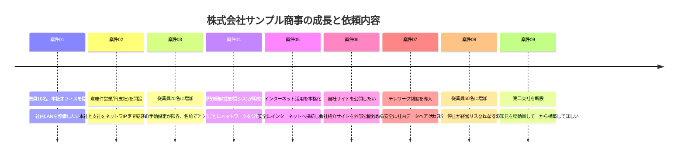
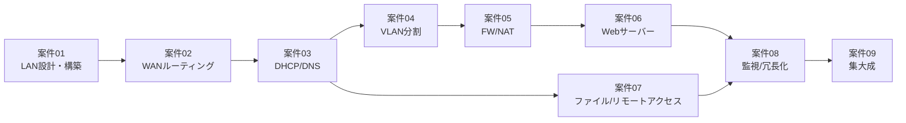

# 🛣️ 学習ロードマップ

このドキュメントは、9つの案件をどの順番で・どのくらいの時間をかけて進めればよいかをまとめたものです。
初めてこのリポジトリを開いた方は、まずここに目を通してから [案件01](../projects/case01_lan_design/README.md) に進んでください。

## 🔰 読み方の基本ルール

1. 案件は **01 → 09 の順に、番号どおりに読む** ことを推奨します。あとの案件ほど、前の案件で構築した環境の上に新しい要素を積み上げていきます。
2. わからない用語が出てきたら、まず [01_glossary.md](01_glossary.md) を確認してください。
3. 演習環境をまだ用意していない場合は、先に [02_environment_setup.md](02_environment_setup.md) を読んで環境を準備してください。
4. すべての案件で使うIPアドレスは [03_ip_address_design.md](03_ip_address_design.md) の設計に統一されています。案件を読んでいて「このIPアドレスはどこから来たんだろう?」と思ったら、まずこのファイルを確認してください。

## 📈 会社の成長と案件の関係

このパックでは、架空の取引先「株式会社サンプル商事」が案件を通じて少しずつ成長していきます。

## 🗺️ 案件の依存関係

## ⏱️ 想定学習時間の目安

学習時間はあくまで目安です。演習環境の構築に慣れていない場合はさらに時間がかかっても問題ありません。
「速く終わらせること」より「なぜそうするのかを説明できること」を優先してください。

| 案件 | 想定時間 | 主な習得スキル |
|---|---|---|
| 案件01 | 3〜5時間 | IPアドレス設計、スイッチ設定、疎通確認 |
| 案件02 | 4〜6時間 | VLSM、静的ルーティング |
| 案件03 | 5〜7時間 | DHCP、DNS、Linuxサーバーの基本操作 |
| 案件04 | 5〜7時間 | VLAN、トランクポート、VLAN間ルーティング |
| 案件05 | 5〜8時間 | NAT/PAT、ファイアウォール、DMZ |
| 案件06 | 5〜8時間 | Webサーバー構築、SSL/TLS |
| 案件07 | 6〜9時間 | Samba、SSH、VPN |
| 案件08 | 6〜9時間 | 監視設計、VRRP冗長化、バックアップ |
| 案件09 | 10〜15時間 | 要件定義〜設計〜構築〜試験の一連の流れ |

**合計目安:約50〜75時間**(1日2時間のペースなら1〜2ヶ月程度)

## ✅ 各案件の進め方(共通フロー)

どの案件も、以下の流れで進めると学習効果が高くなります。

1. **案件概要を読む** — お客様からの依頼内容と背景を理解する
2. **構成図とIPアドレス設計を確認する** — 何を作るのかを図でイメージする
3. **自分で構成図を紙に描き直してみる** — 見るだけでなく手を動かして理解を定着させる
4. **作業手順を実際に手を動かして実施する** — 演習環境上で実際にコマンドを打つ
5. **動作確認を行う** — 想定通りに動くか、コマンドで確認する
6. **わざと失敗させてみる** — 設定を1箇所間違えて、トラブルシューティングを体験する
7. **振り返りとアピールポイントを自分の言葉でまとめる** — 面接で説明できるようにする

## 🎓 この先のステップアップ

このパックをすべて終えたら、次のようなステップも検討してみてください。

- CCNA(Cisco Certified Network Associate)などの資格学習で知識を体系化する
- クラウド(AWS/Azure/GCP)上で同様の構成を再現してみる
- Ansible/Terraformなどを使った構成管理の自動化に挑戦する
- 自宅ラボ(Raspberry Piや中古PCなど)で実機構築に挑戦する
