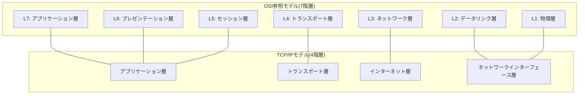
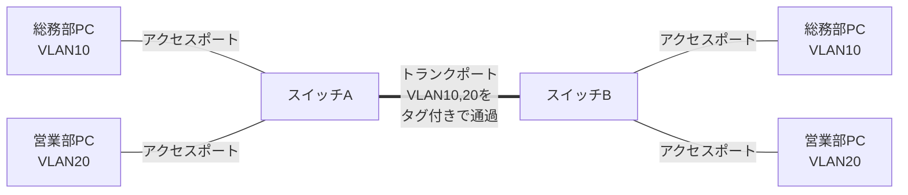
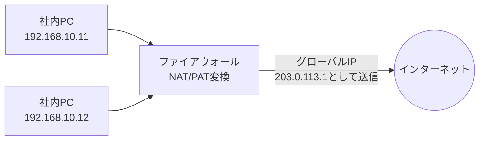
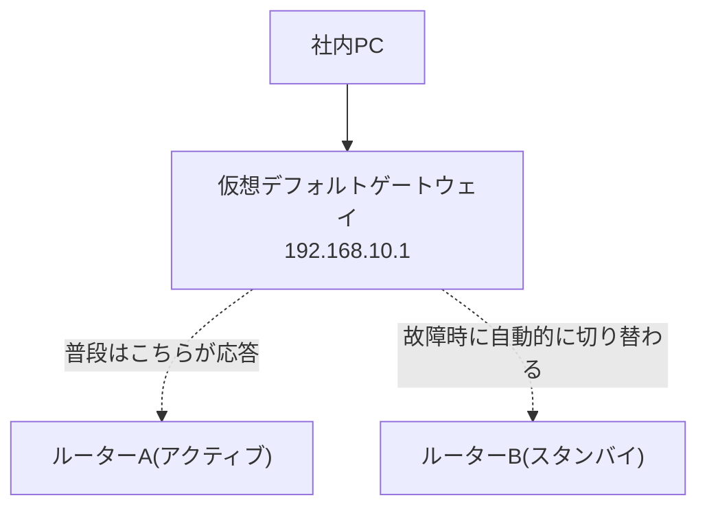

# 📖 初心者向け ネットワーク・サーバー用語集

このドキュメントは、案件01〜09に登場するネットワーク・サーバー関連の用語(カテゴリ1〜6)に加え、サーバー構築エンジニアとして押さえておきたい発展的な基礎用語(カテゴリ7〜10)までをまとめた、前提知識ゼロの方でも読めるネットワーク基礎用語集です。専門用語には、できるだけ身近なものに例えた説明を添えています。

> 💡 **使い方**: 各案件のREADMEを読んでいて分からない用語が出てきたら、このページを開いてブラウザの検索機能(Ctrl+F / Cmd+F)で用語名を探してください。各用語の末尾には「あわせて覚える用語」として関連語へのリンクを付けているので、興味が湧いたら周辺の用語も読み進めてみてください。
>
> ⚠️ 本ページに登場するIPアドレスは、すべて [docs/03_ip_address_design.md](03_ip_address_design.md)(全案件共通のIPアドレス設計書)の値と一致させています。矛盾を見つけた場合は設計書の値を正としてください。

## 📇 カテゴリ一覧

- [1. 基礎 🔰](#cat-basic)
- [2. IPアドレスとルーティング 🔢](#cat-ip-routing)
- [3. スイッチングとVLAN 🔀](#cat-switching-vlan)
- [4. セキュリティとファイアウォール 🛡️](#cat-security)
- [5. サーバーとミドルウェア 🖥️](#cat-server-middleware)
- [6. 運用と監視 📊](#cat-ops-monitoring)
- [7. 物理層・伝送とワイヤレス 🔌](#cat-physical-wireless)
- [8. 発展的なネットワーク技術 🚀](#cat-advanced-network)
- [9. 仮想化とストレージ 💾](#cat-virtualization-storage)
- [10. 高度なセキュリティと認証 🔐](#cat-advanced-security)

---

<a id="cat-basic"></a>
## 1. 基礎 🔰

まずは、この先すべてのカテゴリの土台になる、通信そのものの考え方に関する用語です。

### 📑 この章の用語

- [OSI参照モデル](#term-osi)
- [TCP/IP](#term-tcpip)
- [ホスト名](#term-hostname)
- [FQDN](#term-fqdn)
- [ウェルノウンポート](#term-well-known-port)

<a id="term-osi"></a>
**OSI参照モデル**

「通信」を7つの階層(レイヤー)に分けて整理するための考え方のモデルです。荷物を送るときに「梱包する → 伝票を書く → 配送業者に渡す → 実際に輸送する」と役割が分かれているのと同じように、通信の役割を段階ごとに切り分けて考えることで、トラブルが起きたときにどの階層に原因があるかを特定しやすくなります。実務では7層すべてを毎回意識するわけではありませんが、特に物理層(L1)・データリンク層(L2)・ネットワーク層(L3)・トランスポート層(L4)・アプリケーション層(L7)という呼び方はよく登場します。

> 🔗 あわせて覚える用語: [TCP/IP](#term-tcpip)、[スイッチ(L2/L3)](#term-switch)、[ルーター](#term-router)

<a id="term-tcpip"></a>
**TCP/IP**

現在のインターネットや社内LANで実際に使われている通信の実装方式(プロトコル群)です。OSI参照モデルが7層の「理論上のモデル」であるのに対し、TCP/IPは4層で構成される「実際に世の中で動いている仕組み」と捉えると理解しやすくなります。IP(インターネットプロトコル)がIPアドレスを使った経路選びを担当し、TCP(伝送制御プロトコル)がデータを欠損なく相手に届ける役割を担当します。

> 🔗 あわせて覚える用語: [OSI参照モデル](#term-osi)、[IPアドレス](#term-ip-address)



<a id="term-hostname"></a>
**ホスト名**

ネットワーク上の1台の機器(サーバーやPCなど)に付ける、人間にとって分かりやすい名前です。「dns-server」「HQ-RT01」のように、IPアドレスの数字の羅列だけでは覚えにくい機器を、名前で識別できるようにするために設定します。本パックでも「HQ-RT01」「HQ-SW01」のようなホスト名を各機器に付けています。

> 🔗 あわせて覚える用語: [FQDN](#term-fqdn)、[DNS](#term-dns)

<a id="term-fqdn"></a>
**FQDN**

Fully Qualified Domain Name(完全修飾ドメイン名)の略で、ホスト名にドメイン名まで含めた「完全な名前」のことです。「www」というホスト名だけでは世界中に無数に存在しますが、「www.example.co.jp」までドメイン名を含めて書けば、インターネット上で一意に特定できます。人の名前で例えるなら、ホスト名が「下の名前」だけなのに対し、FQDNは「会社名・部署名まで含むフルネーム」のようなものです。

> 🔗 あわせて覚える用語: [ホスト名](#term-hostname)、[DNS](#term-dns)、[ゾーンファイル](#term-zone-file)

<a id="term-well-known-port"></a>
**ウェルノウンポート**

TCP/IPで通信する際、どの種類の通信かを識別するための「窓口番号」がポート番号です。その中でも0〜1023番は、HTTPなら80番、SSHなら22番というように、あらかじめ用途が世界共通で決められており、これを「ウェルノウンポート(well-known port)」と呼びます。ビルの受付に「1番窓口は郵便受付、2番窓口は来客受付」と役割が決まっているイメージに近く、ファイアウォールで通信を許可・拒否する際にもこのポート番号を基準にすることが多くあります。

> 🔗 あわせて覚える用語: [HTTP/HTTPS](#term-http-https)、[SSH](#term-ssh)、[ファイアウォール](#term-firewall)、[ACL](#term-acl)

| ポート番号 | プロトコル | 用途 |
|---|---|---|
| 20 / 21 | FTP | ファイル転送 |
| 22 | SSH | 暗号化されたリモートログイン |
| 23 | Telnet | 暗号化なしのリモートログイン(現在は非推奨) |
| 25 | SMTP | メール送信 |
| 53 | DNS | 名前解決の問い合わせ |
| 67 / 68 | DHCP | IPアドレスの自動配布 |
| 80 | HTTP | Webページの閲覧(暗号化なし) |
| 443 | HTTPS | Webページの閲覧(暗号化あり) |
| 3389 | RDP | Windowsのリモートデスクトップ接続 |

---

<a id="cat-ip-routing"></a>
## 2. IPアドレスとルーティング 🔢

「通信の住所」であるIPアドレスの仕組みと、住所をもとに経路を決める「ルーティング」に関する用語です。

### 📑 この章の用語

- [IPアドレス](#term-ip-address)
- [サブネットマスク](#term-subnet-mask)
- [CIDR](#term-cidr)
- [VLSM](#term-vlsm)
- [プライベートIP/グローバルIP](#term-private-global-ip)
- [デフォルトゲートウェイ](#term-default-gateway)
- [ping](#term-ping)
- [traceroute](#term-traceroute)
- [DNS](#term-dns)
- [ゾーンファイル](#term-zone-file)
- [DHCP](#term-dhcp)
- [ルーティング(静的/動的)](#term-routing)
- [ルーティングテーブル](#term-routing-table)

<a id="term-ip-address"></a>
**IPアドレス**

ネットワーク上の機器を特定するための「住所」に相当する番号です。手紙に住所がなければ配達できないのと同じで、通信でも送り先を示すIPアドレスがなければパケット(データの小包)を届けることができません。本パック内では「192.168.10.11」のように、4つの数字をピリオドで区切って表記します(IPv4の場合)。

> 🔗 あわせて覚える用語: [サブネットマスク](#term-subnet-mask)、[デフォルトゲートウェイ](#term-default-gateway)、[プライベートIP/グローバルIP](#term-private-global-ip)

<a id="term-subnet-mask"></a>
**サブネットマスク**

IPアドレスのうち、どこまでが「ネットワーク部(建物の住所)」で、どこからが「ホスト部(部屋番号)」かを示す情報です。「255.255.255.0」というサブネットマスクは、「同じ建物(ネットワーク)に住んでいる機器同士かどうか」を判定する境界線の役割を果たします。この境界線をどこに引くかによって、1つのネットワークに収容できる機器の台数が変わります。

> 🔗 あわせて覚える用語: [IPアドレス](#term-ip-address)、[CIDR](#term-cidr)、[VLSM](#term-vlsm)

<a id="term-cidr"></a>
**CIDR**

Classless Inter-Domain Routingの略で、サブネットマスクを「/24」のようにスラッシュとビット数で簡潔に表す記法です。「192.168.10.0/24」と書けば「255.255.255.0というサブネットマスクを持つ192.168.10.0のネットワーク」であることを一目で表せます。本パックの設計書([docs/03_ip_address_design.md](03_ip_address_design.md))でも、すべてのセグメントをこのCIDR表記で管理しています。

> 🔗 あわせて覚える用語: [サブネットマスク](#term-subnet-mask)、[VLSM](#term-vlsm)

<a id="term-vlsm"></a>
**VLSM**

Variable Length Subnet Mask(可変長サブネットマスク)の略で、1つの大きなネットワークを、部署ごとに必要な台数に応じて異なる大きさのサブネットに分割する手法です。案件04では本社LANの192.168.10.0/24を、総務部用の/26、営業部用の/26のように、部門ごとに異なるサイズへ分割します。全員に同じ大きさの部屋を均等に割り振るのではなく、人数に応じて仕切りの位置を柔軟に調整するイメージです。

> 🔗 あわせて覚える用語: [CIDR](#term-cidr)、[サブネットマスク](#term-subnet-mask)、[VLAN](#term-vlan)

<a id="term-private-global-ip"></a>
**プライベートIP/グローバルIP**

プライベートIPアドレスは、社内LANなど限られた範囲内だけで使う「内線番号」のようなアドレスで、192.168.0.0/16や10.0.0.0/8などの範囲が世界共通で予約されています。一方グローバルIPアドレスは、インターネット上で一意に識別される「外線電話番号」に相当し、ISP(インターネット接続業者)から割り当てられます。本パックでは実在の組織と重複しないよう、グローバルIPアドレスの例としてRFC 5737で「例示専用」に予約された203.0.113.0/24のみを使用しています。

> 🔗 あわせて覚える用語: [IPアドレス](#term-ip-address)、[NAT/PAT](#term-nat-pat)、[IPv6](#term-ipv6)

| クラス | プライベートIPの範囲 | 本パックでの使用例 |
|---|---|---|
| クラスA | 10.0.0.0/8 | 本社⇔支社間WAN(10.0.0.0/30) |
| クラスB | 172.16.0.0/12 | DMZ(172.16.0.0/24) |
| クラスC | 192.168.0.0/16 | 本社LAN・サーバーセグメントなど(192.168.10.0/24 等) |

<a id="term-default-gateway"></a>
**デフォルトゲートウェイ**

自分の属するネットワークの外(別のネットワークやインターネット)へ通信するときに、最初に経由する出口となる機器のIPアドレスです。マンションの共用出入口のようなもので、外部宛の通信はすべて一度ここを経由してから外へ送り出されます。本パックの本社LANでは192.168.10.1、サーバーセグメントでは192.168.100.1がこれにあたります。

> 🔗 あわせて覚える用語: [IPアドレス](#term-ip-address)、[ルーター](#term-router)、[ルーティングテーブル](#term-routing-table)

<a id="term-ping"></a>
**ping**

相手の機器に対して「聞こえていますか?」と呼びかけ、応答が返ってくるかどうかで通信できるかを確認するコマンドです。ICMPというプロトコルを使った小さなパケットを送り、応答があれば少なくともその相手までは通信できることが分かります。ネットワークトラブルの調査では、まずこのpingで疎通確認を行うのが基本の第一歩です。

> 🔗 あわせて覚える用語: [traceroute](#term-traceroute)、[デフォルトゲートウェイ](#term-default-gateway)、[レイテンシ(遅延)](#term-latency)

<a id="term-traceroute"></a>
**traceroute**

目的地までの通信が、どの中継機器(ルーターなど)を経由しているかを1台ずつ順番に表示してくれるコマンドです(Windowsでは`tracert`)。pingが「届くかどうか」だけを確認するのに対し、tracerouteは「どこまでは届いていて、どこで止まっているか」を経路上で特定できるため、途中の中継地点にトラブルがある場合の切り分けに役立ちます。

> 🔗 あわせて覚える用語: [ping](#term-ping)、[ルーティングテーブル](#term-routing-table)

```text
$ traceroute 192.168.100.10
traceroute to 192.168.100.10, 30 hops max
 1  192.168.20.1     0.512 ms   (支社ルーター)
 2  10.0.0.1         1.203 ms   (本社ルーターのWAN側)
 3  192.168.100.10   1.897 ms   (DHCP/DNSサーバー)
```

<a id="term-dns"></a>
**DNS**

Domain Name Systemの略で、「www.example.com」のような人間が覚えやすい名前と、192.168.10.10のようなIPアドレスを対応づける仕組みです。電話帳が「名前」から「電話番号」を調べる仕組みであるのと同じように、DNSは「ドメイン名」から「IPアドレス」を調べてくれます。本パックでは案件03で、社員がIPアドレスではなく名前でサーバーへアクセスできるようDNSサーバーを構築します。

> 🔗 あわせて覚える用語: [FQDN](#term-fqdn)、[ゾーンファイル](#term-zone-file)、[DHCP](#term-dhcp)

<a id="term-zone-file"></a>
**ゾーンファイル**

DNSサーバーが管理している「電話帳の中身データ」そのものです。ドメイン名とIPアドレスの対応表(レコード)が記載されており、DNSサーバーはこのファイルを参照して問い合わせに応答します。ゾーンファイルに誤った対応関係を書いてしまうと、正しいドメイン名でアクセスしても意図しないIPアドレスに繋がってしまうため、記載内容の正確さが重要です。

> 🔗 あわせて覚える用語: [DNS](#term-dns)、[FQDN](#term-fqdn)

<a id="term-dhcp"></a>
**DHCP**

Dynamic Host Configuration Protocolの略で、PCなどの端末が起動したときに、IPアドレスなどのネットワーク設定を自動的に配布してくれる仕組みです。ホテルのフロントが空いている部屋番号を来客に自動で割り振ってくれるようなもので、管理者が1台ずつ手作業でIPアドレスを設定する手間を省いてくれます。本パックでは案件01・02では静的(手動)設定を行い、案件03からはDHCPによる自動配布に切り替えます。

> 🔗 あわせて覚える用語: [IPアドレス](#term-ip-address)、[デフォルトゲートウェイ](#term-default-gateway)、[DNS](#term-dns)

<a id="term-routing"></a>
**ルーティング(静的/動的)**

異なるネットワーク宛の通信を、どの経路(次にどの機器へ渡すか)で届けるかを決める仕組みです。静的ルーティングは管理者が経路を1つずつ手作業で設定する方式で、小規模な構成では確実で分かりやすい一方、拠点が増えると設定変更の手間が増えます。動的ルーティングはルーター同士が自動的に経路情報を交換し合う方式で、本パックでは主に静的ルーティングを扱いますが、実務の大規模ネットワークでは動的ルーティング(OSPFなど)もよく使われます。

> 🔗 あわせて覚える用語: [ルーティングテーブル](#term-routing-table)、[デフォルトゲートウェイ](#term-default-gateway)

| 項目 | 静的ルーティング | 動的ルーティング |
|---|---|---|
| 設定方法 | 管理者が手動で1経路ずつ設定 | ルーター同士が自動で経路情報を交換 |
| 向いている規模 | 小規模・拠点数が少ない構成 | 拠点数が多い・経路変更が頻繁な構成 |
| 障害時の切り替え | 手動での見直しが必要 | 自動的に迂回経路を再計算 |
| 本パックでの利用 | 案件02・05(本社⇔支社) | 発展課題として紹介のみ |

<a id="term-routing-table"></a>
**ルーティングテーブル**

ルーターが「どの宛先ネットワークへは、どのインターフェース・次のルーターへ転送すればよいか」を記録している経路表です。郵便局の仕分け係が持っている「地域ごとの配送ルート表」に例えられ、パケットが届くたびにこの表を参照して転送先を決定します。案件02では、本社ルーターと支社ルーターそれぞれに、相手側ネットワーク宛の経路を静的ルートとして登録します。

> 🔗 あわせて覚える用語: [ルーティング(静的/動的)](#term-routing)、[デフォルトゲートウェイ](#term-default-gateway)、[ルーター](#term-router)

---

<a id="cat-switching-vlan"></a>
## 3. スイッチングとVLAN 🔀

同じ建物(LAN)の中で機器同士を繋ぐスイッチと、そのスイッチを論理的に分割するVLANに関する用語です。

### 📑 この章の用語

- [MACアドレス](#term-mac-address)
- [ARP](#term-arp)
- [スイッチ(L2/L3)](#term-switch)
- [ルーター](#term-router)
- [VLAN](#term-vlan)
- [タグVLAN(802.1Q)](#term-tagged-vlan)
- [トランクポート/アクセスポート](#term-trunk-access-port)

<a id="term-mac-address"></a>
**MACアドレス**

ネットワーク機器のNIC(ネットワークインターフェースカード)に、工場出荷時から割り当てられている世界で一意な物理アドレスです。顔写真付きの身分証明書のように機器そのものを特定するための番号であり、IPアドレスのように後から自由に変更する前提のものではありません。スイッチはこのMACアドレスを見て、同じLAN内でどのポートへデータを転送すればよいかを判断します。

> 🔗 あわせて覚える用語: [ARP](#term-arp)、[スイッチ(L2/L3)](#term-switch)

<a id="term-arp"></a>
**ARP**

Address Resolution Protocolの略で、「このIPアドレスを持っている機器のMACアドレスを教えてください」と同一LAN内に問い合わせる仕組みです。名簿で相手の名前(IPアドレス)から連絡先(MACアドレス)を調べるようなイメージで、通信の最終段階でIPアドレスをMACアドレスに変換するために使われます。調べた対応関係は、端末内の「ARPテーブル」に一時的に記録されます。

> 🔗 あわせて覚える用語: [MACアドレス](#term-mac-address)、[IPアドレス](#term-ip-address)、[ブロードキャスト/ユニキャスト/マルチキャスト](#term-broadcast-unicast-multicast)

```text
$ arp -a
? (192.168.10.1) at 00:1a:2b:3c:4d:5e [ether] on eth0    # デフォルトゲートウェイ
? (192.168.10.50) at 00:1a:2b:3c:4d:9f [ether] on eth0   # 共有プリンター
```

<a id="term-switch"></a>
**スイッチ(L2/L3)**

複数の機器をケーブルで接続し、送られてきたデータを適切な相手にだけ転送する集線装置です。L2スイッチはMACアドレスを見て同じネットワーク内での転送だけを行うのに対し、L3スイッチはルーターと同様にIPアドレスを見て異なるネットワーク間の転送(ルーティング)も行える点が異なります。オフィスの内線交換手が「同じ建物内の内線同士を繋ぐ(L2)」だけでなく「他拠点への回線も繋げる(L3)」ようになったものとイメージすると分かりやすいです。

> 🔗 あわせて覚える用語: [ルーター](#term-router)、[MACアドレス](#term-mac-address)、[VLAN](#term-vlan)

| 項目 | L2スイッチ | L3スイッチ |
|---|---|---|
| 参照する情報 | MACアドレス | MACアドレス + IPアドレス |
| できること | 同一LAN内での転送 | 同一LAN内での転送 + 異なるネットワーク間のルーティング |
| 本パックでの登場 | 案件01〜(HQ-SW01など) | 案件04以降(VLAN間ルーティング) |

<a id="term-router"></a>
**ルーター**

異なるネットワーク同士を接続し、IPアドレスの宛先を見て「次にどこへ送ればよいか」を判断して転送する機器です。郵便局の仕分け係のように、届いた荷物(パケット)の宛先住所(IPアドレス)を見て、適切な配送ルートへ次々と振り分けていく役割を担っています。本パックでは本社と支社の間をルーターで接続し、それぞれのLANを1つの大きなネットワークとして結びます。

> 🔗 あわせて覚える用語: [ルーティングテーブル](#term-routing-table)、[デフォルトゲートウェイ](#term-default-gateway)、[スイッチ(L2/L3)](#term-switch)

<a id="term-vlan"></a>
**VLAN**

Virtual LAN(仮想LAN)の略で、1台の物理スイッチの中を、あたかも複数の別々のスイッチであるかのように論理的に分割する技術です。同じフロアにあるオフィスを、パーテーションで「総務部エリア」「営業部エリア」のように区切るイメージに近く、ケーブルを物理的に増設しなくても部署ごとにネットワークを分離できます。本パックでは案件04で本社LANをVLAN10(総務・経理)、VLAN20(営業部)、VLAN30(情報システム部)、VLAN99(機器管理)の4つに分割します。

> 🔗 あわせて覚える用語: [タグVLAN(802.1Q)](#term-tagged-vlan)、[トランクポート/アクセスポート](#term-trunk-access-port)、[VLSM](#term-vlsm)

<a id="term-tagged-vlan"></a>
**タグVLAN(802.1Q)**

1本のケーブル(トランクポート)の中に、複数のVLANの通信を混在させて流すための規格です。それぞれのデータに「このデータはVLAN10のものです」という荷札(タグ)を付けて送ることで、受け取った側のスイッチがどのVLANの通信かを見分けられるようにします。この仕組みがあるおかげで、VLANの数だけケーブルを増設する必要がなくなります。

> 🔗 あわせて覚える用語: [VLAN](#term-vlan)、[トランクポート/アクセスポート](#term-trunk-access-port)

<a id="term-trunk-access-port"></a>
**トランクポート/アクセスポート**

スイッチのポートには大きく2つの種類があります。アクセスポートは1つのVLANにしか属さない、PCやプリンターを直接繋ぐための専用ポートです。トランクポートは複数VLANの通信をタグVLAN(802.1Q)によって同時に流せる、スイッチ同士やスイッチ・ルーター間を繋ぐための幹線道路のようなポートです。

> 🔗 あわせて覚える用語: [VLAN](#term-vlan)、[タグVLAN(802.1Q)](#term-tagged-vlan)



---

<a id="cat-security"></a>
## 4. セキュリティとファイアウォール 🛡️

社内ネットワークをインターネットなどの外部から守るための「境界防御」に関する用語です。

### 📑 この章の用語

- [NAT/PAT](#term-nat-pat)
- [ファイアウォール](#term-firewall)
- [DMZ](#term-dmz)
- [ポートフォワーディング(DNAT)](#term-port-forwarding)
- [ACL](#term-acl)
- [SSL/TLS証明書](#term-ssl-tls)
- [SSH](#term-ssh)
- [公開鍵認証](#term-public-key-auth)
- [VPN](#term-vpn)
- [iptables/firewalld](#term-iptables-firewalld)

<a id="term-nat-pat"></a>
**NAT/PAT**

NAT(Network Address Translation)は、社内で使うプライベートIPアドレスを、インターネットで使えるグローバルIPアドレスに変換する仕組みです。PAT(Port Address Translation、NAPTとも呼ぶ)は、1つのグローバルIPアドレスをポート番号で細分化することで、社内の複数端末が同時に1つのグローバルIPアドレスを共有してインターネットへ出られるようにする方式です。マンションの各部屋(プライベートIP)が、代表の1つの電話番号(グローバルIP)を、内線番号(ポート番号)で使い分けて外線をかけているようなイメージだと考えると分かりやすいです。

> 🔗 あわせて覚える用語: [プライベートIP/グローバルIP](#term-private-global-ip)、[ファイアウォール](#term-firewall)、[ポートフォワーディング(DNAT)](#term-port-forwarding)



<a id="term-firewall"></a>
**ファイアウォール**

社内ネットワークとインターネットなど、信頼度の異なるネットワークの境界に設置し、通していい通信とダメな通信を判断する「受付の警備員」のような役割を果たす機器・ソフトウェアです。あらかじめ決めたルール(誰が・どこへ・何のために来たか)に従って通信を許可したり拒否したりすることで、不正なアクセスから社内ネットワークを守ります。本パックでは案件05で、本社の境界にファイアウォールを構築します。

> 🔗 あわせて覚える用語: [DMZ](#term-dmz)、[ACL](#term-acl)、[NAT/PAT](#term-nat-pat)、[iptables/firewalld](#term-iptables-firewalld)、[IDS/IPS](#term-ids-ips)、[WAF](#term-waf)

<a id="term-dmz"></a>
**DMZ**

DeMilitarized Zone(非武装地帯)の略で、社内ネットワークとインターネットの中間に設ける、外部に公開するサーバー専用の緩衝エリアです。会社の受付ロビーのように「完全に社外」でも「完全に社内(奥の執務スペース)」でもない中間領域を用意することで、万が一公開サーバーが攻撃を受けても、被害が社内ネットワークの奥まで及ぶリスクを減らせます。本パックでは案件05・06で、172.16.0.0/24をDMZとしてWebサーバー(172.16.0.10)を設置します。

> 🔗 あわせて覚える用語: [ファイアウォール](#term-firewall)、[ポートフォワーディング(DNAT)](#term-port-forwarding)

<a id="term-port-forwarding"></a>
**ポートフォワーディング(DNAT)**

インターネットから届いた通信を、あらかじめ決めたルールに従って社内(DMZなど)の特定サーバーへ転送する設定です。DNAT(Destination NAT)とも呼ばれ、会社の代表電話にかかってきた電話を「Web担当は内線1234へ」と転送するのと同じ発想です。本パックでは、外部からの203.0.113.10宛のHTTP/HTTPS通信を、DMZのWebサーバー(172.16.0.10)へ転送する設定を案件05・06で行います。

> 🔗 あわせて覚える用語: [NAT/PAT](#term-nat-pat)、[DMZ](#term-dmz)、[ウェルノウンポート](#term-well-known-port)

<a id="term-acl"></a>
**ACL**

Access Control List(アクセス制御リスト)の略で、「どの送信元から、どの宛先への、どんな種類の通信を許可・拒否するか」を順番にリスト化したルール集です。ビルの入館管理表のように、上から順にルールを照合し最初に一致したルールが適用される点が特徴で、意図せず先に定義したルールでブロックされてしまうといったミスが起こりやすいため注意が必要です。本パックでは案件04でVLAN間の通信制御に、案件05でファイアウォールの通信制御に登場します。

> 🔗 あわせて覚える用語: [ファイアウォール](#term-firewall)、[VLAN](#term-vlan)

<a id="term-ssl-tls"></a>
**SSL/TLS証明書**

Webサイトなどの通信を暗号化し、かつ「接続先が本当に本物のサーバーであるか」を証明するためのデジタル証明書です。宅配便で例えるなら、荷物を鍵付きの箱で送る(暗号化)と同時に、送り主の身元を証明する書類(証明書)を添えるようなものです。本パックでは案件06で、WebサーバーにSSL/TLS証明書を導入し、HTTPではなくHTTPSで安全に通信できるようにします。

> 🔗 あわせて覚える用語: [HTTP/HTTPS](#term-http-https)、[Apache/Nginx](#term-apache-nginx)

<a id="term-ssh"></a>
**SSH**

Secure Shellの略で、離れた場所にあるサーバーへ、暗号化された安全な通信路を通じてログインし、コマンド操作を行うための仕組みです。実務のサーバー運用では、直接サーバーの前まで行かなくても、SSHを使って手元のPCから遠隔で設定変更やトラブル対応を行うのが基本になります。本パックでは案件07で、パスワード認証よりも安全な公開鍵認証を使ったSSH接続を構築します。

> 🔗 あわせて覚える用語: [公開鍵認証](#term-public-key-auth)、[VPN](#term-vpn)

<a id="term-public-key-auth"></a>
**公開鍵認証**

SSHなどでログインする際、パスワードの代わりに「公開鍵」と「秘密鍵」という対になる鍵を使って本人確認を行う認証方式です。南京錠(公開鍵、サーバー側に登録)とその鍵(秘密鍵、自分だけが持つ)に例えられ、対になる鍵でなければ開錠(ログイン)できない仕組みです。秘密鍵さえ厳重に管理していれば、パスワードを盗み見られたり総当たり攻撃を受けたりするリスクを大幅に減らせます。

> 🔗 あわせて覚える用語: [SSH](#term-ssh)

<a id="term-vpn"></a>
**VPN**

Virtual Private Networkの略で、インターネットのような公衆の回線の中に、暗号化によって保護された「専用トンネル」を作り、あたかも社内ネットワークに直接繋がっているかのように通信できるようにする技術です。本パックでは案件07で、テレワークを行う社員が自宅から安全に社内のファイルサーバーへアクセスできるよう、VPNサーバー(192.168.100.40)を構築します。

> 🔗 あわせて覚える用語: [SSH](#term-ssh)、[ファイアウォール](#term-firewall)、[ゼロトラスト](#term-zero-trust)

<a id="term-iptables-firewalld"></a>
**iptables/firewalld**

Linuxサーバー自身に組み込まれている、通信を制御するファイアウォール機能です。iptablesは古くから使われている低レベルな設定コマンド、firewalldはそれをより扱いやすくラップした管理ツールで、CentOS/RHEL系のディストリビューションで標準的に使われています。専用のファイアウォール機器とは別に、サーバー1台1台にも「自分の身は自分で守る」設定を入れておく、多層防御の考え方が実務では重要です。

> 🔗 あわせて覚える用語: [ファイアウォール](#term-firewall)、[ACL](#term-acl)

```bash
# firewalldでSSH(22番)とHTTPS(443番)の通信を許可する例
$ firewall-cmd --permanent --add-service=ssh
$ firewall-cmd --permanent --add-service=https
$ firewall-cmd --reload
```

---

<a id="cat-server-middleware"></a>
## 5. サーバーとミドルウェア 🖥️

Linuxサーバー上で実際に動く、Webサーバーやファイル共有などのソフトウェア(ミドルウェア)に関する用語です。

### 📑 この章の用語

- [HTTP/HTTPS](#term-http-https)
- [Apache/Nginx](#term-apache-nginx)
- [Samba(SMB/CIFS)](#term-samba)
- [systemd](#term-systemd)
- [yum・dnf・apt](#term-package-manager)

<a id="term-http-https"></a>
**HTTP/HTTPS**

HTTPはWebブラウザとWebサーバーがやり取りする際の共通のルール(プロトコル)で、Webページの表示に使われます。HTTPSはこのHTTPの通信をSSL/TLSで暗号化したもので、通信内容を第三者に盗み見られたり改ざんされたりするリスクを減らします。現在の実務では、個人情報を扱わないサイトであっても常時HTTPS化することが標準的な考え方になっています。

> 🔗 あわせて覚える用語: [SSL/TLS証明書](#term-ssl-tls)、[Apache/Nginx](#term-apache-nginx)、[ウェルノウンポート](#term-well-known-port)

<a id="term-apache-nginx"></a>
**Apache/Nginx**

どちらもWebサーバーソフトウェアで、ブラウザなどからのリクエストを受け取り、Webページのデータ(HTMLファイルなど)を返す役割を持ちます。Apacheは歴史が長く豊富な機能・設定の柔軟性で知られ、Nginxは大量の同時アクセスを効率よくさばく性能に強みがあるとされ、用途に応じて使い分けられます。本パックでは案件06で、これらのいずれかを使って会社紹介サイトを外部公開します。

> 🔗 あわせて覚える用語: [HTTP/HTTPS](#term-http-https)、[SSL/TLS証明書](#term-ssl-tls)

<a id="term-samba"></a>
**Samba(SMB/CIFS)**

LinuxサーバーをWindowsのファイル共有機能(SMB/CIFSというプロトコル)に対応させ、Windows PCから「ネットワークドライブ」として違和感なくアクセスできるようにするソフトウェアです。社内の共有フォルダに、まるで自分のPCの中のフォルダのようにアクセスできるようにする「橋渡し役」とイメージすると分かりやすいです。本パックでは案件07で、ファイルサーバー(192.168.100.20)にSambaを導入します。

> 🔗 あわせて覚える用語: [SSH](#term-ssh)、[NAS/SAN](#term-nas-san)

<a id="term-systemd"></a>
**systemd**

多くの現行Linuxディストリビューションで採用されている、OS起動時の処理やサービス(DNSサーバーやWebサーバーなどの常駐プログラム)の起動・停止・自動再起動などを管理する仕組みです。`systemctl start/stop/restart/status`といったコマンドを使い、「このサービスを今すぐ起動して」「サーバー再起動時にも自動的に立ち上げて」といった指示を出します。ビル全体の設備管理システムのように、個々のサービスの状態を一元的に把握・制御する役割を担います。

> 🔗 あわせて覚える用語: [yum・dnf・apt](#term-package-manager)、[syslog](#term-syslog)、[コンテナ(Docker)](#term-container-docker)

```text
$ systemctl status nginx
● nginx.service - A high performance web server
   Loaded: loaded (/usr/lib/systemd/system/nginx.service; enabled)
   Active: active (running) since ...

$ systemctl restart nginx
```

<a id="term-package-manager"></a>
**yum・dnf・apt**

Linuxにソフトウェア(パッケージ)をインストール・更新・削除するための管理コマンドです。yumとdnf(yumの後継)は主にCentOS/RHEL系、aptはUbuntu/Debian系のディストリビューションで使われ、スマートフォンのアプリストアのように、必要なソフトとその依存関係を自動的に解決してインストールしてくれます。本パックではUbuntu Server(apt)とCentOS Stream(dnf)の両方を扱うため、どちらのコマンド体系も覚えておくと役立ちます。

> 🔗 あわせて覚える用語: [systemd](#term-systemd)

| コマンド | 主な対象ディストリビューション | 本パックでの対象OS |
|---|---|---|
| yum | CentOS 7系 など | - |
| dnf | CentOS Stream、RHEL8以降 | CentOS Stream |
| apt | Ubuntu、Debian系 | Ubuntu Server |

---

<a id="cat-ops-monitoring"></a>
## 6. 運用と監視 📊

サーバーを「作って終わり」にせず、止めずに使い続けるための監視・冗長化・バックアップに関する用語です。

### 📑 この章の用語

- [Zabbix](#term-zabbix)
- [SNMP](#term-snmp)
- [VRRP](#term-vrrp)
- [冗長化/フェイルオーバー](#term-redundancy-failover)
- [可用性](#term-availability)
- [ロードバランサ](#term-load-balancer)
- [ログローテーション](#term-log-rotation)
- [バックアップ(フル/差分/増分)](#term-backup)
- [tcpdump/Wireshark](#term-tcpdump-wireshark)

<a id="term-zabbix"></a>
**Zabbix**

サーバーやネットワーク機器が正常に動作しているかを継続的に監視し、異常があれば管理者に通知してくれる監視ソフトウェアです。24時間365日ネットワークの前に張り付いていなくても、代わりに機器の状態を見張ってくれる「見張り番」のような役割を果たします。本パックでは案件08で、監視サーバー(192.168.100.30)にZabbixを導入し、各サーバーの死活監視を行います。

> 🔗 あわせて覚える用語: [SNMP](#term-snmp)、[可用性](#term-availability)

<a id="term-snmp"></a>
**SNMP**

Simple Network Management Protocolの略で、ルーターやスイッチなどのネットワーク機器の状態(CPU使用率や通信量など)を、監視サーバーが定期的に取得するためのプロトコルです。機器に「体温計」や「血圧計」を当てて定期的に測定結果を報告してもらうようなイメージで、Zabbixのような監視ソフトウェアがこのSNMPを使って各機器の情報を収集することがよくあります。

> 🔗 あわせて覚える用語: [Zabbix](#term-zabbix)

<a id="term-vrrp"></a>
**VRRP**

Virtual Router Redundancy Protocolの略で、複数台のルーター(またはL3スイッチ)をまとめて1つの仮想的なデフォルトゲートウェイとして見せかけ、片方が故障してももう片方が即座に代わりを務める仕組みです。バスの運転手が急病になったとき、隣に控えている予備の運転手がすぐに運転を引き継ぐ仕組みとイメージすると分かりやすいです。案件08では、このVRRP(実装としてはkeepalivedなど)を使ってゲートウェイの冗長化を行います。

> 🔗 あわせて覚える用語: [冗長化/フェイルオーバー](#term-redundancy-failover)、[デフォルトゲートウェイ](#term-default-gateway)、[可用性](#term-availability)



<a id="term-redundancy-failover"></a>
**冗長化/フェイルオーバー**

冗長化とは、故障に備えてあらかじめ予備の機器・回線・経路を用意しておく設計の考え方です。フェイルオーバーは、実際に故障が起きた際に、その予備へ自動的に切り替わる動作そのものを指します。ビルの非常用発電機のように、普段は使わないが停電(故障)の際に自動的に電力供給を引き継ぐ仕組みをイメージすると理解しやすいです。

> 🔗 あわせて覚える用語: [VRRP](#term-vrrp)、[可用性](#term-availability)、[ロードバランサ](#term-load-balancer)

<a id="term-availability"></a>
**可用性**

システムやサービスが「止まらずに使い続けられる度合い」を表す指標です。一般に「稼働率99.9%」のように、一定期間のうちどれだけの割合で正常に動作していたかというパーセンテージで表現されます。案件08で扱う冗長化や監視は、いずれもこの可用性を高めるための取り組みという共通の目的でつながっています。

> 🔗 あわせて覚える用語: [冗長化/フェイルオーバー](#term-redundancy-failover)、[VRRP](#term-vrrp)、[ロードバランサ](#term-load-balancer)

<a id="term-load-balancer"></a>
**ロードバランサ**

複数台のサーバーに通信を振り分け、1台に負荷が集中しないようにする機器・ソフトウェアです。人気店舗の入り口に立って、混雑する1つのレジだけでなく複数のレジへお客さんを均等に案内する「窓口整理係」のような役割を果たします。負荷分散だけでなく、振り分け先のサーバーが1台故障してもほかのサーバーへ自動的に迂回させることで、可用性を高める効果もあります。

> 🔗 あわせて覚える用語: [可用性](#term-availability)、[冗長化/フェイルオーバー](#term-redundancy-failover)、[プロキシサーバー/リバースプロキシ](#term-proxy-reverse-proxy)、[CDN](#term-cdn)

<a id="term-log-rotation"></a>
**ログローテーション**

サーバーが記録し続けるログファイル(操作履歴やエラー記録)が無限に肥大化してディスク容量を圧迫しないよう、一定の周期(日次・週次など)で新しいログファイルに切り替え、古いものを圧縮・削除していく仕組みです。毎日使う日記帳を、一定期間ごとに新しいノートに切り替えて古いノートは本棚にしまうようなイメージです。Linuxでは`logrotate`というツールで自動化されることが一般的です。

> 🔗 あわせて覚える用語: [バックアップ(フル/差分/増分)](#term-backup)

<a id="term-backup"></a>
**バックアップ(フル/差分/増分)**

万が一のデータ消失に備えて、データの複製を別の場所に保存しておく仕組みです。フルバックアップは毎回すべてのデータを丸ごと複製する方式、差分バックアップは前回のフルバックアップ以降に変更された分だけを複製する方式、増分バックアップは前回のバックアップ(フルまたは増分)以降の変更分だけを複製する方式で、それぞれ復元の手間とバックアップにかかる時間・容量のバランスが異なります。保険と同じで、普段は使わなくてもいざというときに会社を守るための備えとして考えられています。

> 🔗 あわせて覚える用語: [ログローテーション](#term-log-rotation)、[可用性](#term-availability)、[RAID](#term-raid)

| 方式 | 対象範囲 | 復元の手間 | バックアップ時間・容量 |
|---|---|---|---|
| フルバックアップ | すべてのデータ | 少ない(1世代を戻すだけ) | 大きい |
| 差分バックアップ | 前回フル以降の変更分 | フル+差分の2世代分が必要 | 中程度 |
| 増分バックアップ | 前回バックアップ以降の変更分 | フル+すべての増分が必要 | 小さい |

<a id="term-tcpdump-wireshark"></a>
**tcpdump/Wireshark**

ネットワーク上を流れている通信データ(パケット)をキャプチャ(記録)し、その中身を1つずつ確認できるツールです。tcpdumpはコマンドライン(文字だけの画面)で使う軽量なツール、Wiresharkはキャプチャした内容をグラフィカルな画面で分かりやすく解析できるツールで、通信が「そもそも届いているか」「どんな内容でやり取りされているか」を深いところまで確認したいときに使います。ping・tracerouteだけでは解決しない複雑なトラブルシューティングの、最後の切り札的な存在です。

> 🔗 あわせて覚える用語: [ping](#term-ping)、[traceroute](#term-traceroute)

```bash
$ tcpdump -i eth0 port 53 -n
12:00:01.123456 IP 192.168.10.17.51820 > 192.168.100.10.53: 12345+ A? fileserver.local. (34)
12:00:01.125678 IP 192.168.100.10.53 > 192.168.10.17.51820: 12345 1/1/0 A 192.168.100.20 (50)
```

---

<a id="cat-physical-wireless"></a>
## 7. 物理層・伝送とワイヤレス 🔌

ケーブルや電波など、実際にデータが流れる「物理的な通信路」と、その特性に関する用語です。ネットワークがどれだけ速く、どれだけ安定して情報を届けられるかは、突き詰めればこの物理層の性能によって決まります。

### 📑 この章の用語

- [帯域幅/スループット](#term-bandwidth-throughput)
- [レイテンシ(遅延)](#term-latency)
- [全二重/半二重](#term-duplex)
- [ブロードキャスト/ユニキャスト/マルチキャスト](#term-broadcast-unicast-multicast)
- [LANケーブルとカテゴリ](#term-lan-cable)
- [ネットワークトポロジー](#term-topology)
- [無線LAN(Wi-Fi)とSSID/WPA2・WPA3](#term-wifi)

<a id="term-bandwidth-throughput"></a>
**帯域幅/スループット**

帯域幅とは、1本の通信回線やケーブルが理論上どれだけの量のデータを送れるかという「最大キャパシティ」のことで、道路にたとえるなら車線の数に相当します。一方スループットは、実際にその回線を流れたデータ量、つまり渋滞や信号待ちを考慮した「実際の交通量」を指し、帯域幅を超えることはなくても、様々な要因(他の通信との混雑、機器の性能、ケーブルの品質など)によって理論値を下回るのが普通です。単位にはbps(bits per second、1秒間に送れるビット数)を使い、Mbps(メガビット/秒)やGbps(ギガビット/秒)のように表記します。ファイルサイズを表すMB(メガバイト)とは単位系が異なり(1バイト=8ビット)、「1Gbpsの回線で1GBのファイルを転送する」と単純計算でも約8秒かかる点はよく混同されるので注意が必要です。本社オフィスのLANを設計する新人インフラエンジニアにとっても、「カタログスペックの帯域幅」と「実際に出るスループット」を区別して考える視点は欠かせません。

> 🔗 あわせて覚える用語: [レイテンシ(遅延)](#term-latency)、[全二重/半二重](#term-duplex)、[LANケーブルとカテゴリ](#term-lan-cable)

<a id="term-latency"></a>
**レイテンシ(遅延)**

レイテンシとは、データが送信されてから相手に届くまでにかかる時間のことで、しばしば「往復にかかる時間(RTT: Round Trip Time)」として計測されます。[ping](#term-ping)コマンドを実行したときに表示される応答時間は、まさにこのRTTを示しており、値が小さいほど「レスポンスが速い」快適な通信であることを意味します。道路にたとえると、帯域幅が車線の数だとすれば、レイテンシは目的地までの所要時間(距離や信号の数)に近く、車線が多く(帯域幅が広く)ても、距離が遠ければ(レイテンシが大きければ)到着には時間がかかります。オンラインゲームやリモートデスクトップ、SSHでのサーバー操作のように「入力してからの反応速度」が重視される用途では、帯域幅の広さ以上にレイテンシの小ささが体感の快適さを左右します。

> 🔗 あわせて覚える用語: [ping](#term-ping)、[traceroute](#term-traceroute)、[帯域幅/スループット](#term-bandwidth-throughput)

<a id="term-duplex"></a>
**全二重/半二重**

半二重(half duplex)は、送信と受信を同時には行えず、どちらか一方ずつ交互にしか通信できない方式です。トランシーバーで話すとき、送信ボタンを押している間は相手の声が聞こえず、話し終えてボタンを離して初めて相手の返答を聞ける、というのと同じ仕組みです。一方、全二重(full duplex)は、送信と受信を同時に行える方式で、電話のように話しながら相手の声を同時に聞けるイメージに近いです。かつて安価なハブで構築されたLANや初期のイーサネットでは半二重通信が主流でしたが、現在のスイッチを使ったイーサネットでは各ポートが1対1の専用回線となり、ケーブルの送信線と受信線も独立しているため、ほぼすべてが全二重で動作しており、通信の効率と速度が大きく向上しています。

> 🔗 あわせて覚える用語: [LANケーブルとカテゴリ](#term-lan-cable)、[スイッチ(L2/L3)](#term-switch)、[帯域幅/スループット](#term-bandwidth-throughput)

<a id="term-broadcast-unicast-multicast"></a>
**ブロードキャスト/ユニキャスト/マルチキャスト**

ユニキャストは、1台の送信元から1台の宛先へ届ける「1対1」の通信で、特定の相手に宛てて出す普通の手紙のようなものです。ブロードキャストは、同じネットワーク(ブロードキャストドメイン)内のすべての機器に一斉に届ける「1対全員」の通信で、オフィスの館内放送のように、宛先を絞らずその場にいる全員に呼びかけるイメージです。[DHCP](#term-dhcp)で端末がIPアドレスを求める際に送る要求パケットは、このブロードキャストの代表例です。マルチキャストは、あらかじめ登録された特定のグループにだけ届ける「1対グループ」の通信で、メーリングリストに登録した人にだけ一斉配信するようなイメージに近く、動画配信などで使われます。[VLAN](#term-vlan)によってブロードキャストドメインを分割することは、この館内放送が届く範囲を部署ごとに区切り、不要な通信で他部署のネットワークを混雑させないようにする工夫でもあります。

| 種類 | 宛先の範囲 | 身近な例 |
|---|---|---|
| ユニキャスト | 1台のみ | 宛名を書いた手紙 |
| ブロードキャスト | 同じネットワーク内の全員 | 館内放送 |
| マルチキャスト | 登録された特定グループ | メーリングリスト配信 |

> 🔗 あわせて覚える用語: [DHCP](#term-dhcp)、[VLAN](#term-vlan)、[IPアドレス](#term-ip-address)

<a id="term-lan-cable"></a>
**LANケーブルとカテゴリ**

LANケーブルは、機器同士を物理的に接続してデータをやり取りするための通信ケーブルで、両端にはRJ45と呼ばれるコネクタが付いています。内部には8本の銅線がより合わされた「ツイストペア線」が入っており、外側を金属で覆ってノイズを防ぐタイプをSTP(Shielded Twisted Pair)、覆いのないシンプルなタイプをUTP(Unshielded Twisted Pair)と呼びます。一般的なオフィス環境ではノイズの影響が少ないためUTPが広く使われています。LANケーブルには「カテゴリ(Cat)」という規格があり、Cat5eは最大1Gbps、Cat6は短距離であれば最大10Gbps、Cat6Aは長距離でも安定して10Gbpsを出せるというように、数字が大きいほど高速・高性能になります。本社オフィスのLAN配線を選定する際は、必要な速度と配線距離に応じて適切なカテゴリのケーブルを選ぶことが、新人インフラエンジニアの重要な仕事の1つになります。

| カテゴリ | 最大通信速度 | 備考 |
|---|---|---|
| Cat5e | 1Gbps | 現在の最低ライン |
| Cat6 | 1Gbps(条件付きで10Gbps) | 10Gbpsは配線距離が短い場合のみ |
| Cat6A | 10Gbps | 100m配線でも10Gbpsを維持できる |

> 🔗 あわせて覚える用語: [帯域幅/スループット](#term-bandwidth-throughput)、[全二重/半二重](#term-duplex)、[ネットワークトポロジー](#term-topology)

<a id="term-topology"></a>
**ネットワークトポロジー**

ネットワークトポロジーとは、機器同士をどのような形でつなぐかという「接続形態」のことです。バス型は1本の幹線ケーブルに全機器を数珠つなぎにする方式、リング型は機器を輪のように環状につなぐ方式、フルメッシュ型は全機器同士を1対1で直接つなぎ合う方式で、それぞれ配線のしやすさや故障時の影響範囲が異なります。現在主流となっているのは、中心に[スイッチ(L2/L3)](#term-switch)を置き、そこから各機器へケーブルを1本ずつ伸ばす「スター型」で、自転車の車輪のスポークのように中心から放射状に配線するイメージです。スター型は1本のケーブルが断線しても、その機器だけが影響を受け他の機器には波及しないという利点があり、本パックで構築する本社オフィスLANも、このスター型トポロジーを前提に設計しています。

> 🔗 あわせて覚える用語: [スイッチ(L2/L3)](#term-switch)、[LANケーブルとカテゴリ](#term-lan-cable)、[スパニングツリープロトコル(STP)](#term-stp)

<a id="term-wifi"></a>
**無線LAN(Wi-Fi)とSSID/WPA2・WPA3**

無線LAN(Wi-Fi)は、ケーブルを使わずに電波で機器をネットワークに接続する技術です。有線LANが「専用の道路(ケーブル)」を機器ごとに1本ずつ確保できるのに対し、無線LANは「同じ空間を飛び交う電波」を複数の機器で共有するため、混雑や障害物の影響を受けやすく、一般に有線LANより速度が不安定になりやすいという特徴があります。無線LANアクセスポイント(AP)は、電波の届く範囲に「SSID」と呼ばれるネットワーク名を発信し、利用者はこのSSIDを選んで接続します。ラジオ局が周波数ごとに異なる放送局名を名乗っているのに近いイメージです。通信内容を盗み見られないようにする暗号化方式には、旧来のWPA2と、より安全性の高いWPA3があり、本社オフィスのゲスト用Wi-Fiや従業員用Wi-Fiを構築する際は、できる限りWPA3(対応していない機器がある場合はWPA2)を選び、推測されにくい強固なパスワードを設定することがセキュリティ対策の基本になります。

> 🔗 あわせて覚える用語: [LANケーブルとカテゴリ](#term-lan-cable)、[VLAN](#term-vlan)、[SSL/TLS証明書](#term-ssl-tls)

### 🧠 理解度チェック

<details>
<summary>Q1. 「帯域幅」と「スループット」の違いを説明してください。</summary>

A. 帯域幅は回線が理論上出せる最大の通信量、スループットは実際に流れた通信量のことです。スループットは様々な要因により帯域幅を下回るのが普通です。

</details>

<details>
<summary>Q2. オンラインゲームの反応速度に強く関わるのは、帯域幅とレイテンシのどちらでしょうか。</summary>

A. レイテンシです。データの往復にかかる時間が短いほど、入力に対する反応が速く感じられます。

</details>

<details>
<summary>Q3. DHCPで端末がIPアドレスを要求するときの通信は、ユニキャスト・ブロードキャスト・マルチキャストのどれに当たるでしょうか。</summary>

A. ブロードキャストです。まだIPアドレスを持たない端末は宛先を特定できないため、同じネットワーク内の全員に向けて要求パケットを送ります。

</details>

---

<a id="cat-advanced-network"></a>
## 8. 発展的なネットワーク技術 🚀

基礎を押さえたら次に知っておきたい、実務でよく登場する一段階発展した技術用語です。ここまでのカテゴリで学んだ用語と組み合わさって初めて意味を持つものも多いため、必要に応じて前のカテゴリも振り返りながら読み進めてみてください。

### 📑 この章の用語

- [IPv6](#term-ipv6)
- [MTU](#term-mtu)
- [NTP](#term-ntp)
- [syslog](#term-syslog)
- [スパニングツリープロトコル(STP)](#term-stp)
- [動的ルーティングプロトコル(OSPF/BGP)](#term-ospf-bgp)
- [プロキシサーバー/リバースプロキシ](#term-proxy-reverse-proxy)
- [CDN](#term-cdn)

<a id="term-ipv6"></a>
**IPv6**

IPv6(Internet Protocol version 6)は、これまでのIPv4(32ビット、約43億個)に代わる次世代のアドレス体系で、128ビットという桁違いに広いアドレス空間を持っています。「2001:0db8:85a3:0000:0000:8a2e:0370:7334」のように、8つのグループを「:」(コロン)で区切った16進数で表記する点がIPv4と大きく異なります。世界中でスマートフォンやIoT機器が爆発的に増え、IPv4アドレスの新規割り当てが枯渇したことが普及の背景にあり、現在は多くのネットワークでIPv4とIPv6を同時に稼働させる「デュアルスタック」という移行方式が採用されています。マンションの部屋番号が3桁までしか無くて足りなくなり、より桁数の多い新しい住居表示ルールに切り替えていくイメージに近いと考えると分かりやすいです。本社ネットワークを設計・構築していく新人インフラエンジニアとしても、将来的な拡張性を見据えてIPv6の存在は押さえておきたいところです。

> 🔗 あわせて覚える用語: [IPアドレス](#term-ip-address)、[CIDR](#term-cidr)、[プライベートIP/グローバルIP](#term-private-global-ip)

| 項目 | IPv4 | IPv6 |
|---|---|---|
| アドレス長 | 32ビット | 128ビット |
| 表記例 | 192.168.10.1(10進数、ドット区切り) | 2001:0db8::1(16進数、コロン区切り) |
| アドレス数の目安 | 約43億個 | 事実上無尽蔵 |
| NATの必要性 | アドレス不足のため事実上必須 | アドレス空間が広く原則不要 |

<a id="term-mtu"></a>
**MTU**

MTU(Maximum Transmission Unit)とは、ネットワーク上で一度に送信できるデータの最大サイズのことです。イーサネットの標準的なMTUは1500バイトと決まっており、送りたいデータがこれを超える場合は、複数の小さな単位に分割(フラグメンテーション)してから送信する必要があります。宅配便で「1箱に入りきらない大きな荷物は、複数の箱に分けて送る」のと同じ考え方で、荷物(パケット)の大きさには上限があるとイメージすると理解しやすいです。特にVPNのようにデータを別のパケットで包み直す(カプセル化する)技術を使うと、その分だけ実質的に運べるデータサイズが小さくなり、MTUの設定を誤ると通信が不安定になることがあるため、実務のトラブルシューティングでも注意が必要な用語です。

> 🔗 あわせて覚える用語: [TCP/IP](#term-tcpip)、[帯域幅/スループット](#term-bandwidth-throughput)、[VPN](#term-vpn)

<a id="term-ntp"></a>
**NTP**

NTP(Network Time Protocol)は、複数のサーバーやネットワーク機器の時刻を、正確な基準時刻に合わせて同期させるためのプロトコルです。会社中の時計が1分でもズレていると朝礼や会議の記録の時系列がバラバラになってしまうのと同じように、複数の機器のログに記録された時刻がズレていると、障害発生時に「どのログが先で、どのログが後か」という順序が分からなくなり、原因調査が非常に困難になります。NTPサーバーはUDPの123番ポートを使い、より正確な時刻源に近いサーバーから順に時刻を配信していく階層構造(Stratum)を取っています。本社と支社をまたいで複数のサーバーを運用する新人インフラエンジニアにとって、時刻同期は地味ながらもトラブル調査の土台となる重要な設定です。

> 🔗 あわせて覚える用語: [syslog](#term-syslog)、[tcpdump/Wireshark](#term-tcpdump-wireshark)、[ウェルノウンポート](#term-well-known-port)

<a id="term-syslog"></a>
**syslog**

syslogとは、サーバーやルーター・スイッチなど複数のネットワーク機器で発生したログ(動作記録)を、1台のsyslogサーバーに転送して一元的に集約する仕組み・プロトコルです。各支店がそれぞれ個別に日報を保管しているだけでは全社の状況を把握しにくいのと同じで、機器ごとにログが分散していると障害調査や不正アクセスの調査に時間がかかってしまいます。すべてのログを本社の1か所に集めておけば、複数の機器をまたいだ時系列での突き合わせがしやすくなり、Zabbixのような監視の仕組みと組み合わせることで異常の早期発見にもつながります。この一元化されたログの時刻が正確であるためには、あらかじめNTPで各機器の時刻を合わせておくことが前提になります。

> 🔗 あわせて覚える用語: [NTP](#term-ntp)、[ログローテーション](#term-log-rotation)、[Zabbix](#term-zabbix)

<a id="term-stp"></a>
**スパニングツリープロトコル(STP)**

STP(Spanning Tree Protocol)は、複数のスイッチをループ状(輪のような形)に接続したときに発生する「ブロードキャストストーム」という通信障害を防ぐための仕組みです。イーサネットのフレームにはIPパケットのTTLのような「寿命」の仕組みがないため、ループ状の配線があるとブロードキャスト通信が延々と回り続けて増殖し、最終的にネットワーク全体をパンクさせてしまいます。STPは、あえて一部の経路を論理的に「通行止め」にしてループのないツリー(木)状の経路だけを使うようにし、普段使っている経路が故障したときだけ、通行止めにしていた予備の経路を自動的に開通させます。交差点に信号機を置いて車がぐるぐる回り続けないように制御しつつ、メインの道が通行止めになったときだけ迂回路を開放するイメージに近く、物理的な冗長化(配線を二重化すること)とループ防止を両立させるための知恵といえます。

> 🔗 あわせて覚える用語: [スイッチ(L2/L3)](#term-switch)、[冗長化/フェイルオーバー](#term-redundancy-failover)、[ブロードキャスト/ユニキャスト/マルチキャスト](#term-broadcast-unicast-multicast)、[ネットワークトポロジー](#term-topology)

<a id="term-ospf-bgp"></a>
**動的ルーティングプロトコル(OSPF/BGP)**

OSPF(Open Shortest Path First)とBGP(Border Gateway Protocol)は、どちらもルーター同士が経路情報を自動的に交換し合う「動的ルーティング」を実現するプロトコルですが、使われる規模と目的が異なります。OSPFは、同じ会社・組織内(社内ネットワーク)のような小〜中規模なネットワーク向けのリンクステート型プロトコルで、各ルーターがネットワーク全体の地図を持ち合い、最短経路を自動的に計算します。一方のBGPは、インターネット全体、つまり異なる会社・組織(自律システム、AS)同士を結びつける経路制御に使われるプロトコルで、まさに「インターネットの背骨」を支えている存在です。社内の各部署間の配送ルートを決めるOSPFが「自社内の物流ルール」だとすれば、BGPは国と国をまたぐ「国際郵便の協定」のようなものとイメージすると違いがつかみやすくなります。

> 🔗 あわせて覚える用語: [ルーティング(静的/動的)](#term-routing)、[ルーティングテーブル](#term-routing-table)、[ルーター](#term-router)

| 項目 | OSPF | BGP |
|---|---|---|
| 分類 | IGP(組織内で使う経路制御プロトコル) | EGP(組織間・AS間で使う経路制御プロトコル) |
| 方式 | リンクステート型 | パスベクトル型 |
| 主な利用範囲 | 社内ネットワークなど小〜中規模 | インターネット全体 |

<a id="term-proxy-reverse-proxy"></a>
**プロキシサーバー/リバースプロキシ**

プロキシサーバーは、社内のPCなどクライアント側の代わりにインターネットへアクセスする「代理人」で、キャッシュによる高速化や、閲覧できるサイトを制限するアクセス制御などに使われます。買い物を頼まれた秘書が、依頼主の代わりにお店へ行って商品を買ってきてくれるようなイメージで、お店側からは実際に買いに来ているのが誰なのか(社内の個々のPC)が見えにくくなります。一方リバースプロキシは、逆にサーバー側の手前に立って外部からのリクエストを代理で受け取り、実際に処理するサーバーへ振り分ける役割を持ち、負荷分散やSSL/TLSの処理集約、内部のサーバー構成を外部から隠すといった目的で使われます。会社の受付係が、来訪者を実際の担当部署まで案内しつつ社内の細かい部署配置は外部の来訪者に見せないようにするイメージに近く、ロードバランサやCDNと組み合わせて使われることも多くあります。

> 🔗 あわせて覚える用語: [ロードバランサ](#term-load-balancer)、[Apache/Nginx](#term-apache-nginx)、[CDN](#term-cdn)、[WAF](#term-waf)

<a id="term-cdn"></a>
**CDN**

CDN(Content Delivery Network)は、Webサイトの画像や動画などのコンテンツのコピー(キャッシュ)を世界各地の拠点(エッジサーバー)にあらかじめ配置しておき、利用者から地理的に近い拠点から配信することで表示を高速化する仕組みです。すべての利用者が本社倉庫(オリジンサーバー)まで買いに行くのではなく、全国各地にあるコンビニの店舗(エッジサーバー)で同じ商品をすぐに受け取れるようにするイメージに近く、遠く離れた場所からのアクセスでもレイテンシ(遅延)を抑えられるほか、オリジンサーバーへの負荷集中も避けられます。CDN自体は利用者からのリクエストを一旦受け止めて配信するという点でリバースプロキシの一種と捉えることができ、DNSの仕組みを使って利用者を最寄りのエッジサーバーへ自動的に誘導するのが一般的です。

> 🔗 あわせて覚える用語: [プロキシサーバー/リバースプロキシ](#term-proxy-reverse-proxy)、[レイテンシ(遅延)](#term-latency)、[DNS](#term-dns)、[ロードバランサ](#term-load-balancer)

### 🧠 理解度チェック

<details>
<summary>Q1. イーサネットの標準的なMTUのサイズは何バイトですか?また、このサイズを超えるデータを送ろうとするとどうなりますか?</summary>

A. 標準的なMTUは1500バイトです。これを超えるデータを送ろうとすると、複数の単位に分割(フラグメンテーション)されてから送信されます。

</details>

<details>
<summary>Q2. スパニングツリープロトコル(STP)は、スイッチをループ状に接続した際に何を防ぐための仕組みですか?</summary>

A. ブロードキャストストーム(ブロードキャスト通信がループ上を延々と回り続けて増殖し、ネットワーク全体に障害を引き起こす現象)を防ぐための仕組みです。

</details>

<details>
<summary>Q3. OSPFとBGPは、どちらも動的ルーティングプロトコルですが、それぞれ主にどのような範囲で使われますか?</summary>

A. OSPFは社内ネットワークのような組織内の小〜中規模なネットワークで使われ、BGPは異なる組織(自律システム、AS)同士を結ぶインターネット全体の経路制御に使われます。

</details>

---

<a id="cat-virtualization-storage"></a>
## 9. 仮想化とストレージ 💾

1台の物理サーバーを無駄なく使い切り、そこに保存された大切なデータを事故や故障から守るための技術に関する用語です。

### 📑 この章の用語

- [仮想化/ハイパーバイザー](#term-virtualization)
- [コンテナ(Docker)](#term-container-docker)
- [RAID](#term-raid)
- [LVM](#term-lvm)
- [NAS/SAN](#term-nas-san)

<a id="term-virtualization"></a>
**仮想化/ハイパーバイザー**

1台の物理サーバー(ハードウェア)の上で、CPU・メモリ・ディスクといった資源を分割し、それぞれ独立したOSを持つ複数の「仮想マシン」を同時に動かす技術です。この資源の割り当てや仮想マシンの作成・管理を行う土台となるソフトウェアを「ハイパーバイザー」と呼びます。1棟のビルを複数のテナントに仕切り、それぞれに独立した電気・水道の契約を持たせて別々の会社に貸し出す管理会社のような役割とイメージすると分かりやすいです。本パックの演習環境自体も、実際には1台のPC上に仮想化ソフトウェアを使い、本社ルーターやDNSサーバーなど複数の役割を持つ仮想マシンをまとめて動かしています。物理サーバーを役割ごとに何台も購入しなくても、用途を分けて構築・検証できる点が大きな利点です。

> 🔗 あわせて覚える用語: [コンテナ(Docker)](#term-container-docker)、[可用性](#term-availability)、[冗長化/フェイルオーバー](#term-redundancy-failover)

<a id="term-container-docker"></a>
**コンテナ(Docker)**

コンテナは、仮想化と同じく1台の物理サーバー上でアプリケーションの実行環境を分離する技術ですが、仮想マシンのようにOSごと丸ごと独立させるのではなく、ホストOSのカーネル(中核部分)を複数のコンテナで共有しながら、アプリケーションとその実行に必要なファイルだけを軽量に分離します。Dockerは、このコンテナ技術を手軽に扱うための代表的なソフトウェアです。仮想マシンが「部屋ごとに水道・電気の契約まで別々に持つマンション」だとすると、コンテナは「建物全体の水道・電気設備は共有しつつ、各テナントの生活空間だけをパーテーションで区切るシェアハウス」に近いイメージです。この違いにより、コンテナは仮想マシンに比べて起動が数秒程度と速く、必要なメモリ・ディスク容量も少なく済むため、同じ物理サーバー上でより多くの実行環境を効率よく動かせます。

> 🔗 あわせて覚える用語: [仮想化/ハイパーバイザー](#term-virtualization)、[Apache/Nginx](#term-apache-nginx)、[systemd](#term-systemd)

| 項目 | 仮想マシン | コンテナ |
|---|---|---|
| 分離の単位 | OSごと丸ごと独立 | カーネルを共有し、アプリ単位で分離 |
| 起動速度 | 数十秒〜数分 | 数秒程度 |
| リソース効率 | 比較的重い(OS分のオーバーヘッドあり) | 軽量(必要な分だけ確保) |

<a id="term-raid"></a>
**RAID**

RAID(Redundant Array of Independent Disks)は、複数台の物理ディスクを組み合わせて、1つの記憶装置であるかのように扱う技術です。データの書き込み方式(レベル)によって、読み書きの速度を上げたり、1台のディスクが故障してもデータを失わないようにしたりできます。大切な書類を1つの金庫だけに保管するのではなく、同じ書類のコピーを複数の金庫に分散して保管しておくことで、1つの金庫が壊れても書類が残るようにする発想に近いです。ただしRAIDはあくまで「ディスク故障によるデータ損失」への備えであり、誤操作による削除やランサムウェア被害までは防げないため、バックアップとは別の目的の対策として組み合わせて使う必要があります。

> 🔗 あわせて覚える用語: [LVM](#term-lvm)、[バックアップ(フル/差分/増分)](#term-backup)、[可用性](#term-availability)

| レベル | 仕組み | 最低ディスク数 | 特徴 |
|---|---|---|---|
| RAID0 | ストライピング(データを分散して書き込む) | 2台 | 高速だが冗長性なし(1台故障で全データ消失) |
| RAID1 | ミラーリング(同じデータを複製) | 2台 | 片方が故障してもデータが残る |
| RAID5 | ストライピング+分散パリティ | 3台 | 1台の故障までデータを保持でき、容量効率も比較的良い |
| RAID6 | ストライピング+二重パリティ | 4台 | 2台同時の故障までデータを保持できる |
| RAID10 | ミラーリング+ストライピング | 4台 | 速度と冗長性を両立するが必要ディスク数が多い |

<a id="term-lvm"></a>
**LVM**

LVM(Logical Volume Manager)は、複数の物理ディスク(物理ボリューム)を1つの大きな「ボリュームグループ」としてまとめ、その中から必要な大きさだけを「論理ボリューム」として切り出し、自由に管理できる仕組みです。通常のパーティション分割では、一度区切った領域の大きさを後から変更するのは難しいものですが、LVMであればディスクを追加してボリュームグループの容量を増やし、稼働中のシステムを止めることなく論理ボリュームの容量を拡張できます。大きな粘土の塊(ボリュームグループ)から、必要な分だけ形を変えて取り分ける(論理ボリューム)ようなイメージに近いです。本社オフィスのファイルサーバーを構築した新人インフラエンジニアが、後日ログや保存データの増加でディスク容量が不足した場合でも、LVMを使っていればディスクを増設して論理ボリュームを拡張するだけで対応でき、OSの再インストールのような大掛かりな作業を避けられます。

> 🔗 あわせて覚える用語: [RAID](#term-raid)、[ログローテーション](#term-log-rotation)、[バックアップ(フル/差分/増分)](#term-backup)

<a id="term-nas-san"></a>
**NAS/SAN**

NAS(Network Attached Storage)とSAN(Storage Area Network)は、どちらも複数のサーバーやPCから共有して使える大容量ストレージの仕組みですが、提供する単位とネットワークの構成が異なります。NASはSamba(SMB/CIFS)などのプロトコルを使い、通常の社内LANを経由して「ファイル単位」でフォルダやファイルを共有する装置で、Windows PCからは1台の共有ファイルサーバーのように見えます。一方SANは、サーバー専用の高速な専用ネットワーク(iSCSIやFibre Channelなど)を介して「ブロック単位」(ディスクの生データ)でストレージを提供し、サーバー側からはあたかも自分専用の内蔵ディスクであるかのように扱えるため、データベースサーバーなど高い性能が求められる用途に向いています。図書館のカウンターで本を1冊単位で借りる(NAS)のと、専用の搬入経路を使って本棚ごと丸ごと運び込む(SAN)ような違いをイメージすると分かりやすいです。本パックの案件07で構築するファイルサーバーは、まさにこのNASの考え方に基づき、Sambaを使ってファイル共有を行っています。

> 🔗 あわせて覚える用語: [Samba(SMB/CIFS)](#term-samba)、[RAID](#term-raid)、[バックアップ(フル/差分/増分)](#term-backup)

| 項目 | NAS | SAN |
|---|---|---|
| アクセス単位 | ファイル単位 | ブロック単位 |
| 利用するネットワーク | 通常の社内LAN(TCP/IP) | 専用の高速ネットワーク(iSCSI・Fibre Channelなど) |
| 主なプロトコル | SMB/CIFS、NFS | iSCSI、Fibre Channel |
| 向いている用途 | 一般的なファイル共有 | データベースなど高性能・低遅延が必要な用途 |

### 🧠 理解度チェック

<details>
<summary>Q1. ハイパーバイザーの役割を一言で説明してください。</summary>

A. 1台の物理サーバー上で、資源を分割して複数の仮想マシンを作成・管理するソフトウェアです。

</details>

<details>
<summary>Q2. コンテナが仮想マシンより起動が速いのはなぜですか?</summary>

A. 仮想マシンはOSごと丸ごと起動する必要があるのに対し、コンテナはホストOSのカーネルを共有し、アプリケーションに必要な部分だけを起動するためです。

</details>

<details>
<summary>Q3. NASとSANの違いを一言で説明してください。</summary>

A. NASは通常の社内LANを使い「ファイル単位」で共有するストレージ、SANは専用の高速ネットワークを使い「ブロック単位」でアクセスするストレージです。

</details>

---

<a id="cat-advanced-security"></a>
## 10. 高度なセキュリティと認証 🔐

ファイアウォールだけではカバーしきれない、より高度な防御・認証の仕組みに関する用語です。

### 📑 この章の用語

- [IDS/IPS](#term-ids-ips)
- [WAF](#term-waf)
- [ゼロトラスト](#term-zero-trust)
- [認証・認可(AAA)とLDAP/Active Directory](#term-aaa-ldap-ad)
- [RADIUS](#term-radius)
- [SELinux/AppArmor](#term-selinux-apparmor)

<a id="term-ids-ips"></a>
**IDS/IPS**

IDS(Intrusion Detection System、侵入検知システム)は、ネットワークを流れる通信を監視し、攻撃と疑われる通信パターンを検知して管理者に警告を送る仕組みです。IPS(Intrusion Prevention System、侵入防止システム)はさらに一歩進んで、怪しい通信を検知した瞬間に自動で遮断まで行います。たとえるならIDSは「不審な動きを見つけたら警報を鳴らすだけの防犯センサー」、IPSは「怪しい人物をその場で取り押さえる警備員」のような違いです。IDSは通信の複製(ミラーポート)を監視するだけなので通信そのものを止める力がなく、IPSは通信経路上に直接置かれて能動的に遮断します。本社オフィスのネットワークでも、[ファイアウォール](#term-firewall)で外側の門を守りつつ、内部の通信までIDS/IPSで見張ることで多層防御を実現します。

> 🔗 あわせて覚える用語: [ファイアウォール](#term-firewall)、[WAF](#term-waf)、[tcpdump/Wireshark](#term-tcpdump-wireshark)

| 項目 | IDS | IPS |
|---|---|---|
| 役割 | 検知・通知のみ | 検知して自動遮断 |
| 設置場所 | 通信経路の外(ミラーポート) | 通信経路上(インライン) |
| たとえ | 警報を鳴らすセンサー | その場で止める警備員 |

<a id="term-waf"></a>
**WAF**

WAF(Web Application Firewall)は、SQLインジェクションやクロスサイトスクリプティング(XSS)など、Webアプリケーション特有の攻撃からWebサーバーを守る専用のファイアウォールです。通常の[ファイアウォール](#term-firewall)がIPアドレスやポート番号(L3/L4)で通信を許可・拒否するのに対し、WAFは[HTTP/HTTPS](#term-http-https)のリクエスト内容そのもの、つまりURLパラメータや入力フォームの中身まで読み取って不正なパターンを見抜きます。たとえるなら、通常のファイアウォールがビルの正門で「入館証を持っているか」を確認する受付だとすれば、WAFは持ち込む書類の中身を1枚ずつ確認する専門審査官のような存在です。オンラインの申込みフォームなど、Webアプリケーションを公開する際には欠かせない防御層になります。

> 🔗 あわせて覚える用語: [ファイアウォール](#term-firewall)、[IDS/IPS](#term-ids-ips)、[SSL/TLS証明書](#term-ssl-tls)

<a id="term-zero-trust"></a>
**ゼロトラスト**

ゼロトラストとは、「社内ネットワークに接続できているから安全」という従来の前提を捨て、社内・社外を問わずすべてのアクセスをそのつど検証するセキュリティの考え方です。従来型のセキュリティは、[VPN](#term-vpn)などで社内に入ってしまえば比較的自由に動き回れる「城と堀」のようなモデルでしたが、一度城内に侵入されると被害が広がりやすいという弱点がありました。ゼロトラストでは、社内の会議室に入るたびに毎回社員証を確認するように、アクセスのたびに利用者やデバイスの正当性を確認します。テレワークやクラウド利用が広がった現代のオフィスネットワークでは、境界(ファイアウォールの内と外)だけに頼らないこの考え方が重要視されています。

> 🔗 あわせて覚える用語: [VPN](#term-vpn)、[ファイアウォール](#term-firewall)、[認証・認可(AAA)とLDAP/Active Directory](#term-aaa-ldap-ad)

<a id="term-aaa-ldap-ad"></a>
**認証・認可(AAA)とLDAP/Active Directory**

AAAとは、Authentication(認証:あなたは誰か本人確認すること)、Authorization(認可:その人に何をしてよいか権限を決めること)、Accounting(監査:誰が何をしたか記録すること)の3つの頭文字を取った、アクセス管理の基本的な考え方です。たとえるなら、社員証で本人確認をするのが認証、その社員証でどの部屋に入れるかを決めるのが認可、入退室の記録を残すのが監査(アカウンティング)にあたります。LDAP(Lightweight Directory Access Protocol)は、こうした社員・部署・権限といった情報をまとめたディレクトリ(組織の電話帳のようなデータベース)にアクセスするための標準プロトコルで、Active DirectoryはMicrosoftが提供するLDAPベースのディレクトリサービスです。1台ずつのサーバーに個別にアカウントを作る代わりに、社員名簿を1か所に集約して一元管理できるのが最大の利点で、新人インフラエンジニアが何十台ものサーバーやアプリのアカウントを管理する際にも欠かせない仕組みです。

> 🔗 あわせて覚える用語: [RADIUS](#term-radius)、[ゼロトラスト](#term-zero-trust)、[SSH](#term-ssh)、[公開鍵認証](#term-public-key-auth)

<a id="term-radius"></a>
**RADIUS**

RADIUS(Remote Authentication Dial-In User Service)は、VPN装置やWi-Fi、ネットワーク機器へのログインといった、さまざまな入口の認証を1か所に集約して管理するためのプロトコルです。認証を求める機器(NAS: Network Access Serverの略で、ストレージの「NAS」とは別物です)がRADIUSサーバーに「このユーザーを通していいか」を問い合わせ、サーバーが[LDAP/Active Directory](#term-aaa-ldap-ad)などの情報をもとに可否を判断して返答します。1枚の社員証(アカウント)でオフィスの複数のドアに入れるように、利用者は同じID・パスワードでVPNにもWi-Fiにも機器の管理画面にもログインでき、管理者もアカウントを一元管理できます。通信には主にUDPのポート1812(認証)と1813(アカウンティング)が使われ、古い実装では1645/1646番が使われることもあります。

> 🔗 あわせて覚える用語: [認証・認可(AAA)とLDAP/Active Directory](#term-aaa-ldap-ad)、[VPN](#term-vpn)、[ウェルノウンポート](#term-well-known-port)

<a id="term-selinux-apparmor"></a>
**SELinux/AppArmor**

SELinuxとAppArmorは、Linuxカーネルレベルでプロセス(実行中のプログラム)の動作を制限する、強制アクセス制御(MAC: Mandatory Access Control)の仕組みです。SELinuxは主にRed Hat系のディストリビューション、AppArmorは主にUbuntu系のディストリビューションで標準採用されており、どちらも「あるプロセスがどのファイルにアクセスしてよいか」「どんなネットワーク操作をしてよいか」を、ファイルの所有者権限とは別のポリシーとして細かく定義します。たとえるなら、[firewalldやiptables](#term-iptables-firewalld)がオフィスビルの正門や各部屋の出入口を制限する仕組みだとすれば、SELinux/AppArmorは各社員(プロセス)がビル内でどの書類に触れてよいかを決める内部ルールのようなものです。つまり、firewalldなどがネットワーク通信そのものを制御するのに対し、SELinux/AppArmorはサーバー上で動くプロセスの権限を制御する点が大きな違いで、万が一Webサーバーが乗っ取られても被害を最小限に抑える最後の砦として機能します。

> 🔗 あわせて覚える用語: [iptables/firewalld](#term-iptables-firewalld)、[ファイアウォール](#term-firewall)、[systemd](#term-systemd)

### 🧠 理解度チェック

<details>
<summary>Q1. IDSとIPSの最も大きな違いは何ですか?</summary>

A. IDSは不正な通信を検知して警告するだけですが、IPSは検知した通信をその場で自動的に遮断します。

</details>

<details>
<summary>Q2. 通常のファイアウォールと比べて、WAFはどのような特徴を持っていますか?</summary>

A. 通常のファイアウォールがIPアドレスやポート番号で通信を制御するのに対し、WAFはHTTPリクエストの中身まで検査し、SQLインジェクションなどWebアプリケーション特有の攻撃を防ぎます。

</details>

<details>
<summary>Q3. ゼロトラストの考え方では、社内ネットワークやVPN経由のアクセスを無条件に信頼しますか?</summary>

A. いいえ。ゼロトラストでは社内・社外を問わず、すべてのアクセスをそのつど検証し、無条件に信頼しないことが基本方針です。

</details>

<details>
<summary>Q4. AAAにおける「認証」と「認可」の違いは何ですか?</summary>

A. 認証(Authentication)は「本人であることを確認すること」、認可(Authorization)は「確認できた本人に何をしてよいか権限を決めること」です。社員証で本人確認をするのが認証、その社員証でどの部屋に入れるかを決めるのが認可にあたります。

</details>

<details>
<summary>Q5. RADIUSサーバーを導入する主なメリットは何ですか?</summary>

A. VPN、Wi-Fi、ネットワーク機器へのログインなど、複数の入口の認証情報を1か所に集約して一元管理できることです。利用者は同じID・パスワードで複数のサービスにログインでき、管理者もアカウント管理の手間を減らせます。

</details>

<details>
<summary>Q6. SELinux/AppArmorは、ファイアウォール(iptables/firewalldなど)と何が違いますか?</summary>

A. ファイアウォールがネットワーク通信そのものを許可・拒否するのに対し、SELinux/AppArmorはサーバー上で動くプロセスがどのファイルやネットワーク操作にアクセスできるかを制御します。万が一プロセスが乗っ取られても被害を最小限に抑える仕組みです。

</details>

---

## 🧠 用語を覚えるコツ

用語をただ眺めるだけでは、なかなか記憶に定着しません。以下のような使い方を試してみてください。

- **案件を進めながら出会う**: 単語帳のように最初から通して覚えようとせず、各案件のREADMEを読んでいて分からない用語が出てきたときに、その都度このページを開いて調べてください。「実際に使う場面」とセットで覚えた用語は忘れにくくなります。
- **身近なたとえで思い出す**: 各用語には「住所」「受付の警備員」「マンションの内線番号」のような身近な例えを添えています。用語そのものではなく、まず例えのイメージを思い出せるようにすると、そこから正式な定義を引き出しやすくなります。
- **関連語をたどって芋づる式に覚える**: 各用語の末尾にある「🔗 あわせて覚える用語」のリンクを2〜3個たどってみてください。バラバラの単語として覚えるより、「IPアドレス→サブネットマスク→デフォルトゲートウェイ」のように関連づけて覚えるほうが記憶に残ります。
- **理解度チェックで自分の言葉にする**: カテゴリ7以降には「🧠 理解度チェック」の一問一答クイズを用意しています。答えをすぐに開かず、一度自分の言葉で説明できるか試してから、折りたたみを開いて答え合わせをすると理解度が大きく変わります。
- **人に説明してみる**: 覚えた用語を、面接や実務を想定して「専門用語を知らない人にも分かるように」声に出して説明してみましょう。うまく説明できない用語は理解が浅い部分なので、もう一度このページに戻って読み直すサインです。

---

## 🔗 関連ドキュメント

- [README.md(ポートフォリオ全体トップ)](../README.md)
- [docs/00_roadmap.md(学習ロードマップ)](00_roadmap.md)
- [docs/02_environment_setup.md(演習環境の作り方)](02_environment_setup.md)
- [docs/03_ip_address_design.md(全案件共通IPアドレス設計書)](03_ip_address_design.md)
- [docs/04_portfolio_presentation_guide.md(面接・書類選考での伝え方)](04_portfolio_presentation_guide.md)
- [案件01: 本社オフィスLANの設計・構築](../projects/case01_lan_design/README.md)(最初の案件)
