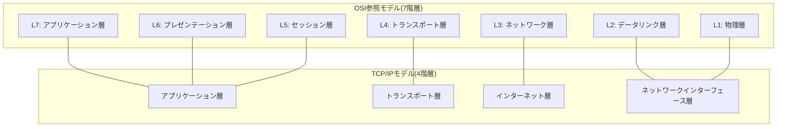
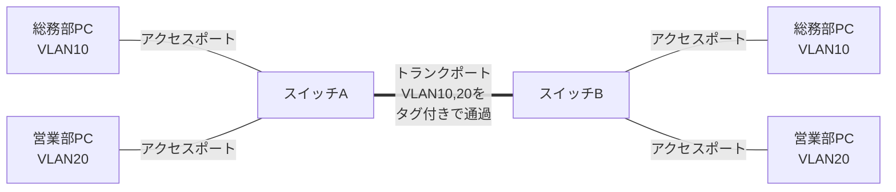
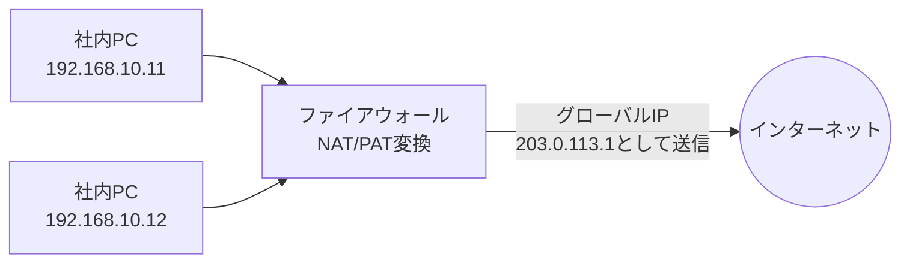
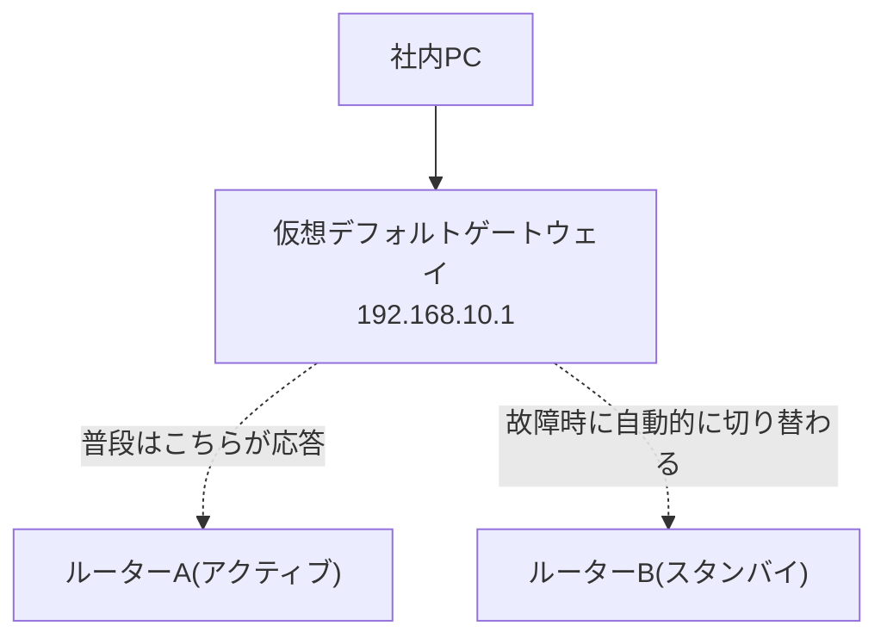

# 📖 初心者向け ネットワーク・サーバー用語集

このドキュメントは、案件01〜09に登場するネットワーク・サーバー関連の用語を、前提知識ゼロの方でも読めるようにまとめた用語集です。専門用語には、できるだけ身近なものに例えた説明を添えています。

> 💡 **使い方**: 各案件のREADMEを読んでいて分からない用語が出てきたら、このページを開いてブラウザの検索機能(Ctrl+F / Cmd+F)で用語名を探してください。各用語の末尾には「あわせて覚える用語」として関連語へのリンクを付けているので、興味が湧いたら周辺の用語も読み進めてみてください。
>
> ⚠️ 本ページに登場するIPアドレスは、すべて [docs/03_ip_address_design.md](03_ip_address_design.md)(全案件共通のIPアドレス設計書)の値と一致させています。矛盾を見つけた場合は設計書の値を正としてください。

## 📇 カテゴリ一覧

- [1. 基礎 🔰](#cat-basic)
- [2. IPアドレスとルーティング 🔢](#cat-ip-routing)
- [3. スイッチングとVLAN 🔀](#cat-switching-vlan)
- [4. セキュリティとファイアウォール 🛡️](#cat-security)
- [5. サーバーとミドルウェア 🖥️](#cat-server-middleware)
- [6. 運用と監視 📊](#cat-ops-monitoring)

---

<a id="cat-basic"></a>
## 1. 基礎 🔰

まずは、この先すべてのカテゴリの土台になる、通信そのものの考え方に関する用語です。

### 📑 この章の用語

- [OSI参照モデル](#term-osi)
- [TCP/IP](#term-tcpip)
- [ホスト名](#term-hostname)
- [FQDN](#term-fqdn)
- [ウェルノウンポート](#term-well-known-port)

<a id="term-osi"></a>
**OSI参照モデル**

「通信」を7つの階層(レイヤー)に分けて整理するための考え方のモデルです。荷物を送るときに「梱包する → 伝票を書く → 配送業者に渡す → 実際に輸送する」と役割が分かれているのと同じように、通信の役割を段階ごとに切り分けて考えることで、トラブルが起きたときにどの階層に原因があるかを特定しやすくなります。実務では7層すべてを毎回意識するわけではありませんが、特に物理層(L1)・データリンク層(L2)・ネットワーク層(L3)・トランスポート層(L4)・アプリケーション層(L7)という呼び方はよく登場します。

> 🔗 あわせて覚える用語: [TCP/IP](#term-tcpip)、[スイッチ(L2/L3)](#term-switch)、[ルーター](#term-router)

<a id="term-tcpip"></a>
**TCP/IP**

現在のインターネットや社内LANで実際に使われている通信の実装方式(プロトコル群)です。OSI参照モデルが7層の「理論上のモデル」であるのに対し、TCP/IPは4層で構成される「実際に世の中で動いている仕組み」と捉えると理解しやすくなります。IP(インターネットプロトコル)がIPアドレスを使った経路選びを担当し、TCP(伝送制御プロトコル)がデータを欠損なく相手に届ける役割を担当します。

> 🔗 あわせて覚える用語: [OSI参照モデル](#term-osi)、[IPアドレス](#term-ip-address)



<a id="term-hostname"></a>
**ホスト名**

ネットワーク上の1台の機器(サーバーやPCなど)に付ける、人間にとって分かりやすい名前です。「dns-server」「HQ-RT01」のように、IPアドレスの数字の羅列だけでは覚えにくい機器を、名前で識別できるようにするために設定します。本パックでも「HQ-RT01」「HQ-SW01」のようなホスト名を各機器に付けています。

> 🔗 あわせて覚える用語: [FQDN](#term-fqdn)、[DNS](#term-dns)

<a id="term-fqdn"></a>
**FQDN**

Fully Qualified Domain Name(完全修飾ドメイン名)の略で、ホスト名にドメイン名まで含めた「完全な名前」のことです。「www」というホスト名だけでは世界中に無数に存在しますが、「www.example.co.jp」までドメイン名を含めて書けば、インターネット上で一意に特定できます。人の名前で例えるなら、ホスト名が「下の名前」だけなのに対し、FQDNは「会社名・部署名まで含むフルネーム」のようなものです。

> 🔗 あわせて覚える用語: [ホスト名](#term-hostname)、[DNS](#term-dns)、[ゾーンファイル](#term-zone-file)

<a id="term-well-known-port"></a>
**ウェルノウンポート**

TCP/IPで通信する際、どの種類の通信かを識別するための「窓口番号」がポート番号です。その中でも0〜1023番は、HTTPなら80番、SSHなら22番というように、あらかじめ用途が世界共通で決められており、これを「ウェルノウンポート(well-known port)」と呼びます。ビルの受付に「1番窓口は郵便受付、2番窓口は来客受付」と役割が決まっているイメージに近く、ファイアウォールで通信を許可・拒否する際にもこのポート番号を基準にすることが多くあります。

> 🔗 あわせて覚える用語: [HTTP/HTTPS](#term-http-https)、[SSH](#term-ssh)、[ファイアウォール](#term-firewall)、[ACL](#term-acl)

| ポート番号 | プロトコル | 用途 |
|---|---|---|
| 20 / 21 | FTP | ファイル転送 |
| 22 | SSH | 暗号化されたリモートログイン |
| 23 | Telnet | 暗号化なしのリモートログイン(現在は非推奨) |
| 25 | SMTP | メール送信 |
| 53 | DNS | 名前解決の問い合わせ |
| 67 / 68 | DHCP | IPアドレスの自動配布 |
| 80 | HTTP | Webページの閲覧(暗号化なし) |
| 443 | HTTPS | Webページの閲覧(暗号化あり) |
| 3389 | RDP | Windowsのリモートデスクトップ接続 |

---

<a id="cat-ip-routing"></a>
## 2. IPアドレスとルーティング 🔢

「通信の住所」であるIPアドレスの仕組みと、住所をもとに経路を決める「ルーティング」に関する用語です。

### 📑 この章の用語

- [IPアドレス](#term-ip-address)
- [サブネットマスク](#term-subnet-mask)
- [CIDR](#term-cidr)
- [VLSM](#term-vlsm)
- [プライベートIP/グローバルIP](#term-private-global-ip)
- [デフォルトゲートウェイ](#term-default-gateway)
- [ping](#term-ping)
- [traceroute](#term-traceroute)
- [DNS](#term-dns)
- [ゾーンファイル](#term-zone-file)
- [DHCP](#term-dhcp)
- [ルーティング(静的/動的)](#term-routing)
- [ルーティングテーブル](#term-routing-table)

<a id="term-ip-address"></a>
**IPアドレス**

ネットワーク上の機器を特定するための「住所」に相当する番号です。手紙に住所がなければ配達できないのと同じで、通信でも送り先を示すIPアドレスがなければパケット(データの小包)を届けることができません。本パック内では「192.168.10.11」のように、4つの数字をピリオドで区切って表記します(IPv4の場合)。

> 🔗 あわせて覚える用語: [サブネットマスク](#term-subnet-mask)、[デフォルトゲートウェイ](#term-default-gateway)、[プライベートIP/グローバルIP](#term-private-global-ip)

<a id="term-subnet-mask"></a>
**サブネットマスク**

IPアドレスのうち、どこまでが「ネットワーク部(建物の住所)」で、どこからが「ホスト部(部屋番号)」かを示す情報です。「255.255.255.0」というサブネットマスクは、「同じ建物(ネットワーク)に住んでいる機器同士かどうか」を判定する境界線の役割を果たします。この境界線をどこに引くかによって、1つのネットワークに収容できる機器の台数が変わります。

> 🔗 あわせて覚える用語: [IPアドレス](#term-ip-address)、[CIDR](#term-cidr)、[VLSM](#term-vlsm)

<a id="term-cidr"></a>
**CIDR**

Classless Inter-Domain Routingの略で、サブネットマスクを「/24」のようにスラッシュとビット数で簡潔に表す記法です。「192.168.10.0/24」と書けば「255.255.255.0というサブネットマスクを持つ192.168.10.0のネットワーク」であることを一目で表せます。本パックの設計書([docs/03_ip_address_design.md](03_ip_address_design.md))でも、すべてのセグメントをこのCIDR表記で管理しています。

> 🔗 あわせて覚える用語: [サブネットマスク](#term-subnet-mask)、[VLSM](#term-vlsm)

<a id="term-vlsm"></a>
**VLSM**

Variable Length Subnet Mask(可変長サブネットマスク)の略で、1つの大きなネットワークを、部署ごとに必要な台数に応じて異なる大きさのサブネットに分割する手法です。案件04では本社LANの192.168.10.0/24を、総務部用の/26、営業部用の/26のように、部門ごとに異なるサイズへ分割します。全員に同じ大きさの部屋を均等に割り振るのではなく、人数に応じて仕切りの位置を柔軟に調整するイメージです。

> 🔗 あわせて覚える用語: [CIDR](#term-cidr)、[サブネットマスク](#term-subnet-mask)、[VLAN](#term-vlan)

<a id="term-private-global-ip"></a>
**プライベートIP/グローバルIP**

プライベートIPアドレスは、社内LANなど限られた範囲内だけで使う「内線番号」のようなアドレスで、192.168.0.0/16や10.0.0.0/8などの範囲が世界共通で予約されています。一方グローバルIPアドレスは、インターネット上で一意に識別される「外線電話番号」に相当し、ISP(インターネット接続業者)から割り当てられます。本パックでは実在の組織と重複しないよう、グローバルIPアドレスの例としてRFC 5737で「例示専用」に予約された203.0.113.0/24のみを使用しています。

> 🔗 あわせて覚える用語: [IPアドレス](#term-ip-address)、[NAT/PAT](#term-nat-pat)

| クラス | プライベートIPの範囲 | 本パックでの使用例 |
|---|---|---|
| クラスA | 10.0.0.0/8 | 本社⇔支社間WAN(10.0.0.0/30) |
| クラスB | 172.16.0.0/12 | DMZ(172.16.0.0/24) |
| クラスC | 192.168.0.0/16 | 本社LAN・サーバーセグメントなど(192.168.10.0/24 等) |

<a id="term-default-gateway"></a>
**デフォルトゲートウェイ**

自分の属するネットワークの外(別のネットワークやインターネット)へ通信するときに、最初に経由する出口となる機器のIPアドレスです。マンションの共用出入口のようなもので、外部宛の通信はすべて一度ここを経由してから外へ送り出されます。本パックの本社LANでは192.168.10.1、サーバーセグメントでは192.168.100.1がこれにあたります。

> 🔗 あわせて覚える用語: [IPアドレス](#term-ip-address)、[ルーター](#term-router)、[ルーティングテーブル](#term-routing-table)

<a id="term-ping"></a>
**ping**

相手の機器に対して「聞こえていますか?」と呼びかけ、応答が返ってくるかどうかで通信できるかを確認するコマンドです。ICMPというプロトコルを使った小さなパケットを送り、応答があれば少なくともその相手までは通信できることが分かります。ネットワークトラブルの調査では、まずこのpingで疎通確認を行うのが基本の第一歩です。

> 🔗 あわせて覚える用語: [traceroute](#term-traceroute)、[デフォルトゲートウェイ](#term-default-gateway)

<a id="term-traceroute"></a>
**traceroute**

目的地までの通信が、どの中継機器(ルーターなど)を経由しているかを1台ずつ順番に表示してくれるコマンドです(Windowsでは`tracert`)。pingが「届くかどうか」だけを確認するのに対し、tracerouteは「どこまでは届いていて、どこで止まっているか」を経路上で特定できるため、途中の中継地点にトラブルがある場合の切り分けに役立ちます。

> 🔗 あわせて覚える用語: [ping](#term-ping)、[ルーティングテーブル](#term-routing-table)

```text
$ traceroute 192.168.100.10
traceroute to 192.168.100.10, 30 hops max
 1  192.168.20.1     0.512 ms   (支社ルーター)
 2  10.0.0.1         1.203 ms   (本社ルーターのWAN側)
 3  192.168.100.10   1.897 ms   (DHCP/DNSサーバー)
```

<a id="term-dns"></a>
**DNS**

Domain Name Systemの略で、「www.example.com」のような人間が覚えやすい名前と、192.168.10.10のようなIPアドレスを対応づける仕組みです。電話帳が「名前」から「電話番号」を調べる仕組みであるのと同じように、DNSは「ドメイン名」から「IPアドレス」を調べてくれます。本パックでは案件03で、社員がIPアドレスではなく名前でサーバーへアクセスできるようDNSサーバーを構築します。

> 🔗 あわせて覚える用語: [FQDN](#term-fqdn)、[ゾーンファイル](#term-zone-file)、[DHCP](#term-dhcp)

<a id="term-zone-file"></a>
**ゾーンファイル**

DNSサーバーが管理している「電話帳の中身データ」そのものです。ドメイン名とIPアドレスの対応表(レコード)が記載されており、DNSサーバーはこのファイルを参照して問い合わせに応答します。ゾーンファイルに誤った対応関係を書いてしまうと、正しいドメイン名でアクセスしても意図しないIPアドレスに繋がってしまうため、記載内容の正確さが重要です。

> 🔗 あわせて覚える用語: [DNS](#term-dns)、[FQDN](#term-fqdn)

<a id="term-dhcp"></a>
**DHCP**

Dynamic Host Configuration Protocolの略で、PCなどの端末が起動したときに、IPアドレスなどのネットワーク設定を自動的に配布してくれる仕組みです。ホテルのフロントが空いている部屋番号を来客に自動で割り振ってくれるようなもので、管理者が1台ずつ手作業でIPアドレスを設定する手間を省いてくれます。本パックでは案件01・02では静的(手動)設定を行い、案件03からはDHCPによる自動配布に切り替えます。

> 🔗 あわせて覚える用語: [IPアドレス](#term-ip-address)、[デフォルトゲートウェイ](#term-default-gateway)、[DNS](#term-dns)

<a id="term-routing"></a>
**ルーティング(静的/動的)**

異なるネットワーク宛の通信を、どの経路(次にどの機器へ渡すか)で届けるかを決める仕組みです。静的ルーティングは管理者が経路を1つずつ手作業で設定する方式で、小規模な構成では確実で分かりやすい一方、拠点が増えると設定変更の手間が増えます。動的ルーティングはルーター同士が自動的に経路情報を交換し合う方式で、本パックでは主に静的ルーティングを扱いますが、実務の大規模ネットワークでは動的ルーティング(OSPFなど)もよく使われます。

> 🔗 あわせて覚える用語: [ルーティングテーブル](#term-routing-table)、[デフォルトゲートウェイ](#term-default-gateway)

| 項目 | 静的ルーティング | 動的ルーティング |
|---|---|---|
| 設定方法 | 管理者が手動で1経路ずつ設定 | ルーター同士が自動で経路情報を交換 |
| 向いている規模 | 小規模・拠点数が少ない構成 | 拠点数が多い・経路変更が頻繁な構成 |
| 障害時の切り替え | 手動での見直しが必要 | 自動的に迂回経路を再計算 |
| 本パックでの利用 | 案件02・05(本社⇔支社) | 発展課題として紹介のみ |

<a id="term-routing-table"></a>
**ルーティングテーブル**

ルーターが「どの宛先ネットワークへは、どのインターフェース・次のルーターへ転送すればよいか」を記録している経路表です。郵便局の仕分け係が持っている「地域ごとの配送ルート表」に例えられ、パケットが届くたびにこの表を参照して転送先を決定します。案件02では、本社ルーターと支社ルーターそれぞれに、相手側ネットワーク宛の経路を静的ルートとして登録します。

> 🔗 あわせて覚える用語: [ルーティング(静的/動的)](#term-routing)、[デフォルトゲートウェイ](#term-default-gateway)、[ルーター](#term-router)

---

<a id="cat-switching-vlan"></a>
## 3. スイッチングとVLAN 🔀

同じ建物(LAN)の中で機器同士を繋ぐスイッチと、そのスイッチを論理的に分割するVLANに関する用語です。

### 📑 この章の用語

- [MACアドレス](#term-mac-address)
- [ARP](#term-arp)
- [スイッチ(L2/L3)](#term-switch)
- [ルーター](#term-router)
- [VLAN](#term-vlan)
- [タグVLAN(802.1Q)](#term-tagged-vlan)
- [トランクポート/アクセスポート](#term-trunk-access-port)

<a id="term-mac-address"></a>
**MACアドレス**

ネットワーク機器のNIC(ネットワークインターフェースカード)に、工場出荷時から割り当てられている世界で一意な物理アドレスです。顔写真付きの身分証明書のように機器そのものを特定するための番号であり、IPアドレスのように後から自由に変更する前提のものではありません。スイッチはこのMACアドレスを見て、同じLAN内でどのポートへデータを転送すればよいかを判断します。

> 🔗 あわせて覚える用語: [ARP](#term-arp)、[スイッチ(L2/L3)](#term-switch)

<a id="term-arp"></a>
**ARP**

Address Resolution Protocolの略で、「このIPアドレスを持っている機器のMACアドレスを教えてください」と同一LAN内に問い合わせる仕組みです。名簿で相手の名前(IPアドレス)から連絡先(MACアドレス)を調べるようなイメージで、通信の最終段階でIPアドレスをMACアドレスに変換するために使われます。調べた対応関係は、端末内の「ARPテーブル」に一時的に記録されます。

> 🔗 あわせて覚える用語: [MACアドレス](#term-mac-address)、[IPアドレス](#term-ip-address)

```text
$ arp -a
? (192.168.10.1) at 00:1a:2b:3c:4d:5e [ether] on eth0    # デフォルトゲートウェイ
? (192.168.10.50) at 00:1a:2b:3c:4d:9f [ether] on eth0   # 共有プリンター
```

<a id="term-switch"></a>
**スイッチ(L2/L3)**

複数の機器をケーブルで接続し、送られてきたデータを適切な相手にだけ転送する集線装置です。L2スイッチはMACアドレスを見て同じネットワーク内での転送だけを行うのに対し、L3スイッチはルーターと同様にIPアドレスを見て異なるネットワーク間の転送(ルーティング)も行える点が異なります。オフィスの内線交換手が「同じ建物内の内線同士を繋ぐ(L2)」だけでなく「他拠点への回線も繋げる(L3)」ようになったものとイメージすると分かりやすいです。

> 🔗 あわせて覚える用語: [ルーター](#term-router)、[MACアドレス](#term-mac-address)、[VLAN](#term-vlan)

| 項目 | L2スイッチ | L3スイッチ |
|---|---|---|
| 参照する情報 | MACアドレス | MACアドレス + IPアドレス |
| できること | 同一LAN内での転送 | 同一LAN内での転送 + 異なるネットワーク間のルーティング |
| 本パックでの登場 | 案件01〜(HQ-SW01など) | 案件04以降(VLAN間ルーティング) |

<a id="term-router"></a>
**ルーター**

異なるネットワーク同士を接続し、IPアドレスの宛先を見て「次にどこへ送ればよいか」を判断して転送する機器です。郵便局の仕分け係のように、届いた荷物(パケット)の宛先住所(IPアドレス)を見て、適切な配送ルートへ次々と振り分けていく役割を担っています。本パックでは本社と支社の間をルーターで接続し、それぞれのLANを1つの大きなネットワークとして結びます。

> 🔗 あわせて覚える用語: [ルーティングテーブル](#term-routing-table)、[デフォルトゲートウェイ](#term-default-gateway)、[スイッチ(L2/L3)](#term-switch)

<a id="term-vlan"></a>
**VLAN**

Virtual LAN(仮想LAN)の略で、1台の物理スイッチの中を、あたかも複数の別々のスイッチであるかのように論理的に分割する技術です。同じフロアにあるオフィスを、パーテーションで「総務部エリア」「営業部エリア」のように区切るイメージに近く、ケーブルを物理的に増設しなくても部署ごとにネットワークを分離できます。本パックでは案件04で本社LANをVLAN10(総務・経理)、VLAN20(営業部)、VLAN30(情報システム部)、VLAN99(機器管理)の4つに分割します。

> 🔗 あわせて覚える用語: [タグVLAN(802.1Q)](#term-tagged-vlan)、[トランクポート/アクセスポート](#term-trunk-access-port)、[VLSM](#term-vlsm)

<a id="term-tagged-vlan"></a>
**タグVLAN(802.1Q)**

1本のケーブル(トランクポート)の中に、複数のVLANの通信を混在させて流すための規格です。それぞれのデータに「このデータはVLAN10のものです」という荷札(タグ)を付けて送ることで、受け取った側のスイッチがどのVLANの通信かを見分けられるようにします。この仕組みがあるおかげで、VLANの数だけケーブルを増設する必要がなくなります。

> 🔗 あわせて覚える用語: [VLAN](#term-vlan)、[トランクポート/アクセスポート](#term-trunk-access-port)

<a id="term-trunk-access-port"></a>
**トランクポート/アクセスポート**

スイッチのポートには大きく2つの種類があります。アクセスポートは1つのVLANにしか属さない、PCやプリンターを直接繋ぐための専用ポートです。トランクポートは複数VLANの通信をタグVLAN(802.1Q)によって同時に流せる、スイッチ同士やスイッチ・ルーター間を繋ぐための幹線道路のようなポートです。

> 🔗 あわせて覚える用語: [VLAN](#term-vlan)、[タグVLAN(802.1Q)](#term-tagged-vlan)



---

<a id="cat-security"></a>
## 4. セキュリティとファイアウォール 🛡️

社内ネットワークをインターネットなどの外部から守るための「境界防御」に関する用語です。

### 📑 この章の用語

- [NAT/PAT](#term-nat-pat)
- [ファイアウォール](#term-firewall)
- [DMZ](#term-dmz)
- [ポートフォワーディング(DNAT)](#term-port-forwarding)
- [ACL](#term-acl)
- [SSL/TLS証明書](#term-ssl-tls)
- [SSH](#term-ssh)
- [公開鍵認証](#term-public-key-auth)
- [VPN](#term-vpn)
- [iptables/firewalld](#term-iptables-firewalld)

<a id="term-nat-pat"></a>
**NAT/PAT**

NAT(Network Address Translation)は、社内で使うプライベートIPアドレスを、インターネットで使えるグローバルIPアドレスに変換する仕組みです。PAT(Port Address Translation、NAPTとも呼ぶ)は、1つのグローバルIPアドレスをポート番号で細分化することで、社内の複数端末が同時に1つのグローバルIPアドレスを共有してインターネットへ出られるようにする方式です。マンションの各部屋(プライベートIP)が、代表の1つの電話番号(グローバルIP)を、内線番号(ポート番号)で使い分けて外線をかけているようなイメージだと考えると分かりやすいです。

> 🔗 あわせて覚える用語: [プライベートIP/グローバルIP](#term-private-global-ip)、[ファイアウォール](#term-firewall)、[ポートフォワーディング(DNAT)](#term-port-forwarding)



<a id="term-firewall"></a>
**ファイアウォール**

社内ネットワークとインターネットなど、信頼度の異なるネットワークの境界に設置し、通していい通信とダメな通信を判断する「受付の警備員」のような役割を果たす機器・ソフトウェアです。あらかじめ決めたルール(誰が・どこへ・何のために来たか)に従って通信を許可したり拒否したりすることで、不正なアクセスから社内ネットワークを守ります。本パックでは案件05で、本社の境界にファイアウォールを構築します。

> 🔗 あわせて覚える用語: [DMZ](#term-dmz)、[ACL](#term-acl)、[NAT/PAT](#term-nat-pat)、[iptables/firewalld](#term-iptables-firewalld)

<a id="term-dmz"></a>
**DMZ**

DeMilitarized Zone(非武装地帯)の略で、社内ネットワークとインターネットの中間に設ける、外部に公開するサーバー専用の緩衝エリアです。会社の受付ロビーのように「完全に社外」でも「完全に社内(奥の執務スペース)」でもない中間領域を用意することで、万が一公開サーバーが攻撃を受けても、被害が社内ネットワークの奥まで及ぶリスクを減らせます。本パックでは案件05・06で、172.16.0.0/24をDMZとしてWebサーバー(172.16.0.10)を設置します。

> 🔗 あわせて覚える用語: [ファイアウォール](#term-firewall)、[ポートフォワーディング(DNAT)](#term-port-forwarding)

<a id="term-port-forwarding"></a>
**ポートフォワーディング(DNAT)**

インターネットから届いた通信を、あらかじめ決めたルールに従って社内(DMZなど)の特定サーバーへ転送する設定です。DNAT(Destination NAT)とも呼ばれ、会社の代表電話にかかってきた電話を「Web担当は内線1234へ」と転送するのと同じ発想です。本パックでは、外部からの203.0.113.10宛のHTTP/HTTPS通信を、DMZのWebサーバー(172.16.0.10)へ転送する設定を案件05・06で行います。

> 🔗 あわせて覚える用語: [NAT/PAT](#term-nat-pat)、[DMZ](#term-dmz)、[ウェルノウンポート](#term-well-known-port)

<a id="term-acl"></a>
**ACL**

Access Control List(アクセス制御リスト)の略で、「どの送信元から、どの宛先への、どんな種類の通信を許可・拒否するか」を順番にリスト化したルール集です。ビルの入館管理表のように、上から順にルールを照合し最初に一致したルールが適用される点が特徴で、意図せず先に定義したルールでブロックされてしまうといったミスが起こりやすいため注意が必要です。本パックでは案件04でVLAN間の通信制御に、案件05でファイアウォールの通信制御に登場します。

> 🔗 あわせて覚える用語: [ファイアウォール](#term-firewall)、[VLAN](#term-vlan)

<a id="term-ssl-tls"></a>
**SSL/TLS証明書**

Webサイトなどの通信を暗号化し、かつ「接続先が本当に本物のサーバーであるか」を証明するためのデジタル証明書です。宅配便で例えるなら、荷物を鍵付きの箱で送る(暗号化)と同時に、送り主の身元を証明する書類(証明書)を添えるようなものです。本パックでは案件06で、WebサーバーにSSL/TLS証明書を導入し、HTTPではなくHTTPSで安全に通信できるようにします。

> 🔗 あわせて覚える用語: [HTTP/HTTPS](#term-http-https)、[Apache/Nginx](#term-apache-nginx)

<a id="term-ssh"></a>
**SSH**

Secure Shellの略で、離れた場所にあるサーバーへ、暗号化された安全な通信路を通じてログインし、コマンド操作を行うための仕組みです。実務のサーバー運用では、直接サーバーの前まで行かなくても、SSHを使って手元のPCから遠隔で設定変更やトラブル対応を行うのが基本になります。本パックでは案件07で、パスワード認証よりも安全な公開鍵認証を使ったSSH接続を構築します。

> 🔗 あわせて覚える用語: [公開鍵認証](#term-public-key-auth)、[VPN](#term-vpn)

<a id="term-public-key-auth"></a>
**公開鍵認証**

SSHなどでログインする際、パスワードの代わりに「公開鍵」と「秘密鍵」という対になる鍵を使って本人確認を行う認証方式です。南京錠(公開鍵、サーバー側に登録)とその鍵(秘密鍵、自分だけが持つ)に例えられ、対になる鍵でなければ開錠(ログイン)できない仕組みです。秘密鍵さえ厳重に管理していれば、パスワードを盗み見られたり総当たり攻撃を受けたりするリスクを大幅に減らせます。

> 🔗 あわせて覚える用語: [SSH](#term-ssh)

<a id="term-vpn"></a>
**VPN**

Virtual Private Networkの略で、インターネットのような公衆の回線の中に、暗号化によって保護された「専用トンネル」を作り、あたかも社内ネットワークに直接繋がっているかのように通信できるようにする技術です。本パックでは案件07で、テレワークを行う社員が自宅から安全に社内のファイルサーバーへアクセスできるよう、VPNサーバー(192.168.100.40)を構築します。

> 🔗 あわせて覚える用語: [SSH](#term-ssh)、[ファイアウォール](#term-firewall)

<a id="term-iptables-firewalld"></a>
**iptables/firewalld**

Linuxサーバー自身に組み込まれている、通信を制御するファイアウォール機能です。iptablesは古くから使われている低レベルな設定コマンド、firewalldはそれをより扱いやすくラップした管理ツールで、CentOS/RHEL系のディストリビューションで標準的に使われています。専用のファイアウォール機器とは別に、サーバー1台1台にも「自分の身は自分で守る」設定を入れておく、多層防御の考え方が実務では重要です。

> 🔗 あわせて覚える用語: [ファイアウォール](#term-firewall)、[ACL](#term-acl)

```bash
# firewalldでSSH(22番)とHTTPS(443番)の通信を許可する例
$ firewall-cmd --permanent --add-service=ssh
$ firewall-cmd --permanent --add-service=https
$ firewall-cmd --reload
```

---

<a id="cat-server-middleware"></a>
## 5. サーバーとミドルウェア 🖥️

Linuxサーバー上で実際に動く、Webサーバーやファイル共有などのソフトウェア(ミドルウェア)に関する用語です。

### 📑 この章の用語

- [HTTP/HTTPS](#term-http-https)
- [Apache/Nginx](#term-apache-nginx)
- [Samba(SMB/CIFS)](#term-samba)
- [systemd](#term-systemd)
- [yum・dnf・apt](#term-package-manager)

<a id="term-http-https"></a>
**HTTP/HTTPS**

HTTPはWebブラウザとWebサーバーがやり取りする際の共通のルール(プロトコル)で、Webページの表示に使われます。HTTPSはこのHTTPの通信をSSL/TLSで暗号化したもので、通信内容を第三者に盗み見られたり改ざんされたりするリスクを減らします。現在の実務では、個人情報を扱わないサイトであっても常時HTTPS化することが標準的な考え方になっています。

> 🔗 あわせて覚える用語: [SSL/TLS証明書](#term-ssl-tls)、[Apache/Nginx](#term-apache-nginx)、[ウェルノウンポート](#term-well-known-port)

<a id="term-apache-nginx"></a>
**Apache/Nginx**

どちらもWebサーバーソフトウェアで、ブラウザなどからのリクエストを受け取り、Webページのデータ(HTMLファイルなど)を返す役割を持ちます。Apacheは歴史が長く豊富な機能・設定の柔軟性で知られ、Nginxは大量の同時アクセスを効率よくさばく性能に強みがあるとされ、用途に応じて使い分けられます。本パックでは案件06で、これらのいずれかを使って会社紹介サイトを外部公開します。

> 🔗 あわせて覚える用語: [HTTP/HTTPS](#term-http-https)、[SSL/TLS証明書](#term-ssl-tls)

<a id="term-samba"></a>
**Samba(SMB/CIFS)**

LinuxサーバーをWindowsのファイル共有機能(SMB/CIFSというプロトコル)に対応させ、Windows PCから「ネットワークドライブ」として違和感なくアクセスできるようにするソフトウェアです。社内の共有フォルダに、まるで自分のPCの中のフォルダのようにアクセスできるようにする「橋渡し役」とイメージすると分かりやすいです。本パックでは案件07で、ファイルサーバー(192.168.100.20)にSambaを導入します。

> 🔗 あわせて覚える用語: [SSH](#term-ssh)

<a id="term-systemd"></a>
**systemd**

多くの現行Linuxディストリビューションで採用されている、OS起動時の処理やサービス(DNSサーバーやWebサーバーなどの常駐プログラム)の起動・停止・自動再起動などを管理する仕組みです。`systemctl start/stop/restart/status`といったコマンドを使い、「このサービスを今すぐ起動して」「サーバー再起動時にも自動的に立ち上げて」といった指示を出します。ビル全体の設備管理システムのように、個々のサービスの状態を一元的に把握・制御する役割を担います。

> 🔗 あわせて覚える用語: [yum・dnf・apt](#term-package-manager)

```text
$ systemctl status nginx
● nginx.service - A high performance web server
   Loaded: loaded (/usr/lib/systemd/system/nginx.service; enabled)
   Active: active (running) since ...

$ systemctl restart nginx
```

<a id="term-package-manager"></a>
**yum・dnf・apt**

Linuxにソフトウェア(パッケージ)をインストール・更新・削除するための管理コマンドです。yumとdnf(yumの後継)は主にCentOS/RHEL系、aptはUbuntu/Debian系のディストリビューションで使われ、スマートフォンのアプリストアのように、必要なソフトとその依存関係を自動的に解決してインストールしてくれます。本パックではUbuntu Server(apt)とCentOS Stream(dnf)の両方を扱うため、どちらのコマンド体系も覚えておくと役立ちます。

> 🔗 あわせて覚える用語: [systemd](#term-systemd)

| コマンド | 主な対象ディストリビューション | 本パックでの対象OS |
|---|---|---|
| yum | CentOS 7系 など | - |
| dnf | CentOS Stream、RHEL8以降 | CentOS Stream |
| apt | Ubuntu、Debian系 | Ubuntu Server |

---

<a id="cat-ops-monitoring"></a>
## 6. 運用と監視 📊

サーバーを「作って終わり」にせず、止めずに使い続けるための監視・冗長化・バックアップに関する用語です。

### 📑 この章の用語

- [Zabbix](#term-zabbix)
- [SNMP](#term-snmp)
- [VRRP](#term-vrrp)
- [冗長化/フェイルオーバー](#term-redundancy-failover)
- [可用性](#term-availability)
- [ロードバランサ](#term-load-balancer)
- [ログローテーション](#term-log-rotation)
- [バックアップ(フル/差分/増分)](#term-backup)
- [tcpdump/Wireshark](#term-tcpdump-wireshark)

<a id="term-zabbix"></a>
**Zabbix**

サーバーやネットワーク機器が正常に動作しているかを継続的に監視し、異常があれば管理者に通知してくれる監視ソフトウェアです。24時間365日ネットワークの前に張り付いていなくても、代わりに機器の状態を見張ってくれる「見張り番」のような役割を果たします。本パックでは案件08で、監視サーバー(192.168.100.30)にZabbixを導入し、各サーバーの死活監視を行います。

> 🔗 あわせて覚える用語: [SNMP](#term-snmp)、[可用性](#term-availability)

<a id="term-snmp"></a>
**SNMP**

Simple Network Management Protocolの略で、ルーターやスイッチなどのネットワーク機器の状態(CPU使用率や通信量など)を、監視サーバーが定期的に取得するためのプロトコルです。機器に「体温計」や「血圧計」を当てて定期的に測定結果を報告してもらうようなイメージで、Zabbixのような監視ソフトウェアがこのSNMPを使って各機器の情報を収集することがよくあります。

> 🔗 あわせて覚える用語: [Zabbix](#term-zabbix)

<a id="term-vrrp"></a>
**VRRP**

Virtual Router Redundancy Protocolの略で、複数台のルーター(またはL3スイッチ)をまとめて1つの仮想的なデフォルトゲートウェイとして見せかけ、片方が故障してももう片方が即座に代わりを務める仕組みです。バスの運転手が急病になったとき、隣に控えている予備の運転手がすぐに運転を引き継ぐ仕組みとイメージすると分かりやすいです。案件08では、このVRRP(実装としてはkeepalivedなど)を使ってゲートウェイの冗長化を行います。

> 🔗 あわせて覚える用語: [冗長化/フェイルオーバー](#term-redundancy-failover)、[デフォルトゲートウェイ](#term-default-gateway)、[可用性](#term-availability)



<a id="term-redundancy-failover"></a>
**冗長化/フェイルオーバー**

冗長化とは、故障に備えてあらかじめ予備の機器・回線・経路を用意しておく設計の考え方です。フェイルオーバーは、実際に故障が起きた際に、その予備へ自動的に切り替わる動作そのものを指します。ビルの非常用発電機のように、普段は使わないが停電(故障)の際に自動的に電力供給を引き継ぐ仕組みをイメージすると理解しやすいです。

> 🔗 あわせて覚える用語: [VRRP](#term-vrrp)、[可用性](#term-availability)、[ロードバランサ](#term-load-balancer)

<a id="term-availability"></a>
**可用性**

システムやサービスが「止まらずに使い続けられる度合い」を表す指標です。一般に「稼働率99.9%」のように、一定期間のうちどれだけの割合で正常に動作していたかというパーセンテージで表現されます。案件08で扱う冗長化や監視は、いずれもこの可用性を高めるための取り組みという共通の目的でつながっています。

> 🔗 あわせて覚える用語: [冗長化/フェイルオーバー](#term-redundancy-failover)、[VRRP](#term-vrrp)、[ロードバランサ](#term-load-balancer)

<a id="term-load-balancer"></a>
**ロードバランサ**

複数台のサーバーに通信を振り分け、1台に負荷が集中しないようにする機器・ソフトウェアです。人気店舗の入り口に立って、混雑する1つのレジだけでなく複数のレジへお客さんを均等に案内する「窓口整理係」のような役割を果たします。負荷分散だけでなく、振り分け先のサーバーが1台故障してもほかのサーバーへ自動的に迂回させることで、可用性を高める効果もあります。

> 🔗 あわせて覚える用語: [可用性](#term-availability)、[冗長化/フェイルオーバー](#term-redundancy-failover)

<a id="term-log-rotation"></a>
**ログローテーション**

サーバーが記録し続けるログファイル(操作履歴やエラー記録)が無限に肥大化してディスク容量を圧迫しないよう、一定の周期(日次・週次など)で新しいログファイルに切り替え、古いものを圧縮・削除していく仕組みです。毎日使う日記帳を、一定期間ごとに新しいノートに切り替えて古いノートは本棚にしまうようなイメージです。Linuxでは`logrotate`というツールで自動化されることが一般的です。

> 🔗 あわせて覚える用語: [バックアップ(フル/差分/増分)](#term-backup)

<a id="term-backup"></a>
**バックアップ(フル/差分/増分)**

万が一のデータ消失に備えて、データの複製を別の場所に保存しておく仕組みです。フルバックアップは毎回すべてのデータを丸ごと複製する方式、差分バックアップは前回のフルバックアップ以降に変更された分だけを複製する方式、増分バックアップは前回のバックアップ(フルまたは増分)以降の変更分だけを複製する方式で、それぞれ復元の手間とバックアップにかかる時間・容量のバランスが異なります。保険と同じで、普段は使わなくてもいざというときに会社を守るための備えとして考えられています。

> 🔗 あわせて覚える用語: [ログローテーション](#term-log-rotation)、[可用性](#term-availability)

| 方式 | 対象範囲 | 復元の手間 | バックアップ時間・容量 |
|---|---|---|---|
| フルバックアップ | すべてのデータ | 少ない(1世代を戻すだけ) | 大きい |
| 差分バックアップ | 前回フル以降の変更分 | フル+差分の2世代分が必要 | 中程度 |
| 増分バックアップ | 前回バックアップ以降の変更分 | フル+すべての増分が必要 | 小さい |

<a id="term-tcpdump-wireshark"></a>
**tcpdump/Wireshark**

ネットワーク上を流れている通信データ(パケット)をキャプチャ(記録)し、その中身を1つずつ確認できるツールです。tcpdumpはコマンドライン(文字だけの画面)で使う軽量なツール、Wiresharkはキャプチャした内容をグラフィカルな画面で分かりやすく解析できるツールで、通信が「そもそも届いているか」「どんな内容でやり取りされているか」を深いところまで確認したいときに使います。ping・tracerouteだけでは解決しない複雑なトラブルシューティングの、最後の切り札的な存在です。

> 🔗 あわせて覚える用語: [ping](#term-ping)、[traceroute](#term-traceroute)

```bash
$ tcpdump -i eth0 port 53 -n
12:00:01.123456 IP 192.168.10.17.51820 > 192.168.100.10.53: 12345+ A? fileserver.local. (34)
12:00:01.125678 IP 192.168.100.10.53 > 192.168.10.17.51820: 12345 1/1/0 A 192.168.100.20 (50)
```

---

## 🔗 関連ドキュメント

- [README.md(ポートフォリオ全体トップ)](../README.md)
- [docs/00_roadmap.md(学習ロードマップ)](00_roadmap.md)
- [docs/02_environment_setup.md(演習環境の作り方)](02_environment_setup.md)
- [docs/03_ip_address_design.md(全案件共通IPアドレス設計書)](03_ip_address_design.md)
- [docs/04_portfolio_presentation_guide.md(面接・書類選考での伝え方)](04_portfolio_presentation_guide.md)
- [案件01: 本社オフィスLANの設計・構築](../projects/case01_lan_design/README.md)(最初の案件)
