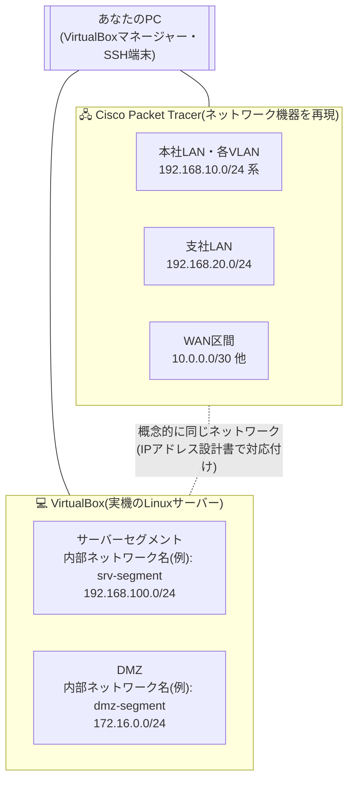

# 🧰 演習環境の作り方

このドキュメントは、案件01〜09を実際に手を動かしながら進めるための **演習環境の準備手順** です。
まだ環境を用意していない方は、この手順に沿って準備を済ませてから [案件01](../projects/case01_lan_design/README.md) に進んでください。

このポートフォリオでは、2つのツールを役割分担して使います。

- **Cisco Packet Tracer**: ルーター・L2/L3スイッチ・PCを画面上に配置して構成する「ネットワーク機器のシミュレータ」です。本社LAN・支社LAN・WAN区間・VLANなど、案件01〜05・09はここで作業します。
- **VirtualBox**: 実際のLinux OS(Ubuntu Server / CentOS Stream)を動かす「サーバー仮想化ソフト」です。案件03以降のDHCP/DNS・ファイアウォール・Webサーバーなどは、実機に近い形で学べるVirtualBox上の本物のLinuxサーバーとして構築します。

技術的に2つを直接つなぐわけではありませんが、[docs/03_ip_address_design.md](03_ip_address_design.md) のIPアドレス設計を共通のものさしにすることで「概念的に同じ1つの社内ネットワーク」として扱います。全体像は次のとおりです。



> 💡 この考え方は案件03のREADMEでも改めて説明します。Packet TracerとVirtualBoxを物理的につなぐ必要はなく、両者の設定にIPアドレス設計書の値を一致させることが重要です。

## 1. 推奨PCスペック 🖥️

| 項目 | 推奨 | 備考 |
|---|---|---|
| メモリ(RAM) | 16GB以上 | 最低8GBでも1台ずつなら動作しますが、案件08・09では複数のサーバーVMを同時起動して冗長化・障害切替を検証するため、余裕を持たせることを強く推奨します |
| CPU | Intel VT-x / AMD-V(仮想化支援機能)対応 | 近年のPCはほぼ対応済みですが、BIOS/UEFIで無効化されている場合があります。起動時に「VT-x is disabled」と出たらBIOS/UEFI画面で有効化してください |
| ストレージ | SSD、空き容量50GB以上 | VMのディスクは動的割当を使えば実消費は少なめですが、複数VMを保持すると徐々に増えます |
| OS(ホスト側) | Windows 10/11、macOS、Linuxのいずれか | VirtualBoxはマルチプラットフォーム対応です。以降はWindowsを主な例にしますが他OSもほぼ同じ流れです |

> ⚠️ 会社貸与PCではBIOS設定変更や仮想化ソフトの導入が制限されている場合があります。私物PCまたは管理者権限のある環境での構築をおすすめします。

## 2. VirtualBoxのインストール 📦

1. 公式サイト [https://www.virtualbox.org/](https://www.virtualbox.org/) にアクセスします。
2. 「Downloads」から、自分のホストOS(Windows hosts / macOS / Linux distributions)に合ったインストーラーをダウンロードします。
3. インストーラーを実行し、基本的にはデフォルト設定のまま進めて問題ありません。途中でネットワークインターフェースに関する確認ダイアログ(一時的にネットワーク接続が切れる旨の警告)が出た場合は「はい」を選んで続行します。
4. インストール完了後、VirtualBoxマネージャーが起動できることを確認します。

> ⚠️ **Windows利用者への注意**: Hyper-V(WSL2やDocker Desktopが内部で使用)が有効だと、仮想化支援機能を奪い合いVMの起動が極端に遅くなったり失敗したりします。WSL2を使わないなら「Windowsの機能の有効化または無効化」からHyper-Vのチェックを外すと安定します。併用したい場合はVirtualBox 7.x以降のHyper-V互換モード(既定で有効)のまま様子を見て、重い場合のみ無効化を検討してください。

Extension Pack(USB 3.0対応やリモートディスプレイ機能などの追加パッケージ)は、本パックの演習では必須ではないため導入は任意です。

## 3. サーバーOSの入手 💿

本パックのサーバー構築案件(案件03、05〜08)は、基本的に **Ubuntu Server 22.04 LTS** を前提に手順を記載しています。加えて、実務ではRHEL系(Red Hat Enterprise Linux系)のサーバーに出会う場面も多いため、選択肢として **CentOS Stream** も紹介します。

| ディストリビューション | 入手先 | 特徴 |
|---|---|---|
| Ubuntu Server LTS | [https://ubuntu.com/download/server](https://ubuntu.com/download/server) | Debian系。`apt`でパッケージ管理。日本語の情報が多く、初めての方でも情報を探しやすい |
| CentOS Stream | [https://www.centos.org/centos-stream/](https://www.centos.org/centos-stream/) | RHEL系。`dnf`でパッケージ管理。案件によっては、firewalldなどRHEL系ならではの流儀に触れる場面もあります |

> 📘 Ubuntu Serverのダウンロードページには常にその時点の最新LTS版が大きく表示されますが、本パックの手順は **22.04 LTS** を前提に書かれています。ページ下部のリンクや `https://releases.ubuntu.com/22.04/` から該当バージョンを選んでください。新しいLTS版でも大半の手順はそのまま使えますが、コマンド名やパスが変わっていたら、エラーメッセージを読み替えて対応する練習だと考えましょう(実務でも「手順書どおりに動かない」ことは日常的に起こります)。

初めての方は、まず **Ubuntu Server** で一通り案件を進めることをおすすめします。CentOS Streamは、一通り終えたあとに「同じ構成を別のディストリビューションで再現してみる」という復習教材として使うと、OSの違いに振り回されずに学習効果を高められます。

## 4. VirtualBoxで仮想マシン(VM)を新規作成する 🧱

ここでは、案件03で実際に構築するDHCP/DNSサーバー「`ns1`」(サーバーセグメント `192.168.100.10`)を例に、VMの作り方を一通り確認します。

1. VirtualBoxマネージャーで「新規」ボタンをクリックします。
2. 名前(例: `ns1`)を入力すると、タイプ・バージョンはOSの種類から自動判定されます(Ubuntu系は「Linux / Ubuntu(64-bit)」、CentOS Stream系は「Linux / Red Hat(64-bit)」)。
3. メモリサイズ、CPU数、仮想ハードディスクを割り当てます(目安は下表)。ハードディスクは「可変サイズ」を選ぶと、実際に使った分だけホストの容量を消費するため扱いやすくなります。
4. 作成したVMの「設定」→「ストレージ」で、ダウンロードしたISOファイルを光学ドライブに割り当てます。
5. VMを起動し、インストーラーの案内に沿って進めます。Ubuntu Serverの「Featured Server Snaps」画面では、案件07でSSHを使うため **OpenSSH server** にチェックを入れておくと以降がスムーズです。

| VMの用途 | メモリ目安 | CPU | ディスク目安 |
|---|---|---|---|
| 基本のLinuxサーバー(DHCP/DNS、ファイル、Webサーバーなど) | 1〜2GB | 1コア | 20GB(可変サイズ) |
| ファイアウォール役のVM(ネットワークアダプタ3枚) | 1〜2GB | 1コア | 20GB |
| 監視サーバー(Zabbix + MySQLを同居させる案件08) | 2〜4GB | 2コア | 20〜30GB |

> 💡 **地味に役立つ2つの機能**: 「Guest Additions」を導入するとホストPCとVMでクリップボードを共有でき、コマンドのコピー&ペーストが楽になります。また、設定変更の前に「スナップショット」を取っておけば、[ロードマップ](00_roadmap.md)が推奨する「わざと失敗させてみる」演習も、うまくいかなければ即座に元の状態へ戻せて安心です。

## 5. ネットワークアダプタの設計:「内部ネットワーク」と「ホストオンリー」の使い分け 🔌

VirtualBoxのVMには複数の種類のネットワークアダプタを割り当てられます。それぞれ「誰と通信できるか」が異なるため、目的に応じて使い分けます。

| アダプター種別 | 通信できる相手 | 本パックでの主な用途 |
|---|---|---|
| NAT | このVM単体がインターネットに出られるだけ。他のVMやホストPCから直接アクセスすることはできない | OSインストール直後、`apt update` などパッケージ取得のために一時的に使う |
| NATネットワーク | 複数VMがまとめてインターネットに出つつ、VM同士でも通信できる仮想ネットワーク | 案件05のファイアウォールVMの「outside」側インターフェースなど、インターネット接続口を模擬する場面 |
| ブリッジアダプター | VMが自宅・会社の物理LANに直接参加し、実機同然のIPアドレスを取得する | 本パックでは基本的に使用しません(自宅や会社のLANに意図せず影響を与える可能性があるため) |
| **内部ネットワーク(Internal Network)** | 同じ名前を指定したVM同士だけが通信できる、外部から完全に隔離された仮想LAN。ホストPCも参加できない | サーバーセグメントやDMZなど、案件のIPアドレス設計をそのまま再現する。本パックの主軸 |
| **ホストオンリーアダプター(Host-Only)** | ホストPCとVMだけが通信できる仮想LAN。他のVMや外部インターネットには出られない | ホストPCのターミナルから直接SSH接続して操作したいときの、任意の管理用アダプタ |

本パックでは **本社LAN・支社LAN・WAN区間はPacket Tracer上で完結** します。VirtualBoxの内部ネットワークが登場するのは、実際のLinuxサーバーを置く **サーバーセグメント(192.168.100.0/24)** と **DMZ(172.16.0.0/24)** だけです。

| セグメント | ネットワークアドレス | 内部ネットワーク名の例 | 登場する主な案件 |
|---|---|---|---|
| サーバーセグメント | 192.168.100.0/24 | `srv-segment` | 案件03、05(inside側)、07、08 |
| DMZ(公開セグメント) | 172.16.0.0/24 | `dmz-segment` | 案件05(dmz側)、06 |

> ⚠️ **名前の一致に注意**: 内部ネットワークは「名前」だけで同一ネットワークかどうかを判定します。`srv-segment` と `srv_segment` のように1文字でも違うと別ネットワーク扱いになり、pingすら通りません。VMを追加するときは既存VM(`ns1`など)の設定を開き、内部ネットワーク名を1文字単位で確認してください。実務でもよくあるトラブルパターンです。

「内部ネットワーク」を主軸にするのは、DMZとサーバーセグメントが本来どおり互いに隔離された独立セグメントであることを再現できるからです(案件06のWebサーバーが社内DNSへ自由にアクセスできない、という設計上の制約もこの隔離性が前提です)。一方「ホストオンリー」は、ホストPCという“外部の管理端末”をラボに参加させたいときに使います。「ツール」→「ネットワーク」→「ホストオンリーネットワーク」から作成すると、ホストPC側にも `vboxnet0` という仮想アダプタが増え、そこ経由でVMへSSH接続できます。各案件のREADMEは基本的に **VirtualBoxのVM画面(コンソール)から直接操作する** 前提ですが、操作しづらければ2枚目のアダプタとしてホストオンリーを追加すると作業しやすくなります(SSHの基本操作は8節、社外からの本格的なリモートアクセスは案件07で扱います)。

なお、OSインストール直後の `apt update` / `dnf update` は内部ネットワークだけでは実行できません(外部と一切つながらないためです)。インストール作業中だけ一時的にアダプタを「NAT」に切り替えてパッケージを取得し、完了後に各案件のREADMEが指定する内部ネットワークへ切り替えてから固定IPを設定してください。

## 6. ネットワーク機器の学習環境:Cisco Packet Tracer 🖧

Packet Tracerは、Cisco Networking Academyが無償で提供するネットワーク機器シミュレータです。実機を購入しなくても、ルーターやスイッチのCLI(コマンドライン)操作をほぼそのまま練習できます。

1. [https://www.netacad.com/courses/packet-tracer](https://www.netacad.com/courses/packet-tracer) にアクセスします。
2. 案内に従って無料のNetworking Academyアカウントを作成します(メールアドレスの確認が必要です)。
3. ログイン後、Packet Tracerの自己学習コースに登録するとダウンロードリンクが表示されます。自分のOSに合ったインストーラーを選び、インストールします。
4. 本パックはPacket Tracer 8.x系を前提に記載しています。バージョンが違っても操作の考え方は共通ですが、メニュー名や画面配置が変わっていたらUI上を探してみてください。

## 7. 代替ツール:GNS3 🌉

Packet Tracerのアカウント登録が難しい場合や、より実機に近いCisco IOSの挙動で練習したい場合は、[GNS3](https://www.gns3.com/) も選択肢になります。GNS3は実際のルーターOSイメージ(自分で用意)やDockerコンテナを組み合わせて仮想ネットワークを構築できるオープンソースのツールで、実務者にも広く使われています。ただしセットアップの手間や必要スペックはPacket Tracerより高くなりがちで、本パックの各案件はPacket Tracerの画面・コマンド体系を前提に書かれています。GNS3を使う場合は、コマンドは流用しつつ操作手順は読み替えながら進めてください。

## 8. SSHクライアントの基本操作 💻

サーバー構築が進むと、VMのコンソール画面だけでなく、手元のPCのターミナルから直接ログインして操作したい場面が増えてきます。SSH(Secure Shell)は、ネットワーク越しに暗号化された通信でリモートのサーバーを操作するための仕組みです。

| ホストOS | 使えるSSHクライアント |
|---|---|
| Windows 10/11 | Windows Terminal または PowerShell に、標準で `ssh` コマンドが同梱されています。追加インストールは不要です |
| Windows(GUIで使いたい場合) | Tera Term(通称「テラターム」)。ログを画面に残しながら操作できるため、案件の作業記録を取るのにも便利です |
| macOS / Linux | ターミナルアプリに標準で `ssh` コマンドが入っています |

基本的な使い方は次のとおりです。

```bash
# 書式: ssh <ユーザー名>@<IPアドレスまたはホスト名>
$ ssh <ユーザー名>@192.168.100.10
```

上記は、案件03で構築するDHCP/DNSサーバー「`ns1`」(ホストオンリーアダプタを追加している場合)への接続例です。ユーザー名はUbuntu Serverインストール時に自分で設定したものに置き換えてください。

初めて接続するサーバーには、次のような確認メッセージが表示されます。

```text
The authenticity of host '192.168.100.10 (192.168.100.10)' can't be established.
ED25519 key fingerprint is SHA256:xxxxxxxxxxxxxxxxxxxxxxxxxxxxxxxxxxxxxxxxxxx.
Are you sure you want to continue connecting (yes/no/[fingerprint])?
```

これは「このサーバー、本当に接続してよい相手ですか?」という確認です。SSHは接続先の「指紋(フィンガープリント)」を記録し、次回以降に別のサーバーへすり替えられていないかを検知します。初回は `yes` と入力して接続を許可し、操作が終わったら `exit` でログアウトします。

SSHで接続するには、接続元から接続先へ実際に到達できるネットワーク経路が必要です。5節のとおり本パックの内部ネットワークはホストPCから隔離されているため、ホストPCから直接SSHしたい場合はホストオンリーアダプタの追加が前提になります。未対応なら、これまでどおりVirtualBoxのVM画面(コンソール)から操作してください。公開鍵認証など実践的な運用は案件07で詳しく扱います。

## 9. 環境構築チェックリスト ✅

| 確認項目 | チェック |
|---|---|
| ホストPCで仮想化支援機能(VT-x/AMD-V)が有効になっている | ☐ |
| VirtualBoxのインストールが完了し、マネージャーが起動できる | ☐ |
| Ubuntu Server 22.04 LTS(または任意でCentOS Stream)のISOを入手済み | ☐ |
| Cisco Networking Academyのアカウントを作成し、Packet Tracerをインストール済み(またはGNS3を用意済み) | ☐ |
| SSHクライアント(Windows Terminal/PowerShellのssh、またはTera Termなど)を確認済み | ☐ |

すべて準備できたら、[docs/00_roadmap.md](00_roadmap.md) の進め方に沿って **案件01から順に読み進めてください。**
