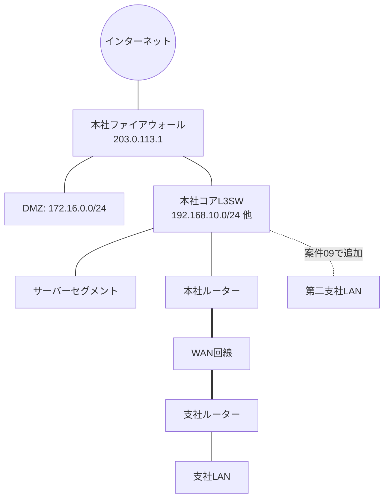

# 🌐 全案件共通 IPアドレス設計書

このドキュメントは、案件01〜09で使用する **すべてのIPアドレスの正本(マスター設計)** です。
各案件のREADME内に出てくるIPアドレスは、すべてこの設計書と一致しています。

> ⚠️ **注意**：このリポジトリで使用するグローバルIPアドレスは、実在の組織を指さないよう
> [RFC 5737](https://datatracker.ietf.org/doc/html/rfc5737) で「文書・例示専用」として予約されている
> `203.0.113.0/24`(TEST-NET-3)のみを使用しています。実際のインターネット上には存在しないアドレスです。

## 1. 全体ネットワーク構成図

## 2. セグメント一覧(サマリ)

| セグメント名 | ネットワークアドレス | 用途 | 登場する案件 |
|---|---|---|---|
| 本社LAN(全体) | 192.168.10.0/24 | 本社内すべての端末・部門 | 案件01 |
| 本社LAN VLAN10(総務・経理) | 192.168.10.0/26 | 総務部・経理部の端末 | 案件04〜 |
| 本社LAN VLAN20(営業部) | 192.168.10.64/26 | 営業部の端末 | 案件04〜 |
| 本社LAN VLAN30(情報システム部) | 192.168.10.128/26 | 情シス部・サーバー管理端末 | 案件04〜 |
| 本社LAN VLAN99(機器管理) | 192.168.10.192/27 | スイッチ・ルーターの管理用 | 案件04〜 |
| 本社LAN 予備 | 192.168.10.224/27 | 将来の部門増設用(未使用) | - |
| サーバーセグメント | 192.168.100.0/24 | DHCP/DNS/ファイル/監視サーバーなど | 案件03,07,08 |
| DMZ(公開セグメント) | 172.16.0.0/24 | 外部公開するWebサーバーなど | 案件05,06 |
| 本社-支社間WAN | 10.0.0.0/30 | 拠点間の専用線(想定) | 案件02〜 |
| 支社LAN | 192.168.20.0/24 | 支社内の端末 | 案件02〜 |
| 本社-第二支社間WAN | 10.0.0.4/30 | 案件09で追加する拠点間回線 | 案件09 |
| 第二支社LAN | 192.168.30.0/24 | 案件09で新設する第二支社 | 案件09 |
| インターネット(例示用) | 203.0.113.0/24 | 会社のグローバルIPアドレス帯(例示用) | 案件05,06 |

## 3. 詳細アドレス設計

### 3-1. 本社LAN(案件01時点:VLAN分割前)

案件01〜03の時点では、本社LANはVLANで分割されていない、フラットな1つのネットワークとして構築します。

| 項目 | 値 |
|---|---|
| ネットワークアドレス | 192.168.10.0/24 |
| サブネットマスク | 255.255.255.0 |
| デフォルトゲートウェイ | 192.168.10.1(L3SW/ルーターのSVI) |
| 端末への割当範囲 | 192.168.10.10 〜 192.168.10.199(静的 or DHCP) |
| DHCPサーバー(案件03〜) | 192.168.10.200 〜 192.168.10.220 |
| ブロードキャストアドレス | 192.168.10.255 |

### 3-2. 本社LAN(案件04以降:VLAN分割後)

案件04で、本社LAN(192.168.10.0/24)を **VLSM(可変長サブネットマスク)** を用いて4つのVLANに分割します。

| VLAN ID | 名称 | ネットワーク | 範囲 | 使用可能ホスト数 | ゲートウェイ(SVI) |
|---|---|---|---|---|---|
| VLAN10 | 総務・経理 | 192.168.10.0/26 | .0 〜 .63 | 62台 | 192.168.10.1 |
| VLAN20 | 営業部 | 192.168.10.64/26 | .64 〜 .127 | 62台 | 192.168.10.65 |
| VLAN30 | 情報システム部 | 192.168.10.128/26 | .128 〜 .191 | 62台 | 192.168.10.129 |
| VLAN99 | 機器管理専用 | 192.168.10.192/27 | .192 〜 .223 | 30台 | 192.168.10.193 |
| (予備) | 将来の部門増設用 | 192.168.10.224/27 | .224 〜 .255 | 30台 | 未割当 |

> 📘 **VLSMの考え方**：/24 のネットワークを、部門ごとに必要な台数に応じて異なる大きさの
> サブネットマスクで分割する手法です。詳しい計算方法は
> [案件04のREADME](../projects/case04_vlan_segmentation/README.md) で手順を追って解説します。

### 3-3. サーバーセグメント

| ホスト | IPアドレス | 役割 | 登場案件 |
|---|---|---|---|
| L3SW/FWのSVI | 192.168.100.1 | サーバーセグメントのゲートウェイ | 案件03 |
| DHCP/DNSサーバー | 192.168.100.10 | 案件03で構築 | 案件03〜 |
| ファイルサーバー | 192.168.100.20 | 案件07で構築(Samba) | 案件07〜 |
| 監視サーバー | 192.168.100.30 | 案件08で構築(Zabbix等) | 案件08〜 |
| VPNサーバー | 192.168.100.40 | 案件07で構築 | 案件07〜 |

### 3-4. DMZ(公開セグメント)

| ホスト | IPアドレス | 役割 | 登場案件 |
|---|---|---|---|
| FWのDMZ側インターフェース | 172.16.0.1 | DMZのゲートウェイ | 案件05 |
| Webサーバー | 172.16.0.10 | 案件06で構築(Apache/Nginx) | 案件05〜 |

### 3-5. WAN区間

| 区間 | ネットワーク | 本社側 | 対向側 |
|---|---|---|---|
| 本社 ⇔ 支社 | 10.0.0.0/30 | 10.0.0.1(本社ルーター) | 10.0.0.2(支社ルーター) |
| 本社 ⇔ 第二支社(案件09) | 10.0.0.4/30 | 10.0.0.5(本社ルーター) | 10.0.0.6(第二支社ルーター) |

/30 は「ポイントツーポイント(1対1)接続専用に使用可能なホストが2台だけになるサブネット」であるため、
WAN区間のような機器同士の直接接続に無駄なく利用されます。

### 3-6. 支社LAN(案件02〜)

| 項目 | 値 |
|---|---|
| ネットワークアドレス | 192.168.20.0/24 |
| デフォルトゲートウェイ | 192.168.20.1 |
| DHCP割当範囲(案件03以降) | 192.168.20.100 〜 192.168.20.200 |

### 3-7. 第二支社LAN(案件09で新設)

| 項目 | 値 |
|---|---|
| ネットワークアドレス | 192.168.30.0/24 |
| デフォルトゲートウェイ | 192.168.30.1 |
| DHCP割当範囲 | 192.168.30.100 〜 192.168.30.200 |

### 3-8. インターネット向けアドレス(例示用グローバルIP)

| ホスト | IPアドレス | 役割 |
|---|---|---|
| 本社FWの外側インターフェース | 203.0.113.1 | インターネット接続口(ISPから払い出された想定) |
| Webサーバー公開用(NAT後) | 203.0.113.10 | 案件05・06で、DMZの172.16.0.10へポート転送 |

## 4. ルーティング設計の要点(案件02・05で使用)

- 本社ルーターは、支社宛(192.168.20.0/24)への **静的ルート** を持つ
  `ip route 192.168.20.0 255.255.255.0 10.0.0.2`
- 支社ルーターは、本社宛(192.168.10.0/24, 192.168.100.0/24)への静的ルートを持つ
  `ip route 192.168.10.0 255.255.255.0 10.0.0.1`
  `ip route 192.168.100.0 255.255.255.0 10.0.0.1`
- インターネット宛のデフォルトルートは本社FWのみが持つ(支社はインターネットへ本社経由でアクセス)

## 5. この設計書の使い方

各案件のREADMEを読んでいて「このIPアドレスの根拠は?」と疑問に思ったら、必ずこのファイルに戻って確認してください。
逆に、自分で演習環境を構築する際にIPアドレスで迷ったときも、この設計書の値をそのまま使えば、
すべての案件を通して矛盾なく構築できるようになっています。
