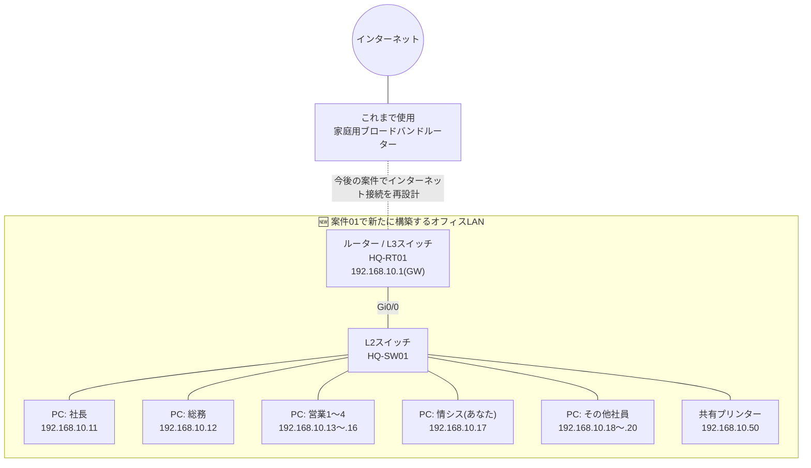

# 案件01: 本社オフィスLANの設計・構築 🏢

## 1. この案件について

| 項目 | 内容 |
|---|---|
| 難易度 | ★☆☆☆☆(全5段階) |
| 想定所要時間 | 3〜5時間 |
| 前提となる案件 | なし(このパック最初の案件です) |

## 2. 身につくスキル 🎯

- IPアドレス・サブネットマスク・デフォルトゲートウェイという「通信の住所」の基本的な考え方
- L2スイッチとルーター(L3スイッチ)の役割の違いと、それぞれの基本設定
- UTPケーブルの結線方式(ストレート/クロス)と、現在主流の自動判別(Auto-MDIX)の仕組み
- OSI参照モデルを使って「通信を階層で捉える」考え方の基礎
- Cisco Packet Tracerを使ったネットワーク構成図の作成とデバイス設定
- `ping` や `ipconfig` / `ip a` コマンドによる疎通確認の基本操作

## 3. 案件概要(お客様からのご依頼) 💬

> 「実は、うちの会社、去年の創業以来ずっと家電量販店で買った家庭用のブロードバンドルーターだけでやってきたんです。最初は3人だったからそれで十分だったんですが、おかげさまで最近社員が10名まで増えましてね……。
>
> 困っているのがまずプリンターです。営業から『共有プリンターに印刷できない』ってクレームが来るし、Wi-Fiも遅くて頻繁に切れる。あと新しく入った社員のパソコンをどう設定すればいいのか、うちの総務担当も分からなくて右往左往してるんですよ。
>
> フュージョンITソリューションズさんは近所の商工会の紹介で知ったんですが……そちらは"ちゃんとした会社のネットワーク"みたいなものを作ってもらえるんですよね? 難しいことはよく分からないんですが、とりあえず社員全員が安心してパソコンとプリンターを使えるようにしてほしいんです。」

*(株式会社サンプル商事 代表取締役社長)*

## 4. 背景・状況 📋

株式会社サンプル商事は創業3年目の商社です。設立当初は社員3名で、家庭用のブロードバンドルーター1台に数台のPCをなんとなく無線・有線接続していただけでした。IPアドレスもルーターのDHCP機能に任せきりで、誰がどのIPアドレスを使っているか把握している人もいませんでした。

事業が軌道に乗りこの1年で社員が10名まで増加すると、共有プリンターへの印刷が「できたりできなかったり」する、Wi-Fiが不安定、新入社員のPC設定に総務担当が半日がかりになる、といったトラブルが日常化しました。原因の多くは、家庭用ルーターのDHCPが払い出すIPアドレスが再起動のたびに変わってしまい、プリンターやファイル共有の設定が追いつかないことにあります。

社長はこれを機に業務用のネットワーク機器(L2スイッチとルーター)を導入し、きちんと設計されたオフィスLANを構築することを決断しました。これがフュージョンITソリューションズへの最初の依頼です。

## 5. 要件 ✅

1. オフィス内の全10台のPCと共有プリンターが、相互に安定して通信できること
2. 将来の増員・拠点拡大を見据え、`docs/03_ip_address_design.md` の設計(192.168.10.0/24)に準拠したIPアドレス設計とすること
3. すべての端末に重複のない一意のIPアドレスを、静的に割り当てること(現時点ではDHCPサーバーは未構築のため)
4. どのケーブルがどの機器を結んでいるか誰でも追跡できるよう、機器名・ポート・配線に一定のルールを設けること
5. 新入社員が入社したときに、総務担当でもIP設定の手順書を見ながら対応できる状態にすること
6. Cisco Packet Tracer上で構成を再現し、後日の見直し・拡張(将来のVLAN分割など)が容易な設計にすること

## 6. 全体構成図 🗺️



この案件で新たに導入するのは **L2スイッチ1台** と **ルーター(またはL3スイッチ)1台** です。既存の家庭用ブロードバンドルーターはインターネット接続口としてしばらく残しますが、本格的な境界防御の設計は案件05(ファイアウォール・NAT構築)で扱うため今回は対象外とします。

## 7. IPアドレス設計 🔢

本案件で使用するIPアドレスは、[docs/03_ip_address_design.md 3-1節](../../docs/03_ip_address_design.md#3-1-本社lan案件01時点vlan分割前)の「本社LAN(案件01時点:VLAN分割前)」の設計に準拠します。詳細な設計思想・他案件との関係は必ず同ファイルを参照してください。

| 項目 | 値 |
|---|---|
| ネットワークアドレス | 192.168.10.0/24 |
| サブネットマスク | 255.255.255.0 |
| デフォルトゲートウェイ | 192.168.10.1(L3SW/ルーターのSVI) |
| 端末への割当範囲 | 192.168.10.10 〜 192.168.10.199(静的 or DHCP) |
| ブロードキャストアドレス | 192.168.10.255 |

> 📘 設計書には「DHCPサーバー: 192.168.10.200〜220」の枠もありますが、これは案件03でDHCPサーバーを構築してから使用する範囲です。案件01の時点ではDHCPサーバーがまだ存在しないため、**全端末に静的IPアドレスを設定**します。

上記の割当範囲(.10〜.199)の中から、本案件では以下のように具体的な端末へ割り当てます。

| ホスト名 | IPアドレス | 用途 |
|---|---|---|
| HQ-RT01(ルーター/L3SW) | 192.168.10.1 | デフォルトゲートウェイ |
| PC-社長 | 192.168.10.11 | 社長業務端末 |
| PC-総務 | 192.168.10.12 | 総務担当端末 |
| PC-営業1〜4 | 192.168.10.13〜.16 | 営業部員の端末(4台) |
| PC-情シス | 192.168.10.17 | あなた(新人インフラエンジニア)の作業端末 |
| PC-その他 | 192.168.10.18〜.20 | 残りの社員端末(3台) |
| 共有プリンター | 192.168.10.50 | 全社共有のネットワークプリンター |

## 8. 使用環境・ツール 🛠️

| 分類 | 使用ツール・バージョン目安 |
|---|---|
| ネットワーク機器シミュレータ | Cisco Packet Tracer 8.2以降 |
| ルーター相当機器 | Router-PT(Cisco ISRシリーズ相当)、またはL3スイッチ(Catalyst 3560相当) |
| L2スイッチ | Cisco Catalyst 2960相当 |
| 端末 | Packet Tracerの PC / Printer デバイス |
| ケーブル | 自動判別(Auto-MDIX)対応の「コピー万能ケーブル」 |

## 9. 作業手順 🔧

### STEP1: LAN/WANとOSI参照モデルの基礎を押さえる

作業に入る前に、最低限の前提知識を整理します。

| 用語 | ざっくりした意味 |
|---|---|
| LAN(Local Area Network) | オフィスや自宅など、限られた範囲内の機器同士を接続するネットワーク。今回作るのはこちら |
| WAN(Wide Area Network) | LAN同士を結ぶ、地理的に離れた場所をまたぐネットワーク(インターネットもWANの一種) |

通信は「OSI参照モデル」という7階層のモデルで整理して考えることが多く、本案件で扱うのは主に以下の3階層です。

| 階層 | 名称 | 本案件での対応物 |
|---|---|---|
| L3 | ネットワーク層 | IPアドレスによる通信経路の決定(ルーター) |
| L2 | データリンク層 | MACアドレスによる同一LAN内の転送(スイッチ) |
| L1 | 物理層 | UTPケーブル・ポートなど物理的な接続 |

### STEP2: UTPケーブルの結線方式を理解する

**UTPケーブル**とは、LANでPCやスイッチをつなぐのに使う、いわゆる「LANケーブル」の正式名称です(Unshielded Twisted Pair=シールドなしのより線、の略)。このケーブルには大きく分けて「ストレート」と「クロス」の2種類の結線方式があります。

| ケーブル種別 | 主な用途(従来のルール) |
|---|---|
| ストレートケーブル | 異なる種類の機器同士(PC⇔スイッチ、ルーター⇔スイッチ) |
| クロスケーブル | 同じ種類の機器同士(PC⇔PC、スイッチ⇔スイッチ) |

> 💡 **補足**: 現在の業務用ネットワーク機器のほとんどは **Auto-MDIX(自動判別)** に対応しており、ストレート・クロスどちらのケーブルでも自動的に極性を判別して通信できます。Packet Tracerの「コピー万能ケーブル」もこれを再現したものですが、稀に古い機器でAuto-MDIX非対応のものに遭遇するため、仕組みは覚えておきましょう。

### STEP3: Packet Tracer上にデバイスを配置し結線する

1. Router-PT(またはL3スイッチ)を1台、Switch(2960相当)を1台配置する
2. PCを10台、Printerを1台配置する
3. ルーターの `GigabitEthernet0/0` とスイッチの `GigabitEthernet0/1` をコピー万能ケーブルで接続する
4. スイッチの空きポートとPC・プリンターをそれぞれコピー万能ケーブルで接続する

### STEP4: ルーター(またはL3スイッチ)の基本設定

```text
Router> enable
Router# configure terminal
Router(config)# hostname HQ-RT01
HQ-RT01(config)# interface GigabitEthernet0/0
HQ-RT01(config-if)# description Link-to-HQ-SW01
HQ-RT01(config-if)# ip address 192.168.10.1 255.255.255.0
HQ-RT01(config-if)# no shutdown
HQ-RT01(config-if)# exit
HQ-RT01(config)# end
HQ-RT01# write memory
```

> 📘 L3スイッチを使う場合は、物理インターフェースの代わりに `interface vlan 1` に対して同じIPアドレスを設定します(SVI = Switch Virtual Interface)。今回はセグメントが1つだけなので `ip routing` の有効化は不要です。

### STEP5: L2スイッチの基本設定

```text
Switch> enable
Switch# configure terminal
Switch(config)# hostname HQ-SW01
HQ-SW01(config)# interface range fastEthernet0/1 - 10
HQ-SW01(config-if-range)# description LAN-PCs-and-Printer
HQ-SW01(config-if-range)# switchport mode access
HQ-SW01(config-if-range)# exit
HQ-SW01(config)# end
HQ-SW01# write memory
```

現時点ではスイッチ自体に管理用IPアドレスは設定していません(スイッチ自体へのリモートログインは案件04以降で扱います)。まずはL2スイッチが「LANケーブルを挿すだけで動く」機器であることを体感してください。

### STEP6: 各PC・プリンターに静的IPアドレスを設定する

各端末のデスクトップにある「IP Configuration」画面で、以下の値を入力します(実機ではWindowsの`ネットワークとインターネットの設定`画面、Linuxの`nmcli`コマンドに相当)。

例:社長PC(192.168.10.11)の場合

```text
IP Address      : 192.168.10.11
Subnet Mask     : 255.255.255.0
Default Gateway : 192.168.10.1
```

同様に、上記「7. IPアドレス設計」の表に沿って残り9台のPCと共有プリンターにもIPアドレスを設定します。入力ミスを防ぐため、必ず一覧表を見ながら1台ずつ確認して進めましょう。

## 10. 動作確認 🔍

### PCからのping確認

社長PC(192.168.10.11)から、まずデフォルトゲートウェイに疎通確認を行います。

```text
C:\> ping 192.168.10.1

Pinging 192.168.10.1 with 32 bytes of data:
Reply from 192.168.10.1: bytes=32 time<1ms TTL=255
Reply from 192.168.10.1: bytes=32 time<1ms TTL=255
Reply from 192.168.10.1: bytes=32 time<1ms TTL=255
Reply from 192.168.10.1: bytes=32 time<1ms TTL=255

Ping statistics for 192.168.10.1:
    Packets: Sent = 4, Received = 4, Lost = 0 (0% loss)
```

続いて、別のPC(総務PC 192.168.10.12)やプリンター(192.168.10.50)にもpingを送り、社内のどの端末とも通信できることを確認します。

### 設定内容の確認(ipconfig / ip a)

```text
C:\> ipconfig

Ethernet0 Connection:
   IP Address. . . . . . . . . . . : 192.168.10.11
   Subnet Mask . . . . . . . . . . : 255.255.255.0
   Default Gateway . . . . . . . . : 192.168.10.1
```

実機のLinux端末(将来案件のサーバー等)では次のコマンドで確認します。

```bash
$ ip a show eth0
2: eth0: <BROADCAST,MULTICAST,UP,LOWER_UP> mtu 1500
    inet 192.168.10.17/24 brd 192.168.10.255 scope global eth0
```

### ルーター側からの確認

```text
HQ-RT01# show ip interface brief

Interface              IP-Address      OK? Method Status                Protocol
GigabitEthernet0/0     192.168.10.1    YES manual up                    up
```

`Status` と `Protocol` の両方が `up` になっていれば、物理的な接続(L1)とデータリンク(L2)の両方が正常であることを意味します。

## 11. よくあるトラブルと対処法 ⚠️

| 症状 | 考えられる原因 | 対処法 |
|---|---|---|
| PC同士でpingが通らない(Destination host unreachable) | IPアドレスやサブネットマスクの入力ミス、別セグメントの値を誤入力 | 対象PCで `ipconfig` を実行し、7章の一覧表と1台ずつ突き合わせて再設定する |
| 特定のPCだけ `Request timed out` になる | ケーブルの挿し忘れ、スイッチポートの故障、ケーブル自体の断線 | Packet Tracerのシミュレーションモードでリンクランプ(緑/赤)を確認し、物理結線を挿し直す |
| 同一LAN内のPC同士は通信できるがゲートウェイ(192.168.10.1)にpingが通らない | ルーター側インターフェースにIPアドレス未設定、または `no shutdown` を実行し忘れている | `show ip interface brief` でStatus/Protocolを確認し、`ip address` と `no shutdown` を設定し直す |
| プリンターに特定のPCからだけ印刷できない | そのPCだけ以前の家庭用ルーター時代のDHCPで取得したIP設定が残っている | 端末の古いネットワーク設定を削除し、静的IPアドレスを設定し直す |

## 12. この案件の重要用語 📚

- **LAN/WAN**: LANは限定された範囲内のネットワーク、WANはLAN同士を結ぶ広域のネットワーク
- **IPアドレスとサブネットマスク**: 通信の宛先を表す「住所」と、その住所のうちどこまでが「ネットワーク部」かを示す情報
- **デフォルトゲートウェイ**: 自分の属するネットワークの外へ通信するときの出口となる機器のIPアドレス
- **スイッチとルーターの違い**: スイッチは同じLAN内でMACアドレスを見て転送する機器、ルーターは異なるネットワーク間でIPアドレスを見て経路を選ぶ機器
- **MACアドレス**: ネットワーク機器に工場出荷時から割り当てられている、世界で一意な物理アドレス
- **ping**: 相手先に対して疎通確認用のパケット(ICMP)を送り、応答が返ってくるかで通信の可否を確認するコマンド

より詳しい解説は [docs/01_glossary.md](../../docs/01_glossary.md) を参照してください。

## 13. 発展課題(任意) 🚀

1. スイッチにポートセキュリティ(Port Security)を設定し、登録されていない機器が接続された場合にポートを自動的にシャットダウンさせてみる
2. 無線LANルーター(Access Point)を追加し、有線端末と同じ192.168.10.0/24セグメントでスマートフォン等からも接続できるようにしてみる
3. 今回作成した構成図を draw.io や PowerPointなどのツールで清書し、実際の設計書として提出できる形に仕上げてみる

## 14. ポートフォリオ・面接でのアピールポイント 🌟

> **想定回答（未実施）:** この節の文例は、この案件を実施した後に使う想定の説明例です。本人がこの案件を実施した記録は、2026-09-28 時点でありません（[README](../../README.md)の「採用ご担当者様へ」を参照）。文中の「構築しました」「確認しました」などは実績ではありません。実施したら、自分の実施日・結果・つまずきで書き換え、実施していない部分は話さないでください。

この案件を実施できたら、面接では「家庭用ルーター1台で運用されていた10名規模のオフィスに対し、要件をヒアリングした上でIPアドレス設計を行い、Cisco Packet Tracerでスイッチとルーターを設定、pingとipconfigで全端末の疎通を確認するところまで自分で対応しました」のように説明できます（想定回答。実施前は使わず、実施したら自分の結果で書き換えます）。あわせて「なぜストレートではなくコピー万能ケーブルを使ったのか」「なぜ静的IPを選んだのか」といった判断理由まで語れるようにしておくと、単なる手順の暗記ではなく理解に基づいた設計であることが伝わります。

## 15. 関連リンク 🔗

- 前の案件: なし(このパックの最初の案件です)
- 次の案件: [案件02: 本社-支社間ルーティング構築](../case02_wan_routing/README.md)
- [README.md(ポートフォリオ全体トップ)](../../README.md)
- [docs/00_roadmap.md(学習ロードマップ)](../../docs/00_roadmap.md)
- [docs/01_glossary.md(用語集)](../../docs/01_glossary.md)
- [docs/02_environment_setup.md(演習環境の作り方)](../../docs/02_environment_setup.md)
- [docs/03_ip_address_design.md(全案件共通IPアドレス設計書)](../../docs/03_ip_address_design.md)
