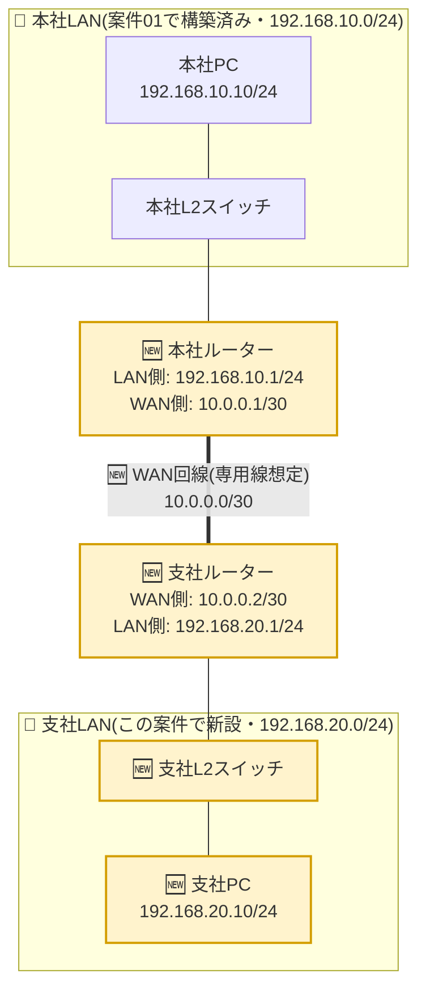

# 案件02: 本社-支社間ルーティング構築

## 1. この案件について 📋

| 項目 | 内容 |
|---|---|
| 難易度 | ★★☆☆☆(5段階中2) |
| 想定所要時間 | 4〜6時間 |
| 前提となる案件 | [案件01: 本社オフィスLANの設計・構築](../case01_lan_design/README.md) |

## 2. 身につくスキル 🎯

- 異なるネットワーク同士をルーターで接続する基本的な考え方
- スタティックルート(静的経路)の設定方法と、ルーティングテーブルの読み方
- ポイントツーポイント接続で `/30` サブネットを使う理由(VLSMの入り口)
- `ping` / `tracert`(`traceroute`)を使った経路確認・障害の切り分け方
- Cisco IOS(ルーターのOS)での基本設定(ホスト名、インターフェース設定)

## 3. 案件概要(お客様からのご依頼) 📞

> 「実は先月、本社から車で15分くらいの倉庫を借りて、営業所として使い始めたんです。
> まだ机とパソコンを2台置いただけの小さな拠点なんですが……本社と営業所のパソコンで
> 同じファイルをやり取りできるようにしたくて。今は資料をUSBメモリで運んでるんですが、
> 更新し忘れて古いファイルを見てしまうこともあって、正直不安なんです。
> 本社と営業所をネットワークでつないでいただけますか?」
>
> ——株式会社サンプル商事 総務部 ご担当者様

## 4. 背景・状況 🏢

案件01で本社LAN(192.168.10.0/24)を整備してから数ヶ月後、サンプル商事は事業拡大のため
近隣の倉庫を借り、**営業所(支社)**を開設しました。営業担当者2名が常駐し、見積書や
在庫資料をパソコンで扱っていますが、本社との情報共有はUSBメモリの手渡しに頼っており、
非効率なうえ情報漏えいや更新漏れのリスクも抱えています。

そこで本社-支社間に回線(拠点間の専用線を敷設した想定)を用意し、双方のLANを
**ルーター**で接続、**スタティックルート**による経路制御を設定します。インターネット経由の
VPN接続は案件07で扱うため、この案件ではシンプルな専用線接続として構築します。

## 5. 要件 📝

1. 本社LAN(192.168.10.0/24)と支社LAN(192.168.20.0/24)が双方向にIP通信できること。
2. WAN区間には `docs/03_ip_address_design.md` 定義済みの `10.0.0.0/30` を使用すること。
3. 経路情報は**スタティックルート**で設定すること(動的ルーティングは扱わない)。
4. 支社ルーターには、案件03で構築予定のサーバーセグメント(192.168.100.0/24)への経路も
   あらかじめ設定しておくこと。
5. `ping` と `tracert`(`traceroute`)で双方向の疎通・経路が確認できること。
6. インターネット接続(案件05で構築予定)は、この案件では扱わないこと。

## 6. 全体構成図 🗺️

黄色の部分が、この案件で新たに追加する機器・区間です。



本社ルーターのLAN側インターフェースには、案件01の設計時点からゲートウェイ用として
予約されていた `192.168.10.1` を割り当てます(`docs/03_ip_address_design.md` 3-1節参照)。
IPアドレス設計自体は変更せず、「その住所に実際に機器を置く」イメージです。

## 7. IPアドレス設計 🔢

すべて `docs/03_ip_address_design.md` に定義済みです。詳細な設計根拠は必ず同ファイルを
参照してください。ここでは関係する範囲だけ抜粋します。

| 区間・セグメント | ネットワーク | アドレス割当 | 参照節 |
|---|---|---|---|
| 本社-支社間WAN | 10.0.0.0/30 | 本社ルーター 10.0.0.1 / 支社ルーター 10.0.0.2 | 3-5節 |
| 支社LAN | 192.168.20.0/24 | GW 192.168.20.1(支社ルーター) | 3-6節 |
| 本社LAN(参考) | 192.168.10.0/24 | GW 192.168.10.1(本社ルーター) | 3-1節 |

> 支社LANのDHCP割当範囲(192.168.20.100〜200)は案件03以降で使用します。この時点では
> DHCPサーバーがまだ存在しないため、PCには固定IPを設定します。

### なぜWAN区間だけ `/30` を使うのか

本社LAN・支社LANは `/24`(最大254台収容)ですが、WAN区間だけは `/30` という極端に
小さいサブネットです。`/30` は「ネットワークアドレス・ホスト用2つ・ブロードキャストアドレス」の
計4つしかアドレスを持たず、ルーター同士を1対1で直結する区間には過不足なくぴったりです。
このように用途に応じてサブネットマスクの大きさを使い分ける考え方を**VLSM(可変長サブネットマスク)**
と呼びます。本格的な計算方法は案件04で扱いますが、ここでは「小さい区間には小さいサブネットを
使う」という発想に慣れておきましょう。

## 8. 使用環境・ツール 🧰

| 分類 | 使用ツール・バージョン目安 |
|---|---|
| ネットワークシミュレータ | Cisco Packet Tracer 8.x |
| 本社側L3スイッチ | Cisco Catalyst 3560相当(Packet Tracerの Multilayer Switch)、ホスト名 HQ-RT01(案件01で導入した機体をそのまま使用。案件04以降もこの機体でVLAN間ルーティングまで担当します) |
| 支社側ルーター | Cisco 1941(Packet Tracer上のモデル、内蔵GigabitEthernetポートを使用) |
| L2スイッチ | Cisco Catalyst 2960(案件01と同モデル) |
| PC | Packet Tracer上のPCデバイス(Windows風コマンドプロンプト) |
| 主なコマンド | `configure terminal`, `interface`, `ip address`, `ip route`, `show ip route`, `show ip interface brief`, `ping`, `tracert`/`traceroute` |

## 9. 作業手順 🔧

### STEP1: 本社ルーターの基本設定

```
Router> enable
Router# configure terminal
Router(config)# hostname HQ-RT01
HQ-RT01(config)# enable secret cisco123
HQ-RT01(config)# no ip domain-lookup
HQ-RT01(config)# exit
```

`no ip domain-lookup` は、コマンドの打ち間違いで余計な名前解決が走り数十秒待たされる、
という初心者がハマりがちな現象を防ぐためのおまじないです。

### STEP2: 本社ルーターのインターフェース設定

```
HQ-RT01# configure terminal
HQ-RT01(config)# interface GigabitEthernet0/0
HQ-RT01(config-if)# ip address 192.168.10.1 255.255.255.0
HQ-RT01(config-if)# no shutdown
HQ-RT01(config-if)# exit
HQ-RT01(config)# interface GigabitEthernet0/2
HQ-RT01(config-if)# description Link-to-R-BR1(WAN)
HQ-RT01(config-if)# ip address 10.0.0.1 255.255.255.252
HQ-RT01(config-if)# no shutdown
HQ-RT01(config-if)# exit
```

`255.255.255.252` は `/30` をドット区切りに直したものです。HQ-RT01(Catalyst 3560相当のL3スイッチ)
はシリアルポートを持たないため、WAN区間もLAN側と同じGigabitEthernetインターフェースを使い、
ISPや回線事業者から提供されるEthernetハンドオフ(メディアコンバーター経由の専用線など)に
直結する想定で構成します。`GigabitEthernet0/1` は案件03でサーバーセグメント接続用に使う
予定のため、ここでは空いている `GigabitEthernet0/2` をWAN用として割り当てます。

> 📘 **豆知識(DCE/DTE・clock rate)**: 従来型のシリアルWAN回線(専用線)では、通信タイミングを
> 決める側(DCE)とそれに合わせる側(DTE)があり、DCE側にだけ `clock rate` というコマンドを
> 設定する必要がありました。CCNAの学習などでは頻出の概念ですが、今回のようにEthernetハンド
> オフの回線を使う場合はこの設定は不要です。存在だけ知っておくと、他の教材や実機で出会った
> ときに戸惑わずに済みます。

### STEP3: 支社ルーターの基本設定とインターフェース設定

```
Router> enable
Router# configure terminal
Router(config)# hostname R-BR1
R-BR1(config)# enable secret cisco123
R-BR1(config)# interface GigabitEthernet0/0
R-BR1(config-if)# ip address 192.168.20.1 255.255.255.0
R-BR1(config-if)# no shutdown
R-BR1(config-if)# exit
R-BR1(config)# interface GigabitEthernet0/1
R-BR1(config-if)# description Link-to-HQ-RT01(WAN)
R-BR1(config-if)# ip address 10.0.0.2 255.255.255.252
R-BR1(config-if)# no shutdown
R-BR1(config-if)# exit
```

R-BR1(Cisco 1941)は内蔵の2つ目のGigabitEthernetポートをそのままWAN用に使います。

### STEP4: WAN回線の物理接続確認

```
HQ-RT01# show ip interface brief
Interface              IP-Address      OK? Method Status                Protocol
GigabitEthernet0/0     192.168.10.1    YES manual up                    up
GigabitEthernet0/2     10.0.0.1        YES manual up                    up
```

`Status` と `Protocol` が両方 `up` であれば正常です。どちらかが `down` の場合は
STEP2〜4のいずれかに設定漏れがあります。

### STEP5: スタティックルートの設定

ルーターは初期状態では自分に直結したネットワークしか知りません。相手先ネットワークへの
経路を教える必要があります。`ip route <宛先ネットワーク> <サブネットマスク> <ネクストホップ>`
という書式です。

```
HQ-RT01(config)# ip route 192.168.20.0 255.255.255.0 10.0.0.2
```

```
R-BR1(config)# ip route 192.168.10.0 255.255.255.0 10.0.0.1
R-BR1(config)# ip route 192.168.100.0 255.255.255.0 10.0.0.1
```

`192.168.100.0/24`(サーバーセグメント)は案件03で構築するネットワークですが、経路情報だけ
先に用意しておきます。こうしておけば、案件03でサーバーを追加したときに支社側の設定変更が
不要になります。設定後は必ず保存します。

```
HQ-RT01(config)# end
HQ-RT01# write memory
```

### STEP6: PC側のIPアドレス設定

DHCPサーバーがまだ存在しないため、固定IPを設定します(Packet Tracerでは各PCの
[Desktop] → [IP Configuration] から設定)。

| 項目 | 本社PC | 支社PC |
|---|---|---|
| IPアドレス | 192.168.10.10 | 192.168.20.10 |
| サブネットマスク | 255.255.255.0 | 255.255.255.0 |
| デフォルトゲートウェイ | 192.168.10.1 | 192.168.20.1 |

デフォルトゲートウェイには、必ずそのPCが所属するLAN側ルーターのIPアドレスを指定します。
間違えると、同一LAN内の通信はできても別ネットワーク宛の通信だけができなくなります。

## 10. 動作確認 ✅

**ルーティングテーブルの確認**

```
HQ-RT01# show ip route
     10.0.0.0/30 is subnetted, 1 subnets
C       10.0.0.0 is directly connected, GigabitEthernet0/2
C    192.168.10.0/24 is directly connected, GigabitEthernet0/0
S    192.168.20.0/24 [1/0] via 10.0.0.2
```

`C` は直接接続、`S` はスタティックルートで追加した経路です。`192.168.20.0/24` が `S` として
表示されればSTEP5の設定は正しく反映されています。

**pingによる疎通確認(必ず両方向で)**

```
C:\> ping 192.168.20.10

Pinging 192.168.20.10 with 32 bytes of data:
Reply from 192.168.20.10: bytes=32 time=2ms TTL=126
Reply from 192.168.20.10: bytes=32 time=1ms TTL=126

Ping statistics for 192.168.20.10:
    Packets: Sent = 4, Received = 4, Lost = 0 (0% loss)
```

片方向だけ通って逆方向が通らない場合、どちらかのルーターにスタティックルートの
設定漏れがある可能性が高いです。

**tracert(traceroute)による経路確認**

`ping` は「届いたか」しか分かりませんが、`tracert`(Windows/Packet Tracer PC)や
`traceroute`(Linux・Cisco機器)は経由するルーターを1ホップずつ表示します。

```
C:\> tracert 192.168.20.10

Tracing route to 192.168.20.10 over a maximum of 30 hops:

  1    1 ms    1 ms    1 ms  192.168.10.1
  2    2 ms    1 ms    2 ms  10.0.0.2
  3    2 ms    2 ms    1 ms  192.168.20.10

Trace complete.
```

1ホップ目が本社ルーター、2ホップ目が支社ルーター、3ホップ目が目的地であれば設計どおりです。
途中に `* * *`(タイムアウト)が出た場合は、その手前までしか経路が通っていないため、
そのホップを担当するルーターの設定を疑います。

## 11. よくあるトラブルと対処法 🐞

| 症状 | 考えられる原因 | 対処法 |
|---|---|---|
| 本社→支社のpingは通るが、支社→本社が通らない | 支社ルーター側にだけ本社LAN宛のスタティックルートが未設定(片方向のみ設定) | `show ip route` で両ルーターの経路表を確認し、双方向分の `ip route` が入っているか確認する |
| インターフェースが `up/up` にならずWAN区間が全く通信できない | `no shutdown` の入れ忘れ、ケーブル未接続、両端のIPアドレス/サブネットマスクの入力ミス | `show ip interface brief` でStatus/Protocolを確認。GigabitEthernet0/2(HQ-RT01)・GigabitEthernet0/1(R-BR1)が `down/down` ならケーブル接続と設定コマンドを再確認 |
| pingは通るのに `tracert` の経路が想定と違う、または `* * *` が出る | 意図しない経路が存在する、または途中のルーターでルートが欠けている | 各ホップのIPを控え、そのホップを担当するルーターの `show ip route` を確認して想定経路と突き合わせる |
| PC間pingで「宛先ホストに到達不能」と表示される | PCのデフォルトゲートウェイ設定間違い、サブネットマスクの入力ミス | PCのIP設定を再確認し、`docs/03_ip_address_design.md` の値と照合する |

## 12. この案件の重要用語 📚

- **ルーティング**: 異なるネットワーク宛のパケットを適切な経路へ転送する仕組み。
- **ルーティングテーブル(経路表)**: ルーターが持つ「どの宛先へどこ経由で届けるか」の一覧表。`show ip route` で確認できる。
- **スタティックルート(静的経路)**: 管理者が手動で設定する固定の経路情報。拠点数が少ないうちは管理しやすい。
- **ネクストホップ**: パケットを次に転送する隣接ルーターのIPアドレス。`ip route` の3番目の値。
- **VLSM(可変長サブネットマスク)**: 用途に応じて異なる大きさのサブネットマスクで分割する設計手法。案件04で本格的に扱う。
- **traceroute(tracert)**: 目的地までのルーターを1ホップずつ表示し、問題箇所を切り分けるコマンド。

共通の基礎用語(IPアドレス、サブネットマスク、pingなど)は
[docs/01_glossary.md](../../docs/01_glossary.md) を参照してください。

## 13. 発展課題 🚀

1. **WAN回線の冗長化**: 現構成では回線が1本のみで、切れると通信が完全に止まります。
   回線を2本用意して冗長化する場合の設計(フローティングスタティックルートなど)を調べてみましょう。
2. **動的ルーティングとの比較**: RIPやOSPFのような動的ルーティングプロトコルと
   スタティックルートのメリット・デメリットを自分の言葉で整理してみましょう。
3. **拠点が増えたら?**: 案件09で第二支社が追加されます。スタティックルートは拠点が
   増えるたびに全ルーターの見直しが必要になります。設定量の変化を試算してみましょう。

## 14. ポートフォリオ・面接でのアピールポイント 💼

> 「拠点間WAN区間になぜ `/30` を使うのかをVLSMの考え方から理解した上で設計しました。
> スタティックルートは双方向に設定しないと片方向にしか通信できないことを、実際に
> 片方の設定を抜いて再現し、`tracert` で経路を1ホップずつ確認しながら原因を切り分ける
> トラブルシューティングの手順を体験を通じて身につけました。」

## 15. 関連リンク 🔗

- 前の案件: [案件01: 本社オフィスLANの設計・構築](../case01_lan_design/README.md)
- 次の案件: [案件03: DHCP/DNSサーバー構築](../case03_dhcp_dns/README.md)
- [docs/00_roadmap.md](../../docs/00_roadmap.md) — 学習ロードマップ全体
- [docs/01_glossary.md](../../docs/01_glossary.md) — 用語集
- [docs/03_ip_address_design.md](../../docs/03_ip_address_design.md) — 全案件共通IPアドレス設計書(この案件のIPアドレスの正本)
