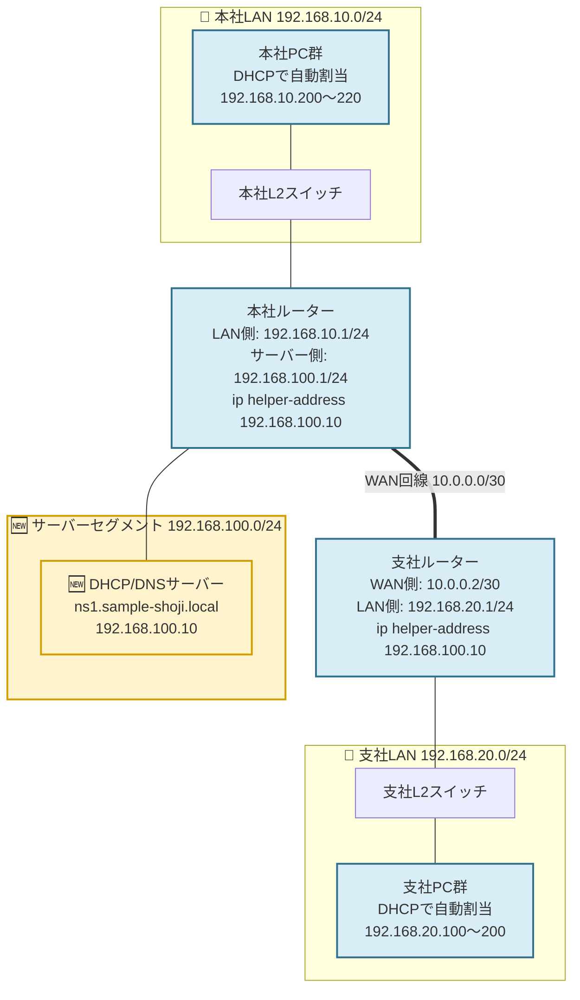

# 案件03: DHCP/DNSサーバー構築 🌐

## 1. この案件について 📋

| 項目 | 内容 |
|---|---|
| 難易度 | ★★☆☆☆(全5段階中2) |
| 想定所要時間 | 5〜7時間 |
| 前提となる案件 | [案件01: 本社オフィスLANの設計・構築](../case01_lan_design/README.md)、[案件02: 本社-支社間ルーティング構築](../case02_wan_routing/README.md) |

> 🔰 本社LAN(192.168.10.0/24)・支社LAN(192.168.20.0/24)、およびその間のルーティングが
> 構築済みであることが前提です。まだの方は先に案件01・案件02を終わらせてください。
> 特にこの案件では、案件02で支社ルーターにあらかじめ設定しておいた
> 「サーバーセグメント(192.168.100.0/24)宛のスタティックルート」がそのまま活きてきます。

## 2. 身につくスキル 🎯

- DHCPの仕組み(DISCOVER→OFFER→REQUEST→ACKのやり取り)と、スコープ(払い出し範囲)設計の考え方
- ルーターを越えてDHCPを使うための「DHCPリレー(`ip helper-address`)」の理解
- DNSの仕組み(正引き・逆引き)と、BIND9でのゾーンファイルの書き方
- Ubuntu Serverへのミドルウェア導入(`apt`)とサービス管理(`systemctl`)の基本操作
- `dig` / `nslookup`を使った名前解決の確認・トラブルシューティング
- クライアント側の名前解決の仕組み(リゾルバ、`/etc/resolv.conf`)の理解

## 3. 案件概要(お客様からのご依頼) 📞

> 「おかげさまで社員が20名まで増えまして……本当にありがたいことなんですが、正直ちょっと悲鳴を
> あげてます。
>
> 新しい人が入るたびに、情シス担当(あなたです)がIPアドレスとかサブネットマスクとかゲートウェイを
> 1台1台手で入力してるんですけど、これがもう本当に大変で。この前なんて、うっかり2台のパソコンに
> 同じIPアドレスを設定しちゃって、片方が急に社内のファイルにアクセスできなくなるトラブルも
> 起きましたよね……。
>
> あと、地味に困ってるのがサーバーへのアクセスなんです。今後ファイルサーバーとか色々増えていくと
> 思うんですけど、そのたびに『192.168.100.何番だっけ』って調べながらアクセスするの、正直つらくて。
> 家でインターネットするときみたいに、名前を入力するだけでつながるようにできませんか?」
>
> ——株式会社サンプル商事 総務部 ご担当者様(情シス担当兼任)

## 4. 背景・状況 🏢

案件01・02を経て、株式会社サンプル商事は本社LAN・支社LANが整備され、拠点間の通信も
問題なく行えるようになりました。しかし、端末へのIPアドレス設定は今も**すべて手作業の静的設定**の
ままです。社員が10名だった頃はまだ管理できていましたが、20名まで増えると次のような問題が
表面化してきました。

- 新入社員のPCを1台セットアップするたびに、情シス担当(あなた)がIPアドレス・サブネットマスク・
  デフォルトゲートウェイを手入力する必要があり、時間がかかる
- 入力ミスによるIPアドレスの重複(同じアドレスを2台に設定してしまう)が実際に発生している
- 今後、ファイルサーバー(案件07)・監視サーバー(案件08)などサーバーセグメント
  (192.168.100.0/24)に構築するサーバーが増えていく予定だが、その都度IPアドレスを覚えて
  アクセスするのは現実的ではない

そこで今回は、サーバーセグメント192.168.100.0/24内に**DHCP/DNSサーバーを兼ねたLinuxサーバー**を
1台構築します。DHCPによってIPアドレスの配布を自動化し、あわせてDNSによって社内の機器に
「名前」でアクセスできるようにします。実務でも、規模が小さいうちはルーターやNAS内蔵のDHCP機能で
済ませることもありますが、拠点をまたいで一元管理したい・DNSと連携させたいといった要件が出てくると、
このように専用のLinuxサーバー(または将来的にはActive Directoryなど)を用意するケースが一般的です。

> 💡 ここから先、サーバー部分は**VirtualBox上に構築した実際のLinux仮想マシン**で再現します。
> 案件01・02まで使ってきたCisco Packet Tracerは、ネットワーク機器(ルーター)側の設定
> (`ip helper-address`など)を引き続き行うために使用しますが、DHCP/DNSサーバーそのものの
> 構築は実機に近い形で学べるVirtualBox環境で行います。両者はこの案件を通して「概念的に同じ
> ネットワークにつながっている」ものとして進めてください。

## 5. 要件 📝

1. サーバーセグメント(192.168.100.0/24)の192.168.100.10に、DHCP/DNSサーバーとして機能する
   Linuxサーバー(Ubuntu Server)を構築すること。
2. 本社LAN(192.168.10.0/24)のクライアント端末に対し、192.168.10.200〜192.168.10.220の範囲で
   IPアドレスを自動的に配布できること。
3. 支社LAN(192.168.20.0/24)のクライアント端末に対しても、同じ1台のDHCPサーバーから
   192.168.20.100〜192.168.20.200の範囲でIPアドレスを自動的に配布できること(セグメントごとに
   個別のDHCPサーバーは立てず、1台で集中管理すること)。
4. 社内ドメイン`sample-shoji.local`として、正引き(ホスト名→IPアドレス)・逆引き(IPアドレス→
   ホスト名)の両方の名前解決ができること。
5. DHCPで配布する情報にDNSサーバーのIPアドレスを含め、クライアント端末がDHCPで自動的に
   名前解決の設定まで受け取れること。
6. 既存のIPアドレス設計(`docs/03_ip_address_design.md`)と矛盾しないこと。特に、これまで静的に
   設定してきたゲートウェイ等のIPアドレスと、DHCPの配布範囲が重複しないこと。
7. `dig`または`nslookup`コマンドで、正引き・逆引きの両方が正しく解決できることを確認できること。

## 6. 全体構成図 🗺️

黄色は今回新たに追加する要素、水色は既存の機器で設定を追加・変更する部分です。



案件01・02で構築した本社LAN・支社LAN・WAN区間はそのまま利用します。この案件で新たに
登場するのは**サーバーセグメント一式(DHCP/DNSサーバーを含む)**です。あわせて、
本社ルーター・支社ルーターには`ip helper-address`の設定を追加し、各PCの設定は
「静的IP」から「DHCPによる自動取得」へ切り替わります。

> 📘 支社ルーター(R-BR1)には、案件02の時点で「まだ存在しないサーバーセグメント
> (192.168.100.0/24)宛」のスタティックルートをあらかじめ設定していました。そのため、
> この案件でサーバーを実際に構築しても、**支社ルーター側の追加設定はhelper-addressの
> 1行だけ**で済みます。

## 7. IPアドレス設計 🔢

この案件で使用するIPアドレスは、すべて `docs/03_ip_address_design.md` に定義済みのものです。
詳細な設計根拠や他案件との関係は、必ず同ファイルを参照してください。ここでは、この案件に
関係する範囲だけを抜粋して転記します。

### サーバーセグメント(同ファイル 3-3節より抜粋)

| ホスト | IPアドレス | 役割 |
|---|---|---|
| 本社ルーターのサーバー側インターフェース | 192.168.100.1 | サーバーセグメントのゲートウェイ |
| DHCP/DNSサーバー | 192.168.100.10 | 本案件で構築 |

### 本社LAN(同ファイル 3-1節より抜粋)

| 項目 | 値 |
|---|---|
| ネットワークアドレス | 192.168.10.0/24 |
| デフォルトゲートウェイ | 192.168.10.1 |
| DHCP動的割当範囲 | 192.168.10.200 〜 192.168.10.220 |
| 端末への割当範囲(全体) | 192.168.10.10 〜 192.168.10.199(プリンターなど静的機器用。本案件のDHCPスコープには含めない) |

> 📘 案件01のREADMEでも触れているとおり、設計書の「DHCPサーバー: 192.168.10.200〜220」という
> 表記は、この案件でDHCPサーバーを構築してから実際に使い始める**動的割当の範囲**を指しています。
> `.10〜.199`は、共有プリンターなど今後も静的IPで運用したい機器のために空けておきます。

### 支社LAN(同ファイル 3-6節より抜粋)

| 項目 | 値 |
|---|---|
| ネットワークアドレス | 192.168.20.0/24 |
| デフォルトゲートウェイ | 192.168.20.1 |
| DHCP割当範囲 | 192.168.20.100 〜 192.168.20.200 |

### この案件で新たに決める設計(社内ドメイン名・ホスト名)

`docs/03_ip_address_design.md`はIPアドレスの正本であり、ドメイン名やホスト名までは定義して
いません。そのため、社内ドメイン名とホスト名の割当はこの案件で新たに決定し、以後の案件でも
この命名規則を踏襲します。

| ホスト名(FQDN) | IPアドレス | 備考 |
|---|---|---|
| ns1.sample-shoji.local | 192.168.100.10 | DHCP/DNSサーバー自身 |
| gw-hq.sample-shoji.local | 192.168.10.1 | 本社ルーター(本社LAN側) |
| gw-srv.sample-shoji.local | 192.168.100.1 | 本社ルーター(サーバーセグメント側) |
| gw-br1.sample-shoji.local | 192.168.20.1 | 支社ルーター(支社LAN側) |

> ⚠️ `.local`は本来Bonjour/mDNSなどが自動的に使う特別な扱いを受けることがあるドメインで、
> 実務では社内ドメインとして正式に取得した独自ドメインのサブドメイン(例:
> `corp.sample-shoji.co.jp`)を使うことも多いです。ただし学習用途では`.local`を使った
> 構成が教材・書籍でも広く使われているため、本パックでもこれに倣い`sample-shoji.local`を
> 採用します。

## 8. 使用環境・ツール 🧰

| 分類 | 使用ツール・バージョン目安 |
|---|---|
| ネットワークシミュレータ | Cisco Packet Tracer 8.x(ルーターの`ip helper-address`設定に使用) |
| サーバー仮想化 | VirtualBox 7.x |
| サーバーOS | Ubuntu Server 22.04 LTS(またはCentOS Stream 9) |
| DHCPサーバーソフト | isc-dhcp-server |
| DNSサーバーソフト | BIND9(パッケージ名 `bind9`) |
| 主なLinuxコマンド | `apt`, `systemctl`, `ip a`, `dig`, `nslookup`, `journalctl`, `named-checkconf`, `named-checkzone` |

## 9. 作業手順 🔧

### STEP1: 本社ルーターにサーバーセグメント用インターフェースを追加する

Cisco 1941ルーターにはオンボードのGigabitEthernetポートが2つあります。案件02で
`GigabitEthernet0/0`をLAN側に使用したので、空いている`GigabitEthernet0/1`をサーバー
セグメント用に使用します。

```
HQ-RT01# configure terminal
HQ-RT01(config)# interface GigabitEthernet0/1
HQ-RT01(config-if)# description to Server-Segment
HQ-RT01(config-if)# ip address 192.168.100.1 255.255.255.0
HQ-RT01(config-if)# no shutdown
HQ-RT01(config-if)# exit
```

### STEP2: DHCPリレー(ip helper-address)を設定する

DHCPの要求パケット(DHCPDISCOVER)はブロードキャストで送信されるため、通常はルーターを
越えて別セグメントに届きません。そこで、クライアントが接続されているLAN側インターフェースに
`ip helper-address`を設定し、ルーターに「ブロードキャストで届いたDHCP要求を、指定した
DHCPサーバーへユニキャストで転送する」役割を持たせます。

本社ルーター(本社LANのクライアントが接続されているGi0/0に設定):

```
HQ-RT01(config)# interface GigabitEthernet0/0
HQ-RT01(config-if)# ip helper-address 192.168.100.10
HQ-RT01(config-if)# exit
HQ-RT01(config)# end
HQ-RT01# write memory
```

支社ルーター(支社LANのクライアントが接続されているGi0/0に設定):

```
R-BR1(config)# interface GigabitEthernet0/0
R-BR1(config-if)# ip helper-address 192.168.100.10
R-BR1(config-if)# exit
R-BR1(config)# end
R-BR1# write memory
```

支社ルーターには案件02の時点で、DHCPサーバー宛の応答パケットが正しく本社方向へ戻れるように
`ip route 192.168.100.0 255.255.255.0 10.0.0.1`が設定済みです。そのため、この案件での
支社ルーター側の追加作業はhelper-addressの1行のみで完了します。

### STEP3: VirtualBoxにUbuntu Serverをセットアップし、固定IPを設定する

VirtualBoxで新規VMを作成し、Ubuntu Server 22.04 LTSをインストールします(ホスト名は
`ns1`とします)。インストール後、ネットワークインターフェース名を確認し、固定IPアドレスを
設定します。

```bash
$ ip a
2: enp0s3: <BROADCAST,MULTICAST,UP,LOWER_UP> mtu 1500 ...
```

`netplan`の設定ファイルを編集します(ファイル名は環境によって異なる場合があります)。

```yaml
# /etc/netplan/00-installer-config.yaml
network:
  version: 2
  ethernets:
    enp0s3:
      dhcp4: no
      addresses:
        - 192.168.100.10/24
      routes:
        - to: default
          via: 192.168.100.1
      nameservers:
        addresses: [127.0.0.1, 8.8.8.8]
```

```bash
$ sudo netplan apply
$ ip a show enp0s3
    inet 192.168.100.10/24 brd 192.168.100.255 scope global enp0s3
```

`nameservers`に自分自身(`127.0.0.1`)を1番目に指定しているのは、この後STEP5で構築する
BIND9を優先的に使わせるためです。まだBIND9を構築していない現時点では一時的に外部の
DNS(`8.8.8.8`)にフォールバックする設定にしています。

### STEP4: isc-dhcp-serverをインストールし、DHCPスコープを設定する

```bash
$ sudo apt update
$ sudo apt install -y isc-dhcp-server
```

`/etc/dhcp/dhcpd.conf`を編集し、本社LAN・支社LANそれぞれのスコープ(払い出し範囲)を
定義します。

```conf
# /etc/dhcp/dhcpd.conf
default-lease-time 600;
max-lease-time 7200;
authoritative;

option domain-name "sample-shoji.local";
option domain-name-servers 192.168.100.10;

# DHCPサーバー自身が直接接続されているセグメント
# (このセグメントには配布しないが、宣言自体は必須)
subnet 192.168.100.0 netmask 255.255.255.0 {
}

# 本社LAN(ルーターにリレーされたリクエストへ応答)
subnet 192.168.10.0 netmask 255.255.255.0 {
  range 192.168.10.200 192.168.10.220;
  option routers 192.168.10.1;
  option broadcast-address 192.168.10.255;
}

# 支社LAN(ルーターにリレーされたリクエストへ応答)
subnet 192.168.20.0 netmask 255.255.255.0 {
  range 192.168.20.100 192.168.20.200;
  option routers 192.168.20.1;
  option broadcast-address 192.168.20.255;
}
```

> ⚠️ **重要**: ISC DHCPは、自分が直接接続されているセグメント(今回は192.168.100.0/24)に
> 対応する`subnet`宣言が1つも無いと、サービス自体が起動に失敗します。このセグメントの
> クライアントにアドレスを配る予定がなくても、中身が空の`subnet`ブロックだけは必ず書いて
> おく必要があります(後述のトラブル対処法でも扱います)。

サービスが待ち受けるインターフェースを指定します。

```conf
# /etc/default/isc-dhcp-server
INTERFACESv4="enp0s3"
```

設定ファイルの構文チェックをしてから、サービスを起動します。

```bash
$ sudo dhcpd -t -cf /etc/dhcp/dhcpd.conf
$ sudo systemctl enable --now isc-dhcp-server
$ sudo systemctl status isc-dhcp-server
```

### STEP5: BIND9をインストールし、正引きゾーンを設定する

```bash
$ sudo apt install -y bind9 bind9utils dnsutils
$ sudo mkdir -p /etc/bind/zones
```

`named.conf.local`に、正引きゾーン(`sample-shoji.local`)と逆引きゾーンを登録します。

```conf
# /etc/bind/named.conf.local
zone "sample-shoji.local" {
    type master;
    file "/etc/bind/zones/db.sample-shoji.local";
};

zone "10.168.192.in-addr.arpa" {
    type master;
    file "/etc/bind/zones/db.192.168.10";
};

zone "100.168.192.in-addr.arpa" {
    type master;
    file "/etc/bind/zones/db.192.168.100";
};
```

逆引きゾーン名が`10.168.192.in-addr.arpa`のように**IPアドレスを逆順に並べる**書式に
なっている点に注意してください。`192.168.10.0/24`というネットワークの逆引きは、
オクテットの並びを反転させて`10.168.192.in-addr.arpa`と表記します。

正引きゾーンファイルを作成します。

```conf
# /etc/bind/zones/db.sample-shoji.local
$TTL    604800
@       IN      SOA     ns1.sample-shoji.local. admin.sample-shoji.local. (
                              3         ; Serial(更新のたびに数値を上げる)
                         604800         ; Refresh
                          86400         ; Retry
                        2419200         ; Expire
                         604800 )       ; Negative Cache TTL
;
@       IN      NS      ns1.sample-shoji.local.
ns1     IN      A       192.168.100.10
gw-hq   IN      A       192.168.10.1
gw-srv  IN      A       192.168.100.1
gw-br1  IN      A       192.168.20.1
```

### STEP6: 逆引きゾーンを設定する

本社LAN(192.168.10.0/24)向けの逆引きゾーンファイルです。

```conf
# /etc/bind/zones/db.192.168.10
$TTL    604800
@       IN      SOA     ns1.sample-shoji.local. admin.sample-shoji.local. (
                              3
                         604800
                          86400
                        2419200
                         604800 )
;
@       IN      NS      ns1.sample-shoji.local.
1       IN      PTR     gw-hq.sample-shoji.local.
```

サーバーセグメント(192.168.100.0/24)向けの逆引きゾーンファイルです。

```conf
# /etc/bind/zones/db.192.168.100
$TTL    604800
@       IN      SOA     ns1.sample-shoji.local. admin.sample-shoji.local. (
                              3
                         604800
                          86400
                        2419200
                         604800 )
;
@       IN      NS      ns1.sample-shoji.local.
1       IN      PTR     gw-srv.sample-shoji.local.
10      IN      PTR     ns1.sample-shoji.local.
```

`named.conf.options`で、社内セグメントからの問い合わせのみ許可し、社内ドメイン以外の
名前は上位のDNS(フォワーダー)に問い合わせるよう設定します。

```conf
# /etc/bind/named.conf.options
options {
    directory "/var/cache/bind";
    recursion yes;
    allow-query { 192.168.10.0/24; 192.168.20.0/24; 192.168.100.0/24; localhost; };
    forwarders {
        8.8.8.8;
        8.8.4.4;
    };
    dnssec-validation auto;
    listen-on { any; };
};
```

> 📘 `forwarders`は「自分のゾーンにない名前を問い合わせられたとき、代わりに問い合わせに
> 行く上位DNSサーバー」です。この案件時点ではまだ社内からインターネットへ出て行く経路
> (案件05のファイアウォール/NAT)が構築されていないため実際には機能しませんが、設計としては
> あらかじめ用意しておきます。

### STEP7: 設定を検証し、サービスを再起動する

```bash
$ sudo named-checkconf
$ sudo named-checkzone sample-shoji.local /etc/bind/zones/db.sample-shoji.local
$ sudo named-checkzone 10.168.192.in-addr.arpa /etc/bind/zones/db.192.168.10
$ sudo named-checkzone 100.168.192.in-addr.arpa /etc/bind/zones/db.192.168.100
$ sudo systemctl restart bind9
$ sudo systemctl enable bind9
```

### STEP8: クライアント側の設定をDHCPに切り替える

Packet Tracer上の各PC(本社LAN・支社LAN両方)について、[Desktop]タブ →
[IP Configuration]を開き、これまでの「Static」設定から「DHCP」に切り替えます。これで
案件02までに手作業で入力していたIPアドレス・サブネットマスク・デフォルトゲートウェイの
入力欄は不要になり、DHCPサーバーから自動的に配布された値が反映されます。

## 10. 動作確認 ✅

### 1. DHCPサーバーのサービス状態を確認する

```bash
$ sudo systemctl status isc-dhcp-server
● isc-dhcp-server.service - ISC DHCP IPv4 server
     Loaded: loaded (/lib/systemd/system/isc-dhcp-server.service; enabled)
     Active: active (running) since ...
```

### 2. PC側でDHCPによる自動取得を確認する

```text
C:\> ipconfig /all

Ethernet0 Connection:(DHCP有効)
   IP Address. . . . . . . . . . . : 192.168.10.203
   Subnet Mask . . . . . . . . . . : 255.255.255.0
   Default Gateway . . . . . . . . : 192.168.10.1
   DHCP Server . . . . . . . . . . : 192.168.100.10
   DNS Servers . . . . . . . . . . : 192.168.100.10
```

`192.168.10.200〜220`の範囲内のアドレスが自動的に割り当てられ、`DNS Servers`欄に
`192.168.100.10`が入っていれば、DHCPリレー〜スコープ〜DNS配布まで正しく機能しています。

### 3. ルーター側でDHCPリレーの設定を確認する

```
HQ-RT01# show ip interface GigabitEthernet0/0 | include Helper
  Helper address is 192.168.100.10
```

### 4. DHCPサーバーのリース状況を確認する

```bash
$ sudo tail -n 8 /var/lib/dhcp/dhcpd.leases
lease 192.168.10.203 {
  starts 3 2026/08/26 09:12:31;
  ends 3 2026/08/26 09:22:31;
  binding state active;
  hardware ethernet 00:0C:29:AB:CD:EF;
}
```

### 5. digコマンドで正引き・逆引きを確認する

```bash
$ dig @192.168.100.10 ns1.sample-shoji.local +short
192.168.100.10

$ dig @192.168.100.10 gw-hq.sample-shoji.local +short
192.168.10.1

$ dig @192.168.100.10 -x 192.168.100.10 +short
ns1.sample-shoji.local.
```

### 6. nslookupコマンドでも確認する

```bash
$ nslookup gw-hq.sample-shoji.local 192.168.100.10
Server:         192.168.100.10
Address:        192.168.100.10#53

Name:   gw-hq.sample-shoji.local
Address: 192.168.10.1
```

正引き(名前→IPアドレス)・逆引き(IPアドレス→名前)の両方が、設計どおりの値で返ってくれば
成功です。

## 11. よくあるトラブルと対処法 🐞

| 症状 | 考えられる原因 | 対処法 |
|---|---|---|
| PCがDHCPでIPアドレスを取得できず、169.254.x.xのようなアドレス(APIPA)になる | ルーターのLAN側インターフェースに`ip helper-address`が設定されていない、またはDHCPサーバーのサービスが起動していない | ルーターで`show run interface GigabitEthernet0/0`を確認しhelper-address設定の有無をチェック。サーバー側は`systemctl status isc-dhcp-server`でサービス状態を確認する |
| `isc-dhcp-server`サービスが起動しない、`journalctl -u isc-dhcp-server`にエラーが出る | dhcpd.confの構文ミス、または直接接続されたセグメント(192.168.100.0/24)のsubnet宣言漏れ | `sudo dhcpd -t -cf /etc/dhcp/dhcpd.conf`で構文チェックを行う。「no subnet declaration for enp0s3」というエラーが出た場合は、自セグメント用の空のsubnetブロックが抜けていないか確認する |
| digで正引きはできるが逆引きができない(`connection timed out`や空の応答になる) | 逆引きゾーン(in-addr.arpa)が`named.conf.local`に登録されていない、またはPTRレコードの記述ミス | `named-checkzone`で逆引きゾーンファイルの構文を確認し、`named.conf.local`のzoneステートメント名(`10.168.192.in-addr.arpa`など)が正しいか見直す |
| 支社PCだけDHCPでIPアドレスを取得できない(本社PCは取得できている) | 支社ルーター側の`ip helper-address`設定漏れ、または支社→本社(192.168.100.0/24)宛のスタティックルートが何らかの理由で消えている | 支社ルーターで`show run interface GigabitEthernet0/0`のhelper設定と、`show ip route`で192.168.100.0/24宛の経路(案件02で設定済み)を確認する |
| DHCPでIPアドレスは取得できるが、ホスト名でアクセスできない(名前解決に失敗する) | クライアントに配布されるDNSサーバー情報が正しくない、またはBIND9の`allow-query`設定でクライアントのセグメントが許可されていない | PCで`ipconfig /all`のDNS Servers欄を確認する。サーバー側`named.conf.options`の`allow-query`に該当セグメントが含まれているか確認する |

## 12. この案件の重要用語 📚

- **DHCP(Dynamic Host Configuration Protocol)**: IPアドレスなどのネットワーク設定情報を、
  サーバーがクライアントへ自動的に配布する仕組み。DISCOVER→OFFER→REQUEST→ACKという
  4段階のやり取り(通称DORAプロセス)を経て1つのIPアドレスが貸し出される。
- **DHCPリレー(ip helper-address)**: DHCPの要求はブロードキャストのため本来は同一セグメント
  内にしか届かないが、ルーターがこれを検知してユニキャストに変換し、別セグメントのDHCPサーバー
  まで転送する仕組み。
- **DNS(Domain Name System)**: 「ホスト名」と「IPアドレス」を対応づけて管理し、人間にとって
  覚えやすい名前で通信相手を指定できるようにする仕組み。
- **正引き/逆引き**: 正引きはホスト名からIPアドレスを調べること、逆引きはIPアドレスからホスト名を
  調べること。BIND9では別々のゾーンファイルで管理する。
- **ゾーンファイル**: あるドメイン(または`in-addr.arpa`の逆引きドメイン)に属するホスト名と
  IPアドレスの対応関係を記述した設定ファイル。AレコードやPTRレコードなどをここに記述する。
- **FQDN(Fully Qualified Domain Name)**: `ns1.sample-shoji.local`のように、ホスト名から
  トップレベルドメインまでを省略せずに書いた完全なドメイン名。
- **リゾルバ**: クライアント側でDNSサーバーに問い合わせを行うソフトウェアの機能。OSに標準で
  組み込まれており、Linuxでは`/etc/resolv.conf`(または`systemd-resolved`)を通じて
  どのDNSサーバーに問い合わせるかが決まる。

共通の基礎用語は [docs/01_glossary.md](../../docs/01_glossary.md) を参照してください。

## 13. 発展課題 🚀

1. **DHCPサーバーの冗長化**: 現状ではDHCPサーバーが1台のみのため、このサーバーが停止すると
   新しいIPアドレスの払い出しが完全に止まってしまいます。ISC DHCPの`failover`機能を使い、
   2台構成でDHCPを冗長化する方法を調べてみましょう(考え方は案件08の冗長化にもつながります)。
2. **DDNS(動的DNS更新)**: DHCPで払い出したIPアドレスに応じて、DNSのAレコード・PTRレコードを
   自動更新する仕組み(DHCPとDNSの連携)を調べ、可能であれば実際に設定してみましょう。
3. **問い合わせ時間の比較**: `dig`の出力に含まれる`Query time`を使って、初回問い合わせと
   キャッシュ済みの問い合わせで応答時間がどう変わるか比較してみましょう。

## 14. ポートフォリオ・面接でのアピールポイント 💼

面接では、たとえば次のように説明すると、単なる手順の暗記ではなく理解の深さが伝わります。

> 「DHCPの要求が本来ブロードキャストであり同一セグメント内にしか届かない仕組みを理解した上で、
> ルーターに`ip helper-address`を設定してDHCPリレーを構成し、本社・支社それぞれ異なるアドレス
> 範囲を1台のDHCPサーバーで一元管理する構成を構築しました。あわせてBIND9で正引き・逆引きの
> ゾーンファイルを作成し、`dig`コマンドで双方向の名前解決が正しく行えることを確認するところまで
> 一人称で対応しました。」

## 15. 関連リンク 🔗

- 前の案件: [案件02: 本社-支社間ルーティング構築](../case02_wan_routing/README.md)
- 次の案件: [案件04: VLANによる部門分割](../case04_vlan_segmentation/README.md)
- [docs/00_roadmap.md](../../docs/00_roadmap.md) — 学習ロードマップ全体
- [docs/01_glossary.md](../../docs/01_glossary.md) — 用語集
- [docs/03_ip_address_design.md](../../docs/03_ip_address_design.md) — 全案件共通IPアドレス設計書(この案件のIPアドレスの正本)
