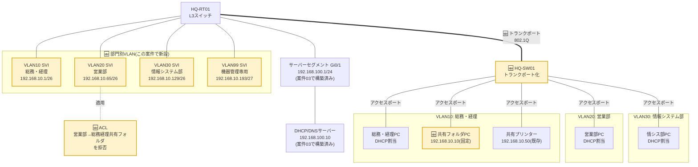

# 案件04: VLANによる部門分割 🧩

## 1. この案件について 📋

| 項目 | 内容 |
|---|---|
| 難易度 | ★★★☆☆(全5段階中3) |
| 想定所要時間 | 5〜7時間 |
| 前提となる案件 | [案件01: 本社オフィスLANの設計・構築](../case01_lan_design/README.md)、[案件02: 本社-支社間ルーティング構築](../case02_wan_routing/README.md)、[案件03: DHCP/DNSサーバー構築](../case03_dhcp_dns/README.md) |

## 2. 身につくスキル 🎯

- VLSM(可変長サブネットマスク)を使い、「必要なホスト数」から逆算してサブネットマスクを設計する考え方
- L3スイッチにおけるVLANの作成、アクセスポート/トランクポート(802.1Qタグ)の設定方法
- SVI(スイッチ仮想インターフェース)によるVLAN間ルーティングの仕組みと、L3スイッチ特有の `ip routing` の役割
- 拡張ACL(アクセスコントロールリスト)を使った、部門間の通信を「最小限だけ許可する」アクセス制御の考え方
- VLANをまたいだDHCPリレー(`ip helper-address`)の設定と、それが必要になる理由
- `show vlan brief` / `show interfaces trunk` / `show access-lists` などのコマンドを使った設定内容の検証・切り分け手順

## 3. 案件概要(お客様からのご依頼) 💬

> 「実は先日、大口のお取引先から新しい契約のお話をいただいたんですが、その前提として『御社の情報セキュリティ体制を確認させてください』と言われまして……外部のセキュリティ診断会社にお願いして、簡単な監査を受けたんです。
>
> 全体的にはそこまで悪くない、という評価だったんですが、指摘事項の一覧に『社内ネットワークが部門を問わず一つの大きなセグメントになっており、営業部の人間が総務・経理部の共有データにアクセスできてしまう状態はリスクが高い』と書かれていまして……。正直、これまで社内はみんな同じネットワークで特に問題を感じたことがなかったので、少し驚きました。
>
> 恥ずかしながら、うちにはまだITに詳しい人間がおらず、『部門ごとにネットワークを分ける』というのが具体的に何をすることなのか、正直あまりイメージが湧いていません。ただ、お取引先への回答期限までに『対応済み』とお伝えしたいので、よろしくお願いできますでしょうか。」

*(株式会社サンプル商事 情報システム部 部長)*

## 4. 背景・状況 🏢

案件03でDHCP/DNSサーバーを導入して以降、株式会社サンプル商事は着実に成長を続け、従業員数は20名に達しました。組織としても「総務・経理部」「営業部」「情報システム部」という3つの部門が明確に区分されるようになり、専任の情報システム部担当者も配置されています。

一方でネットワークの構成は案件01の時点からほとんど変わっておらず、`192.168.10.0/24` という1つの巨大なセグメントに、部門を問わずすべてのPCが接続されたままでした。この状態には、技術的に見て大きく2つの弱点があります。

1. **ブロードキャストドメインの肥大化**: 同一セグメント内の端末が増えるほど、ARPリクエストやDHCPのブロードキャストパケットが全端末に届くようになり、ネットワーク全体の効率が落ちていきます。
2. **アクセス制御の欠如**: 同じセグメントにいる端末同士は、特別な設定をしない限りお互いに自由に通信できてしまいます。総務・経理部が扱う給与や取引先情報のような機密性の高いデータであっても、営業部のPCから物理的にアクセスできてしまう状態でした。

今回、大口取引先からの要請で受けた外部セキュリティ監査は、まさにこの2点を指摘するものでした。フュージョンITソリューションズとしては、**VLAN(仮想LAN)による部門ごとのネットワーク分割**でブロードキャストドメインの問題を、**ACL(アクセスコントロールリスト)による通信制御**でアクセス制御の問題を、それぞれ解決する提案を行うことになりました。

## 5. 要件 ✅

1. 本社LAN(`192.168.10.0/24`)を、[docs/03_ip_address_design.md 3-2節](../../docs/03_ip_address_design.md#3-2-本社lan案件04以降vlan分割後)の設計に基づき、総務・経理部(VLAN10)・営業部(VLAN20)・情報システム部(VLAN30)・機器管理(VLAN99)の4つのVLANに分割すること。
2. 各部門のPCは、部門に対応したVLANのアクセスポートに接続され、他部門のVLANへ誤って接続されることがないようにすること。
3. 部門をまたいだ通常業務の通信(共有プリンターの利用、他部門への相談時の通信など)は、これまでどおりVLAN間ルーティング(SVI)によって行えること。
4. 例外として、**営業部(VLAN20)から総務・経理部(VLAN10)内の共有フォルダへのアクセス**は、ACLにより明確に禁止すること。
5. VLAN分割後も、案件03で構築したDHCP/DNSサーバー(`192.168.100.10`)から各VLANの端末へ正しくIPアドレスが配布されること。
6. スイッチなどネットワーク機器の管理用アドレスは、一般端末とは別のVLAN(VLAN99)に分離すること。
7. Cisco Packet Tracer上に全構成を再現し、`show vlan brief` や `show access-lists` などのコマンドで、第三者が設定内容を検証できる状態にしておくこと。

## 6. 全体構成図 🗺️

これまで案件01〜03を通じて構築してきた `192.168.10.0/24` のフラットな1セグメント構成を、本案件で4つのVLANに置き換えます。黄色(🆕マーク)の部分が、この案件で新たに追加・変更される要素です。



HQ-RT01(L3スイッチ)とサーバーセグメントの接続自体は案件03で構築済みのため変更しません。サーバーセグメント(`192.168.100.0/24`)は案件03のとおり物理インターフェース`GigabitEthernet0/1`のルーテッドポートとして既に構築されている想定とし、本案件ではVLANには含めず手を加えません。

## 7. IPアドレス設計 🔢

本案件で使用するIPアドレスは、[docs/03_ip_address_design.md 3-2節](../../docs/03_ip_address_design.md#3-2-本社lan案件04以降vlan分割後)「本社LAN(案件04以降:VLAN分割後)」の設計に準拠します。詳細な設計根拠は必ず同ファイルを参照してください。

| VLAN ID | 名称 | ネットワーク | 範囲 | 使用可能ホスト数 | ゲートウェイ(SVI) |
|---|---|---|---|---|---|
| VLAN10 | 総務・経理 | 192.168.10.0/26 | .0 〜 .63 | 62台 | 192.168.10.1 |
| VLAN20 | 営業部 | 192.168.10.64/26 | .64 〜 .127 | 62台 | 192.168.10.65 |
| VLAN30 | 情報システム部 | 192.168.10.128/26 | .128 〜 .191 | 62台 | 192.168.10.129 |
| VLAN99 | 機器管理専用 | 192.168.10.192/27 | .192 〜 .223 | 30台 | 192.168.10.193 |
| (予備) | 将来の部門増設用 | 192.168.10.224/27 | .224 〜 .255 | 30台 | 未割当 |

本案件で実際に使用する主な固定IPアドレスは以下のとおりです(それ以外の一般端末は案件03のDHCPサーバーから動的に割り当てます)。

| ホスト/インターフェース | IPアドレス | 備考 |
|---|---|---|
| HQ-RT01 VLAN10 SVI | 192.168.10.1/26 | 総務・経理部ゲートウェイ(旧VLAN1のIPを引き継ぎ) |
| HQ-RT01 VLAN20 SVI | 192.168.10.65/26 | 営業部ゲートウェイ |
| HQ-RT01 VLAN30 SVI | 192.168.10.129/26 | 情報システム部ゲートウェイ |
| HQ-RT01 VLAN99 SVI | 192.168.10.193/27 | 機器管理ゲートウェイ |
| HQ-SW01 管理用IP(VLAN99) | 192.168.10.194/27 | L2スイッチの管理用アドレス(固定) |
| 共有プリンター | 192.168.10.50 | 案件01から継続使用。VLAN10に所属 |
| 総務・経理 共有フォルダPC | 192.168.10.10 | 固定IP。本案件のACLによる保護対象 |
| DHCP/DNSサーバー(参考・案件03) | 192.168.100.10 | [3-3節](../../docs/03_ip_address_design.md#3-3-サーバーセグメント)参照。各VLANのSVIから `ip helper-address` で中継 |

> 📘 総務・経理部の共有フォルダは、まだ専用のファイルサーバーがないため、総務部のPCがWindowsのフォルダ共有機能で提供している想定です。本格的なファイルサーバー(Samba)の構築は案件07で扱います。

## 8. 使用環境・ツール 🧰

| 分類 | 使用ツール・バージョン目安 |
|---|---|
| ネットワークシミュレータ | Cisco Packet Tracer 8.x |
| L3スイッチ | Cisco Catalyst 3560相当(Packet Tracerの Multilayer Switch)、ホスト名 HQ-RT01 |
| L2スイッチ | Cisco Catalyst 2960相当(案件01と同モデル)、ホスト名 HQ-SW01 |
| 端末 | Packet Tracer上のPCデバイス |
| 主なコマンド | `vlan`, `name`, `switchport mode access/trunk`, `switchport access vlan`, `switchport trunk allowed vlan`, `interface vlan`, `ip routing`, `ip helper-address`, `ip access-list extended`, `ip access-group`, `show vlan brief`, `show interfaces trunk`, `show access-lists` |

## 9. 作業手順 🔧

### STEP1: 必要ホスト数からVLSMを設計する

いきなり機器を設定する前に、「なぜ `/26` や `/27` になるのか」を自分の手で計算しておきます。まず各部門の必要ホスト数を見積もります。

| 部門 | 現在の人数目安 | 想定する必要ホスト数(将来の増員分を含む) |
|---|---|---|
| 総務・経理部 | 5名 | PC・複合機等を含め最大60台程度を想定 |
| 営業部 | 8名 | 採用増員・外勤用ノートPC等を含め最大60台程度を想定 |
| 情報システム部 | 3名 | 検証機器・サーバー管理用アドレス等を含め最大60台程度を想定 |
| 機器管理(ネットワーク機器) | − | スイッチ・ルーターなど、最大30台程度を想定 |

サブネットマスクは「ホスト部のビット数 `n`」によって収容可能ホスト数が決まります。計算式は `2^n − 2`(ネットワークアドレスとブロードキャストアドレスの2つを引く)です。

| ホスト部ビット数(n) | 計算式 | 収容可能ホスト数 |
|---|---|---|
| 5 | 2^5 − 2 | 30台 |
| 6 | 2^6 − 2 | 62台 |
| 7 | 2^7 − 2 | 126台 |

各部門は最大60台程度を見込むため `n=5`(30台)では足りず、`n=6`(62台)が必要です。ホスト部6ビットということは、ネットワーク部は `32 − 6 = 26` ビット、つまり **`/26`** になります。機器管理は最大30台程度で足りるため `n=5` で十分、ネットワーク部は `32 − 5 = 27` ビットの **`/27`** です。

続いて、`192.168.10.0/24` というアドレス空間を実際に切り分けていきます。

| 順序 | 操作 | 結果 |
|---|---|---|
| ① | `192.168.10.0/24` 全体(256個)を `/26` 単位(64個ずつ)で4分割する | `.0/26`, `.64/26`, `.128/26`, `.192/26` の4ブロック |
| ② | 先頭3ブロックを、総務・経理/営業/情シスの3部門にそのまま割り当てる | VLAN10 = `.0/26`、VLAN20 = `.64/26`、VLAN30 = `.128/26` |
| ③ | 残った `192.168.10.192/26`(64個)は機器管理には広すぎるため、さらに `/27` 単位(32個ずつ)で2分割する | `.192/27`, `.224/27` の2ブロック |
| ④ | 一方を機器管理(VLAN99)に割り当て、もう一方は将来の部門増設用として予備にする | VLAN99 = `.192/27`、予備 = `.224/27`(未使用) |

このように「必要な部門には大きめの `/26` を、まとまった余りをさらに小さい `/27` に割り直す」のがVLSMの考え方です。全部門を機械的に同じ大きさで割ると、機器管理用に62個も確保して48個以上を無駄にしてしまいますが、VLSMを使えばアドレス空間を無駄なく使い切れます。

### STEP2: Packet Tracer上でVLANを作成する

HQ-RT01(L3スイッチ)とHQ-SW01(L2スイッチ)の両方に、同じVLAN番号・名前でVLANを作成します(この規模ではVTPのようなVLAN一元管理の仕組みは使わず、各スイッチに個別に設定します)。

```text
HQ-SW01> enable
HQ-SW01# configure terminal
HQ-SW01(config)# vlan 10
HQ-SW01(config-vlan)# name SOMU-KEIRI
HQ-SW01(config-vlan)# exit
HQ-SW01(config)# vlan 20
HQ-SW01(config-vlan)# name EIGYO
HQ-SW01(config-vlan)# exit
HQ-SW01(config)# vlan 30
HQ-SW01(config-vlan)# name JOHOSYSTEM
HQ-SW01(config-vlan)# exit
HQ-SW01(config)# vlan 99
HQ-SW01(config-vlan)# name KIKI-KANRI
HQ-SW01(config-vlan)# exit
```

HQ-RT01側にも同様にVLANを作成しておきます(SVI作成時に自動生成されますが、明示的に作っておくと管理しやすくなります)。

```text
HQ-RT01(config)# vlan 10,20,30,99
HQ-RT01(config-vlan)# exit
```

### STEP3: 部門PCが接続するポートをアクセスポート化する

HQ-SW01の各ポートを、接続する部門に応じたVLANの**アクセスポート**として設定します。アクセスポートとは「1つのVLANにしか所属せず、タグなしのフレームだけを扱うポート」で、PCやプリンターなど一般端末を接続する際の標準的な設定です。

| ポート範囲 | 用途 | 所属VLAN |
|---|---|---|
| Fa0/1 〜 Fa0/6 | 総務・経理部PC(5台)+ 共有フォルダPC | VLAN10 |
| Fa0/7 〜 Fa0/14 | 営業部PC(8台) | VLAN20 |
| Fa0/15 〜 Fa0/17 | 情報システム部PC(3台) | VLAN30 |
| Fa0/18 | 共有プリンター(既存192.168.10.50を継続使用) | VLAN10 |

```text
HQ-SW01(config)# interface range fastEthernet0/1 - 6
HQ-SW01(config-if-range)# switchport mode access
HQ-SW01(config-if-range)# switchport access vlan 10
HQ-SW01(config-if-range)# exit
HQ-SW01(config)# interface range fastEthernet0/7 - 14
HQ-SW01(config-if-range)# switchport mode access
HQ-SW01(config-if-range)# switchport access vlan 20
HQ-SW01(config-if-range)# exit
HQ-SW01(config)# interface range fastEthernet0/15 - 17
HQ-SW01(config-if-range)# switchport mode access
HQ-SW01(config-if-range)# switchport access vlan 30
HQ-SW01(config-if-range)# exit
HQ-SW01(config)# interface fastEthernet0/18
HQ-SW01(config-if)# switchport mode access
HQ-SW01(config-if)# switchport access vlan 10
HQ-SW01(config-if)# exit
```

### STEP4: L3スイッチとL2スイッチ間をトランクポート化する

HQ-RT01とHQ-SW01を結ぶ1本のケーブルに、4つのVLANすべての通信を通す必要があります。そのために使うのが**トランクポート**で、フレームに**802.1Qタグ**(どのVLAN宛かを示す4バイトの情報)を付けてやり取りします。

```text
HQ-RT01(config)# interface GigabitEthernet0/0
HQ-RT01(config-if)# description Trunk-to-HQ-SW01
HQ-RT01(config-if)# switchport trunk encapsulation dot1q
HQ-RT01(config-if)# switchport mode trunk
HQ-RT01(config-if)# switchport trunk allowed vlan 10,20,30,99
HQ-RT01(config-if)# no shutdown
HQ-RT01(config-if)# exit
```

```text
HQ-SW01(config)# interface GigabitEthernet0/1
HQ-SW01(config-if)# description Trunk-to-HQ-RT01
HQ-SW01(config-if)# switchport mode trunk
HQ-SW01(config-if)# switchport trunk allowed vlan 10,20,30,99
HQ-SW01(config-if)# no shutdown
HQ-SW01(config-if)# exit
```

> 📘 HQ-RT01(3560相当)は古いISLというタグ付け方式もサポートするため `switchport trunk encapsulation dot1q` で明示的に802.1Qを指定します。HQ-SW01(2960相当)は802.1Qしか対応していないため、この指定は不要です。`switchport trunk allowed vlan` で許可するVLANを絞ることで、関係のない部門のブロードキャストがこのトランクを無駄に流れるのを防いでいます。

### STEP5: 旧VLAN1のSVIを無効化し、各VLANにSVIを作成する

案件01〜03では、`interface vlan 1` に `192.168.10.1/24` を設定してゲートウェイとして使っていました。VLANを分割した後もこのインターフェースが有効なままだと、新しいVLANに移行し損ねた機器が誤ってVLAN1に接続され、意図せずセグメント分割を迂回してしまう恐れがあります。そこでまずVLAN1のIPアドレスを削除して無効化します。

```text
HQ-RT01(config)# interface vlan 1
HQ-RT01(config-if)# no ip address
HQ-RT01(config-if)# shutdown
HQ-RT01(config-if)# exit
```

続けて、各VLANのSVI(Switch Virtual Interface)を作成します。SVIとは「VLANごとに1つ持てる仮想的なルーテッドインターフェース」で、これがそのVLANのデフォルトゲートウェイになります。L3スイッチはデフォルトでVLAN間のルーティングが無効になっているため、`ip routing` コマンドで有効化する点に注意してください(通常のルーターは常時ルーティング機能が有効なため、L3スイッチ特有の手順です)。

```text
HQ-RT01(config)# ip routing
HQ-RT01(config)# interface vlan 10
HQ-RT01(config-if)# ip address 192.168.10.1 255.255.255.192
HQ-RT01(config-if)# ip helper-address 192.168.100.10
HQ-RT01(config-if)# no shutdown
HQ-RT01(config-if)# exit
HQ-RT01(config)# interface vlan 20
HQ-RT01(config-if)# ip address 192.168.10.65 255.255.255.192
HQ-RT01(config-if)# ip helper-address 192.168.100.10
HQ-RT01(config-if)# no shutdown
HQ-RT01(config-if)# exit
HQ-RT01(config)# interface vlan 30
HQ-RT01(config-if)# ip address 192.168.10.129 255.255.255.192
HQ-RT01(config-if)# ip helper-address 192.168.100.10
HQ-RT01(config-if)# no shutdown
HQ-RT01(config-if)# exit
HQ-RT01(config)# interface vlan 99
HQ-RT01(config-if)# ip address 192.168.10.193 255.255.255.224
HQ-RT01(config-if)# no shutdown
HQ-RT01(config-if)# exit
```

`ip helper-address 192.168.100.10` は、案件03で構築したDHCPサーバーへ**DHCPリレー**を行うための設定です。DHCPサーバーはVLAN10〜30とは別のセグメント(`192.168.100.0/24`)にいるため、クライアントが送信するDHCPのブロードキャストは本来そこまで届きません。この設定によりHQ-RT01がブロードキャストをユニキャストに変換してDHCPサーバーへ中継します。機器管理用のVLAN99は静的IPのみで運用するため設定していません。

### STEP6: DHCPサーバー(ns1)のスコープをVLANごとに再設計する

ここまでの設定だけではPCはまだIPアドレスを取得できません。案件03の時点でns1の`/etc/dhcp/dhcpd.conf`に書いた`subnet`宣言は、VLAN分割前の`192.168.10.0/24`(フラットな1つのネットワーク、払い出し範囲`.200`〜`.220`)のままです。VLAN分割後の`192.168.10.0/24`は実在の1つのネットワークではなく「4つのVLANが同じ/24の中に住所を分け合っている状態」になったため、ISC DHCPは`ip helper-address`で中継されてきたリクエストの送信元(`giaddr`、SVIのIPアドレス)から「どのVLANのリクエストか」を判断し、**そのVLANのネットワークアドレスと完全に一致する`subnet`宣言**を探します。旧`subnet 192.168.10.0 netmask 255.255.255.0`のままでは、`192.168.10.1`(VLAN10)や`192.168.10.65`(VLAN20)から中継されたリクエストに対応する宣言が見つからず、DHCPサーバーはリクエストを黙って無視します。

そこでns1の`/etc/dhcp/dhcpd.conf`を、VLANごとの`subnet`宣言に書き換えます。

```conf
# /etc/dhcp/dhcpd.conf(案件04時点での書き換え後)
default-lease-time 600;
max-lease-time 7200;
authoritative;

option domain-name "sample-shoji.local";
option domain-name-servers 192.168.100.10;

# DHCPサーバー自身が直接接続されているセグメント(宣言のみ必須)
subnet 192.168.100.0 netmask 255.255.255.0 {
}

# 旧・本社LANのフラットな宣言は案件04でVLAN単位に置き換えたため削除
# (192.168.10.0/24 という1つのsubnet宣言は、複数VLANが存在する状態とは両立しない)

# VLAN10: 総務・経理
# 共有プリンター(192.168.10.50、固定IP)への払い出しを避けるため、範囲を前後に分割
subnet 192.168.10.0 netmask 255.255.255.192 {
  range 192.168.10.20 192.168.10.49;
  range 192.168.10.51 192.168.10.62;
  option routers 192.168.10.1;
  option broadcast-address 192.168.10.63;
}

# VLAN20: 営業部
subnet 192.168.10.64 netmask 255.255.255.192 {
  range 192.168.10.80 192.168.10.126;
  option routers 192.168.10.65;
  option broadcast-address 192.168.10.127;
}

# VLAN30: 情報システム部
subnet 192.168.10.128 netmask 255.255.255.192 {
  range 192.168.10.144 192.168.10.190;
  option routers 192.168.10.129;
  option broadcast-address 192.168.10.191;
}

# VLAN99(機器管理)は固定IPのみで運用するため宣言しない

# 支社LAN(案件02〜、変更なし)
subnet 192.168.20.0 netmask 255.255.255.0 {
  range 192.168.20.100 192.168.20.200;
  option routers 192.168.20.1;
  option broadcast-address 192.168.20.255;
}
```

> ⚠️ 各VLANの払い出し範囲(`range`)は、そのVLANのサブネット内でSVIのIPアドレスや将来の固定IP機器用の予約アドレスと重ならないよう、範囲の先頭側を少し空けています(例:VLAN10は`.1`がSVI、`.2`〜`.19`を固定IP機器向けの予約とし、`.20`から払い出す)。実際の割当ルールはネットワークごとに決めて構いませんが、必ずどこかにドキュメント化しておきましょう。

設定ファイルを書き換えたら、構文チェックしてからサービスを再起動します。

```bash
$ sudo dhcpd -t -cf /etc/dhcp/dhcpd.conf
$ sudo systemctl restart isc-dhcp-server
$ sudo systemctl status isc-dhcp-server
```

### STEP7: HQ-SW01(L2スイッチ)にVLAN99の管理用IPアドレスを設定する

L2スイッチ自体にも、リモートからの設定・監視のためにIPアドレスが必要です。一般端末とは別のVLAN99に、管理専用のIPアドレスを設定します。

```text
HQ-SW01(config)# interface vlan 99
HQ-SW01(config-if)# ip address 192.168.10.194 255.255.255.224
HQ-SW01(config-if)# no shutdown
HQ-SW01(config-if)# exit
HQ-SW01(config)# ip default-gateway 192.168.10.193
```

L2スイッチはルーティング機能を持たないため、他のセグメントと通信するには `ip default-gateway` でデフォルトゲートウェイ(VLAN99のSVI)を明示的に指定する必要があります。

### STEP8: ACLで営業部から総務・経理部の共有フォルダへのアクセスを禁止する

最後に、要件4の「営業部から総務・経理部の共有フォルダへのアクセス禁止」を拡張ACL(送信元・宛先・ポート番号まで指定できるACL)で実現します。共有フォルダPC(`192.168.10.10`)へのファイル共有用ポート(TCP445=SMB、TCP139=NetBIOS)だけをピンポイントで拒否します。

```text
HQ-RT01(config)# ip access-list extended BLOCK-EIGYO-TO-SOMU-SHARE
HQ-RT01(config-ext-nacl)# deny tcp 192.168.10.64 0.0.0.63 host 192.168.10.10 eq 445
HQ-RT01(config-ext-nacl)# deny tcp 192.168.10.64 0.0.0.63 host 192.168.10.10 eq 139
HQ-RT01(config-ext-nacl)# permit ip any any
HQ-RT01(config-ext-nacl)# exit
```

> ⚠️ **重要**: すべてのACLの末尾には、明示していない通信をすべて拒否する「暗黙のdeny any」が存在します。最後の `permit ip any any` を書き忘れると、営業部だけでなく全部門・全通信がこのインターフェースを通過できなくなってしまいます。拒否したい通信を先に書き、最後に必ず許可のルールで締めるのが基本パターンです。

作成したACLは、拒否したい通信の**送信元にできるだけ近い場所**に適用するのが基本です。今回は営業部(VLAN20)のSVIにインバウンド方向で適用します。

```text
HQ-RT01(config)# interface vlan 20
HQ-RT01(config-if)# ip access-group BLOCK-EIGYO-TO-SOMU-SHARE in
HQ-RT01(config-if)# exit
HQ-RT01(config)# end
HQ-RT01# write memory
```

HQ-SW01側の設定も忘れずに保存します。

```text
HQ-SW01# write memory
```

## 10. 動作確認 🔍

### VLANの設定確認

```text
HQ-SW01# show vlan brief

VLAN Name                             Status    Ports
---- -------------------------------- --------- -------------------------------
1    default                          active
10   SOMU-KEIRI                       active    Fa0/1, Fa0/2, Fa0/3, Fa0/4, Fa0/5, Fa0/6, Fa0/18
20   EIGYO                            active    Fa0/7, Fa0/8, Fa0/9, Fa0/10, Fa0/11, Fa0/12, Fa0/13, Fa0/14
30   JOHOSYSTEM                       active    Fa0/15, Fa0/16, Fa0/17
99   KIKI-KANRI                       active
```

意図したポートが意図したVLANに割り当てられているか、この出力で必ず確認します。

### トランクポートの確認

```text
HQ-RT01# show interfaces trunk

Port        Mode             Encapsulation  Status        Native vlan
Gi0/0       on               802.1q         trunking      1

Port        Vlans allowed on trunk
Gi0/0       10,20,30,99
```

`Status` が `trunking` になっており、`Vlans allowed on trunk` に4つのVLANが表示されていれば正常です。

### SVIとルーティングの確認

```text
HQ-RT01# show ip interface brief
Interface              IP-Address      OK? Method Status                Protocol
Vlan1                  unassigned      YES manual administratively down down
Vlan10                 192.168.10.1    YES manual up                    up
Vlan20                 192.168.10.65   YES manual up                    up
Vlan30                 192.168.10.129  YES manual up                    up
Vlan99                 192.168.10.193  YES manual up                    up
GigabitEthernet0/1     192.168.100.1   YES manual up                    up
```

VLAN10〜99すべてが `up/up` になっていること、VLAN1が意図どおり `administratively down` になっていることを確認します。

### DHCPでのIPアドレス取得確認

STEP6でns1のDHCPスコープをVLANごとに書き換えたため、各VLANのPCが正しいサブネットのIPアドレスを取得できるかを確認します。

```text
C:\> ipconfig /renew

Windows IP Configuration

Ethernet adapter Ethernet0:
   IPv4 Address. . . . . . . . . . . : 192.168.10.66
   Subnet Mask . . . . . . . . . . . : 255.255.255.192
   Default Gateway . . . . . . . . . : 192.168.10.65
```

営業部(VLAN20)のPCであれば `192.168.10.64/26` の範囲(`.65`〜`.126`)のアドレスが、サブネットマスク `255.255.255.192`(=`/26`)とともに取得できていれば正常です。取得できない場合は、STEP5の `ip helper-address` とSTEP6の`dhcpd.conf`の両方を、よくあるトラブル欄の手順で確認してください。

### VLANをまたいだ疎通確認(許可された通信)

```text
C:\> ping 192.168.10.129

Pinging 192.168.10.129 with 32 bytes of data:
Reply from 192.168.10.129: bytes=32 time=1ms TTL=127
Reply from 192.168.10.129: bytes=32 time=1ms TTL=127

Ping statistics for 192.168.10.129:
    Packets: Sent = 4, Received = 4, Lost = 0 (0% loss)
```

営業部PCから情報システム部のゲートウェイ宛にpingが通れば、VLAN間ルーティングが正常に機能しています。TTLが元の値より1小さくなっているのは、HQ-RT01を1台経由(1ホップ)した証拠です。

### ACLによるアクセス制御の確認

営業部PCから共有フォルダPC(`192.168.10.10`)へのpingは、ICMPを拒否していないため通ります。一方、ファイル共有(SMB/TCP445)だけがACLで拒否されていることを、マッチ数(カウンタ)で確認します。

```text
HQ-RT01# show access-lists BLOCK-EIGYO-TO-SOMU-SHARE
Extended IP access list BLOCK-EIGYO-TO-SOMU-SHARE
    10 deny tcp 192.168.10.64 0.0.0.63 host 192.168.10.10 eq 445 (6 matches)
    20 deny tcp 192.168.10.64 0.0.0.63 host 192.168.10.10 eq 139
    30 permit ip any any (214 matches)
```

`deny` の行にマッチ数がカウントされていれば、営業部からのファイル共有アクセスが実際にブロックされたことを意味します。Packet Tracerでは、シミュレーションモードで「Complex PDU」を使いポート445宛のTCP通信を送信すると、HQ-RT01のところで `Denied` として可視化され、より直感的に確認できます。

## 11. よくあるトラブルと対処法 ⚠️

| 症状 | 考えられる原因 | 対処法 |
|---|---|---|
| VLAN間で全く通信できない(同一VLAN内は正常) | L3スイッチで `ip routing` が有効化されていない | `show running-config` で `ip routing` の有無を確認し、なければ設定する |
| 特定のPCだけ古いセグメント(VLAN1由来)のIPのままで通信できない | アクセスポートの `switchport access vlan` 設定漏れ、デフォルトVLAN1のまま放置されている | `show interfaces switchport` でポートの実際の所属VLANを確認し、正しいVLANに割り当て直す |
| トランクポートなのに特定VLANだけ通信が通らない | `switchport trunk allowed vlan` の指定にそのVLAN番号が含まれていない(範囲指定ミス) | `show interfaces trunk` の `Vlans allowed on trunk` 列を確認し、`switchport trunk allowed vlan add <VLAN番号>` で追加する |
| ACLを適用した途端、営業部から社内のあらゆる通信ができなくなった | 拒否ルールだけを書き、末尾の `permit ip any any` を書き忘れて暗黙のdeny anyに引っかかっている | `show access-lists` で内容を確認し、末尾に `permit ip any any` を追加する |
| VLAN分割後、PCがIPアドレスを取得できなくなった | ①各VLANのSVIに `ip helper-address` が設定されていない、②ns1側の`dhcpd.conf`がVLAN分割前の古い`subnet`宣言のままで、SVIのIPアドレス(giaddr)に対応する宣言が無い | ①`show running-config interface vlan <番号>` で `ip helper-address 192.168.100.10` の有無を確認。②ns1で `sudo journalctl -u isc-dhcp-server -n 50` を確認し、`no available billing`や該当subnetが見つからない旨のログが出ていないか、STEP6の`dhcpd.conf`と一致しているかを確認する |

## 12. この案件の重要用語 📚

- **VLAN(Virtual LAN)**: 1台の物理スイッチの中を、論理的に複数の独立したネットワーク(ブロードキャストドメイン)へ分割する技術。
- **タグVLAN(802.1Q)**: 1本のケーブルで複数VLANのフレームをやり取りするために、フレームに「どのVLAN宛か」を示すタグを付ける規格。
- **アクセスポート**: 1つのVLANにのみ所属し、タグなしフレームだけを扱うポート。PCなど一般端末の接続に使う。
- **トランクポート**: 複数VLANのタグ付きフレームをまとめて通すポート。スイッチ同士やスイッチ-ルーター間の接続に使う。
- **SVI(Switch Virtual Interface)**: L3スイッチ上でVLANごとに作成する仮想インターフェース。そのVLANのデフォルトゲートウェイとして機能する。
- **ACL(Access Control List)**: 送信元・宛先・ポート番号などの条件に基づき、通信を許可・拒否するルールの集合。
- **ブロードキャストドメイン**: ブロードキャスト(全端末宛)フレームが届く範囲。VLANを分けることでこの範囲を分割できる。

共通の基礎用語(IPアドレス、サブネットマスクなど)は [docs/01_glossary.md](../../docs/01_glossary.md) を参照してください。

## 13. 発展課題(任意) 🚀

1. **ネイティブVLANの変更**: トランクポートの初期設定ではVLAN1がネイティブVLAN(タグを付けない特別なVLAN)として扱われます。これを未使用のVLAN番号に変更し、「VLANホッピング」と呼ばれる攻撃手法への対策を調べて実装してみましょう。
2. **未使用ポートの保護**: 空いているスイッチポートを、あえて存在しないVLAN番号(例: VLAN666)に割り当てたりシャットダウンしたりすることで、不正な機器が勝手に接続されるのを防ぐ設定を試してみましょう。
3. **VTP(VLAN Trunking Protocol)の調査**: 今回は各スイッチに個別にVLANを設定しましたが、スイッチの台数が増えるとVTPのような一元管理の仕組みが有効になる場面があります。メリットと、誤操作時のリスク(VTPによる意図しないVLAN全消去など)を整理してみましょう。

## 14. ポートフォリオ・面接でのアピールポイント 🌟

> **想定回答（未実施）:** この節の文例は、この案件を実施した後に使う想定の説明例です。本人がこの案件を実施した記録は、2026-09-28 時点でありません（[README](../../README.md)の「採用ご担当者様へ」を参照）。文中の「構築しました」「確認しました」などは実績ではありません。実施したら、自分の実施日・結果・つまずきで書き換え、実施していない部分は話さないでください。

> 「外部セキュリティ監査の指摘事項という実務でよくある形の要件から、『ブロードキャストドメインの分割』にはVLAN、『部門間アクセス制御』にはACLという、異なる技術を組み合わせて対応しました。特にACLでは、暗黙のdeny anyを踏まえて `permit ip any any` を意図的に末尾へ置く必要があることを実際に設定を抜いて再現し、影響範囲を最小限に絞ったルール設計の重要性を体験を通じて理解しました。」

VLSMの計算過程を「必要ホスト数からの逆算」として説明できる点、DHCPサーバーが別セグメントにあるためにDHCPリレー(`ip helper-address`)が必要になるという、案件03との接続部分まで理解している点も、設計意図を語れる材料として有効です。

## 15. 関連リンク 🔗

- 前の案件: [案件03: DHCP/DNSサーバー構築](../case03_dhcp_dns/README.md)
- 次の案件: [案件05: ファイアウォール・NAT構築](../case05_firewall_nat/README.md)
- [docs/00_roadmap.md](../../docs/00_roadmap.md) — 学習ロードマップ全体
- [docs/01_glossary.md](../../docs/01_glossary.md) — 用語集
- [docs/03_ip_address_design.md](../../docs/03_ip_address_design.md) — 全案件共通IPアドレス設計書(この案件のIPアドレスの正本)
