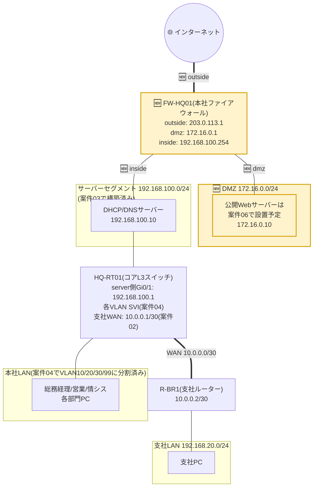

# 案件05: ファイアウォール・NAT構築 🧱

## 1. この案件について 📋

| 項目 | 内容 |
|---|---|
| 難易度 | ★★★☆☆(全5段階中3) |
| 想定所要時間 | 5〜8時間 |
| 前提となる案件 | [案件01: 本社オフィスLANの設計・構築](../case01_lan_design/README.md)、[案件02: 本社-支社間ルーティング構築](../case02_wan_routing/README.md)、[案件03: DHCP/DNSサーバー構築](../case03_dhcp_dns/README.md)、[案件04: VLANによる部門分割](../case04_vlan_segmentation/README.md) |

## 2. 身につくスキル 🎯

- ファイアウォールにおける **inside(内部)/outside(外部)/DMZ** というゾーンの考え方と、ゾーンごとに通信ポリシーを分ける設計思想
- **NAT(ネットワークアドレス変換)** の基本と、その中でも社内から社外へ出るときに使う **PAT(ポートアドレス変換・通称IPマスカレード)** の仕組み
- **ステートフルインスペクション**(通信の状態を追跡し、内部から始めた通信の戻りだけを自動的に許可する仕組み)の考え方
- Linuxサーバー上で **firewalld** を使い、ゾーンベースでファイアウォールルールを設計・投入する実践的な手順
- 「なぜ公開予定のサーバーを社内LANに直接置かず、DMZという別区画に置くのか」という境界防御の設計思想
- `tcpdump` を使って、NATによって送信元IPアドレスが実際に書き換わる様子を目で見て確認する力

## 3. 案件概要(お客様からのご依頼) 💬

> 「VLANの件、無事に監査もクリアできて本当に助かりました。実はその後、また新しい相談がありまして……。
>
> うちの営業なんですが、最近取引先とのやり取りがどんどんメールベースになってきていて、見積書のPDFを送ったり、相手からカタログをダウンロードしたりする機会がすごく増えているんです。ただ、社内のパソコンからは外のインターネットに一切つながらないので、営業のメンバーが自分のスマートフォンをこっそりテザリングして、会社のノートPCをネットにつないでいる有様で……。正直、これはこれで心配なんです。
>
> それと、これは少し先の話になるかもしれないんですが、最近お取引先から『御社のホームページはどちらですか?』と聞かれることが増えてきて、その度に『実は無いんです……』と答えるのがだんだん恥ずかしくなってきていまして。いずれ簡単な会社紹介サイトくらいは公開したいと思っているんです。
>
> というわけで、まずは社内から安全にインターネットへ出られるようにしていただきたいんです。ただ、いずれホームページを公開するとなると、今度は逆に外側からうちの社内ネットワークに入られてしまうんじゃないかというのも心配で……その辺り、専門的な立場から安全に設計していただけますか?」

*(株式会社サンプル商事 情報システム部 部長)*

## 4. 背景・状況 🏢

案件01〜04を通じて、株式会社サンプル商事の社内ネットワークは着実に整備されてきました。しかし、これまで構築してきたのは**あくまで社内(本社LAN・支社LAN・サーバーセグメント)だけで完結するネットワーク**であり、インターネットへ抜ける経路は一切存在していません。実は案件03でBIND9に設定した「外部への問い合わせ先(forwarders `8.8.8.8`)」も、この時点ではまだ実際には機能していませんでした。

一方で会社の業務は着実に外部志向になっており、取引先とのメールでのやり取りや、Webでのカタログ・相場情報の確認が日常的に必要になってきています。にもかかわらず社内から外へ出る手段がないため、営業部員が私物のスマートフォンでテザリングするという、いわゆる**シャドーIT**(会社が把握・管理していない機器やネットワークが業務に使われてしまう状態)が発生してしまっている状況です。これは情報漏えいやウイルス感染のリスクを社内ネットワークの管理外で抱え込むことになり、看過できません。

さらに将来的には、会社紹介Webサイトの外部公開という要望もあります。ただし「インターネットにつなぐ」ことと「インターネットに公開する」ことは、セキュリティ上まったく別の重みを持つ話です。前者は社内から外へ出ていく通信、後者は外から社内(に準ずる場所)へ入ってくる通信だからです。そこで本案件では、まず**ファイアウォールとNATによる安全な出口(インターネット接続)を構築**し、あわせて将来Webサーバーを設置するための**DMZという隔離区画**をあらかじめ用意します。実際に外部公開用のWebサーバーをDMZに設置し、外部からの通信を受け付ける設定(宛先NAT・ポートフォワーディング)を行うのは、次の[案件06](../case06_web_server/README.md)で扱います。

## 5. 要件 ✅

1. 本社LANの各VLAN(VLAN10/20/30/99)、および支社LAN(`192.168.20.0/24`)の端末が、インターネットへアクセスできること(Webブラウジング・メール送受信など)。
2. 社内から外部への通信は、送信元NAT(**PAT / IPマスカレード**)により単一のグローバルIPアドレス(`203.0.113.1`)へ変換されること。プライベートIPアドレスがそのままインターネット上に流出しないこと。
3. インターネット側から社内ネットワーク(inside)への通信は、内部から開始した通信の戻りパケットを除き、原則としてすべて拒否すること(**ステートフルインスペクション**による制御)。
4. 将来外部公開するサーバーを設置するための領域として、**DMZセグメント(`172.16.0.0/24`)** を新設し、inside・outside双方から論理的に隔離された区画として構成すること。
5. この案件の時点ではDMZに設置する公開サーバーが存在しないため、外部からDMZへの**宛先NAT(ポートフォワーディング)は設定しない**こと。ただし、ゾーンとルールの土台だけは用意しておき、次の案件06でスムーズにポート開放を追加できるようにしておくこと。
6. ファイアウォールが許可・拒否した通信をログで確認できる状態にしておくこと。
7. 既存のIPアドレス設計(`docs/03_ip_address_design.md`)と矛盾しないこと。特にファイアウォールのoutside側は`203.0.113.1`、DMZ側は`172.16.0.1`を使用すること。

## 6. 全体構成図 🗺️

黄色(🆕マーク)の部分が、この案件で新たに追加する要素です。ファイアウォール(FW-HQ01)を、これまで社内ネットワークの終端だった**サーバーセグメント(`192.168.100.0/24`)** に接続し、そこを「社内の出入口」として整備します。



案件01〜04で構築した本社LAN(各VLAN)・支社LAN・サーバーセグメントの構成には手を加えません。この案件で新たに登場するのは、**ファイアウォール(FW-HQ01)本体**と、**DMZセグメント(現時点では中身が空)**です。あわせて、社内のコアとなるHQ-RT01に「インターネット宛の通信はFW-HQ01へ送る」というデフォルトルートを1本追加します。

### なぜinside・outside・DMZの3つに分けるのか

「将来Webサーバーを公開する」と聞くと、社内LANの中にそのままサーバーを置いて、外部からのアクセスだけ転送すればよいと考えたくなりますが、これは危険です。もしそのサーバーが乗っ取られた場合、攻撃者は**社内LANの内部から**他のPCやサーバーへ簡単にアクセスできてしまいます。かといって、サーバーをファイアウォールの外(outside)にそのまま置いてしまうと、今度はNATやファイアウォールの保護を一切受けられず、インターネット上のあらゆる攻撃に生身でさらされます。

そこで用意するのが**DMZ(非武装地帯)**です。DMZは「外部からの限定的なアクセスは許可するが、社内LAN(inside)へは原則到達できない」という、内と外の中間に位置する緩衝地帯です。仮に将来DMZ上のWebサーバーが侵害されたとしても、被害をDMZの中に閉じ込め、社内LANへの侵入(いわゆるラテラルムーブメント)を防ぎやすくする、というのがこの区画分けの狙いです。

## 7. IPアドレス設計 🔢

この案件で使用するIPアドレスは、すべて `docs/03_ip_address_design.md` に定義済みのものです。詳細な設計根拠や他案件との関係は、必ず同ファイルを参照してください。ここでは、この案件に関係する範囲だけを抜粋して転記します。

### DMZ(同ファイル [3-4節](../../docs/03_ip_address_design.md#3-4-dmz公開セグメント)より抜粋)

| ホスト | IPアドレス | 役割 | 登場案件 |
|---|---|---|---|
| FWのDMZ側インターフェース | 172.16.0.1 | DMZのゲートウェイ | 案件05 |
| Webサーバー | 172.16.0.10 | 案件06で構築予定(この案件では未設置) | 案件05〜 |

### インターネット向けアドレス(同ファイル [3-8節](../../docs/03_ip_address_design.md#3-8-インターネット向けアドレス例示用グローバルip)より抜粋)

| ホスト | IPアドレス | 役割 |
|---|---|---|
| 本社FWの外側インターフェース | 203.0.113.1 | インターネット接続口(ISPから払い出された想定) |
| Webサーバー公開用(NAT後) | 203.0.113.10 | 案件06で、DMZの172.16.0.10へポート転送(この案件ではまだ使用しない) |

### サーバーセグメント(参考・同ファイル [3-3節](../../docs/03_ip_address_design.md#3-3-サーバーセグメント)より抜粋)

| ホスト | IPアドレス | 役割 |
|---|---|---|
| HQ-RT01のサーバー側インターフェース(Gi0/1) | 192.168.100.1 | サーバーセグメントのゲートウェイ(案件03〜) |
| DHCP/DNSサーバー | 192.168.100.10 | 案件03で構築済み |

### この案件で新たに決める設計(FWのinside側アドレス)

`docs/03_ip_address_design.md` には、FWの**DMZ側**(172.16.0.1)と**outside側**(203.0.113.1)は明記されていますが、社内側(inside)にどのIPアドレスを割り当てるかまでは定義されていません。そこで本案件では、FWのinside側インターフェースを既存のサーバーセグメント(`192.168.100.0/24`)に接続し、まだ誰にも使われていない範囲の末尾から次のアドレスを割り当てます。

| ホスト/インターフェース | IPアドレス | 備考 |
|---|---|---|
| FW-HQ01 inside(サーバーセグメント側) | 192.168.100.254 | 本案件で新たに決定。`.1`(ゲートウェイ)や`.10〜.40`(既存・将来のサーバー群)と重複しない |
| FW-HQ01 outside | 203.0.113.1 | 設計書3-8節のとおり |
| FW-HQ01 dmz | 172.16.0.1 | 設計書3-4節のとおり |

> ⚠️ **演習環境での補足**: `203.0.113.0/24` はRFC 5737で予約された文書・検証専用アドレスのため、実際のインターネット上には存在しません。VirtualBoxなどの演習環境では、outside側アダプタに「NATネットワーク」を使い、VirtualBoxが自動的に割り当てる実アドレスをそのまま使って構いません。本書内の設定例・構成図・確認コマンドの結果では、対外的な代表アドレスとして設計書どおり`203.0.113.1`という表記で統一しています。

## 8. 使用環境・ツール 🧰

| 分類 | 使用ツール・バージョン目安 |
|---|---|
| ネットワークシミュレータ | Cisco Packet Tracer 8.x(HQ-RT01のデフォルトルート設定に使用) |
| サーバー仮想化 | VirtualBox 7.x(3枚のネットワークアダプタを持つVMを作成) |
| ファイアウォールサーバーOS | Ubuntu Server 22.04 LTS(案件03のDHCP/DNSサーバーと同一系列) |
| ファイアウォールソフト | firewalld(Ubuntu標準の`ufw`から切り替えて使用) |
| 主なLinuxコマンド | `apt`, `systemctl`, `firewall-cmd`, `sysctl`, `ip a`, `ip route`, `tcpdump`, `nc`, `journalctl` |

## 9. 作業手順 🔧

### STEP1: FW用仮想マシンを作成し、3枚のNICを割り当てる

VirtualBoxで新規VM(ホスト名 `fw-hq01`)を作成し、Ubuntu Server 22.04 LTSをインストールします。ファイアウォールは複数のネットワークの境界に立つ機器のため、通常のサーバーと違い**3枚のネットワークアダプタ**を持たせます。

| アダプタ | 用途 | VirtualBoxでの割当 | 接続先 |
|---|---|---|---|
| アダプタ1 | inside(内部) | 内部ネットワーク「`srv-segment`」 | 案件03のDHCP/DNSサーバーと同じセグメント |
| アダプタ2 | dmz | 内部ネットワーク「`dmz-segment`」(新規作成) | 案件06で構築するWebサーバー用 |
| アダプタ3 | outside(外部) | NATネットワーク | インターネットへの疑似的な接続口 |

### STEP2: 各インターフェースにIPアドレスを設定する

`ip a` でインターフェース名を確認し、`netplan` で固定IPを設定します。

```bash
$ ip a
2: enp0s3: <BROADCAST,MULTICAST,UP,LOWER_UP> mtu 1500 ...
3: enp0s8: <BROADCAST,MULTICAST,UP,LOWER_UP> mtu 1500 ...
4: enp0s9: <BROADCAST,MULTICAST,UP,LOWER_UP> mtu 1500 ...
```

```yaml
# /etc/netplan/00-installer-config.yaml
network:
  version: 2
  ethernets:
    enp0s3:              # inside(サーバーセグメント側)
      dhcp4: no
      addresses:
        - 192.168.100.254/24
    enp0s8:               # dmz側
      dhcp4: no
      addresses:
        - 172.16.0.1/24
    enp0s9:               # outside側(インターネット向け)
      dhcp4: yes           # VirtualBoxのNATネットワークからDHCPで払い出される
      nameservers:
        addresses: [192.168.100.10]
```

```bash
$ sudo netplan apply
$ ip -4 a show enp0s3
    inet 192.168.100.254/24 brd 192.168.100.255 scope global enp0s3
```

### STEP3: IPフォワーディングを有効化する

Linuxサーバーは初期状態では「自分宛ではないパケットを転送しない」設定になっています。ファイアウォール(兼ルーター)として機能させるには、この転送機能を明示的に有効化する必要があります。

```bash
# /etc/sysctl.d/99-firewall-forward.conf
net.ipv4.ip_forward = 1
```

```bash
$ sudo sysctl --system
$ sysctl net.ipv4.ip_forward
net.ipv4.ip_forward = 1
```

この設定を忘れると、後続の手順をすべて正しく行っても「NATのルールは書けたのにパケットが1つも転送されない」という分かりにくい状態になるため、最初に済ませておきます。

### STEP4: firewalldを導入し、ufwから切り替える

Ubuntuの既定のファイアウォール管理ツールは`ufw`ですが、本案件では**ゾーン(zone)** という考え方に慣れることを目的として、あえて`firewalld`を追加インストールします。firewalldは「どのインターフェースをどれくらい信頼するか」をゾーン単位で管理する仕組みで、すでに`internal`(内部)・`dmz`・`external`(外部)という、今回の設計にそのまま使える名前のゾーンが標準で用意されています。

```bash
$ sudo apt update
$ sudo apt install -y firewalld
$ sudo systemctl disable --now ufw
$ sudo systemctl enable --now firewalld
$ sudo firewall-cmd --state
running
```

> 📘 実務でも、RHEL/CentOS系ではfirewalldが標準ですが、Ubuntu系では`ufw`が標準です。会社によって扱うディストリビューションが異なる以上、両方の考え方を知っておくと現場対応の幅が広がります。

### STEP5: 各インターフェースをゾーンに割り当てる

`internal`ゾーンをinside側、`dmz`ゾーンをDMZ側、`external`ゾーンをoutside側のインターフェースに割り当てます。

```bash
$ sudo firewall-cmd --zone=internal --change-interface=enp0s3 --permanent
$ sudo firewall-cmd --zone=dmz      --change-interface=enp0s8 --permanent
$ sudo firewall-cmd --zone=external --change-interface=enp0s9 --permanent
$ sudo firewall-cmd --reload
```

```bash
$ sudo firewall-cmd --get-active-zones
internal
  interfaces: enp0s3
dmz
  interfaces: enp0s8
external
  interfaces: enp0s9
```

firewalldの標準ゾーンには、あらかじめ「どれくらい信頼するか」に応じたデフォルトの挙動が組み込まれています。

| ゾーン | 想定する信頼度 | 既定の挙動(要点) |
|---|---|---|
| `internal` | 高い(社内ネットワーク) | 未許可の通信も含め、基本的に転送・受信を許可 |
| `dmz` | 低い(外部公開区画) | 明示的に許可した通信以外はすべて拒否 |
| `external` | 最も低い(インターネット側) | 明示的に許可した通信以外はすべて拒否。ただし後述のマスカレードは既定で有効 |

### STEP6: 送信元NAT(PAT・IPマスカレード)を設定する

社内から出ていく通信の送信元IPアドレスを、outside側の`203.0.113.1`へ変換(マスカレード)する設定を、`external`ゾーンに対して行います。

```bash
$ sudo firewall-cmd --zone=external --add-masquerade --permanent
$ sudo firewall-cmd --reload
$ sudo firewall-cmd --zone=external --query-masquerade
yes
```

> 📘 実は`external`ゾーンはfirewalldの標準設定として、最初からマスカレードが有効になっています。ここで改めて明示的にコマンドを実行しているのは、「なぜ動いているのか」を暗黙の初期値任せにせず、設定として意図を残しておくためです。実務でも、初期値に頼った設定は後任の担当者が意図を追いにくくなるため、重要な設定ほど明示しておく習慣が推奨されます。

`internal`(inside)ゾーンから`external`(outside)ゾーンへの通信は、`internal`ゾーンが基本的に転送を許可していることと、STEP3で有効化したIPフォワーディングにより、この時点ですでに転送されます。戻りのパケット(インターネットからの応答)は、`external`ゾーンが本来拒否する対象ですが、**内部から開始した通信に対応する戻りだと接続追跡(conntrack)によって認識される**ため、自動的に通過します。これが要件3で求めている**ステートフルインスペクション**の実体です。「外から来た通信だから一律拒否」ではなく、「その通信が内部発の会話の続きかどうか」を状態として覚えている点が、単純なパケットフィルタリングとの違いです。

### STEP7: 外部からの不要な既定ルールを見直す

firewalldの`external`ゾーンには、既定でリモート管理用のSSHサービスが許可されています。インターネットに直接さらされるインターフェースにSSHが開いたままなのは、実運用では避けるべき設定です。

```bash
$ sudo firewall-cmd --zone=external --list-all
external (active)
  target: default
  interfaces: enp0s9
  services: ssh
  masquerade: yes
  ...
```

```bash
$ sudo firewall-cmd --zone=external --remove-service=ssh --permanent
$ sudo firewall-cmd --reload
```

このFWサーバー自体の管理は、inside側(`internal`ゾーン)からのみ行う運用とし、outside側からの直接ログインは受け付けない状態にします。

### STEP8: 本社側にインターネット向けの経路を追加する

最後に、HQ-RT01(コアL3スイッチ)側に「インターネット宛(それ以外すべて)の通信はFW-HQ01のinside側へ送る」というデフォルトルートを追加します。

```
HQ-RT01(config)# ip route 0.0.0.0 0.0.0.0 192.168.100.254
HQ-RT01(config)# end
HQ-RT01# write memory
```

一方、FW-HQ01側には、社内向けの戻り経路として、本社LAN(VLAN群を含む`192.168.10.0/24`全体)と支社LAN(`192.168.20.0/24`)への経路を、既存のサーバーセグメントゲートウェイ(`192.168.100.1`)経由で設定します。

```bash
$ sudo ip route add 192.168.10.0/24 via 192.168.100.1
$ sudo ip route add 192.168.20.0/24 via 192.168.100.1
```

再起動後も維持されるよう、netplanの`routes`セクションに同じ内容を追記しておきます(STEP2のYAMLに追記する形になります)。

> 📘 FW-HQ01は`192.168.10.0/24`という1つの経路だけを持てば、その配下にあるVLAN10(`.0/26`)・VLAN20(`.64/26`)・VLAN30(`.128/26`)・VLAN99(`.192/27`)すべてに対応できます。VLANごとに細かい経路を書かずに済むのは、案件04でVLSMを使って`192.168.10.0/24`の範囲内にきれいに収まるよう設計しておいたおかげです。ルーティングの手間が減るという形で、あとから設計の効果が実感できる場面です。

## 10. 動作確認 🔍

### 1. FW自身の設定状態を確認する

```bash
$ sudo firewall-cmd --get-active-zones
$ sudo firewall-cmd --zone=external --query-masquerade
yes
$ sysctl net.ipv4.ip_forward
net.ipv4.ip_forward = 1
```

### 2. 社内PCからインターネット宛にpingを送る

```text
C:\> ping 8.8.8.8

Pinging 8.8.8.8 with 32 bytes of data:
Reply from 8.8.8.8: bytes=32 time=12ms TTL=54
Reply from 8.8.8.8: bytes=32 time=11ms TTL=54

Ping statistics for 8.8.8.8:
    Packets: Sent = 4, Received = 4, Lost = 0 (0% loss)
```

### 3. tcpdumpでNAT前後の送信元IPアドレスを見比べる

FW-HQ01上で、inside側とoutside側それぞれのインターフェースを同時にキャプチャしながら、社内PCからインターネットへ通信を送ります。

```bash
# inside側(NAT前)
$ sudo tcpdump -i enp0s3 icmp -n
15:22:10.100000 IP 192.168.10.11 > 8.8.8.8: ICMP echo request, id 1, seq 1

# outside側(NAT後、別ターミナルで同時実行)
$ sudo tcpdump -i enp0s9 icmp -n
15:22:10.101500 IP 203.0.113.1 > 8.8.8.8: ICMP echo request, id 1, seq 1
```

inside側では本来の送信元`192.168.10.11`(VLAN20・営業部のPCなど)が見えているのに対し、outside側では送信元が`203.0.113.1`(FW-HQ01のoutside側アドレス)に書き換わっています。これがPAT(IPマスカレード)がまさに動作している瞬間です。

### 4. 外部から社内への通信が拒否されることを確認する

outside側に見立てた別端末から、社内のサーバーへ直接アクセスを試みます。

```bash
$ nc -vz -w 3 203.0.113.1 3389
nc: connect to 203.0.113.1 port 3389 (tcp) failed: Connection timed out
```

内部から開始していない通信はタイムアウトし、社内側へは到達しません。これが要件3で求めている、原則拒否の境界防御です。

### 5. DNSのforwarders設定が実際に機能するようになったことを確認する

案件03でBIND9に設定した`forwarders 8.8.8.8`は、この案件が完了するまでは実際には機能していませんでした。ここで初めて、外部ドメインの名前解決が通るかを確認します。

```bash
$ dig @192.168.100.10 www.example.com +short
93.184.216.34
```

社内ドメイン(`sample-shoji.local`)だけでなく、外部ドメインの名前も解決できるようになっていれば、FW-HQ01経由の経路が正しく機能しています。

### 6. ログで拒否された通信を確認する

```bash
$ sudo firewall-cmd --set-log-denied=all
$ sudo journalctl -k -f | grep -i "REJECT\|DROP"
... kernel: FINAL_REJECT: IN=enp0s9 OUT= ... SRC=203.0.113.50 DST=203.0.113.1 ... DPT=3389 ...
```

先ほどの`nc`によるアクセス試行が、ログとして記録されていることを確認します。

## 11. よくあるトラブルと対処法 ⚠️

| 症状 | 考えられる原因 | 対処法 |
|---|---|---|
| 社内PCからインターネットに一切出られない(pingすら通らない) | IPフォワーディングが有効になっていない、またはHQ-RT01側のデフォルトルートが未設定 | FW-HQ01で`sysctl net.ipv4.ip_forward`を確認。HQ-RT01で`show ip route`を実行し、`0.0.0.0/0`経由の経路(S*)が`192.168.100.254`向けに存在するか確認する |
| pingは通るがWebサイトが見られない、名前解決もできない | firewalldの`internal`ゾーン設定に不備がある、またはDNSサーバーのforwarders設定漏れ | FW-HQ01で`firewall-cmd --zone=internal --list-all`を確認。DNSサーバー側では案件03の`named.conf.options`の`forwarders`設定を再確認する |
| マスカレードを設定したのに社外への通信の送信元IPが書き換わらない | `--permanent`オプションを付けたのに`--reload`を実行しておらず、設定が実行時設定(runtime)に反映されていない | `firewall-cmd --zone=external --query-masquerade`で状態を確認し、反映されていなければ`firewall-cmd --reload`を再実行する |
| 支社(192.168.20.0/24)のPCだけインターネットに出られない(本社は出られる) | FW-HQ01に支社LAN宛の静的ルートが設定されていない、またはHQ-RT01から支社への既存経路(案件02)が崩れている | FW-HQ01で`ip route`を確認し、`192.168.20.0/24 via 192.168.100.1`が存在するか確認。HQ-RT01側でも支社宛の経路を再確認する |

## 12. この案件の重要用語 📚

- **NAT(Network Address Translation)**: あるIPアドレスを別のIPアドレスへ変換する技術の総称。プライベートIPアドレスのままではインターネット上を流れられないため、境界で変換を行う。
- **PAT(Port Address Translation)/IPマスカレード**: NATの一種で、複数の内部端末が持つ異なるプライベートIPアドレスを、ポート番号によって区別しながら**1つのグローバルIPアドレス**に集約して変換する方式。家庭用ルーターも内部的にはこの仕組みを使っている。
- **ファイアウォール**: ネットワークの境界に置かれ、あらかじめ定めたポリシーに基づいて通信を許可・拒否する機器・ソフトウェア。
- **DMZ(DeMilitarized Zone、非武装地帯)**: 外部に公開するサーバーを設置するための、inside(社内)ともoutside(インターネット)とも異なる第三の区画。公開サーバーが侵害された場合の被害範囲を限定する目的で設ける。
- **ステートフルインスペクション**: 通信の状態(どの内部端末が、いつ、どこへ通信を開始したか)を接続追跡(conntrack)として記憶し、その戻りの通信だけを自動的に許可する仕組み。単純な送信元/宛先IPのみで判定する古いパケットフィルタリングより柔軟かつ安全。
- **ゾーン(internal/dmz/external)**: firewalldにおいて、インターフェースごとの信頼度・扱いをグループ化する単位。本案件のinside/DMZ/outsideという設計とほぼそのまま対応する。

共通の基礎用語は [docs/01_glossary.md](../../docs/01_glossary.md) を参照してください。

## 13. 発展課題(任意) 🚀

1. **ログの集約と可視化**: `firewall-cmd --set-log-denied=all`で記録されるログをrsyslogやElasticsearchなどに集約し、どのIPアドレスからどれだけ不審な接続試行があるかを可視化してみましょう。
2. **アウトバウンド制御の強化**: 現状は「社内から外へは基本的に何でも許可」という設計です。特定のポート(例:P2P通信で使われるようなポート)だけを制限する、あるいはプロキシサーバーを経由させてアクセス先を制御する構成を調べてみましょう。
3. **fail2banの導入**: 不審な接続の試行元IPアドレスを一定回数で自動的にブロックする`fail2ban`を導入し、簡易的な侵入防御(IPS的な動き)を体験してみましょう。

## 14. ポートフォリオ・面接でのアピールポイント 🌟

> 「社内からインターネットへ安全に出ていくための送信元NAT(PAT)と、将来の公開サーバーに備えたDMZの設計を、inside/outside/DMZという3つのゾーンに分けて構築しました。特にステートフルインスペクションについては、`tcpdump`でNATの前後の送信元IPアドレスが書き換わる様子を実際に見比べたり、外部から社内への直接アクセスがタイムアウトすることを`nc`で確認したりと、動作原理を目で見て説明できるレベルまで理解を掘り下げました。」

「なぜ公開予定のサーバーをinsideに直接置かずDMZに分けるのか」という設計判断の理由まで語れると、単なる手順の実施ではなく、境界防御という考え方を理解した上で構築したことが伝わります。

## 15. 関連リンク 🔗

- 前の案件: [案件04: VLANによる部門分割](../case04_vlan_segmentation/README.md)
- 次の案件: [案件06: Webサーバー構築・公開](../case06_web_server/README.md)
- [docs/00_roadmap.md](../../docs/00_roadmap.md) — 学習ロードマップ全体
- [docs/01_glossary.md](../../docs/01_glossary.md) — 用語集
- [docs/03_ip_address_design.md](../../docs/03_ip_address_design.md) — 全案件共通IPアドレス設計書(この案件のIPアドレスの正本)
