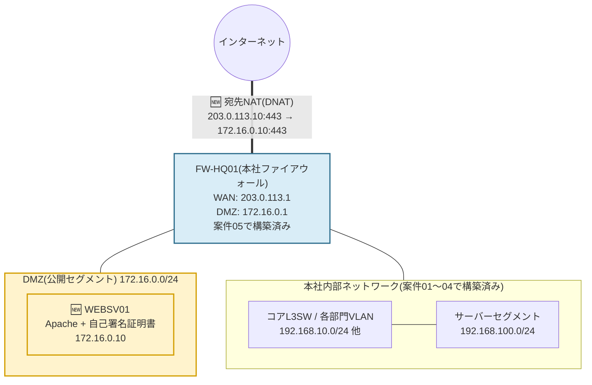

# 案件06: Webサーバー構築・公開 🌐

## 1. この案件について 📋

| 項目 | 内容 |
|---|---|
| 難易度 | ★★★☆☆(全5段階中3) |
| 想定所要時間 | 5〜8時間 |
| 前提となる案件 | [案件01: 本社オフィスLANの設計・構築](../case01_lan_design/README.md)、[案件02: 本社-支社間ルーティング構築](../case02_wan_routing/README.md)、[案件03: DHCP/DNSサーバー構築](../case03_dhcp_dns/README.md)、[案件04: VLANによる部門分割](../case04_vlan_segmentation/README.md)、[案件05: ファイアウォール・NAT構築](../case05_firewall_nat/README.md) |

> 🔰 本案件は、案件05で構築した「DMZ(非武装地帯)」と「ファイアウォールによるNAT/ポート開放」の
> 仕組みの上に、実際に公開する中身(Webサーバー)を配置する案件です。DMZという箱だけ作って
> まだ何も置いていない状態から、この案件でようやく箱の中身が動き始めるとイメージしてください。

## 2. 身につくスキル 🎯

- Webサーバー(Apache)の導入・基本設定と、静的HTMLコンテンツの公開方法
- HTTP/HTTPSの違いと、SSL/TLSによる通信の暗号化・サーバー認証の考え方
- OpenSSLを使った自己署名証明書の作成と、実運用でLet's Encryptなど正規CA証明書を使う理由の理解
- ファイアウォールにおける宛先NAT(DNAT/ポートフォワーディング)の設定と、その必要性の理解
- `curl`を使った外部視点でのサービス疎通確認、`--resolve`オプションによる名前解決を伴わない検証テクニック
- アクセスログ・エラーログの読み方と、公開サーバーの基本的な運用視点

## 3. 案件概要(お客様からのご依頼) 💬

> 「実は最近、新規のお取引先候補から『御社のホームページを見て、事業内容を確認したいのですが』と
> 言われることが増えていまして……お恥ずかしい話、うちの会社、まだホームページを持っていないんです。
> 名刺交換のあとにインターネットで検索されても何も出てこない状態で、正直かなり気まずい思いを
> しています。
>
> 最初はそんなに立派なものでなくて構いません。会社概要や事業内容が載った簡単な紹介ページだけでも
> いいので、インターネット上に公開してもらえないでしょうか。あと、最近は『鍵マークが付いていない
> サイトは怪しい』と言われることもあると聞いたので、そのあたりもちゃんとしたものにしていただける
> と助かります。」
>
> *(株式会社サンプル商事 営業部 部長)*

## 4. 背景・状況 🏢

案件05で、株式会社サンプル商事の社内ネットワークとインターネットの境界にファイアウォールを設置し、
社内からインターネットへ安全に出て行くためのNAT/PAT、そして外部に公開するサーバーを社内LANから
隔離して置くための**DMZ(DeMilitarized Zone、非武装地帯)**セグメントを用意しました。しかし案件05
の時点ではDMZセグメントには何も機器が接続されておらず、いわば「公開用の棚だけ作って、まだ何も
並べていない」状態でした。

そんな折、営業部から冒頭のような相談が寄せられました。背景には、取引先が増えるにつれて「会社の
存在や事業内容をインターネット上で確認できるかどうか」が、名刺交換と同じくらい当たり前の
信用情報として見られるようになってきた、という事情があります。また「鍵マーク」というのは
ブラウザのアドレスバーに表示される鍵アイコン、つまりHTTPS(暗号化された通信)で保護されている
サイトの目印のことです。最近は多くのブラウザが、HTTPS化されていないサイトに対して「保護されて
いない通信」といった警告を表示するようになっており、営業部としてもそれを意識しての依頼でした。

そこで今回は、案件05で用意したDMZセグメント(`172.16.0.0/24`)に実際にWebサーバーを1台構築し、
簡単な会社紹介ページを、HTTPSで安全に外部公開します。社内の重要な情報(顧客データや業務システム)
が置かれている本社LAN・サーバーセグメントとは物理的にも論理的にも別のセグメントにWebサーバーを
置くことで、万が一Webサーバーが攻撃を受けて乗っ取られたとしても、被害が社内ネットワークにまで
及ぶリスクを最小限に抑えられるようにする、という設計思想がDMZの核心です。

## 5. 要件 ✅

1. DMZセグメント(`172.16.0.0/24`)の`172.16.0.10`に、Ubuntu ServerでWebサーバー(Apache)を
   構築すること。
2. 会社概要・事業内容など、株式会社サンプル商事を紹介する簡単な静的HTMLページを配置すること。
3. HTTP(80番ポート)だけでなくHTTPS(443番ポート)でもアクセスできるようにし、自己署名証明書
   による暗号化通信を確認すること。あわせて、実運用では自己署名証明書ではなくLet's Encryptなど
   正規のCA(認証局)が発行する証明書へ切り替える必要があることを説明できるようにしておくこと。
4. HTTP(80番)でアクセスした場合は、HTTPS(443番)へ自動的にリダイレクトされること。
5. ファイアウォール(案件05で構築済み)に**宛先NAT(DNAT)**を設定し、インターネット側の
   `203.0.113.10:443`宛の通信を、DMZの`172.16.0.10:443`へ転送できること(この転送設定は本案件の
   必須要件とし、80番ポートの転送は任意・発展課題とする)。
6. 外部(WAN側)のクライアントから`curl`コマンドで実際にアクセスし、正しくコンテンツが返ることを
   確認できること。
7. アクセスログを確認し、どのIPアドレスからいつアクセスがあったかを把握できる状態にしておくこと。
8. 既存のIPアドレス設計([docs/03_ip_address_design.md](../../docs/03_ip_address_design.md))と
   矛盾しないこと。

## 6. 全体構成図 🗺️

黄色(🆕マーク)が本案件で新たに追加する要素、水色は案件05で構築済みの設備のうち本案件で設定を
追加する部分です。



DMZセグメントは、ファイアウォールを挟んで本社内部ネットワークとは別セグメントに存在している点が
ポイントです。図の`FW`ノードは案件05で構築済みですが、本案件ではここに新しいDNATルールを1つ
追加します。DMZと本社内部ネットワークの間の通信は、案件05のファイアウォールポリシーにより
基本的に許可されていない想定のため、後述のとおりWEBSV01は社内のDNSサーバー(`192.168.100.10`、
案件03で構築)ではなく、外部の公開DNSを名前解決に使用します。

## 7. IPアドレス設計 🔢

本案件で使用するIPアドレスは、[docs/03_ip_address_design.md](../../docs/03_ip_address_design.md)
の3-4節・3-8節の設計に準拠します。詳細な設計根拠は必ず同ファイルを参照してください。ここでは、
この案件に関係する範囲だけを抜粋して転記します。

### DMZ(同ファイル 3-4節より抜粋)

| ホスト | IPアドレス | 役割 | 登場案件 |
|---|---|---|---|
| FWのDMZ側インターフェース | 172.16.0.1 | DMZのゲートウェイ | 案件05 |
| Webサーバー | 172.16.0.10 | 案件06で構築(Apache/Nginx) | 案件05〜 |

### インターネット向けアドレス(同ファイル 3-8節より抜粋)

| ホスト | IPアドレス | 役割 |
|---|---|---|
| 本社FWの外側インターフェース | 203.0.113.1 | インターネット接続口(ISPから払い出された想定) |
| Webサーバー公開用(NAT後) | 203.0.113.10 | 案件05・06で、DMZの172.16.0.10へポート転送 |

### この案件で新たに決める設計(ホスト名・公開ドメイン名)

`docs/03_ip_address_design.md`はIPアドレスの正本であり、ホスト名や公開用のドメイン名までは
定義していません。そのため、Webサーバーのホスト名と、外部公開時に使うドメイン名はこの案件で
新たに決定します。

| 項目 | 値 | 備考 |
|---|---|---|
| ホスト名 | WEBSV01 | DMZに設置するApacheサーバー |
| IPアドレス | 172.16.0.10 | 3-4節のとおり |
| 公開ドメイン名(想定) | www.sample-shoji.example | 実在しないドメイン。詳細は後述 |

> 📘 `.example`は、`.local`と同じように**IANA/RFC 2606で「文書・例示専用」として予約**されている
> トップレベルドメインです。本リポジトリのIPアドレスがRFC 5737の`203.0.113.0/24`を使っている
> のと同じ発想で、ここでもドメイン名を実在の組織と紐付けないよう`.example`を採用しています。
> 実際にこのドメインを名前解決してもインターネット上には何も存在しません。動作確認の章で説明
> するとおり、本演習では`curl`の`--resolve`オプションを使い、DNS登録なしにこのドメイン名で
> 疎通確認を行います。

## 8. 使用環境・ツール 🧰

| 分類 | 使用ツール・バージョン目安 |
|---|---|
| サーバー仮想化 | VirtualBox 7.x |
| Webサーバー(本案件で構築) | Ubuntu Server 22.04 LTS + Apache2(2.4系)。Nginx(1.24系)でも同様の手順で代替可能 |
| SSL/TLS | OpenSSL 3.x(自己署名証明書の作成に使用) |
| ファイアウォール(案件05で構築済み) | Ubuntu Server 22.04 LTS + firewalld(ゾーンベースのパケットフィルタ・NAT)、ホスト名 FW-HQ01 |
| 主なコマンド | `apt`, `systemctl`, `a2enmod`, `a2ensite`, `apachectl`, `openssl`, `curl`, `firewall-cmd`, `ss`, `tail` |

> 📘 Apache/Nginxはどちらも広く使われる代表的なWebサーバーソフトです。本手順ではApacheを例に
> 進めますが、設定ファイルの書き方が異なるだけで「静的ファイルを配信する」「SSL/TLSで暗号化する」
> という考え方自体は共通です。Nginxを使う場合は、`sites-available`の代わりに`server`ブロックで
> 同様の設定(`listen 443 ssl;`、`ssl_certificate`、`ssl_certificate_key`など)を記述します。

## 9. 作業手順 🔧

### STEP1: DMZセグメントにWebサーバーを配置する

VirtualBoxで`WEBSV01`という名前の新規仮想マシンを作成し、Ubuntu Server 22.04 LTSをインストール
します。ネットワークアダプタは、案件05でDMZセグメント用に作成済みのVirtualBox内部ネットワーク
(例:`dmz-segment`)に接続します。本社LANやサーバーセグメントに使っているアダプタとは別物である
点を必ず確認してください。

固定IPアドレスを設定します。

```yaml
# /etc/netplan/00-installer-config.yaml
network:
  version: 2
  ethernets:
    enp0s3:
      dhcp4: no
      addresses:
        - 172.16.0.10/24
      routes:
        - to: default
          via: 172.16.0.1
      nameservers:
        addresses: [8.8.8.8]
```

```bash
$ sudo netplan apply
$ ip a show enp0s3
    inet 172.16.0.10/24 brd 172.16.0.255 scope global enp0s3
```

> ⚠️ ネームサーバーに案件03で構築した社内DNS(`192.168.100.10`)ではなく、あえて外部の公開DNS
> (`8.8.8.8`)を指定しています。DMZは本社内部ネットワークと隔離されたセグメントであり、
> 案件05のファイアウォールポリシー上、DMZから内部のサーバーセグメント(`192.168.100.0/24`)への
> 通信は基本的に許可されていない想定だからです。「公開サーバーだからといって、内部の便利な
> リソースに何でも自由にアクセスできてよいわけではない」という、DMZ設計の基本的な考え方が
> ここにも表れています。

### STEP2: Apacheをインストールする

```bash
$ sudo apt update
$ sudo apt install -y apache2
$ sudo systemctl enable --now apache2
$ sudo systemctl status apache2
```

### STEP3: 会社紹介ページを作成する

デフォルトのドキュメントルート(`/var/www/html/`)に、会社紹介用の静的HTMLページを配置します。

```html
<!-- /var/www/html/index.html -->
<!DOCTYPE html>
<html lang="ja">
<head>
  <meta charset="UTF-8">
  <title>株式会社サンプル商事</title>
  <style>
    body { font-family: sans-serif; margin: 0; background: #f7f7f7; color: #333; }
    header { background: #1a3c5e; color: #fff; padding: 24px; }
    main { max-width: 720px; margin: 24px auto; background: #fff; padding: 24px; }
    h2 { border-left: 4px solid #1a3c5e; padding-left: 8px; }
    footer { text-align: center; color: #888; font-size: 0.85em; padding: 16px; }
  </style>
</head>
<body>
  <header>
    <h1>株式会社サンプル商事</h1>
    <p>誠実な商いで、お客様とともに成長する。</p>
  </header>
  <main>
    <h2>会社概要</h2>
    <table>
      <tr><td>商号</td><td>株式会社サンプル商事</td></tr>
      <tr><td>所在地</td><td>東京都千代田区サンプル1-2-3</td></tr>
      <tr><td>従業員数</td><td>30名(2026年8月現在)</td></tr>
    </table>
    <h2>事業内容</h2>
    <ul>
      <li>各種商材の卸売・仕入れ販売</li>
      <li>取引先企業への物流・在庫管理支援</li>
      <li>業務効率化に関するコンサルティング</li>
    </ul>
  </main>
  <footer>&copy; 2026 Sample Shoji Corp.</footer>
</body>
</html>
```

### STEP4: 自己署名SSL/TLS証明書を作成する

OpenSSLを使い、Apacheで使用する秘密鍵と自己署名証明書を作成します。

```bash
$ sudo mkdir -p /etc/apache2/ssl
$ sudo openssl req -x509 -nodes -days 825 -newkey rsa:2048 \
    -keyout /etc/apache2/ssl/websv01.key \
    -out /etc/apache2/ssl/websv01.crt \
    -subj "/C=JP/ST=Tokyo/L=Chiyoda/O=Sample Shoji Corp/OU=IT/CN=www.sample-shoji.example"
$ sudo chmod 600 /etc/apache2/ssl/websv01.key
```

- `-x509`: 証明書署名要求(CSR)ではなく、自己署名済みの証明書そのものを直接生成するオプション
- `-days 825`: 証明書の有効期間(日数)。実務では正規CAでも398日程度に制限されるのが一般的ですが、
  自己署名証明書は自分でルールを決められるため学習用途としてはやや長めに設定しています
- `CN=www.sample-shoji.example`: コモンネーム(Common Name)。この証明書がどのホスト名向けの
  ものかを示す情報で、アクセスするURLのホスト名と一致しているかがブラウザ側の検証項目の1つに
  なります

> 📘 **実運用ではLet's Encryptを使う**: 自己署名証明書は「誰でも自分で作れてしまう証明書」の
> ため、ブラウザやOSにあらかじめ組み込まれている信頼済みのCA(認証局)一覧には含まれず、
> アクセス時に警告が表示されます。実際にインターネット上でサービスを公開する場合は、
> [Let's Encrypt](https://letsencrypt.org/)のような無料の認証局と`certbot`コマンドを使い、
> ACME(Automatic Certificate Management Environment)というプロトコルで自動的に正規の証明書を
> 取得・更新するのが一般的です。ただしLet's Encryptによる証明書発行には、実在する公開ドメイン
> 名と、外部から到達可能な80番または443番ポートが必要です。本演習の`203.0.113.10`はRFC 5737の
> 検証用アドレスでインターネットには実在しないため、この案件では自己署名証明書で代替しています。

### STEP5: ApacheをHTTPS化し、HTTPからのリダイレクトを設定する

まずSSLモジュールを有効化し、HTTPS用の仮想ホスト(VirtualHost)設定に、作成した証明書と秘密鍵の
パスを設定します。

```bash
$ sudo a2enmod ssl
```

```apache
# /etc/apache2/sites-available/default-ssl.conf (抜粋)
<IfModule mod_ssl.c>
    <VirtualHost _default_:443>
        ServerName www.sample-shoji.example
        DocumentRoot /var/www/html

        SSLEngine on
        SSLCertificateFile      /etc/apache2/ssl/websv01.crt
        SSLCertificateKeyFile   /etc/apache2/ssl/websv01.key
    </VirtualHost>
</IfModule>
```

```bash
$ sudo a2ensite default-ssl
```

次に、HTTP(80番)でアクセスされた場合にHTTPS(443番)へ自動的にリダイレクトするよう、
デフォルトの仮想ホスト設定を変更します。

```apache
# /etc/apache2/sites-available/000-default.conf (抜粋)
<VirtualHost *:80>
    ServerName www.sample-shoji.example
    Redirect permanent / https://www.sample-shoji.example/
</VirtualHost>
```

設定の構文を確認してから、Apacheに反映します。

```bash
$ sudo apachectl configtest
Syntax OK
$ sudo systemctl reload apache2
```

### STEP6: ファイアウォールで宛先NAT(DNAT)を設定する

最後に、案件05で構築済みのファイアウォール(FW-HQ01、firewalld)に、インターネット側からの
HTTPSアクセスをWEBSV01へ転送するルールを追加します。firewalldはあらかじめ`external`(外部)・
`dmz`(非武装地帯)・`internal`(内部)といった役割ごとのゾーンが用意されており、DMZという概念が
最初から組み込まれているのが特徴です。

まず、DMZゾーンでHTTP/HTTPSサービスへのアクセスを許可します(初期状態のdmzゾーンは、デフォルトの
SSHなど最小限のサービスしか許可していません)。

```bash
$ sudo firewall-cmd --zone=dmz --add-service=http --permanent
$ sudo firewall-cmd --zone=dmz --add-service=https --permanent
```

続いて、外部(`external`ゾーン)の443番ポート宛の通信を、DMZの`172.16.0.10`の443番ポートへ転送する
DNATルールを追加します。

```bash
$ sudo firewall-cmd --zone=external --add-forward-port=port=443:proto=tcp:toport=443:toaddr=172.16.0.10 --permanent
```

宛先を別セグメントへ転送する際は、戻りの通信が正しくファイアウォール経由で送信元へ戻れるように
`masquerade`(送信元NAT)が有効になっている必要があります。案件05で社内LANのインターネット
アクセス用にすでに有効化されているはずなので、ここでは設定状況を確認するだけで構いません。

```bash
$ sudo firewall-cmd --zone=external --query-masquerade
yes
```

すべての設定を反映させます。

```bash
$ sudo firewall-cmd --reload
```

> 📘 本案件の要件では443番ポートの転送のみを必須としています。80番ポート(HTTPリダイレクト用)
> を外部にも転送すると、外部の利用者が誤ってHTTPでアクセスしてきた際にもHTTPSへ自動的に
> 案内できるようになりますが、こちらは「発展課題」で扱う任意項目とします。

## 10. 動作確認 🔍

### 1. Apacheのサービス状態を確認する

```bash
$ sudo systemctl status apache2
● apache2.service - The Apache HTTP Server
     Loaded: loaded (/lib/systemd/system/apache2.service; enabled)
     Active: active (running) since ...
```

### 2. DMZ内からHTTP/HTTPSの疎通を確認する

```bash
$ curl -I http://172.16.0.10/
HTTP/1.1 301 Moved Permanently
Location: https://www.sample-shoji.example/

$ curl -k https://172.16.0.10/ | grep "<title>"
<title>株式会社サンプル商事</title>
```

HTTPへのアクセスが301(恒久的リダイレクト)でHTTPSへ案内されていること、HTTPSでは`-k`オプション
(証明書検証をスキップ)を付ければページの中身が正しく返ってくることを確認します。

### 3. ファイアウォールのDNAT設定を確認する

```bash
$ sudo firewall-cmd --zone=external --list-forward-ports
port=443:proto=tcp:toport=443:toaddr=172.16.0.10

$ sudo firewall-cmd --zone=dmz --list-services
dhcpv6-client http https ssh
```

### 4. 外部(インターネット側)からの疎通を確認する

社内LANの外側(インターネット側)にいる想定の検証端末から、公開用アドレス`203.0.113.10`宛に
アクセスします。ドメイン名`www.sample-shoji.example`は実際には登録されていないため、
`--resolve`オプションでDNSに問い合わせずに名前とIPアドレスの対応を強制的に指定します。

```bash
$ curl -k -v --resolve www.sample-shoji.example:443:203.0.113.10 https://www.sample-shoji.example/
*   Trying 203.0.113.10:443...
* Connected to www.sample-shoji.example (203.0.113.10) port 443
* TLSv1.3, ...
* Server certificate:
*  subject: CN=www.sample-shoji.example
*  SSL certificate verify result: self signed certificate (18), continuing anyway.
> GET / HTTP/1.1
> Host: www.sample-shoji.example
< HTTP/1.1 200 OK
< Content-Type: text/html
...
<title>株式会社サンプル商事</title>
```

`SSL certificate verify result: self signed certificate`という表示は、自己署名証明書を使って
いる以上想定どおりの警告であり、`-k`オプションで検証をスキップして先へ進んでいます。最終的に
`HTTP/1.1 200 OK`と、会社紹介ページの`<title>`タグが返ってくれば、インターネット側→DNAT→DMZの
Webサーバーまで、一連の経路がすべて正しく機能していることになります。

### 5. アクセスログを確認する

```bash
$ sudo tail -n 5 /var/log/apache2/access.log
203.0.113.50 - - [30/Aug/2026:10:15:32 +0900] "GET / HTTP/1.1" 200 1532 "-" "curl/8.5.0"
```

Apacheの標準的な「combined」形式のログは、左から順に「接続元IPアドレス」「(認証情報、通常は空)」
「アクセス日時」「リクエストの内容(メソッド・パス・プロトコル)」「HTTPステータスコード」
「転送バイト数」「リファラー」「User-Agent(クライアントの種類)」を表しています。この行が
記録されていれば、外部からのアクセスが実際にWebサーバーまで届き、正常に処理されたことが
サーバー側のログからも裏付けられます。

### 6. エラーログを確認する(トラブル発生時)

```bash
$ sudo tail -n 20 /var/log/apache2/error.log
```

証明書の読み込みエラーや、SSLハンドシェイクの失敗など、アクセスログだけでは分からない
サーバー内部のエラーは、こちらのエラーログに記録されます。

## 11. よくあるトラブルと対処法 ⚠️

| 症状 | 考えられる原因 | 対処法 |
|---|---|---|
| 外部(203.0.113.10)へ`curl`してもタイムアウトする | ファイアウォールのforward-port設定が`--permanent`のまま`--reload`されていない、または`dmz`ゾーンで`https`サービスが許可されていない | `firewall-cmd --zone=external --list-forward-ports`と`firewall-cmd --zone=dmz --list-services`で設定を確認し、`--reload`を忘れず実行する |
| `curl`で`SSL certificate problem: self signed certificate`と表示されて失敗する | 自己署名証明書は正規のCA(認証局)による署名がないため、デフォルト設定では信頼されない(想定内の挙動) | 検証時は`curl -k`(証明書検証をスキップ)を使う。実運用ではLet's Encryptなど正規CAの証明書に切り替える |
| Apacheが起動せず`(98)Address already in use: AH00072: make_sock: could not bind to address 0.0.0.0:443`が出る | 443番ポートをすでに他のプロセス(例: 誤って有効化したままのNginxなど)が使用している | `sudo ss -tlnp \| grep :443`で使用中のプロセスを特定し、不要な方を停止する |
| HTTPでアクセスすると`ERR_TOO_MANY_REDIRECTS`(無限リダイレクト)になる | HTTPS用の`default-ssl.conf`側にも誤ってHTTPSへのリダイレクト設定を書いてしまい、443番へのアクセスがさらに443番へリダイレクトされ続けている | リダイレクト設定は80番ポート用の`000-default.conf`側だけに記述し、`default-ssl.conf`側には書かないよう見直す |

## 12. この案件の重要用語 📚

- **HTTP/HTTPS**: Webブラウザとサーバーがページの内容をやり取りするための通信規約(プロトコル)。
  HTTPSはHTTPにSSL/TLSによる暗号化を組み合わせたもので、通信内容の盗聴・改ざんを防ぐ。
- **SSL/TLS証明書**: 通信を暗号化し、かつ「このサーバーが本当に名乗っているとおりの相手か」を
  証明するための電子証明書。証明書の中に、暗号化用の鍵とサーバーの情報(CNなど)が含まれる。
- **自己署名証明書**: 認証局(CA)を通さず、自分自身で署名して発行する証明書。無料かつ即座に作れる
  反面、ブラウザからは「信頼できるかどうか確認できない証明書」として警告の対象になる。
- **ポートフォワーディング(宛先NAT/DNAT)**: 外部から特定のIPアドレス・ポート宛に届いた通信を、
  内部の別のIPアドレス・ポートへ転送する仕組み。本案件では`203.0.113.10:443`宛の通信を
  `172.16.0.10:443`へ転送している。
- **ウェルノウンポート**: 0〜1023番のポート番号のうち、用途があらかじめ広く決められているもの。
  HTTPは80番、HTTPSは443番というように、サービスの種類とポート番号が慣習的に結び付いている。

共通の基礎用語(IPアドレス、NATなど)は [docs/01_glossary.md](../../docs/01_glossary.md) を
参照してください。

## 13. 発展課題(任意) 🚀

1. **80番ポートの外部転送**: ファイアウォールに80番ポートのDNATルールも追加し、外部の利用者が
   HTTPでアクセスしてきた場合でも、外部から見てもHTTPSへリダイレクトされる状態を完成させて
   みましょう。
2. **Let's Encrypt(Certbot)の仕組みの調査**: 実際には動作させられなくても、`certbot`が
   証明書を取得する際に使う「HTTP-01チャレンジ」「DNS-01チャレンジ」という2種類の検証方式の
   違いと、それぞれどのような場合に使い分けるかを調べてまとめてみましょう。
3. **アクセスログの簡易集計**: `awk`や`sort`、`uniq -c`などを組み合わせたワンライナーを作成し、
   アクセスログからアクセス数の多い送信元IPアドレスの上位を抽出してみましょう。

## 14. ポートフォリオ・面接でのアピールポイント 🌟

> 「DMZという境界セグメントの意味を、単に『そういう設定をする場所』としてではなく、『公開サーバーが
> 万一乗っ取られても被害を社内ネットワークに波及させないための隔離』という目的から理解した上で
> 構築しました。あわせて、自己署名証明書ではブラウザやcurlが警告を出すのは仕様どおりの挙動である
> ことを理解し、実運用ではLet's Encryptのような正規のCAを使う必要がある理由まで、面接の場でも
> 説明できるようにしています。」

外部からの疎通確認を、単に「動きました」で終わらせず、`curl -v`の出力にある`SSL certificate
verify result`のような情報を根拠に「なぜその表示が出るのか」を説明できる点も、単なる手順の
暗記ではなく仕組みへの理解が伝わる材料になります。

## 15. 関連リンク 🔗

- 前の案件: [案件05: ファイアウォール・NAT構築](../case05_firewall_nat/README.md)
- 次の案件: [案件07: ファイルサーバー・リモートアクセス](../case07_file_remote_access/README.md)
- [docs/00_roadmap.md](../../docs/00_roadmap.md) — 学習ロードマップ全体
- [docs/01_glossary.md](../../docs/01_glossary.md) — 用語集
- [docs/03_ip_address_design.md](../../docs/03_ip_address_design.md) — 全案件共通IPアドレス設計書(この案件のIPアドレスの正本)
