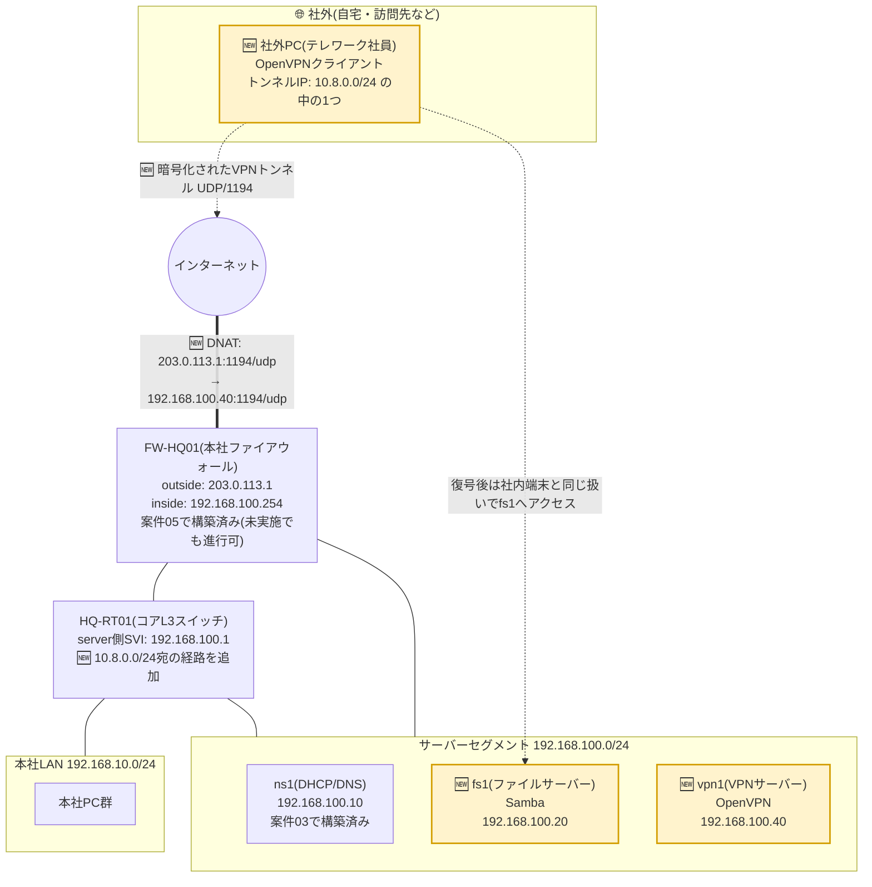

# 案件07: ファイルサーバー・リモートアクセス 🗄️

## 1. この案件について 📋

| 項目 | 内容 |
|---|---|
| 難易度 | ★★★★☆(全5段階中4) |
| 想定所要時間 | 6〜9時間 |
| 前提となる案件 | [案件01: 本社オフィスLANの設計・構築](../case01_lan_design/README.md)、[案件02: 本社-支社間ルーティング構築](../case02_wan_routing/README.md)、[案件03: DHCP/DNSサーバー構築](../case03_dhcp_dns/README.md) |

> 🔰 技術的に必須となるのは案件01〜03(特にサーバーセグメントと社内DNSが構築済みであること)までです。
> [案件04: VLANによる部門分割](../case04_vlan_segmentation/README.md)や
> [案件05: ファイアウォール・NAT構築](../case05_firewall_nat/README.md)を済ませていると、
> より実務に近い形で「部門ごとの通信制御」や「インターネット経由でのVPN公開」まで再現できますが、
> 未実施でも本案件は最後まで進められるように構成しています。未実施の場合の代替手順は本文中で
> 案内します。

## 2. 身につくスキル 🎯

- **Samba(SMB/CIFS)** による部門別ファイル共有サーバーの構築と、Linuxのグループ管理と連動した
  パーミッション設計の考え方
- **OpenVPN** によるリモートアクセスVPNの構築と、公開鍵基盤(PKI)を使ったサーバー証明書・
  クライアント証明書による認証の仕組み
- **トンネリング** の概念(なぜVPNを使うと「あたかも社内にいるかのように」通信できるのか)
- **SSH公開鍵認証** への切り替えと、パスワード認証を無効化することによる不正ログイン対策
- Linuxのファイルパーミッション(所有者/グループ/その他)と `setgid` ビットを使った、
  実務で使える権限設計の実践
- `smbclient` やサービスログを使った、リモートアクセス系トラブルの切り分け方

## 3. 案件概要(お客様からのご依頼) 💬

> 「実はうちの営業なんですが、外回りの合間に訪問先で見積書や過去の商談履歴を確認したいという
> 場面が増えてきていまして……今は各自のUSBメモリにコピーしたり、個人のGoogleドライブに
> 一時的にアップロードしたりして凌いでいるみたいなんです。正直、情報管理の観点でヒヤヒヤして
> います。
>
> それと最近、総務のパートさんから『子どもの学校行事で午前中だけ在宅にしたい』という相談も
> 出てきて、いよいよ在宅勤務(テレワーク)を制度として整えたいと思っています。ただ、自宅の
> パソコンから会社のファイルに安全にアクセスする方法が、私にはさっぱり分からなくて……。
>
> あと、総務の資料と営業の資料が同じ場所に置いてあると、お互いのフォルダを覗けてしまうのも
> 気になっています。部署ごとにちゃんと見える範囲を分けつつ、全員が使う共通の資料だけは
> 誰でも見られるようにしたいんです。安全に、かつ使いやすい形で実現していただけますか?」
>
> *(株式会社サンプル商事 総務部長)*

## 4. 背景・状況 🏢

案件01〜06を経て、株式会社サンプル商事は従業員数35名ほどにまで成長し、社内ネットワークの
基盤(LAN・ルーティング・DHCP/DNS)、インターネットへの安全な出口(ファイアウォール・NAT)、
そして会社紹介サイトの外部公開まで一通り整ってきました。

一方で、社内の「ファイル」の扱いは案件01の時点からほとんど手つかずのままでした。総務担当者の
PC内のフォルダをそのままネットワーク共有し、各自が必要なファイルを探しに行くという、いわば
属人的な運用が続いています。アクセス権も特に管理されておらず、総務の給与関連ファイルを
営業担当者が開こうと思えば開けてしまう状態でした。

さらに、働き方に対する社員の要望も変化してきています。子育て中の社員からの在宅勤務の相談、
外回りの多い営業担当者からの「訪問先で資料を確認したい」という声など、**オフィスの外から
安全に社内のファイルへアクセスしたい**というニーズが具体化してきました。しかし現状では
そのための手段が用意されておらず、社員が個人のクラウドストレージやUSBメモリで代用してしまう
——いわゆる**シャドーIT**(案件05でも触れた、会社が把握していない手段が業務に使われてしまう
状態)が、ここでも顔を出し始めています。

そこで本案件では、サーバーセグメント(`192.168.100.0/24`)に2台のLinuxサーバーを新設します。
1台は**部門ごとにアクセス範囲を分けたファイルサーバー(Samba)**、もう1台は**社外から安全に
社内ネットワークへ接続するためのVPNサーバー(OpenVPN)**です。あわせて、新しく構築するこの
2台のサーバー自身についても、SSHのパスワード認証を廃止し公開鍵認証のみに切り替えることで、
インフラ担当者としての基本的なサーバーセキュリティ対策も実践します。

## 5. 要件 ✅

1. サーバーセグメント(`192.168.100.0/24`)の`192.168.100.20`に、Ubuntu ServerでSambaによる
   ファイルサーバーを構築すること。
2. 部門ごとの共有フォルダ(**総務用・営業用**)と、全社員が読み書きできる**共通用**フォルダの
   3種類を用意し、それぞれ所属部門以外のユーザーからはアクセスできないよう権限設計を行うこと。
3. Sambaへのアクセスはユーザー名・パスワードによる認証を必須とし、ゲスト(匿名)アクセスは
   許可しないこと。
4. サーバーセグメントの`192.168.100.40`に、Ubuntu ServerでOpenVPNサーバーを構築すること。
5. VPN接続の認証には、単純なID/パスワードだけでなく**クライアント証明書**を用い、正規に発行された
   証明書を持つ端末だけが接続できること。
6. VPN接続後、社外の端末から社内のサーバーセグメント(ファイルサーバーを含む)へ到達できること。
7. 本案件で新たに構築するファイルサーバー・VPNサーバーの両方について、SSHログインは
   **公開鍵認証のみ**を許可し、パスワード認証を無効化すること。
8. 既存のIPアドレス設計([docs/03_ip_address_design.md](../../docs/03_ip_address_design.md))と
   矛盾しないこと。

## 6. 全体構成図 🗺️

黄色(🆕マーク)が本案件で新たに追加する要素です。ファイアウォール(FW-HQ01)は案件05で
構築済みのものとして描いていますが、未実施の場合は「社外」からの経路を、検証用PCを直接
サーバーセグメントの外側に見立てて代用してください(詳細はSTEP11で説明します)。



VPNサーバーを、案件06のWebサーバーのようにDMZへ置かず、あえて社内の**サーバーセグメント
そのもの**に置いている点に注目してください。VPN接続は「認証に成功した社外の端末を、疑似的に
社内ネットワークの一員にする」仕組みのため、最終的にファイルサーバーへ到達できる必要があります。
実務ではセキュリティをさらに高めるために、VPN終端(接続の受け口)をDMZやファイアウォール自身に
置き、認証後の通信だけを内部へ中継する設計も広く使われますが、本演習では設計をシンプルに保つため、
既存のIPアドレス設計どおりサーバーセグメント内に配置しています。

## 7. IPアドレス設計 🔢

本案件で使用するIPアドレスは、[docs/03_ip_address_design.md](../../docs/03_ip_address_design.md)
の3-3節の設計に準拠します。詳細な設計根拠は必ず同ファイルを参照してください。ここでは、この
案件に関係する範囲だけを抜粋して転記します。

### サーバーセグメント(同ファイル 3-3節より抜粋)

| ホスト | IPアドレス | 役割 | 登場案件 |
|---|---|---|---|
| L3SW/FWのSVI | 192.168.100.1 | サーバーセグメントのゲートウェイ | 案件03 |
| DHCP/DNSサーバー | 192.168.100.10 | 案件03で構築 | 案件03〜 |
| ファイルサーバー | 192.168.100.20 | 案件07で構築(Samba) | 案件07〜 |
| 監視サーバー | 192.168.100.30 | 案件08で構築(Zabbix等・本案件では未使用) | 案件08〜 |
| VPNサーバー | 192.168.100.40 | 案件07で構築 | 案件07〜 |

### この案件で新たに決める設計

`docs/03_ip_address_design.md`には各サーバーのIPアドレスまでは定義されていますが、ホスト名や
VPNトンネル内で使うアドレス帯までは定義していません。そのため、以下は本案件で新たに決定し、
今後の案件でもこの値を踏襲します。

| 項目 | 値 | 備考 |
|---|---|---|
| ファイルサーバーのホスト名 | fs1.sample-shoji.local | 192.168.100.20。案件03のDNS命名規則を踏襲 |
| VPNサーバーのホスト名 | vpn1.sample-shoji.local | 192.168.100.40 |
| VPNトンネル用アドレス帯 | 10.8.0.0/24 | OpenVPN接続時に各クライアントへ割り当てる仮想アドレス。既存のWAN区間(10.0.0.0/30、10.0.0.4/30)とは重複しない |
| VPNの外部公開先(案件05実施済みの場合) | 203.0.113.1 : 1194/udp | 案件06のWebサーバーのように新しいグローバルIPは追加せず、FWの既存outsideアドレスにポート番号違いで同居させる |

> 📘 `192.168.100.254`(FW-HQ01のinside側アドレス)は案件05のREADMEで新たに決定された値であり、
> `docs/03_ip_address_design.md`本体には記載がありません。案件05を実施済みの方は、本案件の
> STEP11でこの値を参照します。

## 8. 使用環境・ツール 🧰

| 分類 | 使用ツール・バージョン目安 |
|---|---|
| サーバー仮想化 | VirtualBox 7.x |
| サーバーOS | Ubuntu Server 22.04 LTS(fs1・vpn1ともに) |
| ファイル共有 | Samba 4.15系(Ubuntu 22.04 LTS標準リポジトリ) |
| リモートアクセスVPN | OpenVPN 2.5系 + Easy-RSA 3系(PKI構築用) |
| SSH | OpenSSH(Ubuntu標準搭載) |
| ファイアウォール(案件05で構築済みの場合) | firewalld(Ubuntu Server 22.04 LTS、案件05のFW-HQ01) |
| 主なコマンド | `apt`, `systemctl`, `groupadd`, `useradd`, `smbpasswd`, `testparm`, `smbclient`, `easyrsa`, `openvpn`, `ssh-keygen`, `ssh-copy-id`, `chmod`/`chown` |

## 9. 作業手順 🔧

### STEP1: ファイルサーバー(fs1)・VPNサーバー(vpn1)を用意する

VirtualBoxで`fs1`・`vpn1`という名前の仮想マシンをそれぞれ作成し、Ubuntu Server 22.04 LTSを
インストールします。ネットワークアダプタは、案件03で`ns1`を接続したサーバーセグメント用の
内部ネットワーク(例:`srv-segment`)に接続します。

固定IPアドレスを設定します(以下は`fs1`の例。`vpn1`は末尾のアドレスと`hostnamectl`のホスト名
だけを読み替えてください)。

```yaml
# /etc/netplan/00-installer-config.yaml (fs1の例)
network:
  version: 2
  ethernets:
    enp0s3:
      dhcp4: no
      addresses:
        - 192.168.100.20/24
      routes:
        - to: default
          via: 192.168.100.1
      nameservers:
        addresses: [192.168.100.10]
```

```bash
$ sudo hostnamectl set-hostname fs1
$ sudo netplan apply
$ ip a show enp0s3
    inet 192.168.100.20/24 brd 192.168.100.255 scope global enp0s3
```

`vpn1`も同様に、アドレスを`192.168.100.40/24`、ホスト名を`vpn1`として構築しておきます。

### STEP2: 社内DNSにfs1・vpn1を登録する

案件03で構築した社内DNS(`ns1`、`192.168.100.10`)のゾーンファイルに、新しい2台のAレコードを
追加します。IPアドレスではなくホスト名で覚えられるようにしておくのは、案件03で整えた仕組みを
使い倒すという意味でも理にかなっています。

```conf
# /etc/bind/zones/db.sample-shoji.local (抜粋・追記分)
fs1     IN      A       192.168.100.20
vpn1    IN      A       192.168.100.40
```

SOAレコードのSerial値を1つ増やしてから、設定を反映します。

```bash
$ sudo named-checkzone sample-shoji.local /etc/bind/zones/db.sample-shoji.local
$ sudo systemctl reload bind9
```

### STEP3: Sambaをインストールし、部門グループ・ユーザーを作成する

```bash
$ sudo apt update
$ sudo apt install -y samba
```

まず、部門を表すLinuxグループと、全社員が所属する共通グループを作成します。グループ分けを
先に決めておくことで、あとの共有フォルダ設定を「誰が」ではなく「どのグループに属しているか」で
一元管理できます。

```bash
$ sudo groupadd grp-soumu     # 総務・経理
$ sudo groupadd grp-eigyo     # 営業部
$ sudo groupadd grp-all       # 全社員共通
```

サンプルユーザーを作成し、それぞれ所属部門のグループと共通グループの両方に追加します。

```bash
$ sudo useradd -m -G grp-soumu,grp-all yamada    # 総務部
$ sudo useradd -m -G grp-eigyo,grp-all suzuki    # 営業部
$ sudo useradd -m -G grp-all sato                # 情報システム部
```

> 📘 実務では情シス部門やバックアップ担当が監査目的ですべてのフォルダを閲覧できるようにする
> 設計もよく見られますが、本演習では権限設計をシンプルに保つため、部門フォルダは所属部門のみ、
> 共通フォルダは全員がアクセスできるという最小限の構成にしています。サーバー管理者(あなた)は
> `sudo`でOS上どのファイルにもアクセスできるため、Sambaの権限とは別に管理者権限が確保されている
> 点も覚えておいてください。

### STEP4: 共有フォルダを作成し、パーミッションを設計する

```bash
$ sudo mkdir -p /srv/samba/{soumu,eigyo,kyoyu}
$ sudo chown root:grp-soumu /srv/samba/soumu
$ sudo chown root:grp-eigyo /srv/samba/eigyo
$ sudo chown root:grp-all   /srv/samba/kyoyu
$ sudo chmod 2770 /srv/samba/soumu /srv/samba/eigyo /srv/samba/kyoyu
```

`chmod 2770`の先頭の`2`は**setgidビット**です。これを付けたディレクトリの中に新しく作られる
ファイル・フォルダは、作成したユーザーの所属グループに関わらず、常に**親ディレクトリと同じ
グループ**が引き継がれます。setgidを付けずに`770`だけにしてしまうと、ユーザーごとのデフォルト
グループ次第でファイルの所有グループがバラバラになり、いつの間にか他のメンバーが読み書き
できなくなる、というよくある事故につながります。

### STEP5: smb.confで共有を定義し、Sambaユーザーを登録する

```conf
# /etc/samba/smb.conf (抜粋)
[global]
   workgroup = SAMPLE-SHOJI
   server string = fs1 File Server
   security = user
   map to guest = never
   server min protocol = SMB2
   client min protocol = SMB2

[soumu]
   comment = 総務・経理部門用
   path = /srv/samba/soumu
   valid users = @grp-soumu
   write list = @grp-soumu
   force group = grp-soumu
   create mask = 0660
   directory mask = 2770
   browseable = yes

[eigyo]
   comment = 営業部門用
   path = /srv/samba/eigyo
   valid users = @grp-eigyo
   write list = @grp-eigyo
   force group = grp-eigyo
   create mask = 0660
   directory mask = 2770
   browseable = yes

[kyoyu]
   comment = 全社共通
   path = /srv/samba/kyoyu
   valid users = @grp-all
   write list = @grp-all
   force group = grp-all
   create mask = 0660
   directory mask = 2770
   browseable = yes
```

`server min protocol = SMB2`は、脆弱性が多く報告されている古いバージョンのプロトコル(SMB1)を
無効化する設定です。`valid users`で共有ごとにアクセス可能なグループを限定し、`map to guest = never`
でゲスト(未認証)アクセスを明示的に禁止しているのが、要件2・3に対応する部分です。

設定ファイルの構文をチェックしてから、Sambaのユーザーパスワードを登録し、サービスを起動します。

```bash
$ sudo testparm
Load smb config files from /etc/samba/smb.conf
...
Loaded services file OK.

$ sudo smbpasswd -a yamada
$ sudo smbpasswd -a suzuki
$ sudo smbpasswd -a sato

$ sudo systemctl enable --now smbd nmbd
$ sudo systemctl status smbd
```

`smbpasswd -a`は、すでに存在するLinuxユーザーに対して、**Samba用の別のパスワード**を設定する
コマンドです。SambaのユーザーはOSのログインパスワードとは独立して管理されるため、この登録を
忘れるとLinuxユーザーを作っただけではSambaから接続できません。

### STEP6: OpenVPNとEasy-RSAで認証基盤(PKI)を構築する

vpn1に切り替えて作業します。

```bash
$ sudo apt update
$ sudo apt install -y openvpn easy-rsa
$ make-cadir ~/easy-rsa
$ cd ~/easy-rsa
```

Easy-RSAは、証明書の発行元となる**認証局(CA)**を自分たちで立て、サーバー証明書・クライアント
証明書をそこから発行するためのツールです。案件06では実在のCAの代わりに自己署名証明書1枚を
使いましたが、VPNでは「サーバーだけでなくクライアントも証明書で認証する」という、より厳密な
相互認証(mTLS)の考え方を体験します。

```bash
$ ./easyrsa init-pki
$ ./easyrsa build-ca nopass          # 社内CAを作成(Common Name例: Sample-Shoji-CA)
$ ./easyrsa gen-req vpn1 nopass      # サーバー証明書の元となる鍵と署名要求を作成
$ ./easyrsa sign-req server vpn1     # CAでサーバー証明書に署名
$ ./easyrsa gen-dh                   # DHパラメータ(鍵交換の安全性を高める)
$ openvpn --genkey secret pki/ta.key # tls-crypt用の追加鍵(第三者による通信内容の解析対策)
```

続けて、テレワーク対象社員1名分のクライアント証明書も発行しておきます。

```bash
$ ./easyrsa gen-req remote-client01 nopass
$ ./easyrsa sign-req client remote-client01
```

`nopass`を付けているのは演習を簡略化するためです。実運用では秘密鍵自体にもパスフレーズを
設定し、鍵ファイルが盗まれただけでは悪用できないようにするのが望ましい運用です。

### STEP7: OpenVPNサーバーを設定し、起動する

必要なファイルを配置します。

```bash
$ sudo mkdir -p /etc/openvpn/server
$ sudo cp ~/easy-rsa/pki/ca.crt /etc/openvpn/server/
$ sudo cp ~/easy-rsa/pki/issued/vpn1.crt /etc/openvpn/server/
$ sudo cp ~/easy-rsa/pki/private/vpn1.key /etc/openvpn/server/
$ sudo cp ~/easy-rsa/pki/dh.pem /etc/openvpn/server/
$ sudo cp ~/easy-rsa/pki/ta.key /etc/openvpn/server/
```

```conf
# /etc/openvpn/server/server.conf
port 1194
proto udp
dev tun

ca ca.crt
cert vpn1.crt
key vpn1.key
dh dh.pem
tls-crypt ta.key

topology subnet
server 10.8.0.0 255.255.255.0

# 接続してきたクライアントに、社内へアクセスするための経路を配布する
push "route 192.168.100.0 255.255.255.0"
push "route 192.168.10.0 255.255.255.0"
push "dhcp-option DNS 192.168.100.10"
push "dhcp-option DOMAIN sample-shoji.local"

keepalive 10 120
cipher AES-256-GCM
persist-key
persist-tun
status /var/log/openvpn/status.log
verb 3
explicit-exit-notify 1
```

`push "route ..."`は「トンネルを通じてどのネットワーク宛の通信を社内経由にするか」をクライアントに
指示する設定です。ここで社内LAN(`192.168.10.0/24`)とサーバーセグメント(`192.168.100.0/24`)を
指定することで、接続後はファイルサーバーだけでなく本社LAN側の端末にも到達できるようになります。

VPN経由の通信を正しく転送できるよう、IPフォワーディングを有効化します(案件05のFWでも行った
のと同じ考え方です)。

```bash
# /etc/sysctl.d/99-openvpn-forward.conf
net.ipv4.ip_forward = 1
```

```bash
$ sudo sysctl --system
$ sudo systemctl enable --now openvpn-server@server
$ sudo systemctl status openvpn-server@server
```

### STEP8: クライアント設定ファイル(.ovpn)を作成する

STEP6で発行したクライアント証明書一式を1つの`.ovpn`ファイルにまとめ、テレワーク対象の社員へ
配布します。`remote`行の宛先は、案件05を実施済みかどうかで変わります。

```conf
# remote-client01.ovpn
client
dev tun
proto udp
remote 203.0.113.1 1194        # 案件05未実施の場合は 192.168.100.40 に読み替え
resolv-retry infinite
nobind
persist-key
persist-tun
remote-cert-tls server
cipher AES-256-GCM
verb 3
<ca>
... ca.crtの中身 ...
</ca>
<cert>
... remote-client01.crtの中身 ...
</cert>
<key>
... remote-client01.keyの中身 ...
</key>
<tls-crypt>
... ta.keyの中身 ...
</tls-crypt>
```

証明書や秘密鍵の中身は、`cat ~/easy-rsa/pki/issued/remote-client01.crt`のように出力した内容を
それぞれのタグの間にそのまま貼り付けます。この`.ovpn`ファイル1枚だけで接続に必要な情報が
すべて完結するため、配布が簡単になる一方、**ファイル自体が秘密鍵を含む機密情報**であることを
利用者にも周知しておく必要があります。

### STEP9: 本社ルーターにVPNクライアント宛の経路を追加する

VPNクライアントが持つトンネル内アドレス(`10.8.0.0/24`)からの通信に、社内の機器が正しく
応答を返せるよう、コアL3スイッチ(HQ-RT01)に経路を追加します。

```
HQ-RT01(config)# ip route 10.8.0.0 255.255.255.0 192.168.100.40
HQ-RT01(config)# end
HQ-RT01# write memory
```

`10.8.0.0/24`宛の通信は、サーバーセグメント上のvpn1(`192.168.100.40`)が次のホップとして
中継し、そこからトンネルを通ってクライアントまで届く、という経路を教えている設定です。

### STEP10: SSHを公開鍵認証のみに切り替える(fs1・vpn1共通)

作業用PC側で鍵ペアを作成し、公開鍵をサーバーへ登録します(以下は`fs1`向けの例。`vpn1`にも
同様に行います)。

```bash
$ ssh-keygen -t ed25519 -C "engineer@sample-shoji"
$ ssh-copy-id -i ~/.ssh/id_ed25519.pub engineer@fs1.sample-shoji.local
```

公開鍵でログインできることを確認したうえで、サーバー側の`sshd_config`でパスワード認証を
無効化します。**公開鍵の登録確認を後回しにすると、パスワード認証を切った瞬間に誰もログイン
できなくなる**ため、必ず「先にログインできることを確認 → 無効化」の順序を守ってください。

```conf
# /etc/ssh/sshd_config (抜粋)
PubkeyAuthentication yes
PasswordAuthentication no
PermitRootLogin no
```

```bash
$ sudo sshd -t          # 設定ファイルの構文チェック
$ sudo systemctl restart ssh
```

### STEP11: (案件05実施済みの場合)ファイアウォールでVPNポートを外部公開する

案件05のFW-HQ01(`firewalld`)に、外部(`external`ゾーン)の1194番/UDPポート宛の通信を、
サーバーセグメントの`vpn1`(`192.168.100.40`)へ転送するDNATルールを追加します。

```bash
$ sudo firewall-cmd --zone=external --add-port=1194/udp --permanent
$ sudo firewall-cmd --zone=external --add-forward-port=port=1194:proto=udp:toport=1194:toaddr=192.168.100.40 --permanent
$ sudo firewall-cmd --reload
```

> ⚠️ 案件05を実施していない場合、この演習環境には「本物のインターネットからサーバーセグメントへ
> 到達する経路」自体が存在しません。その場合は代わりに、サーバーセグメントとは別のVirtualBox
> 内部ネットワークに検証用PCを1台用意し、そこから`192.168.100.40`宛に直接VPN接続することで、
> トンネルの暗号化やアクセス制御の効果を確認してください。実際にインターネット越しでの接続まで
> 確認したい場合は、[案件05](../case05_firewall_nat/README.md)を完了してから、このSTEP11を
> 追加で実施することをおすすめします。

## 10. 動作確認 🔍

### 1. Sambaサービスの状態を確認する

```bash
$ sudo systemctl status smbd nmbd
● smbd.service - Samba SMB Daemon
     Active: active (running) since ...
```

### 2. 部門ごとのアクセス制御を確認する

総務部の`yamada`で、自分の部門フォルダにはアクセスでき、営業部フォルダにはアクセスできない
ことを確認します。

```bash
$ smbclient //fs1/soumu -U yamada
Enter WORKGROUP\yamada's password:
smb: \> ls
  .   D        0  ...
  ..  D        0  ...
smb: \> quit

$ smbclient //fs1/eigyo -U yamada
Enter WORKGROUP\yamada's password:
tree connect failed: NT_STATUS_ACCESS_DENIED
```

`soumu`共有には問題なく接続でき、`eigyo`共有では`NT_STATUS_ACCESS_DENIED`(アクセス拒否)と
なっていれば、部門ごとのパーミッション設計が意図どおりに機能しています。共通フォルダ
(`kyoyu`)には、`yamada`・`suzuki`・`sato`のいずれでも接続できることも確認しておきます。

### 3. OpenVPNサービスの状態を確認する

```bash
$ sudo systemctl status openvpn-server@server
● openvpn-server@server.service
     Active: active (running) since ...

$ sudo cat /var/log/openvpn/status.log
OpenVPN CLIENT LIST
remote-client01,203.0.113.50:52341,...
```

### 4. クライアント側からVPN接続し、トンネルIPを確認する

```bash
$ sudo openvpn --config remote-client01.ovpn
...
Initialization Sequence Completed

$ ip a show tun0
    inet 10.8.0.6/24 brd 10.8.0.255 scope global tun0
```

`10.8.0.0/24`の範囲内のアドレスが`tun0`(仮想トンネルインターフェース)に割り当てられていれば、
VPNトンネルの確立に成功しています。

### 5. トンネル経由で社内のファイルサーバーへ到達できることを確認する

```bash
$ ping -c 3 192.168.100.20
64 bytes from 192.168.100.20: icmp_seq=1 ttl=63 time=18.2 ms

$ smbclient //fs1/kyoyu -U suzuki
Enter WORKGROUP\suzuki's password:
smb: \> ls
```

VPN未接続の状態から同じコマンドを実行するとタイムアウトすること、VPN接続後は正しく到達
できることを比較して確認すると、トンネルの効果がより実感できます。

### 6. SSHが公開鍵認証のみになっていることを確認する

```bash
$ ssh -o PreferredAuthentications=password -o PubkeyAuthentication=no engineer@fs1.sample-shoji.local
engineer@fs1.sample-shoji.local: Permission denied (publickey).

$ ssh engineer@fs1.sample-shoji.local
Welcome to Ubuntu 22.04 LTS ...
```

パスワード認証を明示的に要求した1つ目のコマンドが拒否され、通常どおり鍵で接続する2つ目の
コマンドが成功すれば、要件7を満たしています。

## 11. よくあるトラブルと対処法 ⚠️

| 症状 | 考えられる原因 | 対処法 |
|---|---|---|
| Samba共有が見えない・接続時にタイムアウトする | Sambaユーザー(`smbpasswd`)が未登録、またはサービス自体が起動していない | `sudo pdbedit -L`で登録済みユーザー一覧を確認し、`sudo systemctl status smbd`でサービス状態を確認する |
| 共有には接続できるが、書き込み時に`Permission denied`になる | ディレクトリの所有グループとSambaの`valid users`/Linuxのグループ所属が一致していない、または`setgid`ビット漏れ | `ls -ld /srv/samba/soumu`でグループとパーミッションを確認し、`chmod 2770`が反映されているか、対象ユーザーが`groups ユーザー名`で正しいグループに入っているか見直す |
| OpenVPNクライアントは接続できるが、社内サーバーにpingが通らない | サーバー側で`net.ipv4.ip_forward`が有効化されていない、または`push "route ..."`の指定漏れ、あるいはHQ-RT01側に`10.8.0.0/24`宛の戻り経路がない | vpn1で`sysctl net.ipv4.ip_forward`を確認し、`server.conf`の`push "route"`行を見直す。HQ-RT01では`show ip route`で`10.8.0.0/24`宛の経路(STEP9)が存在するか確認する |
| VPNクライアントの接続が`TLS handshake failed`で失敗する | クライアント証明書がサーバー側のCAで署名されたものと一致していない、またはクライアント/サーバー間で時刻が大きくずれている | 証明書は必ず同じCA(`~/easy-rsa`)から発行したものを使う。`date`コマンドでクライアント・サーバー双方の時刻を確認し、大きくずれている場合はNTPで同期する |
| SSHをパスワード認証無効化した直後にログインできなくなった | 公開鍵の登録(`ssh-copy-id`)を確認する前に`PasswordAuthentication no`を反映してしまった | コンソール(VirtualBoxの画面)から直接ログインし、`~/.ssh/authorized_keys`の内容とパーミッション(`700`/`600`)を確認したうえで設定を修正する。以後は必ず「鍵でのログイン確認→無効化」の順序を守る |

## 12. この案件の重要用語 📚

- **Samba(SMB/CIFS)**: Windows標準のファイル共有プロトコル(SMB/CIFS)をLinux上で実装した
  ソフトウェア。異なるOS同士でも同じ方法でファイル共有ができるようにする。
- **SSH公開鍵認証**: パスワードの代わりに、秘密鍵(手元に保管)と公開鍵(サーバーに登録)の
  ペアを使って本人確認を行う認証方式。パスワードの推測・総当たり攻撃への耐性が高い。
- **VPN(Virtual Private Network)**: インターネットのような公衆網の上に、暗号化された仮想的な
  専用線を作り出す技術。VPN接続中の端末は、あたかも社内ネットワークに直接つながっているかの
  ように通信できる。
- **トンネリング**: 元の通信データを別のプロトコルでカプセル化(包み込み)して転送する技術。
  VPNはこのトンネリングと暗号化を組み合わせることで、安全な仮想専用線を実現している。
- **PKI(公開鍵基盤)/CA(認証局)**: 「誰が」「どの鍵を」持っているかを証明書という形で
  保証する仕組み全体。自分たちでCAを立てて証明書を発行することを「プライベートCA」と呼ぶ。
- **setgidビット**: ディレクトリに設定すると、その中に新規作成されるファイル・フォルダの
  所有グループが、作成者ではなく親ディレクトリのグループに統一される特殊な権限ビット。

共通の基礎用語(IPアドレス、ルーティングなど)は
[docs/01_glossary.md](../../docs/01_glossary.md) を参照してください。

## 13. 発展課題(任意) 🚀

1. **WireGuardへの置き換え**: OpenVPNの代わりに、より新しく設定がシンプルな**WireGuard**を
   使ってVPNサーバーを構築し直し、設定ファイルの量や鍵の扱い方の違いを比較してみましょう。
2. **fail2banの導入**: SSHは公開鍵認証のみに切り替えて安全性を高めましたが、それでも
   ログイン試行のログは残ります。`fail2ban`を導入し、一定回数以上失敗したアクセス元IPを
   自動的に遮断する仕組みを追加してみましょう。
3. **VPN接続ログの可視化**: `/var/log/openvpn/status.log`や認証ログを定期的に集計し、
   「いつ・誰が・どこから接続したか」を一覧化する簡単なスクリプトを作成してみましょう
   (案件08の監視の考え方にもつながります)。

## 14. ポートフォリオ・面接でのアピールポイント 🌟

> 「『社外から社内へ安全にアクセスする』という要件に対し、単にVPNソフトを導入するだけでなく、
> クライアント証明書による相互認証、SSHの公開鍵認証への切り替えといった複数の認証レイヤーを
> 組み合わせて設計しました。あわせて、部門ごとのアクセス権をLinuxのグループとsetgidビットを
> 使って設計し、`smbclient`で実際にアクセス拒否が発生することまで確認するなど、『設定した
> つもり』で終わらせず、意図どおりに拒否されることまで検証する姿勢を大切にしています。」

VPNとファイル共有という2つの異なる技術を、1つの「テレワーク実現」という目的のために組み合わせて
設計・構築した経験は、単発の技術知識ではなく「業務要件から必要な技術を選び、組み合わせる力」を
伝える材料になります。

## 15. 関連リンク 🔗

- 前の案件: [案件06: Webサーバー構築・公開](../case06_web_server/README.md)
- 次の案件: [案件08: 監視・冗長化による可用性向上](../case08_monitoring_ha/README.md)
- [docs/00_roadmap.md](../../docs/00_roadmap.md) — 学習ロードマップ全体
- [docs/01_glossary.md](../../docs/01_glossary.md) — 用語集
- [docs/03_ip_address_design.md](../../docs/03_ip_address_design.md) — 全案件共通IPアドレス設計書(この案件のIPアドレスの正本)
