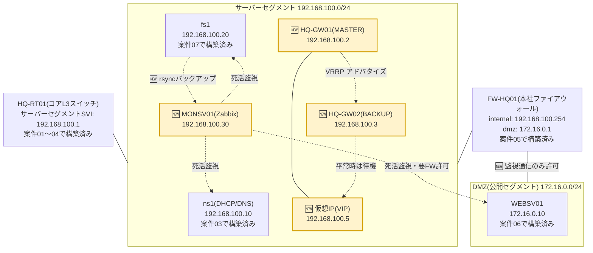

# 案件08: 監視・冗長化による可用性向上 🛡️

## 1. この案件について 📋

| 項目 | 内容 |
|---|---|
| 難易度 | ★★★★☆(全5段階中4) |
| 想定所要時間 | 6〜9時間 |
| 前提となる案件 | [案件01: 本社オフィスLANの設計・構築](../case01_lan_design/README.md)、[案件02: 本社-支社間ルーティング構築](../case02_wan_routing/README.md)、[案件03: DHCP/DNSサーバー構築](../case03_dhcp_dns/README.md)、[案件04: VLANによる部門分割](../case04_vlan_segmentation/README.md)、[案件05: ファイアウォール・NAT構築](../case05_firewall_nat/README.md)、[案件06: Webサーバー構築・公開](../case06_web_server/README.md)、[案件07: ファイルサーバー・リモートアクセス](../case07_file_remote_access/README.md) |

> 🔰 本案件は、これまでの案件で構築してきた**サーバー群そのものを守る側に回る案件**です。
> 案件01〜07では「新しいサーバーを1台ずつ増やす」ことに取り組んできましたが、サーバーの台数が
> 増えるほど、実は「どれか1台が止まったときに気づけるか」「止まっても業務が止まらないか」という
> 問題が重くのしかかってきます。この案件では、案件03のDHCP/DNSサーバー、案件06のWebサーバー、
> 案件07のファイルサーバーを主な監視対象として扱いますので、特にこの2案件を終えてから取り組む
> ことを強く推奨します。

## 2. 身につくスキル 🎯

- Zabbixによる死活監視・リソース監視サーバーの構築と、監視対象サーバーへのエージェント導入
- しきい値(トリガー)に基づくアラート設計と、「監視しすぎて誰も見なくなる」状態を避けるための考え方
- keepalived(VRRP)を用いた仮想IP(VIP)によるアクティブ/スタンバイ構成と、実際にフェイルオーバーが
  起きる瞬間を目で確認する経験
- cron + rsyncを用いた定期バックアップの自動化と、フルバックアップ・差分バックアップの使い分け方
- logrotateによるログファイルの世代管理・自動ローテーションの設定
- セグメントをまたぐ監視通信を、既存のファイアウォールポリシーを壊さずに最小限だけ許可する設計判断

## 3. 案件概要(お客様からのご依頼) 💬

> 「実はこの前、ちょっと肝を冷やす出来事がありまして……。深夜から早朝にかけて、案件03で入れて
> もらったDHCP/DNSサーバーの調子がおかしくなっていたみたいなんです。朝一で出社した営業のメンバーが
> 『社内のファイルサーバーにも、Webサイトの管理画面にも名前でアクセスできない』と大騒ぎになって、
> 調べてもらったら、あのサーバーが数時間前から応答しなくなっていたと。結局、朝9時に情シス担当が
> たまたま異変に気づいて再起動するまで、誰も気づかないまま数時間放置されていたことになります。
>
> 幸い大きな実害はなかったんですが、正直血の気が引きました。今はもう社員も50名になって、
> Webサイトも社外に公開してますし、ファイルサーバーにはみんなが仕事のデータを置いています。
> どれか1つでも止まったら、その日の仕事にならないんですよ。『壊れてから気づく』んじゃなくて、
> 『壊れる前に、あるいは壊れた瞬間に気づける』仕組みが欲しいです。
>
> それと、これは社長からも言われたんですが……『そもそも社内ネットワークの心臓部にあたる機械が
> 1台しかないんじゃないの? そこが壊れたら全部止まるんじゃない?』と。正直そのとおりで、返す言葉が
> ありませんでした。すぐに機器を二重化する予算は今期は厳しいんですが、まずは『壊れたらどうなるか、
> どう対策できるか』を実際に検証して、来期の稟議に使える資料を作ってもらえないでしょうか。」
>
> *(株式会社サンプル商事 情報システム部 部長)*

## 4. 背景・状況 🏢

案件01〜07を経て、株式会社サンプル商事の社内には、DHCP/DNSサーバー(案件03)、ファイアウォール
(案件05)、Webサーバー(案件06)、ファイルサーバー・VPNサーバー(案件07)と、業務に欠かせない
サーバーが着実に増えてきました。社員数も50名規模となり、これらのサーバーは「止まっても
誰かがそのうち気づくだろう」で済ませられるものではなくなっています。

冒頭の依頼にあるとおり、実際にDHCP/DNSサーバーが数時間にわたって無応答になっていたにもかかわらず、
誰も気づけなかったという**ヒヤリハット**が発生しました。これは典型的な「**監視されていないシステムは、
壊れていることにすら気づけない**」というリスクです。サーバーの安定運用には、大きく分けて2つの
アプローチがあります。

1. **死活監視(モニタリング)**: サーバーやサービスが正常に動作しているかを定期的にチェックし、
   異常があれば人間に知らせる仕組み。障害の発生に**いち早く気づく**ためのもの。
2. **冗長化(HA: High Availability)**: 機器やサーバーを複数台用意しておき、1台が故障しても
   残りが処理を引き継ぐ仕組み。障害が起きても**業務を止めない**ためのもの。

この2つは対立するものではなく、両輪です。監視だけあっても壊れたら止まってしまいますし、
冗長化だけあっても「本当に切り替わっているか」を監視していなければ、いざというとき機能しない
リスクが残ります。そこで本案件では、この2つを両方扱います。

監視ソフトウェアには、老舗であり日本語の情報も豊富な**Zabbix**を採用します(同種のツールとして
Prometheus + Grafanaという組み合わせも広く使われており、「メトリクス(数値データ)を収集し、
しきい値で評価し、アラートを出す」という考え方自体はどちらも共通です)。監視サーバーは
サーバーセグメント(`192.168.100.0/24`)の`192.168.100.30`に構築し、案件03のDHCP/DNSサーバー、
案件06のWebサーバー、案件07のファイルサーバーの3台を監視対象とします。なお、Webサーバーは
DMZ(`172.16.0.0/24`)という別セグメントに隔離されているため、監視のための通信だけを最小限
ファイアウォールで許可する、という一手間が必要になります。

冗長化については、社長の指摘どおり、本社LAN・サーバーセグメントすべての通信の根幹を担っている
**HQ-RT01(コアL3スイッチ、案件01〜04で構築)**が、実質的な単一障害点(SPOF: Single Point of
Failure)になっています。ただし、HQ-RT01は実務に近い形での学習のためCisco機器(Packet Tracer)を
想定して構築してきた機器であり、いきなり同等機種をもう1台調達して本番環境に組み込むのは、
予算的にもリスク的にもハードルが高い相談です。そこで本案件では、**まず技術者自身がVRRP(仮想
ルーター冗長プロトコル)という仕組みを理解し、実際に手を動かして「壊れたら自動的に肩代わりする」
挙動を確認するための検証環境**を、VirtualBox上のLinuxサーバー2台と`keepalived`というソフトウェアで
構築します。実務でも、いきなり本番機器を改修する前に、こうした小規模な検証(PoC: Proof of
Concept)で仕組みを理解し、上長への説明材料を用意してから本番導入を提案する、という進め方は
よく行われます。この検証で得た「仮想IP(VIP)を2台で共有し、片方が死んだらもう片方が自動的に
引き継ぐ」という考え方そのものは、Cisco機器のHSRP/VRRPネイティブ機能でも、クラウド上の仮想
ルーターでも共通する普遍的な仕組みです。

あわせて、これまで後回しになっていた**バックアップ**と**ログローテーション**も本案件で整備します。
どれだけ監視や冗長化を整えても、データそのものが失われては元も子もありません。案件07で構築した
ファイルサーバーのデータを、cronとrsyncを使って定期的に別のサーバーへ複製し、フルバックアップと
差分バックアップを使い分けることでディスク容量を抑えます。また、監視やバックアップの仕組みが
増えるとログファイルも増え続けるため、logrotateでログの世代管理を自動化します。

## 5. 要件 ✅

1. サーバーセグメント(`192.168.100.0/24`)の`192.168.100.30`に、監視サーバー(Zabbix Server +
   Web UI)をUbuntu Serverで構築すること。
2. 案件03で構築したDHCP/DNSサーバー(`192.168.100.10`)、案件07で構築したファイルサーバー
   (`192.168.100.20`)、案件06で構築したWebサーバー(`172.16.0.10`)の3台に監視エージェントを
   導入し、Zabbixの監視対象として登録すること。
3. 各監視対象について、CPU使用率・メモリ使用率・ディスク使用率・主要サービスの死活(HTTP、
   SSH等)を最低限監視できること。
4. あらかじめ定めたしきい値(例: ディスク使用率85%以上、サービス停止など)を超えた場合、
   Zabbix上でアラート(トリガー)が発報される状態にすること。
5. DMZに設置されたWebサーバーへの監視通信を許可するため、ファイアウォール(FW-HQ01)に、
   監視サーバーからDMZ向けの必要最小限の通信のみを許可するルールを追加すること。既存の
   他の通信ポリシー(案件05・06で構築済みのもの)に影響を与えないこと。
6. keepalived(VRRP)を用いて、仮想IP(VIP)によるアクティブ/スタンバイ構成のゲートウェイ冗長化を
   検証環境として構築すること。稼働中のノード(MASTER)を意図的に停止させ、VIPが自動的に
   もう一方のノード(BACKUP)へ引き継がれ、通信が継続することを確認できること。
7. cronとrsyncを用いて、ファイルサーバーのデータを監視サーバー(バックアップ先)へ定期的に
   転送する仕組みを構築すること。フルバックアップと差分バックアップを使い分け、ディスク容量を
   抑えつつ複数世代のバックアップを保持できること。
8. logrotateを用いて、本案件で新たに生成される主要なログ(バックアップスクリプトのログなど)を
   自動的にローテーション・圧縮・世代管理できる状態にすること。
9. 既存のIPアドレス設計([docs/03_ip_address_design.md](../../docs/03_ip_address_design.md))と
   矛盾しないこと。

## 6. 全体構成図 🗺️

黄色(🆕マーク)が本案件で新たに追加する要素です。監視サーバー(MONSV01)から各サーバーへの
点線が死活監視の通信、ファイルサーバーからMONSV01への点線がバックアップの通信を表しています。



`HQ-GW01`・`HQ-GW02`・仮想IPの3つは、サーバーセグメント内に構築する**VRRP検証環境**です。
実際のHQ-RT01(コアL3スイッチ)を直接置き換えるものではなく、「仮想IPを使った冗長化とはどういう
挙動をするものか」を実機で確認し、将来HQ-RT01やFW-HQ01を本格的に冗長化する際の判断材料とする
ための構成である点に注意してください。詳しくは後述の「背景・状況」および「発展課題」を参照して
ください。

## 7. IPアドレス設計 🔢

本案件で使用するIPアドレスは、[docs/03_ip_address_design.md](../../docs/03_ip_address_design.md)
の3-3節(サーバーセグメント)・3-4節(DMZ)の設計に準拠します。詳細な設計根拠は必ず同ファイルを
参照してください。ここでは、この案件に関係する範囲だけを抜粋して転記します。

### サーバーセグメント(同ファイル 3-3節より抜粋)

| ホスト | IPアドレス | 役割 | 登場案件 |
|---|---|---|---|
| L3SW/FWのSVI | 192.168.100.1 | サーバーセグメントのゲートウェイ | 案件03 |
| DHCP/DNSサーバー | 192.168.100.10 | 案件03で構築(監視対象) | 案件03〜 |
| ファイルサーバー | 192.168.100.20 | 案件07で構築(監視対象・バックアップ先) | 案件07〜 |
| **監視サーバー** | **192.168.100.30** | **本案件で構築(Zabbix)** | **案件08〜** |
| VPNサーバー | 192.168.100.40 | 案件07で構築 | 案件07〜 |

### DMZ(同ファイル 3-4節より抜粋)

| ホスト | IPアドレス | 役割 | 登場案件 |
|---|---|---|---|
| Webサーバー | 172.16.0.10 | 案件06で構築(監視対象) | 案件05〜 |

### この案件で新たに決める設計(VRRP検証用のIPアドレス)

`docs/03_ip_address_design.md`は既存のホスト(`.1`、`.10`、`.20`、`.30`、`.40`)のIPアドレスまでを
定義しており、本案件で追加するVRRP検証機のIPアドレスまでは定義していません。そこで、サーバー
セグメント内の未使用アドレス帯から、既存のどのホストとも重複しない範囲を選び、本案件で新たに
割り当てます。

| ホスト名 | IPアドレス | 役割 |
|---|---|---|
| HQ-GW01 | 192.168.100.2 | VRRP検証用ルーター(平常時MASTER) |
| HQ-GW02 | 192.168.100.3 | VRRP検証用ルーター(平常時BACKUP) |
| 仮想IP(VIP) | 192.168.100.5 | keepalivedが2台で共有する仮想IP。フェイルオーバー時にMASTER→BACKUPへ自動的に引き継がれる |

## 8. 使用環境・ツール 🧰

| 分類 | 使用ツール・バージョン目安 |
|---|---|
| サーバー仮想化 | VirtualBox 7.x |
| 監視サーバーOS | Ubuntu Server 22.04 LTS |
| 監視ソフトウェア | Zabbix 6.0 LTS(Zabbix Server / Frontend / Agent2)。DBはMySQL 8.0系を使用 |
| Webフロントエンド | Apache2 + PHP 8.1系(Zabbix公式リポジトリのパッケージに準拠) |
| 冗長化 | keepalived 2.2系(VRRPv2/v3を実装するLinux用ソフトウェア) |
| バックアップ | rsync、OpenSSH(案件07で構築済みの公開鍵認証を流用)、cron |
| ログ管理 | logrotate |
| 動作確認用コマンド | `zabbix_get`, `ping`, `ip`, `systemctl`, `journalctl`, `curl`, `du` |

> 📘 Zabbixの代わりに**Prometheus + Grafana**という組み合わせを使う現場も多くあります。
> Prometheusが数値データ(メトリクス)を定期的に収集・保存し、Grafanaがそれをグラフとして
> 可視化する、という役割分担です。Zabbixは「監視対象への死活監視・エージェント管理・アラート」
> までを1つの製品で完結できるオールインワン型、Prometheus + Grafanaは「収集」「可視化」
> 「アラート」がそれぞれ別コンポーネントに分かれた組み合わせ型、という違いはありますが、
> 「メトリクスを集め、しきい値で評価し、人に知らせる」という考え方の骨格は共通しています。

## 9. 作業手順 🔧

### STEP1: 監視サーバー(MONSV01)を準備する

VirtualBoxで`MONSV01`という名前の新規仮想マシンを作成し、Ubuntu Server 22.04 LTSをインストール
します。ネットワークアダプタは、サーバーセグメント用のVirtualBox内部ネットワークに接続します。

```yaml
# /etc/netplan/00-installer-config.yaml
network:
  version: 2
  ethernets:
    enp0s3:
      dhcp4: no
      addresses:
        - 192.168.100.30/24
      routes:
        - to: default
          via: 192.168.100.1
      nameservers:
        addresses: [192.168.100.10]
```

```bash
$ sudo hostnamectl set-hostname monsv01
$ sudo netplan apply
$ ip a show enp0s3
    inet 192.168.100.30/24 brd 192.168.100.255 scope global enp0s3
```

案件03・07と同様に、社内DNS(`ns1`)へ正引き・逆引きの両方を登録しておきます。ホスト名で
`monsv01.sample-shoji.local`としてアクセスできるようにしておくと、この後のバックアップ設定
(STEP7)でもIPアドレスを直書きせずに済みます。

```conf
# /etc/bind/zones/db.sample-shoji.local (抜粋・追記分)
monsv01 IN      A       192.168.100.30
```

```conf
# /etc/bind/zones/db.192.168.100 (抜粋・追記分)
30      IN      PTR     monsv01.sample-shoji.local.
```

```bash
$ sudo named-checkzone sample-shoji.local /etc/bind/zones/db.sample-shoji.local
$ sudo named-checkzone 100.168.192.in-addr.arpa /etc/bind/zones/db.192.168.100
$ sudo systemctl reload bind9
```

### STEP2: Zabbix Serverをインストールする

Zabbix公式リポジトリを追加し、Zabbix ServerとWeb UI(フロントエンド)、DBとしてMySQLを導入します。

```bash
$ wget https://repo.zabbix.com/zabbix/6.0/ubuntu/pool/main/z/zabbix-release/zabbix-release_6.0-4+ubuntu22.04_all.deb
$ sudo dpkg -i zabbix-release_6.0-4+ubuntu22.04_all.deb
$ sudo apt update
$ sudo apt install -y zabbix-server-mysql zabbix-frontend-php zabbix-apache-conf zabbix-sql-scripts zabbix-agent2 mysql-server
```

MySQLにZabbix用のデータベースとユーザーを作成し、スキーマを流し込みます。

```bash
$ sudo mysql -uroot <<'SQL'
CREATE DATABASE zabbix CHARACTER SET utf8mb4 COLLATE utf8mb4_bin;
CREATE USER 'zabbix'@'localhost' IDENTIFIED BY 'ChangeThisPassword!';
GRANT ALL PRIVILEGES ON zabbix.* TO 'zabbix'@'localhost';
SET GLOBAL log_bin_trust_function_creators = 1;
SQL

$ zcat /usr/share/zabbix-sql-scripts/mysql/server.sql.gz | \
    mysql --default-character-set=utf8mb4 -uzabbix -p zabbix
```

Zabbix Serverの設定ファイルにDB接続情報を記入し、サービスを起動します。

```bash
# /etc/zabbix/zabbix_server.conf (抜粋)
DBPassword=ChangeThisPassword!
```

```bash
$ sudo systemctl restart zabbix-server zabbix-agent2 apache2
$ sudo systemctl enable zabbix-server zabbix-agent2 apache2
```

ブラウザから`http://192.168.100.30/zabbix`にアクセスし、初期セットアップウィザードに従って
管理者(`Admin`)のパスワードを必ずデフォルトから変更します。

> ⚠️ Zabbix Serverの初期管理者アカウントはユーザー名`Admin`・初期パスワード`zabbix`という
> 誰でも知っている値です。インストール直後は必ずパスワードを変更してください。監視サーバーは
> 社内の全サーバーの状態を把握できる立場にあるため、乗っ取られた場合の影響が大きい機器の1つです。

### STEP3: 監視対象にZabbixエージェントを導入する

DHCP/DNSサーバー(`ns1`, `192.168.100.10`)、ファイルサーバー(`fs1`, `192.168.100.20`)、
Webサーバー(`WEBSV01`, `172.16.0.10`)のそれぞれに、Zabbixエージェント(`zabbix-agent2`)を
導入します。

```bash
$ wget https://repo.zabbix.com/zabbix/6.0/ubuntu/pool/main/z/zabbix-release/zabbix-release_6.0-4+ubuntu22.04_all.deb
$ sudo dpkg -i zabbix-release_6.0-4+ubuntu22.04_all.deb
$ sudo apt update
$ sudo apt install -y zabbix-agent2
```

各サーバーで、Zabbix Serverの場所と自分自身のホスト名を設定します(以下は`fs1`の例)。

```bash
# /etc/zabbix/zabbix_agent2.conf (抜粋、fs1の例)
Server=192.168.100.30
ServerActive=192.168.100.30
Hostname=fs1
```

```bash
$ sudo systemctl enable --now zabbix-agent2
```

`ns1`・`WEBSV01`についても、`Hostname`の値をそれぞれ`ns1`・`WEBSV01`に変えるだけで同様に
導入できます。

### STEP4: ファイアウォールで監視通信のみを許可する(DMZ向け)

案件05・06で構築済みのFW-HQ01は、DMZ(`dmz`ゾーン)と内部(`internal`ゾーン)の間の通信を
原則として許可していません。このままではMONSV01(サーバーセグメント側)からWEBSV01(DMZ)への
監視通信も届かないため、Zabbixエージェントが使うTCP10050番ポート(パッシブチェック)と、
死活確認用のICMP(ping)だけを、送信元をMONSV01に限定して許可します。

firewalldのゾーンは、通信を受け取った側(ここではWEBSV01が属する`dmz`ゾーンではなく、
MONSV01からの通信を受け取る入口インターフェース)に対して設定します。案件05のとおり、
サーバーセグメント(MONSV01がいる`192.168.100.0/24`)はFW-HQ01の`internal`ゾーン
(`enp0s3`)に割り当てられているため、ルールは`internal`ゾーンに追加します。

```bash
$ sudo firewall-cmd --zone=internal \
    --add-rich-rule='rule family="ipv4" source address="192.168.100.30" port port="10050" protocol="tcp" accept' \
    --permanent
$ sudo firewall-cmd --zone=internal \
    --add-rich-rule='rule family="ipv4" source address="192.168.100.30" protocol="icmp" accept' \
    --permanent
$ sudo firewall-cmd --reload
```

> 📘 「とりあえず`internal`ゾーンから`dmz`ゾーンへの通信を全部許可する」のではなく、送信元を
> 監視サーバー1台に限定し、ポートも監視に必要な10050番だけに絞っています。監視のために開けた
> 穴が、そのまま別の攻撃経路になってしまっては本末転倒だからです。「必要最小限の通信だけを
> 目的別に許可する」という考え方は、案件05のファイアウォール設計から一貫している方針です。

### STEP5: Zabbix Web UIでホストを登録し、しきい値アラートを設定する

Web UI(`設定` → `ホスト`)から、`ns1`・`fs1`・`WEBSV01`の3台をホストとして登録し、それぞれに
標準テンプレート`Linux by Zabbix agent`をリンクします。このテンプレートには、CPU・メモリ・
ディスク使用率などの標準的な監視項目とトリガー(しきい値)があらかじめ用意されています。

標準テンプレートだけでは拾えない、この会社ならではの監視項目として、WEBSV01にはWebサービスの
死活確認用のアイテムとトリガーを追加します。

```text
# アイテムのキー(WEBSV01)
net.tcp.service[http]

# トリガーの式(Webサービス停止を検知)
last(/WEBSV01/net.tcp.service[http])=0

# 重大度: 高度の障害(High)
# 名前: WEBSV01のHTTPサービスが応答していません
```

同様に、fs1にはディスク使用率に対するトリガーを追加します(標準テンプレートの初期値を
自社の運用実態に合わせて調整するイメージです)。

```text
# トリガーの式(ディスク使用率85%超過を検知)
last(/fs1/vfs.fs.size[/,pused])>85

# 重大度: 警告(Warning)
# 名前: fs1のディスク使用率が85%を超えています
```

最後に`アクション`設定で、これらのトリガーが発報された際にメール等で通知されるよう設定します。

> 📘 **しきい値は「気づける値」に調整する**: ディスク使用率のしきい値をいきなり99%に設定すると
> 気づいたときには手遅れですし、逆に50%のような低い値にすると、正常な範囲の変動でも頻繁に
> アラートが鳴ってしまい、次第に誰もアラートを見なくなる「アラート疲れ」を招きます。85%前後から
> 段階的に警告を出す、といった調整は、監視設計における実務上のノウハウの1つです。

### STEP6: keepalivedによるVRRP検証環境を構築する

サーバーセグメント内に`HQ-GW01`(MASTER)・`HQ-GW02`(BACKUP)という2台のUbuntu ServerのVMを
作成し、それぞれ固定IPアドレスとkeepalivedを設定します。

```yaml
# /etc/netplan/00-installer-config.yaml (HQ-GW01の例。HQ-GW02は192.168.100.3に読み替え)
network:
  version: 2
  ethernets:
    enp0s3:
      dhcp4: no
      addresses:
        - 192.168.100.2/24
```

```bash
$ sudo apt update
$ sudo apt install -y keepalived
```

MASTER側(`HQ-GW01`)の設定です。

```conf
# /etc/keepalived/keepalived.conf (HQ-GW01 / MASTER)
vrrp_instance VI_1 {
    state MASTER
    interface enp0s3
    virtual_router_id 51
    priority 150
    advert_int 1

    unicast_src_ip 192.168.100.2
    unicast_peer {
        192.168.100.3
    }

    authentication {
        auth_type PASS
        auth_pass sampleShoji08
    }

    virtual_ipaddress {
        192.168.100.5/24
    }
}
```

BACKUP側(`HQ-GW02`)は、`state`と`priority`、送受信するIPアドレスの向きが異なるだけです。

```conf
# /etc/keepalived/keepalived.conf (HQ-GW02 / BACKUP)
vrrp_instance VI_1 {
    state BACKUP
    interface enp0s3
    virtual_router_id 51
    priority 100
    advert_int 1

    unicast_src_ip 192.168.100.3
    unicast_peer {
        192.168.100.2
    }

    authentication {
        auth_type PASS
        auth_pass sampleShoji08
    }

    virtual_ipaddress {
        192.168.100.5/24
    }
}
```

```bash
$ sudo systemctl enable --now keepalived
```

- `virtual_router_id`: 同じVRRPグループを識別するID。**2台で必ず同じ値**にする必要があります。
- `priority`: 数値が大きい方がMASTERになります。両者が起動している平常時はHQ-GW01(150)が
  MASTERとしてVIPを保持し、HQ-GW02(100)はBACKUPとして待機します。
- `unicast_src_ip` / `unicast_peer`: VRRPは本来マルチキャスト(224.0.0.18宛)でお互いの生存を
  確認し合いますが、VirtualBoxの内部ネットワークではマルチキャストが正しく転送されないことが
  あります。そこで、1対1のユニキャスト通信でVRRPアドバタイズをやり取りするよう明示的に指定して
  います。これは仮想環境やクラウド環境でkeepalivedを使う際によく用いられる実務上のテクニックです。
- `authentication`: 2台が同じ`auth_pass`を持っていないと、正規のペアとして認識されません。

### STEP7: cron + rsyncによる定期バックアップを構築する

ファイルサーバー(fs1)のデータを、監視サーバー(MONSV01)へ定期的に複製します。案件07で
構築したSSH公開鍵認証の仕組みを使い、パスワード入力なしでrsyncを自動実行できるようにします。

まず、バックアップ運用の考え方を整理します。

| 種類 | 内容 | 特徴 |
|---|---|---|
| フルバックアップ | 対象データを毎回すべて複製する | 復元が単純で確実だが、時間とディスク容量を大きく消費する |
| 差分バックアップ | 直近のフルバックアップ以降に変更されたデータのみ複製する | フルより高速・省容量。復元には「フル+最新の差分」の2つが必要 |
| 増分バックアップ | 直近のバックアップ(フル or 増分)以降に変更されたデータのみ複製する | 最も省容量・高速だが、復元には全世代を順番に適用する必要があり手順が複雑 |

本案件では、**週次(日曜)にフルバックアップ、月〜土曜は差分バックアップ**という、実務でも
比較的よく使われる組み合わせを採用します。差分バックアップには、変更のないファイルを
ハードリンクで再利用する`rsync`の`--link-dest`オプションを使い、実質的に「毎回スナップショットを
残しつつ、実際のディスク使用量は差分だけ」という運用を実現します。

```bash
#!/bin/bash
# /usr/local/bin/backup_full.sh (fs1上で実行)
set -eu
SRC="/srv/samba/"
DEST_HOST="bkuser@192.168.100.30"
DEST_BASE="/backup/filesv01"
DATE=$(date +%Y%m%d)
LOG="/var/log/sample-shoji/backup.log"

rsync -az --delete -e ssh "$SRC" "${DEST_HOST}:${DEST_BASE}/full/${DATE}/"
echo "[$(date '+%F %T')] full backup done: ${DATE}" >> "$LOG"
```

```bash
#!/bin/bash
# /usr/local/bin/backup_diff.sh (fs1上で実行)
set -eu
SRC="/srv/samba/"
DEST_HOST="bkuser@192.168.100.30"
DEST_BASE="/backup/filesv01"
DATE=$(date +%Y%m%d)
LOG="/var/log/sample-shoji/backup.log"

LATEST_FULL=$(ssh "$DEST_HOST" "ls -1 ${DEST_BASE}/full | sort | tail -n1")
rsync -az --delete -e ssh --link-dest="../../full/${LATEST_FULL}" \
    "$SRC" "${DEST_HOST}:${DEST_BASE}/diff/${DATE}/"
echo "[$(date '+%F %T')] diff backup done: ${DATE} (base: ${LATEST_FULL})" >> "$LOG"
```

```bash
$ sudo chmod +x /usr/local/bin/backup_full.sh /usr/local/bin/backup_diff.sh
$ sudo mkdir -p /var/log/sample-shoji
```

cronで、日曜1時にフルバックアップ、月〜土曜1時に差分バックアップを実行するよう登録します。

```cron
# /etc/cron.d/filesv01-backup
0 1 * * 0   root  /usr/local/bin/backup_full.sh
0 1 * * 1-6 root  /usr/local/bin/backup_diff.sh
```

> 📘 `--link-dest`は「参照先ディレクトリと内容が同じファイルは、コピーせずハードリンクで
> 済ませる」というrsyncの機能です。前日から変更されていないファイルはディスク上の実体を
> 増やさずに済むため、「見た目は毎回フルバックアップと同じ完全なスナップショットなのに、
> 実際のディスク使用量は変更分だけ」という効率的な世代管理が実現できます。この仕組みは
> `rsnapshot`や`BorgBackup`といった専用バックアップツールが内部的に使っている考え方でもあり、
> ここではその原理を`rsync`単体で体験します。

### STEP8: logrotateでログを世代管理する

バックアップスクリプトのログ(`/var/log/sample-shoji/backup.log`)が際限なく肥大化しないよう、
logrotateの設定を追加します。

```conf
# /etc/logrotate.d/sample-shoji-backup
/var/log/sample-shoji/backup.log {
    daily
    rotate 14
    compress
    delaycompress
    missingok
    notifempty
    dateext
    create 0640 root adm
}
```

- `daily`: 1日ごとにローテーション対象かどうかを判定する
- `rotate 14`: 過去14世代分まで保持し、それより古いものは削除する
- `compress` / `delaycompress`: ローテーションしたログをgzip圧縮する(直前の1世代だけ圧縮を
  1日遅らせ、直近のログはすぐにgrepなどで読めるようにしておく)
- `missingok`: 対象ファイルが存在しなくてもエラーにしない(バックアップが一度も走っていない日でも
  cronのlogrotate自体は正常終了させる)
- `notifempty`: ログの中身が空ならローテーションしない(空ファイルばかり量産しない)
- `dateext`: ローテーション後のファイル名に日付を付与する(`backup.log-20260830`のような形式にし、
  同じ番号のファイルを上書きしない)

```bash
$ sudo logrotate -d /etc/logrotate.d/sample-shoji-backup   # 設定内容の確認(ドライラン)
```

## 10. 動作確認 🔍

### 1. Zabbix Serverの起動状態を確認する

```bash
$ sudo systemctl status zabbix-server
● zabbix-server.service - Zabbix Server
     Loaded: loaded (/lib/systemd/system/zabbix-server.service; enabled)
     Active: active (running) since ...
```

### 2. エージェントから値が取得できるか確認する(MONSV01上)

```bash
$ zabbix_get -s 192.168.100.20 -k system.cpu.load[all,avg1]
0.020000
$ zabbix_get -s 172.16.0.10 -k system.cpu.load[all,avg1]
0.050000
```

値が返ってくれば、Zabbix ServerからエージェントへのTCP10050番の疎通(WEBSV01についてはSTEP4で
追加したファイアウォールの穴)が正しく機能していることが分かります。Web UIの`監視データ` →
`最新のデータ`画面でも、同じ値がグラフとともに表示されていることを確認してください。

### 3. わざとサービスを止めてアラートが発報されるか確認する

```bash
# WEBSV01上で
$ sudo systemctl stop apache2
```

```bash
# MONSV01上で
$ zabbix_get -s 172.16.0.10 -k net.tcp.service[http]
0
```

`0`(サービス停止)が返り、数分以内にZabbix Web UIの`監視データ` → `問題`画面に「WEBSV01のHTTP
サービスが応答していません」という赤字のアラートが表示されれば成功です。確認できたら、必ず
`sudo systemctl start apache2`でサービスを元に戻し、アラートが自動的に解消(緑色に復帰)する
こともあわせて確認してください。

### 4. keepalivedのVIP保持状況を確認する(平常時)

```bash
# HQ-GW01(MASTER)上で
$ ip -4 addr show enp0s3 | grep 192.168.100.5
    inet 192.168.100.5/24 scope global secondary enp0s3

# HQ-GW02(BACKUP)上で
$ ip -4 addr show enp0s3 | grep 192.168.100.5
(何も表示されない = この時点ではVIPを保持していない)
```

### 5. フェイルオーバーを実際に発生させて確認する

検証用の別端末から、VIP宛に継続的にpingを送り続けます。

```bash
$ ping 192.168.100.5
64 bytes from 192.168.100.5: icmp_seq=8 ttl=64 time=0.5 ms
64 bytes from 192.168.100.5: icmp_seq=9 ttl=64 time=0.4 ms
```

pingを続けたまま、別ターミナルからHQ-GW01(MASTER)のkeepalivedを停止し、意図的に障害を発生
させます。

```bash
# HQ-GW01上で
$ sudo systemctl stop keepalived
```

pingの画面では、1〜数個のパケットロス(数秒程度の瞬断)のあと、応答が再開することを確認します。

```text
64 bytes from 192.168.100.5: icmp_seq=10 ttl=64 time=0.4 ms
Request timeout for icmp_seq 11
64 bytes from 192.168.100.5: icmp_seq=12 ttl=64 time=0.6 ms
64 bytes from 192.168.100.5: icmp_seq=13 ttl=64 time=0.5 ms
```

HQ-GW02側のログを見ると、状態がBACKUPからMASTERへ切り替わったことが記録されています。

```bash
# HQ-GW02上で
$ sudo journalctl -u keepalived -n 10
... (VI_1) Transition to MASTER STATE
... (VI_1) Entering MASTER STATE
... (VI_1) setting protocol VIPs.
```

```bash
# HQ-GW02上で
$ ip -4 addr show enp0s3 | grep 192.168.100.5
    inet 192.168.100.5/24 scope global secondary enp0s3
```

VIPがHQ-GW02側に移動していれば、フェイルオーバーは成功です。最後に`HQ-GW01`で
`sudo systemctl start keepalived`を実行し、priorityの高いHQ-GW01がVIPを取り戻す(フェイル
バックする)ことも確認しておきましょう。

### 6. バックアップの実行結果を確認する

```bash
# MONSV01上で
$ ls -1 /backup/filesv01/full/
20260823
20260830

$ ls -1 /backup/filesv01/diff/
20260824
20260825
20260826
20260827
20260828
20260829

$ du -sh /backup/filesv01/full/20260830 /backup/filesv01/diff/20260829
1.2G    /backup/filesv01/full/20260830
48M     /backup/filesv01/diff/20260829
```

差分バックアップ(`diff`)のディスク使用量が、フルバックアップ(`full`)よりも大幅に小さいことが
確認できれば、`--link-dest`による省容量の仕組みが正しく機能しています。

### 7. logrotateの動作を確認する

```bash
$ sudo logrotate -f /etc/logrotate.d/sample-shoji-backup   # 強制的にローテーションを実行
$ ls -la /var/log/sample-shoji/
-rw-r----- 1 root adm    0 Aug 30 10:00 backup.log
-rw-r----- 1 root adm 3.1K Aug 30 09:59 backup.log-20260830.gz
```

古いログが日付付きのファイル名で圧縮され、`backup.log`自体は空の新しいファイルとして再作成
されていれば成功です。

## 11. よくあるトラブルと対処法 ⚠️

| 症状 | 考えられる原因 | 対処法 |
|---|---|---|
| Zabbixのホストが「取得不可」(赤)のまま変わらない | 監視対象側で`zabbix-agent2`が起動していない、または`zabbix_agent2.conf`の`Server`/`ServerActive`のIPアドレスが誤っている | 対象サーバーで`systemctl status zabbix-agent2`を確認し、設定ファイルのIPアドレスを見直して`systemctl restart zabbix-agent2` |
| WEBSV01だけ監視データが取得できない(他の2台は正常) | FW-HQ01に追加したrich-ruleが`--permanent`のまま`--reload`されていない、または送信元IPアドレスの指定を誤っている | FW-HQ01で`firewall-cmd --zone=internal --list-rich-rules`を確認し、`--reload`を忘れず実行する |
| keepalived起動後もVIPがどちらのノードにも表示されない、または両方に表示される | 2台の`virtual_router_id`または`auth_pass`が一致していない | `HQ-GW01`・`HQ-GW02`双方の`keepalived.conf`を突き合わせ、`virtual_router_id`と`auth_pass`を完全に一致させる |
| フェイルオーバー後、pingが数十秒以上戻ってこない | `advert_int`(アドバタイズ間隔)が長すぎる、または`unicast_peer`のIPアドレス指定が誤っている | `advert_int`を1秒程度に短縮する。`journalctl -u keepalived`でVRRPアドバタイズを正常に受信できているか確認する |
| 差分バックアップを重ねるうちにディスク使用量がどんどん増えていく | `--link-dest`の参照パスが誤っている(異なるファイルシステム間ではハードリンクが機能しない)、または保持世代数を制限する仕組みがない | `--link-dest`の相対パスがフルバックアップの実際の格納場所と一致しているか確認する。一定世代を超えた古いバックアップを`find`コマンド等で自動削除する仕組みを追加する |
| logrotateを設定したはずなのにログファイルが肥大化したまま | 対象パスの記述ミス、または`cron.daily`のlogrotateが実行される時間帯にサーバーが稼働していない | `sudo logrotate -d /etc/logrotate.d/sample-shoji-backup`で構文とパスをデバッグ確認する。`systemctl list-timers`で`logrotate`のタイマーが有効か確認する |

## 12. この案件の重要用語 📚

- **死活監視**: サーバーやサービスが正常に稼働しているかどうかを、定期的なping応答やポートの
  応答有無などで確認する監視の基本形。「動いているか、いないか」を最初に判定するもの。
- **SNMP(Simple Network Management Protocol)**: ネットワーク機器の状態を取得するための
  プロトコル。本案件ではLinuxサーバー3台にはエージェントを直接導入して監視していますが、
  Cisco機器のようにエージェントを導入できない機器を監視する場合は、SNMPによるポーリングを
  使うのが一般的です(詳しくは発展課題を参照)。
- **VRRP(Virtual Router Redundancy Protocol)**: 複数台のルーター(相当の機器)で1つの仮想IP
  アドレスを共有し、稼働中の1台(MASTER)が故障した場合に、残りの1台(BACKUP)が自動的に
  その役割を引き継ぐためのプロトコル。`keepalived`はLinux上でVRRPを実装するソフトウェアです。
- **仮想IP(VIP: Virtual IP Address)**: 特定の1台の機器に固定で割り当てられたIPアドレスでは
  なく、複数台の機器のうち「今稼働している方」に動的に割り当てられるIPアドレス。クライアント側は
  VIP宛に通信するだけでよく、裏でどちらの機器が実際に応答しているかを意識する必要がありません。
- **フェイルオーバー**: 稼働中の機器やサービスに障害が発生した際に、待機系(バックアップ)へ
  自動的に処理を切り替えること。本案件ではkeepalivedがVRRPのアドバタイズ(生存通知)が途絶えた
  ことを検知し、自動的にフェイルオーバーを行います。
- **バックアップ(フル/差分/増分)**: データの複製をどの範囲で取得するかの分類。フルは全体を
  毎回、差分は直近のフル以降の変更分、増分は直近の何らかのバックアップ以降の変更分のみを
  複製する。バックアップ容量・所要時間と、復元(リストア)の手間はトレードオフの関係にあります。

共通の基礎用語(IPアドレス、ファイアウォールなど)は
[docs/01_glossary.md](../../docs/01_glossary.md) を参照してください。

## 13. 発展課題(任意) 🚀

1. **SNMPによるネットワーク機器監視**: HQ-RT01(コアL3スイッチ)やFW-HQ01のインターフェースの
   トラフィック量やCPU使用率を、SNMPポーリングでZabbixに取り込んでみましょう。エージェントを
   導入できない機器を監視する感覚がつかめます。
2. **チャットツールへのアラート通知連携**: Zabbixの「メディアタイプ」「アクション」の設定で
   Webhookを使い、しきい値超過時にSlackやMicrosoft Teamsのチャンネルへ自動的に通知が飛ぶ
   仕組みを作ってみましょう。
3. **Prometheus + Grafanaでの再現**: 同じ監視要件(CPU・メモリ・ディスク・サービス死活)を、
   `node_exporter` + Prometheus + Grafanaという別の代表的な監視スタックで構築し直し、Zabbixとの
   構築の手間や運用感の違いを比較してみましょう。

## 14. ポートフォリオ・面接でのアピールポイント 🌟

> 「可用性向上には『壊れる前に気づく(監視)』と『壊れても止めない(冗長化)』という2つの
> アプローチがあることを理解した上で、Zabbixでの死活監視・しきい値アラートと、keepalivedに
> よるVRRP冗長化の両方を実際に手を動かして構築しました。特に、意図的にWebサービスを停止させて
> アラートが発報される瞬間や、keepalivedのMASTERノードを停止させてVIPが数秒で自動的に切り替わる
> 瞬間を自分の目で確認し、『なぜ切り替わるのか』を`journalctl`のログを根拠に説明できる状態に
> しています。」

バックアップやログローテーションといった、派手さはないものの運用に欠かせない仕組みについても、
「フルと差分をなぜ使い分けるのか」「`--link-dest`によってなぜディスク容量を抑えられるのか」を
実際のディスク使用量の差から具体的に説明できる点は、単なる手順の暗記ではなく仕組みへの理解が
伝わる材料になります。

## 15. 関連リンク 🔗

- 前の案件: [案件07: ファイルサーバー・リモートアクセス](../case07_file_remote_access/README.md)
- 次の案件: [案件09: 【集大成】第二支社インフラ統合構築](../case09_capstone/README.md)
- [docs/00_roadmap.md](../../docs/00_roadmap.md) — 学習ロードマップ全体
- [docs/01_glossary.md](../../docs/01_glossary.md) — 用語集
- [docs/03_ip_address_design.md](../../docs/03_ip_address_design.md) — 全案件共通IPアドレス設計書(この案件のIPアドレスの正本)
