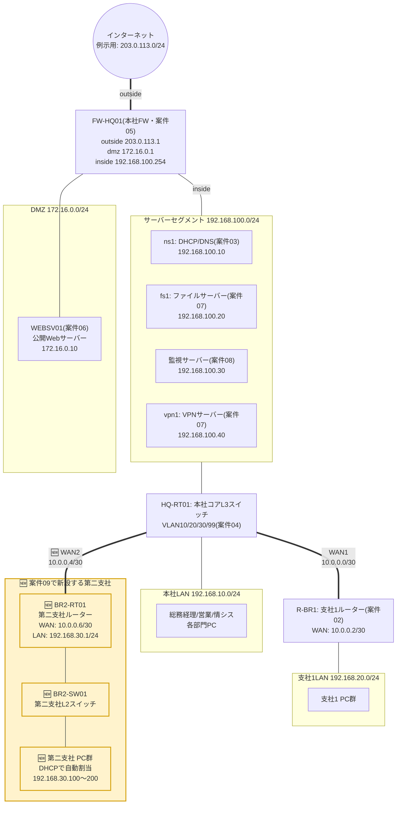

# 案件09: 【集大成】第二支社インフラ統合構築 🏗️

## 1. この案件について 📋

| 項目 | 内容 |
|---|---|
| 難易度 | ★★★★★(全5段階中5・このパック最難関) |
| 想定所要時間 | 10〜15時間 |
| 前提となる案件 | 案件01〜08 **すべて**(下記参照) |

この案件は単独では成立しません。以下の8案件で身につけた知識・構築物をすべて土台として使用します。まだの案件がある方は、先にそちらを完了させてください。

- [案件01: 本社オフィスLANの設計・構築](../case01_lan_design/README.md) — IPアドレス設計とL2/L3機器の基本設定
- [案件02: 本社-支社間ルーティング構築](../case02_wan_routing/README.md) — WAN区間の設計とスタティックルート
- [案件03: DHCP/DNSサーバー構築](../case03_dhcp_dns/README.md) — 中央集権型のDHCP/DNS基盤
- [案件04: VLANによる部門分割](../case04_vlan_segmentation/README.md) — VLSMとVLAN間ルーティングの考え方
- [案件05: ファイアウォール・NAT構築](../case05_firewall_nat/README.md) — inside/outside/DMZという境界防御の設計
- [案件06: Webサーバー構築・公開](../case06_web_server/README.md) — DMZでの公開サーバー運用
- [案件07: ファイルサーバー・リモートアクセス](../case07_file_remote_access/README.md) — Samba共有とOpenVPNによるリモートアクセス
- [案件08: 監視・冗長化による可用性向上](../case08_monitoring_ha/README.md) — 死活監視と可用性設計の考え方

## 2. 身につくスキル 🎯

- 要件定義書・基本設計書・作業手順書・試験項目書という、実務で求められる成果物一式をひとりで作成する経験
- 複数の過去構築物(LAN/WAN/DHCP・DNS/VLAN/FW・NAT/Web/ファイル共有・リモートアクセス/監視)を、矛盾なく1つの新拠点に統合する設計力
- 既存の設計書(IPアドレス設計書など)を根拠に、新しい拠点のアドレス設計を「これまでの資産を壊さずに」決める力
- どの技術要素を「そのまま流用する」か「新拠点用に手を加える」か「あえて今回は採用しない」かを、理由とともに判断する力
- 単なる構築記録ではなく、第三者(お客様・後任者)が読んでも理解・再現できる形にドキュメント化する力

## 3. 案件概要(お客様からのご依頼) 💬

> 「フュージョンITソリューションズさんには、この1年半、本当にお世話になりました。おかげさまで社員も50名まで増えて、社内のネットワークも見違えるほどしっかりしたものになりましたよね。
>
> 実は今度、隣県に第二の拠点を出すことになったんです。営業とロジスティクス(物流)を担当する社員6名でスタートする予定なんですが……正直、今のうちの拠点(支社)を作ったときは行き当たりばったりだったなという反省があって。今回は最初からちゃんとした形で作りたいんです。
>
> それで折り入ってお願いなんですが、今回は『とりあえず繋がればOK』ではなく、これまで御社に作っていただいたもの——DHCPもDNSも、ファイアウォールも、ファイルサーバーも、監視の仕組みも——を全部きちんと踏まえた上で、第二支社を一から設計・構築していただけないでしょうか。
>
> それと、もし可能であれば、今回は要件定義書や設計書もちゃんとした形で納品してほしいんです。今後さらに拠点が増えるかもしれないので、次に誰が担当しても同じレベルで作れるように、ドキュメントとして残しておきたくて。」
>
> ——株式会社サンプル商事 取締役(元・総務部担当、現在は経営企画も兼任)

## 4. 背景・状況 🏢

案件01の時点で社員10名だった株式会社サンプル商事は、案件02〜08を通じてネットワーク基盤を段階的に整備し、案件08の時点で社員50名の規模にまで成長しました。事業も軌道に乗り、今回いよいよ**第二支社**を新設して事業エリアを拡大することになりました。

これまでの支社(案件02で開設した拠点。以下「支社1」)は、倉庫を間借りして急きょ立ち上げたという経緯もあり、ネットワークもその時々の要件に応じて後追いで機能を積み増してきました。しかし第二支社は計画段階から関わることができるため、お客様からは「行き当たりばったりではなく、最初から完成形に近い設計で」という明確なリクエストがありました。

また、今回初めて「要件定義書・設計書一式を納品してほしい」という依頼も受けています。これは、フュージョンITソリューションズ側にとっても、これまで案件01〜08で個別に対応してきた技術要素を**1つの統合されたドキュメント**として説明できるかどうかが問われる、いわば集大成の案件です。実務でも、新規拠点の展開時にはこのように「既存の設計書を踏まえて矛盾なく拡張する」場面が繰り返し発生します。

## 5. 要件 ✅

要件定義書に相当する内容として、お客様との打ち合わせをもとに以下を要件として定義します。

1. 第二支社(想定社員6名、将来的に増員予定)に、安定したLAN環境を新設すること
2. 本社-第二支社間は `docs/03_ip_address_design.md` 3-5節で定義済みの `10.0.0.4/30` を用いたWAN回線(専用線を想定)で接続し、双方向にIP通信できること
3. 第二支社LAN(`192.168.30.0/24`)の端末は、第二支社に新規サーバーを設置せず、既存の本社DHCP/DNSサーバー(ns1, `192.168.100.10`)からIPアドレス自動配布・名前解決を受けられること
4. 第二支社からインターネットへのアクセスは、本社ファイアウォール(FW-HQ01)を経由すること。第二支社に個別の境界防御機器は導入せず、二重投資を避けること
5. 第二支社の端末から、既存のファイルサーバー(fs1, `192.168.100.20`)へアクセスできること
6. 第二支社の主要ネットワーク機器を、既存の監視基盤(案件08・`192.168.100.30`)の監視対象に追加すること
7. 第二支社と本社を結ぶWAN回線が停止した場合の代替アクセス手段(既存VPN基盤の活用)を検討し、制約事項として文書化すること(自動フェイルオーバーまでは今回のスコープ外とする)
8. 成果物として、要件定義書・基本設計書・作業手順書・試験項目書に相当するドキュメントを整備すること(本READMEがこれを兼ねる)

## 6. 全体構成図 🗺️

黄色(🆕マーク)の部分が、この案件で新たに追加する第二支社の構成です。それ以外は案件01〜08で構築済みの資産をそのまま流用します。



ポイントは、**FW-HQ01・DMZ・サーバーセグメント・本社LANのVLAN構成には一切手を加えない**ことです。第二支社は「既存のコアL3スイッチ(HQ-RT01)にもう1本WANがぶら下がる」だけの形で追加され、インターネット接続・DHCP/DNS・ファイル共有・監視といった機能はすべて本社の既存基盤をそのまま利用します。これは、案件01〜08を通じて積み上げてきた設計がそのまま「拡張しやすい形」になっていたことの証明でもあります。

## 7. IPアドレス設計 🔢

本案件で新たに使用するIPアドレスは、`docs/03_ip_address_design.md` の **3-5節(WAN区間)** と **3-7節(第二支社LAN)** にすでに定義済みです。詳細な設計根拠・他案件との関係は必ず同ファイルを参照してください。ここでは本案件に関係する範囲だけを抜粋します。

### 本社-第二支社間WAN(同ファイル [3-5節](../../docs/03_ip_address_design.md#3-5-wan区間)より抜粋)

| 区間 | ネットワーク | 本社側 | 対向側 |
|---|---|---|---|
| 本社 ⇔ 第二支社 | 10.0.0.4/30 | 10.0.0.5(本社ルーター: HQ-RT01) | 10.0.0.6(第二支社ルーター: BR2-RT01) |

### 第二支社LAN(同ファイル [3-7節](../../docs/03_ip_address_design.md#3-7-第二支社lan案件09で新設)より抜粋)

| 項目 | 値 |
|---|---|
| ネットワークアドレス | 192.168.30.0/24 |
| デフォルトゲートウェイ | 192.168.30.1(BR2-RT01) |
| DHCP割当範囲 | 192.168.30.100 〜 192.168.30.200 |

> 📘 案件01〜03の頃と違い、第二支社ではDHCPサーバーが最初から稼働している前提で構築を始められます。そのため支社1(案件02)のように「まず固定IPで構築し、あとから案件03でDHCPへ切り替える」という段階を踏まず、**最初から全端末をDHCPで運用**します。これも、既存基盤があるからこそ実現できる時短です。

### 参考: 第二支社から利用する既存リソース

新規に構築するものはありません。すべて案件03・05・07・08で構築済みの資産をそのまま利用します。

| ホスト | IPアドレス | 役割 | 構築案件 |
|---|---|---|---|
| ns1.sample-shoji.local | 192.168.100.10 | DHCP/DNSサーバー | 案件03 |
| fs1.sample-shoji.local | 192.168.100.20 | ファイルサーバー(Samba) | 案件07 |
| 監視サーバー | 192.168.100.30 | 死活監視(Zabbix等) | 案件08 |
| vpn1.sample-shoji.local | 192.168.100.40 | VPNサーバー(OpenVPN) | 案件07 |
| FW-HQ01 inside | 192.168.100.254 | 本社FWの社内側インターフェース | 案件05 |
| FW-HQ01 outside | 203.0.113.1 | 本社FWのインターネット接続口 | 案件05 |

> ⚠️ `192.168.100.254`(FW-HQ01のinside側)は `docs/03_ip_address_design.md` 本体には記載がなく、案件05のREADMEで新たに決定された値です。案件07に続き、本案件でも参照する値として明記しておきます。

## 8. 使用環境・ツール 🧰

| 分類 | 使用ツール・バージョン目安 | 備考 |
|---|---|---|
| ネットワークシミュレータ | Cisco Packet Tracer 8.x | 第二支社のルーター・スイッチを新規配置 |
| サーバー仮想化 | VirtualBox 7.x | 新規VMは作成しない(既存サーバーの設定変更のみ) |
| DHCP/DNS | isc-dhcp-server, BIND9(案件03で構築済み) | 設定ファイルへ第二支社分を追記 |
| ファイアウォール | firewalld(案件05で構築済み) | 原則変更なし(9章で理由を解説) |
| ファイル共有・VPN | Samba, OpenVPN(案件07で構築済み) | 変更なし。VPNは代替アクセス経路として活用 |
| 監視 | Zabbix等(案件08で構築済み) | 第二支社の機器を監視対象ホストとして追加登録 |
| 主なコマンド | `ip route`, `show ip route`, `dhcpd -t`, `named-checkzone`, `dig`, `ping`, `traceroute`, `firewall-cmd` | これまでの案件で使用したものと同一 |

この案件で**新たに導入するミドルウェアは1つもありません**。すべて既存基盤の設定を「拡張」することで対応します。実務でも、拠点が増えるたびに一からサーバーを構築するのではなく、既存基盤をどう活かすかを考えることがコスト・運用負荷の両面で重要です。

## 9. 作業手順書(過去案件の組み合わせ) 🔧

### 9-0. 全体設計方針

本作業手順書は、過去8案件の手順を土台として、以下の方針で組み合わせて実施します。

| フェーズ | 実施内容 | 主に参照する過去案件 | 第二支社での新規要素 |
|---|---|---|---|
| フェーズ1 | LAN構築(機器設置・基本設定) | [案件01](../case01_lan_design/README.md) | ルーター(BR2-RT01)・スイッチ(BR2-SW01)を新規配置 |
| フェーズ2 | WAN接続・ルーティング | [案件02](../case02_wan_routing/README.md) | 10.0.0.4/30の新規WAN区間、本社側への経路追加 |
| フェーズ3 | DHCP/DNS統合 | [案件03](../case03_dhcp_dns/README.md) | 既存ns1への設定追記のみ(新規サーバーなし) |
| フェーズ4 | VLAN分割の要否判断 | [案件04](../case04_vlan_segmentation/README.md) | 今回は**あえて適用しない**(理由は後述) |
| フェーズ5 | 境界防御・ファイル共有・監視への組み込み | [案件05](../case05_firewall_nat/README.md)・[案件07](../case07_file_remote_access/README.md)・[案件08](../case08_monitoring_ha/README.md) | 既存基盤への追加登録のみ |
| フェーズ6 | 代替アクセス経路の検討 | [案件07](../case07_file_remote_access/README.md) | 既存VPN基盤を使った手動フェイルオーバー手順の文書化 |

各過去案件の詳細な手順(ケーブルの結線、パッケージのインストール方法など)はここでは再掲しません。**第二支社という新しい要素に対して、具体的に何を設定するか**だけを示します。

### 9-1. フェーズ1: 第二支社LANの構築(案件01の考え方を適用)

案件01と同じ考え方——「まずL2スイッチとルーターを設置し、ケーブリングと基本設定を行う」——を第二支社にも適用します。ルーターのホスト名は、既存の命名(HQ-RT01, R-BR1)を踏まえ、拠点コードを用いた `BR2-RT01` / `BR2-SW01` とします。

```text
Router> enable
Router# configure terminal
Router(config)# hostname BR2-RT01
BR2-RT01(config)# interface GigabitEthernet0/0
BR2-RT01(config-if)# description Link-to-BR2-SW01
BR2-RT01(config-if)# ip address 192.168.30.1 255.255.255.0
BR2-RT01(config-if)# no shutdown
BR2-RT01(config-if)# exit
```

案件01のとき(社員10名で構成メンバーを個別に固定IP割当)と異なり、今回は既にDHCPサーバーが稼働しているため、PC側の設定は最初から「DHCPによる自動取得」の1本で済みます(手作業での固定IP設定は行いません)。

### 9-2. フェーズ2: WAN接続・ルーティング(案件02の考え方を適用)

案件02と同じ`/30`によるポイントツーポイント接続を、`10.0.0.4/30`区間に適用します。

本社側(HQ-RT01)には、案件01でHQ-SW01への接続に使った `GigabitEthernet0/0`、案件03でサーバー
セグメント接続に使った `GigabitEthernet0/1`、案件02で支社1とのWAN接続に使った `GigabitEthernet0/2`
がすでに使用済みです。次に空いている `GigabitEthernet0/3` を第二支社とのWAN接続に割り当てます
(実機の空きインターフェースに合わせて読み替えてください)。

```text
HQ-RT01(config)# interface GigabitEthernet0/3
HQ-RT01(config-if)# description Link-to-BR2-RT01
HQ-RT01(config-if)# ip address 10.0.0.5 255.255.255.252
HQ-RT01(config-if)# no shutdown
HQ-RT01(config-if)# exit
```

第二支社側(BR2-RT01)も対向のインターフェースに設定します。

```text
BR2-RT01(config)# interface GigabitEthernet0/1
BR2-RT01(config-if)# description Link-to-HQ-RT01
BR2-RT01(config-if)# ip address 10.0.0.6 255.255.255.252
BR2-RT01(config-if)# no shutdown
BR2-RT01(config-if)# exit
```

ここからが案件02との**設計上の違い**です。案件02の時点では本社側に到達可能なネットワークが「本社LAN」「サーバーセグメント」の2つしかなく、支社1ルーター(R-BR1)にはその2つ分の個別ルートを設定しました。しかし現在の本社ネットワークは、VLAN4本(案件04)・サーバーセグメント(案件03)・インターネット(案件05)と、行き先がかなり増えています。第二支社ルーターに行き先ごとの個別ルートを1つずつ書いていくのは非効率かつ設定漏れの温床になるため、**デフォルトルート1本**に集約します。

```text
BR2-RT01(config)# ip route 0.0.0.0 0.0.0.0 10.0.0.5
BR2-RT01(config)# end
BR2-RT01# write memory
```

第二支社ルーターは唯一のアップリンクである本社側(10.0.0.5)しか出口を持たないため、「行き先が分からない通信はとりあえず本社に投げる」というデフォルトルートで過不足なく対応できます。実際に行き先を判断する(社内LANか、インターネットかを振り分ける)役割は、これまで通りHQ-RT01とFW-HQ01が担います。

一方、**本社側(HQ-RT01)には第二支社宛の具体的なルートが必須**です。HQ-RT01は案件05の時点ですでに「行き先不明な通信はFW-HQ01へ送る」というデフォルトルートを持っているため、これに任せてしまうと第二支社(192.168.30.0/24)宛の通信までFW-HQ01に吸い込まれて意図しない挙動になります。

```text
HQ-RT01(config)# ip route 192.168.30.0 255.255.255.0 10.0.0.6
HQ-RT01(config)# end
HQ-RT01# write memory
```

### 9-3. フェーズ3: DHCP/DNSへの統合(案件03の考え方を適用)

第二支社に新規サーバーは置かず、既存のns1(`192.168.100.10`)にスコープとゾーンを追記します。まず、DHCP要求を中継するため、BR2-RT01のLAN側インターフェースに`ip helper-address`を設定します。

```text
BR2-RT01(config)# interface GigabitEthernet0/0
BR2-RT01(config-if)# ip helper-address 192.168.100.10
BR2-RT01(config-if)# exit
BR2-RT01(config)# end
BR2-RT01# write memory
```

ns1側の`/etc/dhcp/dhcpd.conf`に、第二支社LAN分のsubnet宣言を追記します。

```conf
# /etc/dhcp/dhcpd.conf(末尾に追記)
# 第二支社LAN(案件09で追加)
subnet 192.168.30.0 netmask 255.255.255.0 {
  range 192.168.30.100 192.168.30.200;
  option routers 192.168.30.1;
  option broadcast-address 192.168.30.255;
}
```

```bash
$ sudo dhcpd -t -cf /etc/dhcp/dhcpd.conf
$ sudo systemctl restart isc-dhcp-server
```

続いてBIND9側です。正引きゾーン(`/etc/bind/zones/db.sample-shoji.local`)にホストを追加し、Serial値を更新します。

```conf
;(SOAのSerialを1つ繰り上げてから追記)
gw-br2  IN      A       192.168.30.1
```

逆引き用に新しいゾーンファイルを作成し、`named.conf.local`に登録します。

```conf
# /etc/bind/named.conf.local(追記)
zone "30.168.192.in-addr.arpa" {
    type master;
    file "/etc/bind/zones/db.192.168.30";
};
```

```conf
# /etc/bind/zones/db.192.168.30(新規作成)
$TTL    604800
@       IN      SOA     ns1.sample-shoji.local. admin.sample-shoji.local. (
                              1
                         604800
                          86400
                        2419200
                         604800 )
;
@       IN      NS      ns1.sample-shoji.local.
1       IN      PTR     gw-br2.sample-shoji.local.
```

最後に`named.conf.options`の`allow-query`に第二支社セグメントを追加するのを忘れないようにします(案件03のトラブル事例でも扱った、非常に見落としやすいポイントです)。

```conf
allow-query { 192.168.10.0/24; 192.168.20.0/24; 192.168.30.0/24; 192.168.100.0/24; localhost; };
```

```bash
$ sudo named-checkconf
$ sudo named-checkzone 30.168.192.in-addr.arpa /etc/bind/zones/db.192.168.30
$ sudo systemctl restart bind9
```

### 9-4. フェーズ4: VLAN分割(案件04)は、今回はあえて適用しない

案件04では、本社LANが社員増加にともない部門ごとの通信分離が必要になったためVLAN分割を行いました。第二支社は開設時点で社員6名、部門も営業・物流の小人数構成であり、`docs/03_ip_address_design.md`上も第二支社LANは`192.168.30.0/24`という単一セグメントとして設計されています。これは、ちょうど本社が案件01の時点(社員10名・単一セグメント)で置かれていた状況と同じです。

そのため本案件では、VLAN分割は行わず単一セグメントのまま構築します。これは「知っている技術をとりあえず全部使う」のではなく、**規模と要件に見合った設計を選ぶ**という判断です。将来第二支社の人員が増え部門間の通信制御が必要になった段階で、案件04と同じ考え方(VLSMによるVLAN分割)を適用すればよく、その拡張性は`192.168.30.0/24`という/24単位のアドレス割り当てによってすでに確保されています。

### 9-5. フェーズ5: 境界防御・ファイル共有・監視への組み込み(案件05・07・08)

**ファイアウォール(案件05)**: 変更は一切不要です。FW-HQ01は「inside側インターフェースから来た通信は社内、outside側は社外」という**インターフェースベース**でゾーンを判定しており、送信元のセグメントが`192.168.10.0/24`か`192.168.30.0/24`かを区別していません。9-2で設定した通り、第二支社からの通信もHQ-RT01経由でinside側インターフェースに到達するため、既存の送信元NAT(PAT)ルールがそのまま適用されます。念のため、変更が不要であることを確認します。

```bash
$ sudo firewall-cmd --get-active-zones
internal
  interfaces: enp0s3
dmz
  interfaces: enp0s8
external
  interfaces: enp0s9
```

**ファイルサーバー(案件07)**: Samba側の設定変更も不要です。共有フォルダのアクセス権限はユーザー・グループ単位で管理されており、接続元のIPセグメントを制限していないため、第二支社のDHCPクライアントもns1で名前解決した`fs1.sample-shoji.local`へそのままアクセスできます。

**監視(案件08)**: 第二支社の主要機器(BR2-RT01、BR2-SW01)を、監視サーバーの監視対象ホストとして追加登録します。ルーター・スイッチはエージェントを導入せず、ICMP(ping)による死活監視アイテムとして追加するのが実務でも一般的です。監視サーバーのWeb管理画面で対象ホストを追加し、WAN区間(10.0.0.4/30)経由の応答時間としきい値を設定します。

### 9-6. フェーズ6: WAN回線停止時の代替アクセス経路(案件07 VPN基盤の活用)

要件7への対応として、WAN回線(10.0.0.4/30)が停止した場合の代替手段を検討します。第二支社と本社を結ぶ専用線は現時点で1本のみのため、**単一障害点(SPOF)**です。今回は新たに冗長回線を敷設する予算までは確保されていないため、緊急時の代替手段として、既存のOpenVPN基盤(vpn1)を活用します。

第二支社の社員は、案件07で確立した手順(クライアント証明書の発行、`.ovpn`設定ファイルの配布)にもとづき、各自のノートPCにOpenVPNクライアントを導入しておきます。専用線が停止した際は、モバイルルーター等のインターネット回線経由でvpn1に接続することで、ns1・fs1など本社側サーバーへの最低限のアクセスを確保できます。

```bash
# 第二支社の社員が緊急時に手元のPCで実行する想定
$ sudo openvpn --config br2-staff01.ovpn
```

> ⚠️ **この手段の限界**: これはあくまで**個々の社員のPC単位**での代替経路であり、第二支社LAN全体(BR2-SW01配下のPC群)を自動的に救済する仕組みではありません。第二支社LAN全体を巻き込んだ拠点間の自動フェイルオーバー(サイト間VPNや複数回線の動的ルーティングなど)は、今回の要件・予算の範囲外として明確にお客様へ説明し、13章の発展課題として文書に残します。

## 10. 動作確認(試験項目書) 🔍

実務の試験項目書を模し、番号・試験項目・試験手順・期待結果を一覧化します。すべての項目が「期待結果」どおりであることを確認できて初めて、この案件は完了とみなします。

| No. | 試験項目 | 試験手順 | 期待結果 |
|---|---|---|---|
| T-01 | WAN区間の物理疎通 | HQ-RT01・BR2-RT01双方で`show ip interface brief`を実行 | 該当インターフェースのStatus/Protocolが両方`up` |
| T-02 | WAN区間のIP疎通 | BR2-RT01から`ping 10.0.0.5`を実行 | 4/4パケットとも応答あり |
| T-03 | ルーティングテーブルの反映 | HQ-RT01で`show ip route`を実行 | `192.168.30.0/24`が`S`(スタティック)経由10.0.0.6として表示 |
| T-04 | 第二支社PCのDHCP取得 | 第二支社PCで`ipconfig /all`(またはLinuxは`ip a`)を実行 | 192.168.30.100〜200の範囲のIP、GW 192.168.30.1、DNS 192.168.100.10を取得 |
| T-05 | DNS正引き | ns1に対し`dig gw-br2.sample-shoji.local`を実行 | `192.168.30.1`が返る |
| T-06 | DNS逆引き | ns1に対し`dig -x 192.168.30.1`を実行 | `gw-br2.sample-shoji.local.`が返る |
| T-07 | 本社⇔第二支社の全区間疎通 | 第二支社PCから本社PC・サーバーセグメント各機へping | すべて応答あり |
| T-08 | ファイルサーバーアクセス | 第二支社PCから`\\fs1.sample-shoji.local\共有フォルダ`へ接続 | 権限に応じてフォルダが参照できる |
| T-09 | インターネット到達性 | 第二支社PCから外部向けサイトへブラウザアクセス | FW-HQ01経由でページが表示される |
| T-10 | 監視への登録 | 監視サーバーの管理画面でBR2-RT01/BR2-SW01の状態を確認 | ステータスが「正常」、直近のping応答が記録されている |
| T-11 | VPN代替経路 | WAN区間を意図的に`shutdown`し、社員PCからOpenVPN接続を実施 | vpn1経由でns1・fs1へ到達できる |

代表的な項目の実行例を示します。

```text
HQ-RT01# show ip route
     10.0.0.0/30 is subnetted, 2 subnets
C       10.0.0.0 is directly connected, GigabitEthernet0/2
C       10.0.0.4 is directly connected, GigabitEthernet0/3
S    192.168.20.0/24 [1/0] via 10.0.0.2
S    192.168.30.0/24 [1/0] via 10.0.0.6
```

```bash
$ dig @192.168.100.10 gw-br2.sample-shoji.local +short
192.168.30.1

$ dig @192.168.100.10 -x 192.168.30.1 +short
gw-br2.sample-shoji.local.
```

```text
C:\> ipconfig /all

Ethernet0 Connection:(DHCP有効)
   IP Address. . . . . . . . . . . : 192.168.30.103
   Subnet Mask . . . . . . . . . . : 255.255.255.0
   Default Gateway . . . . . . . . : 192.168.30.1
   DHCP Server . . . . . . . . . . : 192.168.100.10
   DNS Servers . . . . . . . . . . : 192.168.100.10
```

T-03の`192.168.30.0/24`が`S`として表示され、T-04でDNSサーバーが`192.168.100.10`として配布されていれば、フェーズ2・3の設定は正しく連動しています。

## 11. よくあるトラブルと対処法 ⚠️

| 症状 | 考えられる原因 | 対処法 |
|---|---|---|
| 第二支社→本社は通信できるが、本社→第二支社が通らない | HQ-RT01側に`192.168.30.0/24`宛のスタティックルートを入れ忘れている(BR2-RT01側のデフォルトルートだけでは片方向にしか作用しない) | HQ-RT01で`show ip route`を確認し、`192.168.30.0/24`が`S`経由10.0.0.6として存在するか確認する |
| 第二支社PCがDHCPでIPを取得できず169.254.x.x(APIPA)になる | `dhcpd.conf`への`subnet 192.168.30.0`ブロック追記漏れ、またはBR2-RT01のLAN側インターフェースに`ip helper-address`が未設定 | ns1で`sudo dhcpd -t -cf /etc/dhcp/dhcpd.conf`を実行して構文とsubnet宣言を確認、BR2-RT01で`show run interface GigabitEthernet0/0`のhelper設定を確認する |
| 第二支社PCではDHCPでIPは取得できるが名前解決だけ失敗する | `named.conf.options`の`allow-query`に`192.168.30.0/24`を追加し忘れている | ns1で`allow-query`の内容を確認し、対象セグメントを追加後`systemctl restart bind9` |
| インターネット宛のアクセスだけ第二支社からできない(社内向け通信は問題なし) | HQ-RT01の第二支社向けルート追加後、既存のデフォルトルート(FW-HQ01宛)を誤って上書き・削除してしまった | `show ip route`で`S* 0.0.0.0/0`(デフォルトルート)が残っているか確認し、消えていた場合は案件05の設定を参照して再投入する |
| 緊急時にVPNで接続しても、fs1やns1に到達できない | vpn1の設定(`push route`)に第二支社の社員が到達すべき本社側ネットワークが含まれていない、またはクライアント証明書の期限切れ・失効 | vpn1の`server.conf`の`push`行を確認し、必要な宛先ネットワークが含まれているか確認する。証明書はEasy-RSAで再発行する |

## 12. この案件の重要用語 📚

これまでの案件で登場した技術用語(DHCP、DNS、VLAN、NAT、VPNなど)はすべて既出のため、詳細は [docs/01_glossary.md](../../docs/01_glossary.md) を参照してください。本案件で新たに登場する、実務のドキュメント運用に関わる用語のみ簡単に補足します。

- **要件定義書**: お客様の要望を「満たすべき条件」として明文化した文書。本README5章に相当。
- **基本設計書**: 要件を満たすためのシステム構成・アドレス設計をまとめた文書。本README6〜8章に相当。
- **作業手順書**: 実際に何をどの順序で作業するかを記した文書。本README9章に相当。
- **試験項目書**: 構築後に確認すべき項目と期待結果を一覧化した文書。本README10章に相当。
- **SPOF(単一障害点)**: そこが1つ故障するだけでシステム全体が止まってしまう箇所。本案件では第二支社への専用回線1本がこれに該当する。
- **サイト間VPN(site-to-site VPN)**: 個人単位ではなく拠点同士をまるごと結ぶVPN接続方式。13章の発展課題で扱う。

## 13. 発展課題(任意) 🚀

1. **WAN回線の冗長化**: 第二支社への回線は現状1本のみでSPOFです。2本目の回線(例えばインターネットVPN経由のサイト間VPN)を用意し、フローティングスタティックルートで自動的に切り替わる構成を設計してみましょう。
2. **VLAN分割の再設計**: 第二支社の人員が将来15名程度まで増えたと仮定し、案件04と同じ手法でVLANを分割する設計案(VLSMの再計算を含む)を作成してみましょう。
3. **ドキュメントのテンプレート化**: 本案件で作成した「要件定義書→基本設計書→作業手順書→試験項目書」という構成を、第三の拠点が今後増えることを見据えたテンプレートとして整理し、誰が担当しても同じ品質で拠点展開できる状態にしてみましょう。

## 14. このポートフォリオを通して学ぶスキルの総括 🌟

案件01から案件09までは、架空の株式会社サンプル商事の成長に沿って、ネットワークとサーバー構築の基礎から応用を学ぶ教材です。**前の案件で扱った構成に次の案件の要件を追加する**ことで、設定を変更するときに既存機能も確認する進め方を練習します。以下は学習目標であり、本人が全案件を構築・習得した記録ではありません。実施状況は[全体README](../../README.md)を参照してください。

| 案件 | 学習目標 |
|---|---|
| 案件01〜02 | IPアドレス設計とルーティングという「通信の地図」を描く力 |
| 案件03〜04 | 手作業の限界を自動化・構造化で解決する設計力(DHCP/DNS、VLAN) |
| 案件05〜06 | 社内と社外の境界を安全に設計・公開する力(FW/NAT、DMZ) |
| 案件07〜08 | 「人が使う」「止まらない」ことを支える運用視点(共有・VPN、監視・冗長化) |
| 案件09 | これら全部を矛盾なく統合し、ドキュメントとして説明する統合力 |

実施後は、**「なぜその設計にしたのか」を本人の言葉で説明できること**と、実際に確認した出力を記録してください。教材の説明を読むことと、独力で説明できることは別に確認します。

面接では、本人が実施した一つの作業を次の順番で説明します。全9案件を完了している必要はありません。

1. 対象と実施日、本人が操作した環境、支援を受けた範囲。
2. 要件と設定を選んだ理由、変更前後の違い。
3. 正常・異常を判断した出力と、確認した試験項目。
4. 実際に調べ直したこと、失敗時の戻し方、未実施の課題。

記録の書式は[ポートフォリオ活用ガイド](../../docs/04_portfolio_presentation_guide.md)を利用できます。

## 15. 関連リンク 🔗

- 前の案件: [案件08: 監視・冗長化による可用性向上](../case08_monitoring_ha/README.md)
- 次の案件: なし(このパックの最終案件です)
- [README.md(ポートフォリオ全体トップ)](../../README.md)
- [docs/00_roadmap.md(学習ロードマップ)](../../docs/00_roadmap.md)
- [docs/01_glossary.md(用語集)](../../docs/01_glossary.md)
- [docs/03_ip_address_design.md(全案件共通IPアドレス設計書)](../../docs/03_ip_address_design.md)
- [docs/04_portfolio_presentation_guide.md(面接・書類選考での伝え方ガイド)](../../docs/04_portfolio_presentation_guide.md)
